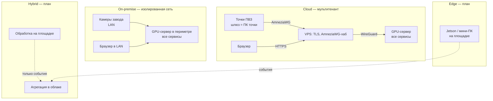
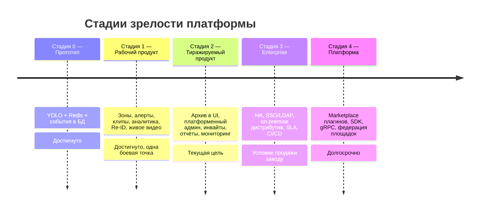

# 00. Видение платформы ViziAI

**Статус документа:** актуален на 2026-07-15
**Аудитория:** архитекторы, технические руководители, продуктовые менеджеры, новые инженеры
**Связанные документы:** [01_SYSTEM_ARCHITECTURE.md](01_SYSTEM_ARCHITECTURE.md), [15_PVZ_MODULES.md](15_PVZ_MODULES.md), [14_FACTORY_MODULES.md](14_FACTORY_MODULES.md), [18_ROADMAP.md](18_ROADMAP.md), [13_SECURITY.md](13_SECURITY.md)

---

## 1. Назначение документа

Документ фиксирует продуктовую и инженерную философию платформы ViziAI: зачем она существует, для кого, на каких рынках конкурирует, какие технические принципы являются неизменяемыми и какие компромиссы приняты сознательно.

Все остальные документы каталога `docs/architecture/` являются производными от принципов, изложенных здесь. Если техническое решение противоречит разделу 6 («Инженерные принципы»), приоритет имеет этот документ; расхождение должно быть либо устранено, либо явно задокументировано как исключение с обоснованием.

Документ не является маркетинговым материалом. Он не содержит обещаний, не подкреплённых кодом или планом. Всё, что ещё не реализовано, помечено явно: **[План]**, **[Требует решения]** или **[Данные отсутствуют]**.

---

## 2. Продукт: определение

ViziAI — программная платформа видеоаналитики и управления видеонаблюдением (VMS + VCA) для российского рынка, ориентированная в первую очередь на пункты выдачи заказов (ПВЗ) и производственные площадки.

Публичное имя: **ViziAI**, домен **точка-взора.рф**.

Формальное определение по классам систем:

| Класс | Наличие | Комментарий |
|---|---|---|
| VMS (Video Management System) | Частично | Видеоархив пишется (`analyzer/ingest/recorder.py`, таблица `archive_segment`), UI просмотра архива не реализован — см. [18_ROADMAP.md](18_ROADMAP.md) |
| VCA (Video Content Analytics) | Да | YOLOv8 + ByteTrack + зонный движок + плагины (`analyzer/`) |
| Alerting / Incident | Частично | Правила алертов и доставка есть (`api/src/workers/alerts.worker.ts`); управление инцидентами — см. [09_WORKFLOW_ENGINE.md](09_WORKFLOW_ENGINE.md) |
| Мультитенантная SaaS-платформа | Да | `tenant_id` в JWT и в каждом запросе |
| On-premise дистрибутив | Да, по архитектуре | Один код, режим через `DEPLOYMENT_MODE`; отдельный дистрибутив не собран |

Ключевая формулировка позиционирования, от которой производны все продуктовые решения:

> ViziAI продаёт не видеонаблюдение. ViziAI продаёт ответы на вопросы владельца площадки: сколько было людей, сколько они ждали, что пошло не так и что с этим делать.

Из этого следует, что живое видео — обязательная, но не главная функция. Главный артефакт продукта — событие (`event`) и вывод, построенный поверх потока событий.

---

## 3. Миссия и проблема

### 3.1. Проблема рынка

Владелец ПВЗ или руководитель производственного участка сегодня имеет одно из двух:

1. **Дешёвое видеонаблюдение без аналитики.** Регистратор Hikvision/Dahua, 4–8 камер, приложение производителя. Видео есть, но чтобы узнать «сколько людей стояло в очереди во вторник в 18:00», нужно человеко-час просмотра. Практически никто этого не делает — архив используется только постфактум, при конфликте или краже.

2. **Дорогую enterprise-платформу с аналитикой.** Milestone XProtect, Genetec, BriefCam. Полноценно, но: лицензия за канал, обязательный сервер, интегратор, сроки внедрения в месяцах, стоимость, несопоставимая с экономикой одного ПВЗ (выручка которого измеряется десятками тысяч рублей в месяц).

Между этими полюсами — пустота. Малая и средняя площадка в РФ не может позволить себе Genetec и не получает никакой пользы от NVR.

### 3.2. Миссия

Сделать видеоаналитику уровня enterprise экономически доступной для площадки, где работает 1–5 человек, не жертвуя при этом инженерным качеством, необходимым для продажи той же платформы заводу на 200 камер.

Технически это означает единственное требование, определяющее всю архитектуру: **одна кодовая база должна одинаково корректно работать в конфигурации «4 камеры, один ПВЗ, шлюз — кассовый ПК» и «200 камер, изолированная сеть завода, стойка GPU-серверов»**. Расхождение допускается только в конфигурации и в наборе включённых модулей, но не в коде.

### 3.3. Что не является миссией

Явные отказы, зафиксированные как решения (см. также раздел 7):

- **Не биометрия посетителей.** Распознавание лиц посетителей не реализуется. Обоснование в разделе 7.1.
- **Не «коробка с камерами».** Аппаратное обеспечение не производится и не перепродаётся как основной бизнес. Рекомендации по железу — в [02_INFRASTRUCTURE.md](02_INFRASTRUCTURE.md).
- **Не универсальный CV-конструктор.** Платформа решает набор конкретных отраслевых задач; произвольные модели пользователь не обучает. Расширение — через плагины ([07_PLUGIN_SYSTEM.md](07_PLUGIN_SYSTEM.md)).

---

## 4. Целевые рынки

### 4.1. Сегментация

Платформа поддерживает четыре профиля организации. Профиль определяет набор включённых модулей (`tenant_feature`), пресеты зон и состав дашборда.

| Профиль | Состояние | Типовой размер | Главная ценность |
|---|---|---|---|
| ПВЗ | Основной, в проде | 2–6 камер на точку, 1–500 точек на тенанта | Очередь, посетители, перепаковка, сохранность |
| Производство | В разработке | 10–200 камер | СИЗ, безопасность зон, простои, OEE |
| Ритейл | В разработке | 4–40 камер | Посетители, тепловые карты, очередь на кассе |
| Офис | В разработке | 2–20 камер | Занятость, доступ в зоны, посещаемость |

Приоритет ПВЗ выбран сознательно и не является случайным следствием первого клиента:

1. **Однородность.** ПВЗ — это тиражируемая планировка: вход, зона ожидания, стойка выдачи, стеллажи. Одна конфигурация зон подходит тысячам точек. Это то, что делает продукт масштабируемым без интегратора.
2. **Плотность рынка.** Количество ПВЗ маркетплейсов в РФ измеряется десятками тысяч и продолжает расти.
3. **Явная боль.** Очередь и сохранность посылок — измеримые потери, которые владелец осознаёт без объяснений.
4. **Низкий порог входа.** На точке уже есть интернет, ПК и камеры. Платформе нужен только туннель — см. [04_NETWORK.md](04_NETWORK.md).

Производство — второй рынок, к которому платформа готовится архитектурно (режим on-premise, изолированная сеть, промышленные камеры), но продуктово ещё не готова.

### 4.2. Профиль покупателя

| Профиль | Кто платит | Кто принимает решение | Кто пользуется |
|---|---|---|---|
| ПВЗ (одна точка) | Владелец точки | Владелец | Владелец, оператор |
| ПВЗ (сеть) | Управляющая компания | Операционный директор | Территориальные менеджеры |
| Производство | Предприятие | Директор по производству / охране труда | Начальник смены, служба ОТ |

Ключевое следствие: интерфейс не может требовать оператора. Владелец точки не сидит перед видеостеной. Он получает Telegram-сообщение и заходит в веб-интерфейс, когда что-то произошло. Поэтому качество алертов важнее качества видеостены — см. [08_RULE_ENGINE.md](08_RULE_ENGINE.md), раздел про анти-флуд.

---

## 5. Конкурентная среда

### 5.1. Карта конкурентов

| Продукт | Класс | Сила | Слабость на рынке ViziAI |
|---|---|---|---|
| Milestone XProtect | VMS enterprise | Экосистема, надёжность, тысячи интеграций | Цена за канал, требует интегратора, аналитика — платные плагины третьих сторон |
| Genetec Security Center | VMS+ACS enterprise | Единая платформа безопасности, зрелость | Стоимость, сложность, тяжёлое внедрение; уход с рынка РФ |
| Nx Witness | VMS среднего класса | Лёгкость, хороший клиент, открытый SDK | Аналитика слабая и внешняя; не решает задачу «ответы вместо видео» |
| HikCentral | VMS вендорская | Дёшево, интеграция с камерами Hikvision | Привязка к вендору; аналитика на уровне камеры; вопросы доверия у госсектора |
| Axis Camera Station | VMS вендорская | Качество, ACAP-аналитика на борту | Только Axis; цена камер |
| BriefCam | Аналитика поверх VMS | Лучший в классе поиск и синопсис видео | Дорого, требует VMS, лицо/биометрия в основе |
| Irisity (IRIS+) | Аналитика | Сильные детекторы, edge-модели | Дорого для малой площадки; уход с рынка РФ |
| Avigilon | VMS+камеры | Аппаратно-программный комплекс | Вендорская привязка, цена, уход с рынка РФ |
| Verkada | Облачные камеры | Простота, «включил и работает» | Только своё железо; облако вне РФ — 152-ФЗ неприменим |
| Eagle Eye Networks | Облачный VMS | Зрелое облако, API | Облако вне РФ; цена; аналитика ограниченная |

### 5.2. Позиция ViziAI

ViziAI не пытается выиграть у Milestone в классе «VMS для аэропорта». Конкурентное преимущество лежит в четырёх областях.

**1. Экономика единицы.** Целевая себестоимость обслуживания одной точки ПВЗ на 4 камеры — доли GPU и десятки мегабайт трафика. Достигается за счёт: анализа по субпотоку (`url_sub`), пропуска кадров (`frame_skip`), одного процесса на тенанта с разделяемым GPU (`analyzer/detect/worker.py`), отсутствия постоянной передачи видео в облако для аналитики (анализ идёт на нашем сервере, но по низкобитрейтному субпотоку через туннель).

**2. Отсутствие биометрии посетителей как продуктовое свойство.** См. 7.1. Для госсектора, крупного ритейла и предприятий с юристами это не «недостаток», а критерий допуска.

**3. Российская юрисдикция и работа в изолированной сети.** Данные не покидают периметр заказчика в режиме on-premise; в облачном режиме — сервер в РФ. Уход Genetec, Avigilon, Irisity с рынка РФ оставил незакрытый сегмент.

**4. Скорость внедрения без интегратора.** Кит онбординга `pvz-onboarding/` рассчитан на то, что владелец точки запускает `.cmd`-файлы двойным кликом и через 30 минут точка на связи. Это прямая атака на главный барьер enterprise-VMS.

### 5.3. Признаваемые слабости

Честный список того, где ViziAI сегодня проигрывает, — чтобы он был виден при планировании ([18_ROADMAP.md](18_ROADMAP.md)):

- Нет UI видеоархива — базовая функция любого VMS. Данные пишутся, интерфейса нет.
- Нет отказоустойчивости: единственный GPU-сервер, единственный PostgreSQL, единственный Redis. См. [11_HIGH_AVAILABILITY.md](11_HIGH_AVAILABILITY.md).
- Нет промышленного мониторинга (Prometheus/Grafana отсутствуют). См. [12_MONITORING.md](12_MONITORING.md).
- Нет ONVIF-обнаружения камер, PTZ-управления, поддержки GB28181, GigE Vision. См. [05_CAMERA_CONNECTION.md](05_CAMERA_CONNECTION.md).
- Нет SSO/LDAP/AD — блокер для корпоративной продажи. См. [13_SECURITY.md](13_SECURITY.md).
- Нет CI/CD, автотестов, воспроизводимой сборки образов. См. [19_BEST_PRACTICES.md](19_BEST_PRACTICES.md).

Ни одна из этих слабостей не является архитектурным тупиком: все они — незаполненные места в существующей архитектуре, а не следствие неверных решений.

---

## 6. Инженерные принципы

Принципы неизменны. Нарушение любого из них требует явного архитектурного решения с записью в этом документе.

### 6.1. Один код — два режима развёртывания

```
DEPLOYMENT_MODE=cloud       мультитенант, ПВЗ, наш сервер
DEPLOYMENT_MODE=on-premise  завод, изолированная сеть, все сервисы локально
```

Код не знает, где он работает. Различие выражается только конфигурацией: адреса сервисов, наличие внешнего VPS, набор включённых модулей. Ветвление по `if (mode === 'cloud')` в бизнес-логике запрещено; допустимо только в слое конфигурации.

Обоснование: две кодовые базы для облака и on-premise — это гарантированное расхождение через 12 месяцев и удвоение стоимости каждой фичи. Цена решения — необходимость держать всякую внешнюю зависимость (Telegram, S3, VPS) опциональной и заменяемой.

### 6.2. Изоляция отказов обязательна на каждом уровне

Падение одной камеры не имеет права остановить обработку остальных. Это реализовано и должно сохраняться:

- `RtspPullSource` (`analyzer/ingest/video_source.py`): ошибка чтения → reconnect с экспоненциальным откатом 1с → 2с → 4с → … → `max_backoff_seconds` (60с).
- `AnalyzerWorker._consume` (`analyzer/detect/worker.py`): исключение потребителя логируется, остальные задачи камер продолжают работу.
- `PluginManager.dispatch` (`analyzer/plugins/registry.py`): исключение плагина не убивает кадр, остальные плагины отрабатывают.
- `EventConsumer.handle` (`api/src/streams/event_consumer.ts`): невалидное сообщение уходит в dead-letter `events:failed` и подтверждается (XACK), чтобы не блокировать группу.
- Heartbeat (`camera_alive:{camera_id}`): сбой записи heartbeat не прерывает потребителя кадров.

Принцип: **любой внешний вход — враждебный, любая внешняя зависимость — временно недоступна.**

### 6.3. Событие — граница между сервисами

Сервисы не вызывают друг друга напрямую в горячем пути. Обмен — через Redis Streams с consumer group. Это даёт: буферизацию при недоступности потребителя, независимый перезапуск сервисов, возможность добавить второго потребителя без изменения производителя.

Схема сообщений — единственный контракт. Она зафиксирована в `shared/events.schema.ts` (Zod) и `shared/events.schema.json`. Изменение схемы — это изменение публичного API, см. [16_API_GUIDE.md](16_API_GUIDE.md).

### 6.4. Тенант-изоляция на каждом запросе

`tenant_id` берётся из JWT, а не из тела запроса или query-параметра. Каждый запрос к БД фильтруется по нему. Нарушение этого правила — уязвимость класса «горизонтальное повышение привилегий», а не стилистическая ошибка. См. [13_SECURITY.md](13_SECURITY.md), раздел «Модель угроз».

### 6.5. Строгая типизация на границах

- TypeScript: `strict`, включая `noImplicitAny`, `strictNullChecks`, `exactOptionalPropertyTypes`.
- Python: `mypy strict`, `pydantic v2` с `ConfigDict(strict=True)`.
- Валидация входящих данных: Zod (TS), pydantic-settings (Python).
- Запросы к PostgreSQL — только через Drizzle; сырой SQL допустим в миграциях и в местах, где Drizzle не покрывает возможности TimescaleDB (`drop_chunks`, `hypertable_size`).

Обоснование: платформа обрабатывает поток машинно-сгенерированных сообщений от процесса, которому нельзя доверять по построению (видеоаналитика ошибается). Типы — первая линия обороны.

### 6.6. Конфигурация только из окружения

Ни одного IP, порта, токена или домена в коде. Валидация конфигурации на старте: `EnvSchema.parse(process.env)` (`api/src/config.ts`), `Settings(BaseSettings)` (`analyzer/config.py`). Процесс, стартовавший с невалидной конфигурацией, обязан упасть немедленно, а не через час в проде.

Исключение, реализованное осознанно: часть параметров переопределяется из БД (`system_setting`, `api/src/settings.ts`) — БД имеет приоритет над `.env`. Это нужно, чтобы владелец мог менять пороги без доступа к серверу. Пустое значение секрета удаляет строку и возвращает fallback на `.env`.

### 6.7. Деградация вместо отказа

Каждый модуль обязан иметь определённое поведение при отсутствии его зависимости:

| Зависимость недоступна | Поведение |
|---|---|
| Redis | Analyzer продолжает детекцию, буферизует события в памяти **[План, см. 11]** |
| PostgreSQL | Consumer не подтверждает сообщения, они остаются в стриме; после восстановления обрабатываются |
| MinIO | Событие сохраняется без снапшота/клипа |
| Telegram | Уведомление помечается `failed` в `notifications`, BullMQ повторяет с экспоненциальным откатом |
| GPU | **[Требует решения]** — сейчас `analyzer_device=cpu` возможен конфигурацией, но производительность не измерена |
| OSNet ONNX (Re-ID) | Fallback на HSV-гистограммы (`analyzer/reid/embedding.py`) |
| Модели лиц (YuNet/SFace) | Отсутствие файлов отключает путь Face-ID, остальное работает |

### 6.8. Минимальные комментарии, максимальная явность

Комментарии в коде — на английском, только там, где код не может объяснить сам себя: неочевидное ограничение, причина обходного решения, ссылка на внешнее поведение. Примеры правильных комментариев в текущем коде: объяснение, почему `notifications.event_id` не имеет FK (гипертаблица, `id` не уникален), почему nginx использует переменные в `proxy_pass` (пересборка контейнеров меняет IP).

Документация — в `docs/`, а не в коде.

---

## 7. Продуктовые решения, не подлежащие пересмотру

Каждое решение здесь принято с осознанием альтернативы. Пересмотр возможен только при появлении нового факта, а не нового мнения.

### 7.1. Re-ID посетителей без биометрии лиц

**Решение.** Сквозная идентификация посетителя между камерами выполняется по внешнему виду (одежда, силуэт), а не по лицу. Реализация: `analyzer/reid/` — эмбеддинг (HSV-гистограммы верх/низ тела, с планом перехода на OSNet ONNX), галерея в Redis `reid:gallery:{site_id}` с TTL 12 часов.

**Альтернатива, которая отвергнута.** Распознавание лиц посетителей даёт заметно более высокую точность, особенно ночью.

**Обоснование отказа.**
1. Биометрические персональные данные по 152-ФЗ требуют отдельного согласия субъекта, отдельного правового режима обработки и создают обязанности, которые владелец ПВЗ физически не может исполнить.
2. Отсутствие биометрии — критерий допуска в тендерах госсектора и крупных корпораций.
3. Эмбеддинг одежды с TTL 12 часов не является персональными данными: он не позволяет идентифицировать субъекта и обнуляется ежедневно.

**Граница решения.** Face-ID применяется **только к сотрудникам** (`analyzer/reid/face.py`, галерея `face:staff:{tenant_id}`) — с их ведома, в рамках трудовых отношений, для исключения персонала из подсчёта посетителей. Посетители не проходят через лицевой путь никогда.

Это конкурентное преимущество, а не техническое ограничение. Замена на распознавание лиц посетителей разрушает позиционирование.

### 7.2. Транспорт живого видео: MSE/HLS через go2rtc, не WebRTC

**Решение.** Живое видео доставляется в браузер через go2rtc с адаптивным выбором MSE → HLS. Один источник H.264 на камеру. Задержка 1–3 секунды признана приемлемой.

**Отвергнуто.**
- **WebRTC (UDP через VPS).** Даёт задержку менее секунды, но требует прохождения UDP через VPS-хаб и WireGuard, что на практике оказалось хрупким. Проброс `tcp/udp :8555` через VPS остаётся в конфигурации (`infra/go2rtc/go2rtc.prod.yaml`), но как транспорт по умолчанию не используется.
- **MJPEG.** Тяжёлый по трафику и ломался в связке nginx + длинные потоки.

**Обоснование.** Целевой пользователь смотрит живое видео эпизодически, для проверки контекста алерта. Задержка в 2 секунды его не касается. Надёжность отображения важнее задержки. См. [05_CAMERA_CONNECTION.md](05_CAMERA_CONNECTION.md).

### 7.3. Онбординг только по инвайт-ссылкам

**Решение.** Свободной регистрации нет. Организация создаётся платформенным администратором, пользователи приходят по приглашению.

**Обоснование.** Каждая новая точка требует туннеля и настройки шлюза — это не самообслуживание. Кроме того, свободная регистрация в системе видеонаблюдения создаёт поверхность атаки и репутационный риск без единой выгоды на текущем рынке.

**Состояние.** Модель принята, таблица инвайтов и платформенный админ — **[План]**, см. [18_ROADMAP.md](18_ROADMAP.md), Фаза 2.

### 7.4. Шлюз точки — существующий ПК точки

**Решение.** Роль шлюза AmneziaWG выполняет кассовый ПК ПВЗ. Скрипты — `pvz-onboarding/windows/`.

**Обоснование.** Нулевая стоимость железа для клиента — решающий фактор в экономике ПВЗ.

**Признанный риск.** Windows 7 на первой боевой точке хрупок. Принятый fallback: для проблемных точек — роутер или мини-ПК. Это осознанный компромисс, а не недосмотр. См. [04_NETWORK.md](04_NETWORK.md).

### 7.5. Русский интерфейс без исключений

**Решение.** Весь пользовательский интерфейс — на русском. Перечисления переводятся через `web/lib/labels.ts`. Английских слов на экране нет.

**Обоснование.** Владелец ПВЗ и мастер участка не обязаны знать, что такое `zone_violation`.

**Следствие для кода.** Идентификаторы, поля БД, ключи Redis, логи, комментарии — на английском. Перевод — исключительно на границе представления.

### 7.6. Оформление интерфейса без «ИИ-вида»

**Решение.** Без эмодзи в UI. Иконки — `@tabler/icons-react`, не `lucide` (узнаваемость набора lucide стала маркером сгенерированного интерфейса).

**Обоснование.** Продукт продаётся как инженерный инструмент. Визуальные маркеры «сделано нейросетью за вечер» прямо снижают готовность платить.

**Исключение.** Эмодзи допускаются в исходящих Telegram-уведомлениях как индикатор важности (`SEVERITY_EMOJI` в `api/src/workers/alerts.worker.ts`) — это среда, где текст без визуальных маркеров теряется в ленте.

---

## 8. Модели развёртывания

Подробности — в [03_DEPLOYMENT.md](03_DEPLOYMENT.md). Здесь — продуктовый смысл каждой модели.



### 8.1. Cloud

**Состояние:** в проде.

Мультитенантная конфигурация. Все сервисы — на одном GPU-сервере (сейчас: домашний ПК с RTX 3070 8GB, целевое — стойка в ЦОД). Публичный вход — через VPS с TLS; VPS также является хабом AmneziaWG (`10.9.0.1`), к которому подключаются точки.

Экономика: стоимость точки для нас — доля GPU и трафик субпотока. Модель монетизации — подписка за точку.

Ограничение: сервер один. Отказ сервера = отказ сервиса для всех тенантов. Это главный технический долг, см. [11_HIGH_AVAILABILITY.md](11_HIGH_AVAILABILITY.md).

### 8.2. On-premise

**Состояние:** поддержано архитектурой, не поставлялось.

Все сервисы разворачиваются в периметре заказчика. Внешние зависимости (Telegram, публичный VPS) отключаются или заменяются локальными (SMTP, webhook во внутреннюю систему).

Продуктовый смысл: это единственный способ продать заводу или госзаказчику. Требования, которые появляются вместе с этим рынком: LDAP/AD, отсутствие интернета при установке, поставка образов офлайн, сертификация. См. [03_DEPLOYMENT.md](03_DEPLOYMENT.md), [13_SECURITY.md](13_SECURITY.md).

### 8.3. Hybrid

**Состояние:** [План].

Обработка видео на площадке, агрегация событий в облаке. Целевой сценарий: сеть из 200 ПВЗ, где передавать субпотоки в центр дорого, а сводную аналитику по сети управляющая компания хочет видеть в одном месте.

Архитектурно это уже возможно: `analyzer` пишет в Redis Stream, а `api` его читает. Достаточно, чтобы Redis площадки реплицировал `events` в центральный. **[Требует решения]**: механизм репликации (Redis replication против отдельного forwarder-сервиса против федерации через MQTT/Kafka).

### 8.4. Edge

**Состояние:** [План].

Аналитика на устройстве около камер (Jetson Orin Nano, мини-ПК с iGPU). Смысл: точки без стабильного канала; заказчики, запрещающие вынос видео за пределы участка.

Требование, которое это накладывает уже сейчас: **никогда не привязываться к конкретной модели или к CUDA в бизнес-логике.** Слой абстракции ИИ — см. [06_AI_ENGINE.md](06_AI_ENGINE.md).

---

## 9. Бизнес-модель

Раздел содержит только то, что определено. Финансовые параметры (цены, юнит-экономика, план продаж) в репозитории отсутствуют.

### 9.1. Определённые элементы

| Элемент | Решение |
|---|---|
| Единица тарификации | Точка (site) для ПВЗ; **[Требует решения]** для производства — канал или площадка |
| Модель | Подписка |
| Онбординг | По инвайту, силами владельца точки, кит `pvz-onboarding/` |
| Модульность | `tenant_feature` — включение модулей по тенанту с конфигурацией |
| Канал продаж | Прямой; лид с публичной страницы → `POST /api/v1/public/demo-request` → Telegram |

Механика включения модулей уже реализована и является основой продуктовой упаковки: `tenant_feature(tenant_id, feature, enabled, config)`, где `feature ∈ {ppe, face_id, shelf, repack, queue, crowd, counter, reid}`. Тариф — это набор включённых `feature`.

### 9.2. Отсутствующая информация

**[Данные отсутствуют]** — в репозитории нет и не должно быть выдумано:

1. **Цена подписки и структура тарифов.**
   *Почему требуется:* определяет допустимую себестоимость точки, а значит — предельное число камер на GPU, глубину архива и выбор модели YOLO.
   *Рекомендация:* трёхуровневая упаковка, где уровень = набор `tenant_feature`. Базовый (счётчик посетителей + камеры онлайн), Стандартный (+ очередь, зоны, алерты, клипы), Расширенный (+ Re-ID, тепловые карты, отчёты). Это ложится на существующую модель данных без изменений схемы.

2. **Юнит-экономика точки.**
   *Почему требуется:* без неё нельзя обосновать выбор между `yolov8n` и `yolov8s` или глубину архива, а эти решения уже приняты по инженерному наитию.
   *Рекомендация:* ввести измерение фактического потребления (кадров в секунду на камеру, доля GPU, гигабайты архива на точку) — это прямо зависит от [12_MONITORING.md](12_MONITORING.md), который сейчас отсутствует. До появления метрик экономика точки не может быть посчитана.

3. **SLA, предлагаемый клиенту.**
   *Почему требуется:* определяет требования к HA и, следовательно, стоимость инфраструктуры.
   *Рекомендация:* до реализации [11_HIGH_AVAILABILITY.md](11_HIGH_AVAILABILITY.md) не декларировать SLA выше «best effort». Текущая архитектура с единственным сервером честно поддерживает не более 99.0% в месяц (около 7 часов простоя), и обещать больше — значит гарантировать нарушение договора.

4. **Юридическая модель обработки данных (роли оператора/обработчика ПДн).**
   *Почему требуется:* в облачном режиме мы обрабатываем видео с площадки клиента. Кто оператор ПДн, кто обработчик, какое уведомление в РКН требуется — это определяет договор и архитектуру хранения.
   *Рекомендация:* привлечь юриста по 152-ФЗ до первой продажи вне круга знакомых. Инженерное решение (отсутствие биометрии посетителей, TTL галереи 12 часов) уже минимизирует риск, но не отменяет юридического оформления.

---

## 10. Эволюция продукта



Переход между стадиями определяется не сроком, а критерием готовности:

| Переход | Критерий |
|---|---|
| 1 → 2 | Точка подключается без участия разработчика; владелец ежедневно получает пользу без запроса |
| 2 → 3 | Отказ любого узла не приводит к потере событий; аудит и права проходят проверку службы безопасности заказчика |
| 3 → 4 | Внешняя команда способна написать плагин, не имея доступа к нашему коду |

Детализация по кварталам — в [18_ROADMAP.md](18_ROADMAP.md).

---

## 11. Философия проектирования

### 11.1. Событие важнее кадра

Кадр эфемерен. Событие живёт в гипертаблице TimescaleDB, сжимается через 7 дней, участвует в аналитике, порождает алерт и клип. Всё, что система «поняла», должно стать событием — иначе оно не существует.

Практическое следствие: новый детектор считается готовым не когда он что-то нашёл на кадре, а когда он породил событие, прошедшее валидацию схемы, попавшее в БД и корректно отображённое в русском UI.

### 11.2. Шум — это отказ

Алерт, который владелец начал игнорировать, хуже отсутствия алерта: он обучает пользователя игнорировать все алерты, включая критические. Пять тысяч уведомлений в сутки — это не «работающая система с настройками по умолчанию», а неработающая система.

Реализованные следствия этого принципа (все в проде):
- `zone_entry` / `zone_exit` не порождают алертов вообще (`NO_ALERT_TYPES` в `api/src/streams/event_consumer.ts`) — они статистика, а не тревога.
- Кулдаун считается по личности человека (`global_id`), а не по камере: один человек, попавший в кадр четырёх камер, — один повод для алерта.
- Некритичные события накапливаются и уходят сводкой раз в `alert_digest_minutes`; `critical` доставляется немедленно.
- Сотрудники по умолчанию невидимы для зон (`zone.config.ignore_staff`, по умолчанию `true`).

### 11.3. Точность важнее полноты

Ложное срабатывание дороже пропуска. Владелец, получивший «нарушение» там, где его не было, теряет доверие к системе целиком; пропущенное событие он чаще всего не заметит.

Прецедент, зафиксированный как урок: «2 курьера ночью = 44 посетителя». HSV-гистограммы слепли на ИК-картинке, личность создавалась с одного кадра при мерцании трекинга. Исправление — пробация (`min_samples=3`, `min_track_age=3с`), фильтры качества, гейт по насыщенности ночью, исключение `pending`-треков из подсчёта. Общее правило, выведенное отсюда: **новая личность/сущность создаётся только после накопления доказательств, а не по первому наблюдению.**

### 11.4. Всё заменяемо

Ни один компонент не должен быть незаменимым:

- Модель детекции — через конфигурацию (`YOLO_MODEL`), не в коде.
- Эмбеддер Re-ID — через фабрику `make_embedder()` с fallback (`REID_ONNX`).
- Транспорт видео — go2rtc за прокси, меняется без изменения UI.
- Канал алертов — запись в `channels jsonb`, диспетчеризация по типу.
- Хранилище объектов — S3-совместимый API, MinIO заменяем.

Причина: срок жизни архитектуры — 10 лет. Ни одна модель компьютерного зрения и ни один вендор столько не живут. Живёт только контракт.

### 11.5. Работать в реальных условиях, а не в лаборатории

Целевая среда — это Windows 7 на кассе, ИК-подсветка ночью, канал 5 Мбит/с, ПК, который выключают на ночь. Решение, работающее только на чистом стенде, считается нерабочим.

Практические следствия, уже вошедшие в код: PowerShell-скрипты совместимы с PS 2.0; `.ps1` с кириллицей сохраняются в UTF-8 с BOM (иначе PS 5.1 ломает разбор); reconciler в API чинит go2rtc после его перезапусков, потому что go2rtc держит потоки в памяти; nginx переразрешает имена контейнеров, потому что пересборка меняет IP.

---

## 12. Долгосрочное видение

Горизонт — 10 лет. Утверждения ниже — это то, что должно остаться верным всё это время.

**Останется неизменным:**
1. Одна кодовая база, два режима развёртывания.
2. Событие как единица ценности и граница между сервисами.
3. Отсутствие биометрии посетителей.
4. Российская юрисдикция данных.
5. Возможность работы в полностью изолированной сети.

**Изменится обязательно:**
1. Модель детекции. YOLOv8 будет заменён; абстракция обязана это пережить.
2. Способ вычисления. CUDA → TensorRT → возможно, иной ускоритель или edge-NPU.
3. Хранилище. Один PostgreSQL → кластер с репликацией.
4. Оркестрация. docker-compose → Kubernetes при переходе на несколько узлов.
5. Роль LLM. Сейчас — план (описание событий, чат по аналитике). Через 10 лет — вероятно, основной интерфейс к данным.

**Целевое состояние через 10 лет:**

ViziAI — платформа, на которой сторонние команды пишут отраслевые модули, а мы поставляем ядро: приём видео, детекцию, трекинг, идентичность, зоны, события, правила, доставку. Ядро одинаково работает на одном мини-ПК в ПВЗ и на кластере GPU завода. Отраслевая экспертиза (что именно считать нарушением на конвейере, как измерять OEE, что такое хорошая выкладка) живёт в плагинах — наших и партнёрских.

Проверка на непротиворечивость: это состояние достижимо из текущей архитектуры без переписывания. `FeaturePlugin` (`analyzer/plugins/base.py`) уже является той границей, вдоль которой отраслевая логика отделена от ядра. Что требуется добавить — изоляция, версионирование, SDK и дистрибуция плагинов; это [07_PLUGIN_SYSTEM.md](07_PLUGIN_SYSTEM.md), а не новая архитектура.

---

## 13. Как читать остальную документацию

| Задача | Документы |
|---|---|
| Понять систему целиком | [01_SYSTEM_ARCHITECTURE.md](01_SYSTEM_ARCHITECTURE.md) → [10_DATABASE.md](10_DATABASE.md) → [16_API_GUIDE.md](16_API_GUIDE.md) |
| Развернуть | [02_INFRASTRUCTURE.md](02_INFRASTRUCTURE.md) → [03_DEPLOYMENT.md](03_DEPLOYMENT.md) → [04_NETWORK.md](04_NETWORK.md) |
| Подключить камеру | [05_CAMERA_CONNECTION.md](05_CAMERA_CONNECTION.md) → [04_NETWORK.md](04_NETWORK.md) |
| Работать с ИИ | [06_AI_ENGINE.md](06_AI_ENGINE.md) → [07_PLUGIN_SYSTEM.md](07_PLUGIN_SYSTEM.md) |
| Настроить логику реагирования | [08_RULE_ENGINE.md](08_RULE_ENGINE.md) → [09_WORKFLOW_ENGINE.md](09_WORKFLOW_ENGINE.md) |
| Обеспечить надёжность | [11_HIGH_AVAILABILITY.md](11_HIGH_AVAILABILITY.md) → [12_MONITORING.md](12_MONITORING.md) |
| Пройти проверку безопасности | [13_SECURITY.md](13_SECURITY.md) |
| Разрабатывать отраслевые модули | [14_FACTORY_MODULES.md](14_FACTORY_MODULES.md), [15_PVZ_MODULES.md](15_PVZ_MODULES.md) |
| Планировать | [18_ROADMAP.md](18_ROADMAP.md) |
| Писать код | [19_BEST_PRACTICES.md](19_BEST_PRACTICES.md) → [17_CLAUDE_PROMPTS.md](17_CLAUDE_PROMPTS.md) |

---

## 14. Реестр решений этого документа

| № | Решение | Раздел | Статус |
|---|---|---|---|
| V-01 | Одна кодовая база, режим через `DEPLOYMENT_MODE` | 6.1 | Действует |
| V-02 | Re-ID посетителей без биометрии лиц; Face-ID только для сотрудников | 7.1 | Действует |
| V-03 | Живое видео — MSE/HLS через go2rtc, не WebRTC, не MJPEG | 7.2 | Действует |
| V-04 | Онбординг только по инвайтам | 7.3 | Принято, не реализовано |
| V-05 | Шлюз точки — ПК точки, fallback на роутер/мини-ПК | 7.4 | Действует |
| V-06 | UI полностью на русском, идентификаторы на английском | 7.5 | Действует |
| V-07 | Без эмодзи в UI, иконки @tabler; эмодзи допустимы в Telegram | 7.6 | Действует |
| V-08 | Событие — единственная граница между сервисами | 6.3 | Действует |
| V-09 | Приоритет вертикали ПВЗ | 4.1 | **Заменено [ADR-0001](ADR-0001-production-first-pivot.md)** (2026-07-17): основной рынок — производство, ПВЗ дополнительный |
| V-10 | SLA не декларируется выше best effort до реализации HA | 9.2 | Действует |

---

## 15. Расширение по [REVIEW_BOARD.md](REVIEW_BOARD.md)

**Статус: [План].** Дополнения по итогам ревью совета (B-19, B-71, B-77).

### 15.1. Стадия 4 и планка 1000+ клиентов

Разделы 10 и 12 описывают эволюцию до «платформы». Ревью уточняет: переход к компании с **1000+ клиентами** — это не та же архитектура с бóльшими числами, а другая архитектура. Отсутствующие домены спроектированы в новых документах:

| Домен | Документ |
|---|---|
| Ячейки, control plane, модель ёмкости | [20_SCALE_ARCHITECTURE.md](20_SCALE_ARCHITECTURE.md) |
| Метеринг, квоты, офбординг, резидентность | [21_TENANT_LIFECYCLE.md](21_TENANT_LIFECYCLE.md) |
| SLI/SLO/бюджет ошибок, дежурство, поддержка | [22_SRE_OPERATIONS.md](22_SRE_OPERATIONS.md) |
| Корпоративные интеграции, VMS, промышленные протоколы | [23_ENTERPRISE_INTEGRATION.md](23_ENTERPRISE_INTEGRATION.md) |
| Управление парком устройств | [24_EDGE_FLEET.md](24_EDGE_FLEET.md) |

### 15.2. Режимы деградации как продуктовое свойство (B-19)

Принцип 6.7 (деградация вместо отказа) описан таблицей частных случаев. При планке деградация становится **явными режимами** (brownout), где очерёдность отключения — продуктовое решение: сначала отключается восстановимое (тепловые карты — агрегат), в последнюю очередь необратимое (critical-событие о вторжении). Полностью — [20_SCALE_ARCHITECTURE.md](20_SCALE_ARCHITECTURE.md), 7.4.

### 15.3. Экономика единицы как условие, а не следствие (B-71, B-77)

Раздел 9 честно фиксирует `[Данные отсутствуют]` по цене и юнит-экономике. Ревью усиливает: при планке метеринг ([21](21_TENANT_LIFECYCLE.md), 5) и модель себестоимости ([21](21_TENANT_LIFECYCLE.md), 6) — **блокеры**, а не улучшения. Без учёта потребления счёт выставить нельзя; без себестоимости цена — догадка. Оба закрываются мониторингом ([12](12_MONITORING.md)), что делает наблюдаемость предусловием не только SLA, но и ценообразования.

### 15.4. Дополнение к реестру решений

| № | Решение | Обоснование |
|---|---|---|
| V-11 | Элемент масштаба внедряется по триггеру, не по графику | Инфраструктура для несуществующих клиентов убивает компанию быстрее отсутствия ячеек ([20](20_SCALE_ARCHITECTURE.md), 10) |
| V-12 | Деградация — явные режимы brownout с очерёдностью «восстановимое первым» | Под нагрузкой иначе отключается случайное |
| V-13 | Метеринг и себестоимость — блокеры планки, не улучшения | Без них нет счёта и нет цены |
