# 01. Архитектура системы

**Статус документа:** актуален на 2026-07-15
**Аудитория:** инженеры всех направлений, архитекторы
**Связанные документы:** [00_VISION.md](00_VISION.md), [02_INFRASTRUCTURE.md](02_INFRASTRUCTURE.md), [10_DATABASE.md](10_DATABASE.md), [16_API_GUIDE.md](16_API_GUIDE.md), [06_AI_ENGINE.md](06_AI_ENGINE.md), [07_PLUGIN_SYSTEM.md](07_PLUGIN_SYSTEM.md)

---

## 1. Назначение и границы документа

Документ описывает полную архитектуру платформы ViziAI: состав сервисов, их процессы, внутренние контракты, транспорт между ними, хранилища, протоколы и режимы развёртывания.

Документ описывает **фактическое состояние кода** в репозитории. Планируемые элементы явно помечены **[План]**; места, где решение ещё не принято, — **[Требует решения]**.

Границы: детали схемы БД — в [10_DATABASE.md](10_DATABASE.md); внешний HTTP-контракт — в [16_API_GUIDE.md](16_API_GUIDE.md); сетевой уровень (VPN, NAT, прокси) — в [04_NETWORK.md](04_NETWORK.md); внутреннее устройство ИИ-подсистемы — в [06_AI_ENGINE.md](06_AI_ENGINE.md).

---

## 2. Общая схема

### 2.1. Контекстная диаграмма (C4, уровень 1)

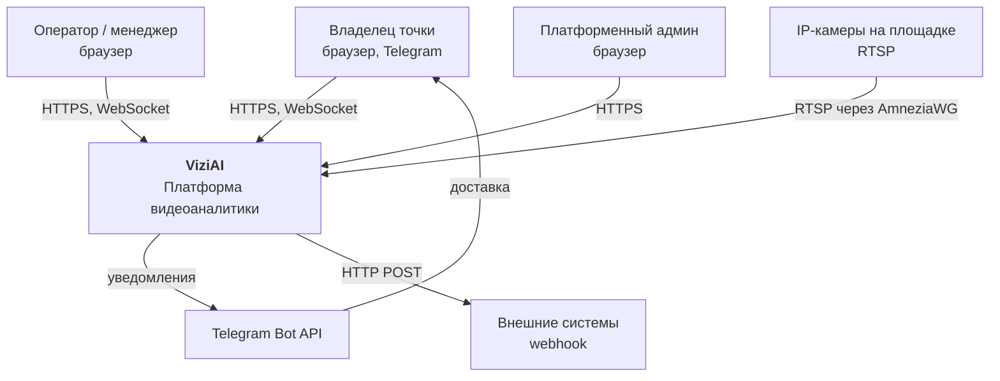

### 2.2. Диаграмма контейнеров (C4, уровень 2)

```mermaid
graph TB
    subgraph Site["Площадка (ПВЗ / завод)"]
        CAM["IP-камеры<br/>RTSP :554"]
        GW["Шлюз точки<br/>ПК с AmneziaWG<br/>netsh portproxy"]
        CAM --> GW
    end

    subgraph VPS["VPS (только режим cloud)"]
        NGX_V["nginx<br/>TLS-терминация :443"]
        WG_HUB["AmneziaWG-хаб<br/>10.9.0.1"]
    end

    subgraph Server["GPU-сервер"]
        NGX["nginx :80<br/>единая точка входа"]
        WEB["web<br/>Next.js 15 :3001"]
        API["api<br/>Fastify 5 :3000"]
        WCLIPS["worker-clips<br/>BullMQ"]
        WALERTS["worker-alerts<br/>BullMQ"]
        ANALYZER["analyzer<br/>Python 3.12 + CUDA"]
        RECORDER["recorder<br/>ffmpeg сегменты"]
        GO2RTC["go2rtc<br/>host net :1984/:8554/:8555"]

        PG[("PostgreSQL 16<br/>+ TimescaleDB")]
        REDIS[("Redis 7<br/>Streams, BullMQ, кеш")]
        MINIO[("MinIO<br/>S3 :9000")]
        DISK[["Диск архива<br/>/archive"]]
    end

    GW -.AmneziaWG.-> WG_HUB
    WG_HUB -.WireGuard.-> NGX
    WG_HUB -.RTSP 10.9.0.x.-> ANALYZER
    WG_HUB -.RTSP 10.9.0.x.-> GO2RTC
    WG_HUB -.RTSP 10.9.0.x.-> RECORDER

    Browser["Браузер"] -->|HTTPS| NGX_V
    NGX_V --> NGX
    NGX --> WEB
    NGX --> API
    NGX --> GO2RTC

    API --> PG
    API --> REDIS
    API --> MINIO
    API --> GO2RTC
    WEB --> API

    ANALYZER --> REDIS
    ANALYZER -->|POST /internal/reid/crop| API
    RECORDER --> DISK
    RECORDER -->|POST /internal/segments| API

    WCLIPS --> REDIS
    WCLIPS --> PG
    WCLIPS --> DISK
    WCLIPS --> MINIO
    WALERTS --> REDIS
    WALERTS --> PG
    WALERTS --> MINIO
    WALERTS -->|Bot API| TG["Telegram"]

    API --> DISK
```

### 2.3. Конвейер обработки

Основной поток данных — от кадра до уведомления:

```
RTSP → [analyzer: VideoSource] → кадр
     → [YOLOv8] → детекции
     → [ByteTrack] → треки
     → [IdentityManager] → global_id, staff
     → [Redis Stream: track_events]        (телеметрия, диагностика)
     → [ZoneEngine] → геофенсинг, dwell
     → [PluginManager] → отраслевые события
     → [Redis Stream: events]
     → [api: EventConsumer] → PostgreSQL
                            → PUBLISH events:{tenant_id} → WebSocket → браузер
                            → BullMQ alerts → Telegram / webhook
     → [по запросу] BullMQ clips → ffmpeg -c copy → MinIO
```

Отличие от исходной схемы в `CLAUDE.md`: `raw_frames` как Redis Stream **не существует**. Кадры никогда не покидают процесс анализатора — детекция выполняется в том же процессе, что и приём RTSP. Это сознательное упрощение: передача сырых кадров через Redis дала бы гигабайты в секунду при нулевой пользе.

---

## 3. Реестр сервисов

| Сервис | Технология | Точка входа | Состояние | Масштабирование |
|---|---|---|---|---|
| `analyzer` | Python 3.12, PyTorch/CUDA | `analyzer/detect/worker.py` | Stateful (треки, зоны, галерея в памяти) | Один процесс на тенанта; горизонтально — по тенантам |
| `recorder` | Python 3.12, ffmpeg | `analyzer/ingest/recorder.py` | Stateless | По камерам |
| `api` | Node.js 22, Fastify 5 | `api/src/index.ts` | Stateless, кроме WS-хаба | Требует доработки (см. 3.2.6) |
| `worker-clips` | Node.js 22, BullMQ | `api/src/workers/clips.worker.ts` | Stateless | Горизонтально |
| `worker-alerts` | Node.js 22, BullMQ | `api/src/workers/alerts.worker.ts` | Stateless | Горизонтально (с оговоркой, см. 6.4) |
| `web` | Node.js 22, Next.js 15 | `web/app/` | Stateless | Горизонтально |
| `go2rtc` | Go (внешний образ) | `infra/go2rtc/go2rtc.prod.yaml` | Stateful в памяти | Один экземпляр |
| `nginx` | nginx 1.27 | `infra/nginx/nginx.prod.conf` | Stateless | Горизонтально |
| `postgres` | TimescaleDB HA pg16 | `infra/postgres/init.sql` | Stateful | Один узел (см. [11](11_HIGH_AVAILABILITY.md)) |
| `redis` | Redis 7 alpine | AOF `appendonly yes` | Stateful | Один узел |
| `minio` | MinIO latest | — | Stateful | Один узел |

---

## 4. Сервис: analyzer

### 4.1. Назначение и модель выполнения

Единственный Python-сервис платформы. Один процесс обслуживает **все камеры одного тенанта**.

Модель конкурентности выбрана нетривиально и требует объяснения:

- Камеры обрабатываются **конкурентно через asyncio** — по одной задаче `_consume` на камеру.
- Инференс YOLO **сериализован на одном потоке** `ThreadPoolExecutor(max_workers=1, thread_name_prefix="yolo")`.

Обоснование: GPU — разделяемый ресурс, параллельные вызовы `model.predict` из нескольких потоков не ускоряют работу, но увеличивают потребление VRAM и провоцируют OOM на 8 ГБ. Один поток инференса даёт предсказуемую загрузку GPU; asyncio обеспечивает то, что пока GPU считает один кадр, остальные камеры продолжают читать RTSP (операция, связанная с вводом-выводом).

Правило из `CLAUDE.md` «один GPU-воркер = один процесс (не поток)» соблюдено: процесс один, GPU-поток внутри него один.

### 4.2. Диаграмма компонентов

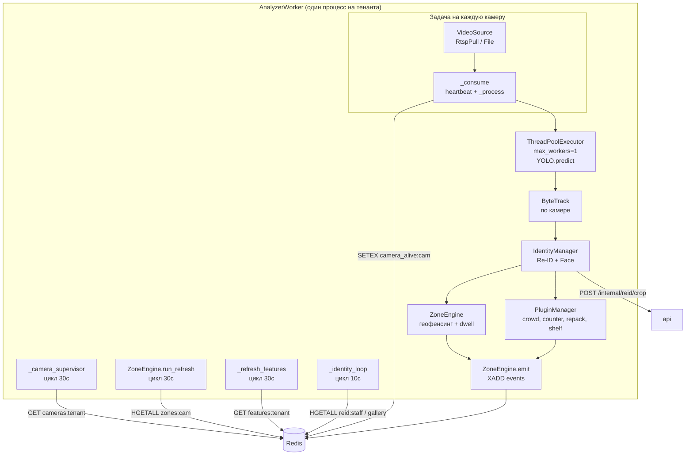

### 4.3. Процессы (фоновые циклы)

Все запускаются из `AnalyzerWorker.run()` и работают до остановки процесса.

| Процесс | Период | Функция | Поведение при ошибке |
|---|---|---|---|
| `_camera_supervisor` | `zone_refresh_seconds` (30с) | Сверяет `cameras:{tenant_id}` с запущенными задачами: стартует новые, отменяет удалённые | `logger.exception`, цикл продолжается |
| `ZoneEngine.run_refresh` | 30с | Перечитывает `zones:{camera_id}`; вызывает `sweep()` — синтетические `zone_exit` для потерянных треков | Ошибка одной камеры не ломает остальные |
| `_refresh_features` | 30с | Перечитывает `features:{tenant_id}`; переключение модулей в админке применяется без рестарта | `logger.exception`, цикл продолжается |
| `_identity_loop` | 10с | `identity.refresh()` (конфиг + галерея сотрудников), `identity.sync()` (запись изменённых эмбеддингов и кропов) | `logger.exception`, цикл продолжается |

Ключевое свойство супервизора: **он никогда не завершается при нуле камер**. Причина зафиксирована в коде: свежее развёртывание без камер иначе привело бы к выходу процесса и бесконечному циклу перезапуска Docker.

### 4.4. Жизненный цикл потребителя камеры

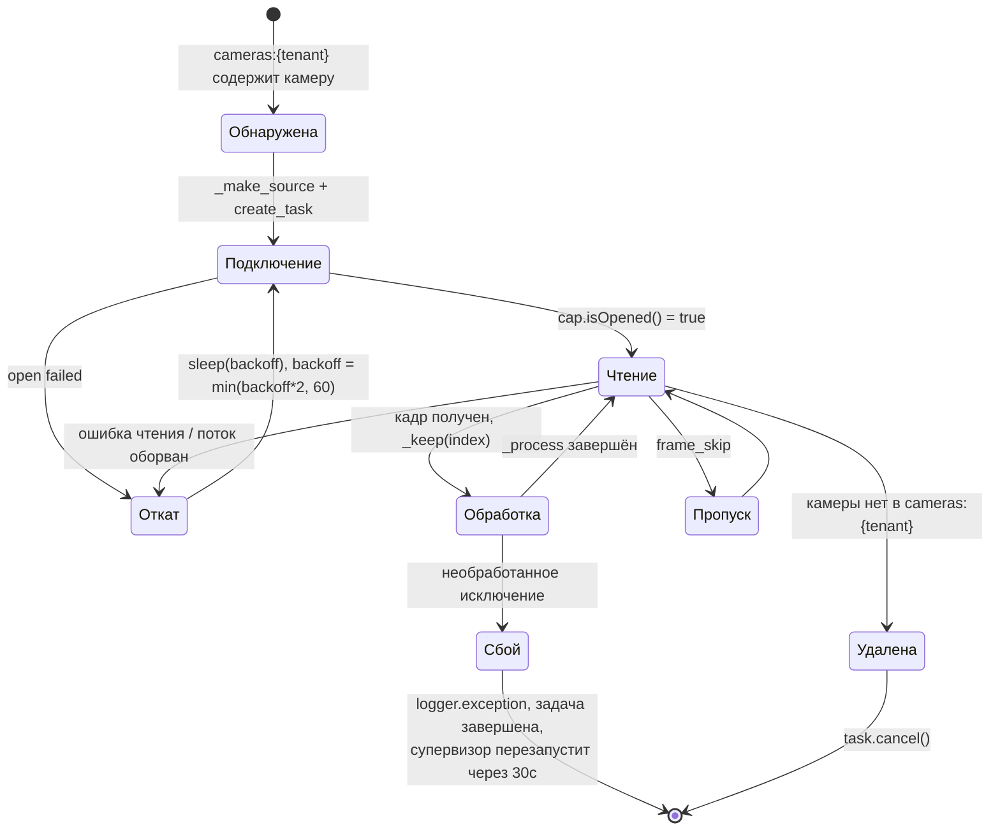

Heartbeat: в `_consume` на каждом кадре проверяется, прошло ли `HEARTBEAT_EVERY` (5с) с последней записи; если да — `SETEX camera_alive:{camera_id} 15 "1"`. Сбой записи heartbeat перехватывается и игнорируется — сеть до Redis не должна убивать обработку видео.

### 4.5. Обработка кадра: `_process`

Последовательность строго определена, порядок значим:

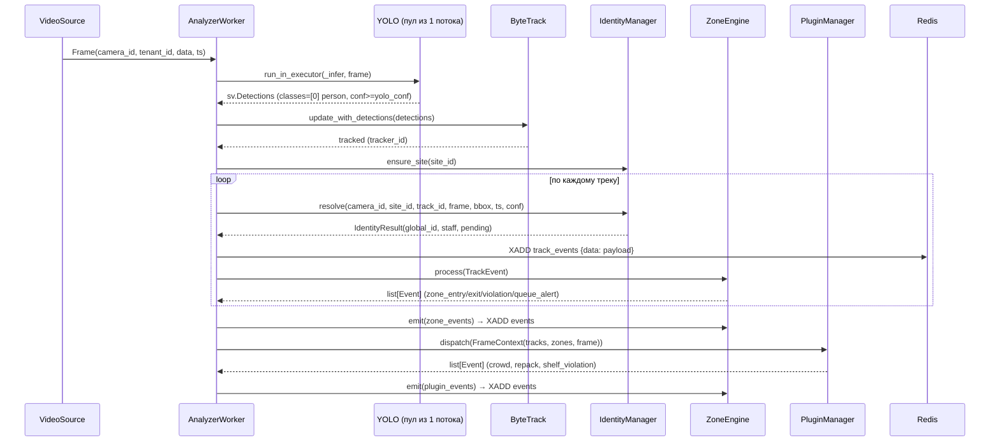

Замечания по деталям, которые неочевидны:

- **`classes=[PERSON_CLASS]`** (`0`, COCO person). Детектируются только люди. Расширение на другие классы (погрузчик, каска) требует изменения этого фильтра — см. [14_FACTORY_MODULES.md](14_FACTORY_MODULES.md).
- **`zone_id` в `track_events` всегда `null`.** Поле оставлено для совместимости со схемой; фактическая принадлежность зонам вычисляется дальше по конвейеру и попадает в `TrackInfo.zone_ids`.
- **`ByteTrack` создаётся лениво по камере** (`self._trackers.setdefault(frame.camera_id, sv.ByteTrack())`) и живёт вместе с процессом.
- **Нормализованные координаты.** Центр трека переводится в `0..1` делением на ширину/высоту кадра. Все полигоны зон хранятся нормализованными, поэтому смена разрешения камеры не ломает зоны.

### 4.6. VideoSource: абстракция источника

`analyzer/ingest/video_source.py`.

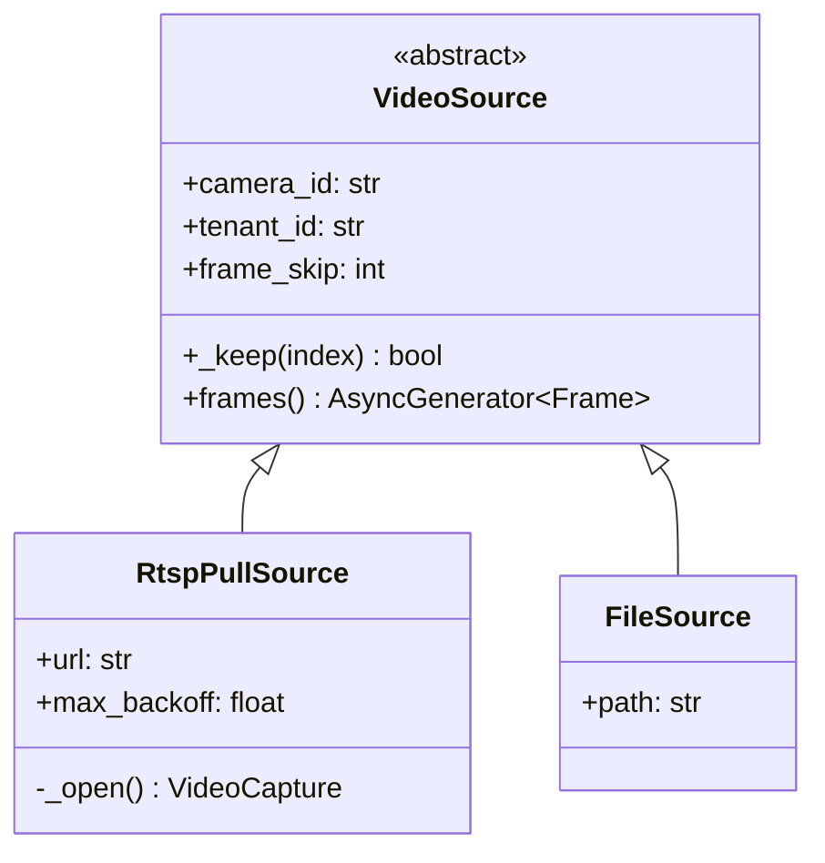

`RtspPullSource` открывает поток через `cv2.VideoCapture(url, cv2.CAP_FFMPEG)` с `CAP_PROP_BUFFERSIZE = 1` — внутренняя буферизация OpenCV отключается, иначе анализатор отстаёт от реального времени на секунды.

`frame_skip` реализован как `index % (frame_skip + 1) == 0`: `0` — все кадры, `2` — каждый третий. Настраивается per-camera через `camera.config.frame_skip` с fallback на `DEFAULT_FRAME_SKIP` (в проде `2`).

`srt_push` в перечислении `source_type` присутствует, но обрабатывается тем же `RtspPullSource` — FFmpeg открывает SRT-URL так же. Отдельного push-приёмника нет; см. [05_CAMERA_CONNECTION.md](05_CAMERA_CONNECTION.md).

### 4.7. ZoneEngine

`analyzer/zones/engine.py`. Разделение на чистую и асинхронную части сделано намеренно: `process()` синхронный и детерминированный (тестируется без Redis), `emit()` и цикл обновления — единственные асинхронные части.

**Геофенсинг:** алгоритм трассировки луча (`_point_in_polygon`) по нормализованному центру bbox. Полигон менее трёх точек считается пустым.

**Ключ состояния:** `(camera_id, subject, zone_id)`, где `subject = global_id or f"trk:{track_id}"`. Это принципиально: состояние привязано к **личности**, а не к треку. Мерцание трекера (потеря и переприсвоение `track_id`) не создаёт ложных входов/выходов, если Re-ID включён.

**Группы типов зон:**

```python
DWELL_KINDS = {"counter", "desk", "queue"}                    # + queue_alert по dwell_seconds
ENTRY_EXIT_KINDS = {"counter", "desk", "queue", "shelf"}      # zone_entry / zone_exit
# "forbidden" → zone_violation немедленно
# "required_ppe" → обрабатывается плагином PPE [План]
```

**Таблица переходов:**

| Состояние | Событие | Условие | Действие |
|---|---|---|---|
| Нет состояния | Внутри полигона | `kind = forbidden` | `zone_violation` (critical), `alerted = true` |
| Нет состояния | Внутри полигона | `kind ∈ ENTRY_EXIT_KINDS` | `zone_entry` (info) |
| Есть состояние | Внутри полигона | `kind ∈ DWELL_KINDS`, `dwell ≥ dwell_seconds`, кулдаун истёк | `queue_alert` (warn) с `meta.dwell_sec` |
| Есть состояние | Внутри полигона | `kind = forbidden`, кулдаун истёк | `zone_violation` (critical) повторно |
| Есть состояние | Вне полигона | `kind ∈ ENTRY_EXIT_KINDS` | `zone_exit` (info) с `meta.dwell_sec`, состояние удалено |
| Есть состояние | Трек не виден > `track_lost_seconds` (5с) | `kind ∈ ENTRY_EXIT_KINDS` | `zone_exit` с `meta.lost = true` (через `sweep()`) |

**Расписание зоны** (`zone.schedule`, часовой пояс площадки):

- `active_from`/`active_to` — окно активности зоны. Вне окна состояние удаляется молча, события не порождаются.
- `all_from`/`all_to` — «ночной режим»: в этом окне сотрудники перестают быть невидимыми (`night_all = true`). Сценарий охраны: ночью в зоне не должно быть никого, включая персонал.

Окна задаются в `HH:MM` и могут пересекать полночь: `_in_window` обрабатывает `frm > to` как перенос через сутки.

**Исключение сотрудников:** если `te.staff` и `zone.config.ignore_staff` (по умолчанию `true`) и не `night_all` — состояние удаляется, зона трек не видит.

### 4.8. IdentityManager (Re-ID)

`analyzer/reid/`. Подробности алгоритмов — в [06_AI_ENGINE.md](06_AI_ENGINE.md), здесь — архитектурная роль.

Назначение: присвоить человеку `global_id`, стабильный между камерами одной площадки, и флаг `staff`.

Хранилища:

| Ключ Redis | Тип | Содержимое | TTL |
|---|---|---|---|
| `reid:gallery:{site_id}` | hash | `gid → {emb, last_seen}` — посетители площадки | 12 часов |
| `reid:staff:{tenant_id}` | hash | `gid → {embs: [[...]], name}` — эталоны одежды сотрудников (до 8) | Бессрочно |
| `face:staff:{tenant_id}` | hash | `gid → {embs: [[...]], photos, failed}` — эталоны лиц сотрудников (до 10) | Бессрочно |
| `face_enroll:{tenant_id}` | list | `{gid, jpeg_b64}` — очередь на извлечение эталона лица | — |
| `visitors:{tenant_id}` | hash | `site_id → {visitors, day, ts}` — уникальные посетители за сутки | — |
| `occupancy:{tenant_id}` | hash | `camera_id → {occupancy, ts}` — текущая занятость | — |

Ключевые архитектурные свойства:

1. **Галерея посетителей — на площадку (`site_id`), не на камеру.** Это то, что устраняет двойной счёт: человек, прошедший перед четырьмя камерами, — один посетитель.
2. **Галерея сотрудников — на тенанта.** Сотрудник узнаётся на любой площадке организации.
3. **Пробация.** Личность не создаётся с первого кадра: требуется `min_samples` принятых сэмплов и `min_track_age`. До этого `IdentityResult.pending = true`, и `CounterPlugin` такой трек не считает. Это прямое следствие инцидента «2 курьера = 44 посетителя».
4. **Эмбеддинг — не персональные данные.** TTL 12 часов, обнуление ежесуточно, невозможность обратной идентификации. См. [00_VISION.md](00_VISION.md), 7.1.

### 4.9. Конфигурация analyzer

`analyzer/config.py`, класс `Settings(BaseSettings)`. Полный перечень с фактическими значениями по умолчанию:

| Переменная | Умолчание | Смысл |
|---|---|---|
| `REDIS_URL` | `redis://localhost:6379` | Адрес Redis |
| `TENANT_ID` | — (обязательна) | Тенант, чьи камеры обслуживает процесс |
| `ANALYZER_DEVICE` | `cuda` | `cuda` \| `cpu` |
| `YOLO_MODEL` | `yolov8n.pt` (в проде `yolov8s.pt`) | Модель детекции |
| `YOLO_CONF` | `0.3` | Порог уверенности |
| `YOLO_IMGSZ` | `640` | Размер входа сети |
| `DEFAULT_FRAME_SKIP` | `0` (в проде `2`) | Пропуск кадров по умолчанию |
| `MAX_BACKOFF_SECONDS` | `60.0` | Потолок экспоненциального отката |
| `TRACK_EVENTS_STREAM` | `track_events` | Имя стрима телеметрии |
| `EVENTS_STREAM` | `events` | Имя стрима событий |
| `STREAM_MAXLEN` | `10000` | Приблизительный лимит длины стрима при XADD |
| `ZONE_REFRESH_SECONDS` | `30` | Период всех 30-секундных циклов |
| `TRACK_LOST_SECONDS` | `5.0` | Порог синтетического `zone_exit` |
| `DEFAULT_COOLDOWN_SECONDS` | `60.0` | Кулдаун повторного алерта зоны |
| `ENABLED_PLUGINS` | `""` | Dev-переопределение: список модулей через запятую |
| `FACE_DETECT_ONNX` | `/opt/models/face_detection_yunet.onnx` | Детектор лиц (сотрудники) |
| `FACE_RECOG_ONNX` | `/opt/models/face_recognition_sface.onnx` | Распознаватель лиц (сотрудники) |
| `ARCHIVE_ROOT` | `/mnt/archive` (в проде `/archive`) | Корень видеоархива для recorder |
| `SEGMENT_SECONDS` | `300` | Длина сегмента архива |
| `FFMPEG_BIN` | `ffmpeg` | Путь к ffmpeg |
| `INTERNAL_API_URL` | `http://localhost:3000` | API для служебных вызовов |
| `INTERNAL_TOKEN` | `""` | Токен служебной аутентификации |
| `LOG_LEVEL` | `INFO` | Уровень логирования |
| `REID_ONNX` | не задана | Путь к OSNet ONNX; пусто → HSV-fallback |

---

## 5. Сервис: recorder

`analyzer/ingest/recorder.py`, тот же образ, что и analyzer, запускается командой `python -m analyzer.ingest.recorder`. В prod-compose вынесен в профиль `recorder` — включается флагом `--profile recorder`.

Назначение: непрерывная запись видеоархива, необходимая для нарезки клипов. Пишет сегменты по `SEGMENT_SECONDS` (300с) в `ARCHIVE_ROOT`, регистрирует их через `POST /internal/segments`.

Архитектурное решение: запись выполняется **без перекодирования**. Ключевое следствие — нарезка клипа тоже идёт через `ffmpeg -c copy`, то есть за миллисекунды и без нагрузки на GPU. Цена: точность нарезки ограничена интервалом опорных кадров камеры.

Взаимодействие с retention: файлы удаляет не recorder, а `api/src/retention.ts` — раз в час, по `archive_retention_days` и по порогу свободного места `archive_min_free_gb`. Поэтому контейнер `api` монтирует `/archive` на запись, а `worker-clips` — только на чтение.

---

## 6. Сервис: api

### 6.1. Состав процесса

`api/src/index.ts` поднимает Fastify 5 и внутри одного процесса запускает пять независимых подсистем:

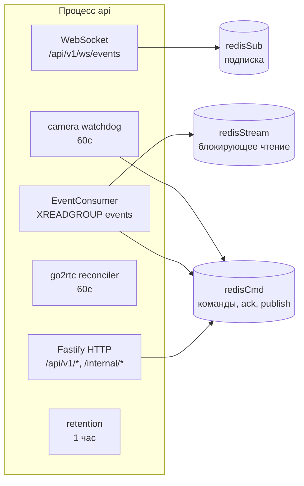

**Три отдельных соединения с Redis** — не избыточность. `XREADGROUP ... BLOCK 5000` блокирует соединение; `SUBSCRIBE` переводит соединение в режим подписки, где обычные команды недоступны. Смешение привело бы к взаимной блокировке.

### 6.2. Валидация и типизация

Fastify сконфигурирован с `fastify-type-provider-zod`: `validatorCompiler` и `serializerCompiler` из Zod. Это означает, что схема Zod одновременно является контрактом валидации входа, схемой сериализации ответа и источником типов TypeScript. Расхождение между типом и рантаймом структурно невозможно.

### 6.3. EventConsumer: Redis Streams → PostgreSQL

`api/src/streams/event_consumer.ts`.

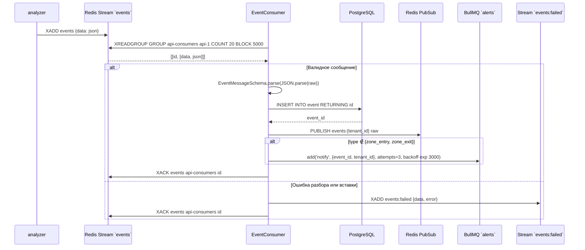

Проектные решения и их обоснование:

| Решение | Обоснование |
|---|---|
| Dead-letter + XACK при ошибке | Невалидное сообщение, оставленное без XACK, вечно возвращается в pending и блокирует группу. Отравленное сообщение не имеет права остановить конвейер |
| `PUBLISH` после успешной вставки | Браузер не должен увидеть событие, которого нет в БД |
| `zone_entry`/`zone_exit` не порождают алертов | Основной источник флуда (пять тысяч сообщений в сутки). Они сохраняются и попадают в WS-ленту, но не в очередь алертов |
| `BLOCK 5000` | Компромисс: холостых пробуждений мало, реакция на остановку — не более 5с |
| `COUNT 20` | Батч ограничивает объём необработанных сообщений при падении процесса |

**Известное ограничение [Требует решения]:** «зависшие» сообщения (доставленные потребителю, который упал до XACK) не восстанавливаются — `XAUTOCLAIM` не вызывается. При штатном перезапуске контейнера возможна потеря небольшого числа событий. Рекомендация: добавить периодический `XAUTOCLAIM` с `min-idle-time` порядка 60с. См. [11_HIGH_AVAILABILITY.md](11_HIGH_AVAILABILITY.md).

### 6.4. WebSocket-хаб

`api/src/ws/events.ts`. Одно соединение-подписчик Redis, каналы по тенанту `events:{tenant_id}`. Подписка оформляется при первом клиенте тенанта, снимается при последнем.

**Аутентификация — одноразовый тикет:**

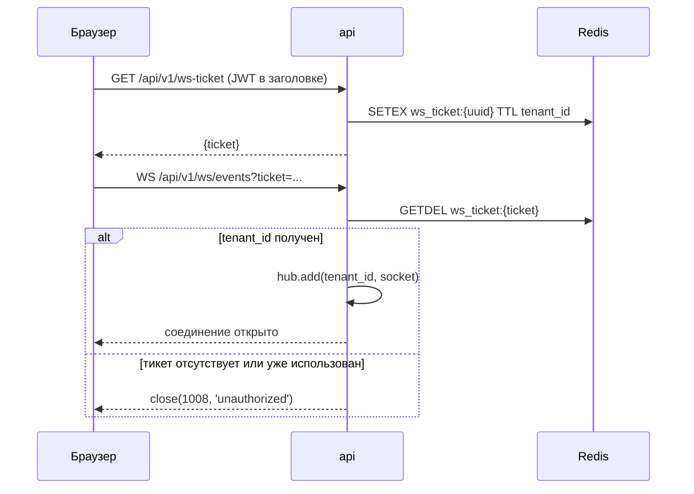

Обоснование схемы: браузерный WebSocket-клиент не позволяет задать заголовок `Authorization`, поэтому передать JWT можно только в query-строке — где он попадёт в логи nginx и историю браузера. Одноразовый тикет с `GETDEL` решает это: перехваченный из логов тикет уже израсходован.

**Ограничение масштабирования:** хаб хранит подключения в памяти процесса. Несколько реплик `api` работают корректно (каждая подписана на Redis и рассылает своим клиентам), но `EventConsumer` внутри того же процесса требует уникального `CONSUMER_NAME` на реплику. Сейчас он задаётся статически (`api-1`). **[Требует решения]** при переходе на несколько реплик: вывести `CONSUMER_NAME` из hostname контейнера.

### 6.5. Фоновые процессы api

| Процесс | Период | Файл | Назначение |
|---|---|---|---|
| go2rtc reconciler | 60с | `api/src/routes/cameras.ts` | go2rtc хранит потоки в памяти и теряет их при рестарте; reconciler сверяет список с БД и восстанавливает |
| camera watchdog | 60с | `api/src/camera_watchdog.ts` | Отсутствие `camera_alive:{id}` дольше `camera_offline_alert_seconds` (300с) → событие `camera_offline` (critical); восстановление → `camera_online` (info) |
| retention | 1 час | `api/src/retention.ts` | События: `drop_chunks` TimescaleDB по `event_retention_days`. Архив: удаление сегментов старше срока + аварийное удаление старейших при нехватке места |

Watchdog не алармит по камерам с `source_type = file` и по камерам, ни разу не выходившим в онлайн, — иначе каждое развёртывание порождало бы шквал ложных критических событий.

### 6.6. Служебный API (`/internal/*`)

Аутентификация — `INTERNAL_TOKEN`, не JWT. Эти маршруты вызывают сервисы, а не браузеры.

| Маршрут | Вызывающий | Назначение |
|---|---|---|
| `POST /internal/reid/crop` | analyzer | Загрузка кропа личности в MinIO (`reid/{tenant}/{gid}.jpg`) для страницы «Люди» |
| `POST /internal/segments` | recorder | Регистрация записанного сегмента в `archive_segment` |

Обоснование отдельного пространства имён: у сервисов нет пользователя и нет тенанта из JWT — они действуют от имени системы. Смешение с `/api/v1/*` потребовало бы «системного пользователя», то есть обходного пути в модели прав. См. [13_SECURITY.md](13_SECURITY.md).

### 6.7. Слой настроек

`api/src/settings.ts`. Двухуровневая конфигурация: `.env` задаёт умолчание, таблица `system_setting` переопределяет.

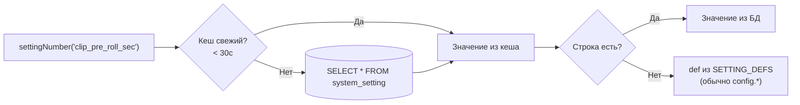

Кеш на 30с существует потому, что горячие пути (тик watchdog, диспетчеризация алерта, нарезка клипа) читают настройки на каждой операции. Запись (`saveSetting`) сбрасывает кеш (`cacheAt = 0`).

Валидация — в `SETTING_DEFS`: тип, границы `min`/`max`, метка на русском. Пустое значение типа `secret` **удаляет строку**, возвращая fallback на `.env`. Секреты (`telegram_bot_token`) наружу не отдаются.

Полный список настроек — в [08_RULE_ENGINE.md](08_RULE_ENGINE.md) и [16_API_GUIDE.md](16_API_GUIDE.md).

### 6.8. Конфигурация api

`api/src/config.ts`, `EnvSchema.parse(process.env)` — процесс не стартует с невалидной конфигурацией.

| Группа | Переменные |
|---|---|
| HTTP | `API_PORT` (3000), `API_HOST` (0.0.0.0) |
| Хранилища | `DATABASE_URL`, `REDIS_URL` |
| Аутентификация | `JWT_SECRET` (min 8), `INTERNAL_TOKEN` (min 8) |
| Видео | `GO2RTC_URL` |
| Streams | `EVENTS_STREAM`, `FAILED_STREAM`, `CONSUMER_GROUP`, `CONSUMER_NAME` |
| MinIO | `MINIO_ENDPOINT`, `MINIO_PUBLIC_ENDPOINT`, `MINIO_ACCESS_KEY`, `MINIO_SECRET_KEY`, `MINIO_BUCKET_CLIPS`, `MINIO_BUCKET_SNAPSHOTS` |
| Архив | `ARCHIVE_ROOT` (/archive) |
| Клипы | `CLIP_TMP_DIR`, `CLIP_PRE_ROLL_SEC` (10), `CLIP_POST_ROLL_SEC` (5), `CLIP_WATERMARK` (true), `CLIP_FONT`, `FFMPEG_BIN` |
| Алерты | `TELEGRAM_BOT_TOKEN`, `CAMERA_OFFLINE_ALERT_SECONDS` (300) |
| Загрузка | `TESTVIDEO_DIR` (/data), `UPLOAD_MAX_BYTES` (5 ГБ) |

`MINIO_PUBLIC_ENDPOINT` существует отдельно от `MINIO_ENDPOINT`, потому что presigned-ссылки открывает браузер: внутренний адрес `http://minio:9000` ему недоступен, нужен публичный `https://s3.<domain>`.

---

## 7. Сервисы: BullMQ-воркеры

### 7.1. worker-clips

`api/src/workers/clips.worker.ts`. Очередь `clips`, задание `ClipJob {event_id, camera_id, ts_start, ts_end, tenant_id}`.

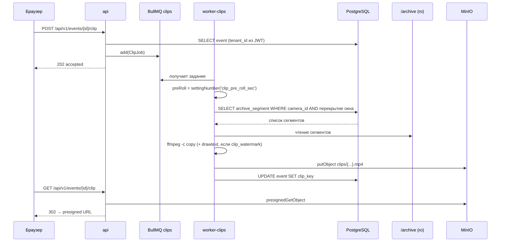

Ключевые решения:

- **`ffmpeg -c copy`** — нарезка без перекодирования. Клип за 30 секунд архива готовится за доли секунды и не занимает GPU. Цена — привязка границ к опорным кадрам.
- **Водяной знак через `drawtext`** требует перекодирования, поэтому включается настройкой `clip_watermark`. Текст экранируется (`ffmpegEscape`): обратный слэш, двоеточие, апостроф, процент — иначе имя камеры с двоеточием ломает фильтр.
- **Pre/post-roll читаются из настроек на каждом задании**, а не из окружения при старте: владелец меняет их в админке.
- **Монтирование `/archive` только для чтения** — воркер не имеет права удалять записи.

### 7.2. worker-alerts

`api/src/workers/alerts.worker.ts`. Очередь `alerts`, задание `AlertJob {event_id, tenant_id, test_rule_id?, digest?}`.

Три режима одного воркера:

| Режим | Признак | Поведение |
|---|---|---|
| Обычный | `event_id` | Подбор правил, проверка условий, кулдаун, тихие часы → доставка или буфер сводки |
| Тестовый | `test_rule_id` | Синтетическое сообщение в каналы правила в обход кулдауна и тихих часов |
| Сводка | `digest: true` | Повторяемый тик: выгрузка накопленных буферов одним сообщением |

Логика правил, кулдаунов, тихих часов и сводок разобрана в [08_RULE_ENGINE.md](08_RULE_ENGINE.md).

Каналы (`alert_rule.channels` jsonb, валидация Zod):

```typescript
TelegramChannel = { type: 'telegram', chat_id: string | number }
WebhookChannel  = { type: 'webhook', url: string (url) }
// прочие типы принимаются схемой и записываются как unsupported
```

Каждая попытка доставки фиксируется в `notifications (event_id, rule_id, channel, status, error, sent_at)`. Отсутствие FK на `event_id` объяснено в [10_DATABASE.md](10_DATABASE.md): `event` — гипертаблица с составным PK `(id, ts_start)`, её `id` не уникален и не может быть целью FK.

Состояние воркера вынесено в Redis, а не в память процесса: кулдаун — `cooldown:{rule_id}:{gid|camera_id}` через атомарный `SET NX EX`, буфер сводки — список `digest:{rule_id}` и множество `digest:rules`. Благодаря этому воркер сам по себе не имеет состояния, а `concurrency: 5` внутри одного процесса безопасен.

**[Требует решения] при масштабировании:** выгрузка сводки (`processDigest`) не атомарна — между проверкой `digest:last:{rule_id}` и `DEL digest:{rule_id}` есть окно, в котором вторая реплика прочитает тот же буфер. Кулдаун от этого защищён (`SET NX`), сводка — нет. Две реплики `worker-alerts` могут отправить сводку дважды. Рекомендация: обернуть выгрузку блокировкой (`SET digest:lock:{rule_id} NX EX`) перед добавлением второй реплики.

---

## 8. Сервис: web

Next.js 15 (App Router), React 19, TypeScript strict.

### 8.1. Карта страниц

| Маршрут | Роль | Назначение |
|---|---|---|
| `/` | Гость | Публичный лендинг; залогиненные перенаправляются на `/dashboard` |
| `/login` | Гость | Вход, SSR |
| `/dashboard` | Любая | Сетка камер, статусы, лента событий |
| `/events` | Любая | Журнал событий: фильтры, снапшоты, клипы, разбор |
| `/analytics` | Любая | Графики, разбивка по типам и камерам, посетители |
| `/settings/cameras` | admin+ | Список камер |
| `/settings/cameras/[id]/zones` | admin+ | Редактор зон поверх кадра (Canvas) |
| `/settings/features` | admin+ | Модули тенанта |
| `/admin/*` | super | Площадки, пользователи, правила алертов, «Люди», настройки сервера, обслуживание, видео |

### 8.2. Аутентификация в браузере

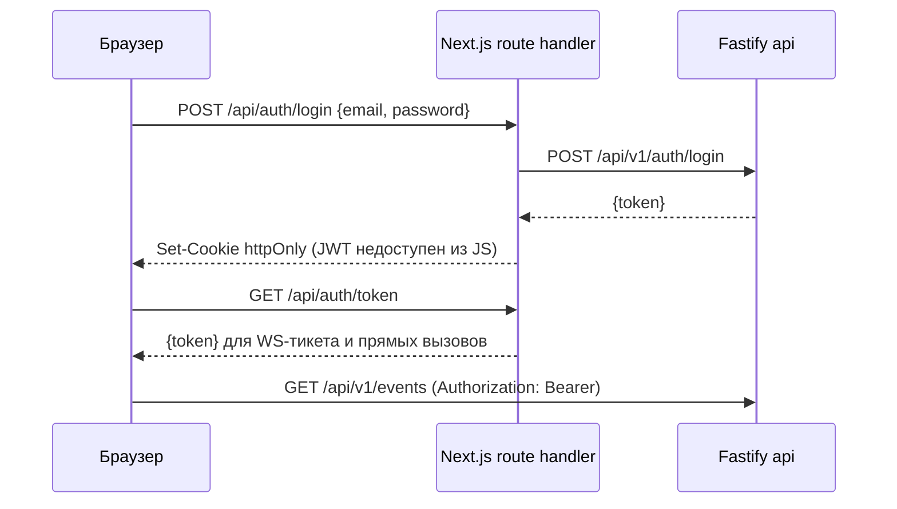

JWT живёт в httpOnly-cookie — он недоступен для JavaScript и потому неизвлекаем при XSS. Собственные route-handlers Next.js (`web/app/api/auth/*`) существуют ровно ради установки этой cookie.

Отсюда следует неочевидное правило nginx, зафиксированное в `infra/nginx/locations.inc`: проксировать на Fastify можно **только** `/api/v1`, но не голый `/api`. Иначе `/api/auth/login` был бы перехвачен и отправлен в Fastify, который такого маршрута не знает.

### 8.3. Состояние на клиенте

| Слой | Инструмент | Область |
|---|---|---|
| Серверные данные | TanStack Query | Кеш и инвалидация REST |
| Живые события | Zustand (`web/store/events.store.ts`) | Поток WS |
| Локализация перечислений | `web/lib/labels.ts` | Единственное место перевода |

REST и WebSocket дают разные формы одного события (`ApiEvent` в camelCase, `StreamEvent` в snake_case). Обе нормализуются в `UiEvent` функциями `fromApiEvent` / `fromStreamEvent` (`shared/events.schema.ts`) — компоненты знают только `UiEvent`.

### 8.4. Живое видео

Компонент `web/components/camera-stream.tsx` использует завендоренный веб-компонент go2rtc `<video-stream>` (v1.9.14) — не CDN. Транспорт: MSE с деградацией в HLS. Прокси — `/go2rtc/` в nginx с `proxy_buffering off` (длинные потоки нельзя буферизовать) и таймаутами 3600с.

---

## 9. Транспорт и контракты

### 9.1. Redis Streams

| Стрим | Производитель | Потребитель | Группа | Лимит |
|---|---|---|---|---|
| `track_events` | analyzer | Нет активных потребителей | — | `maxlen ≈ 10000` |
| `events` | analyzer (ZoneEngine.emit) | api (EventConsumer) | `api-consumers` | `maxlen ≈ 10000` |
| `events:failed` | api (dead-letter) | Админка `/admin/dead-letter` | — | Без лимита |

`track_events` сейчас никем не читается. Это не мёртвый код, а осознанный задел: телеметрия трекинга нужна для отладки и для будущих потребителей (тепловые карты, аналитика траекторий). Стрим ограничен по длине, поэтому не растёт бесконечно. **[Требует решения]:** либо появится потребитель (тепловые карты — ближайший кандидат), либо запись следует отключать флагом ради экономии сети и CPU.

Формат сообщения: одно поле `data` с JSON-строкой. Причина: Redis Streams хранит плоский набор полей; вложенные структуры (`bbox`, `meta`) всё равно потребовали бы сериализации. Единое поле упрощает валидацию — одна `JSON.parse` и одна `schema.parse`.

### 9.2. Схема сообщения `events`

`shared/events.schema.ts` — единственный источник истины.

```typescript
StreamEventSchema = z.object({
  stream: z.literal('events').optional(),
  tenant_id: z.string().uuid(),
  site_id: z.string().uuid(),
  camera_id: z.string().uuid(),
  zone_id: z.string().uuid().nullable().optional(),
  type: EventType,          // 11 значений, см. ниже
  severity: Severity,       // info | warn | critical
  track_id: z.number().int().nullable().optional(),
  confidence: z.number().nullable().optional(),
  bbox: BboxSchema.nullable().optional(),   // {x1,y1,x2,y2} в пикселях
  meta: z.record(z.unknown()).optional(),
  ts_start: z.string(),
  ts_end: z.string().nullable().optional(),
})
```

`EventType` (согласован между Zod, Drizzle `pgEnum` и SQL `CREATE TYPE`):

```
zone_entry | zone_exit | zone_violation | queue_alert | ppe_violation |
repack_event | shelf_violation | crowd | unknown_person |
camera_offline | camera_online
```

Добавление типа требует согласованного изменения в трёх местах: `shared/events.schema.ts`, `api/db/schema.ts` (`eventTypeEnum`), миграция SQL (`ALTER TYPE event_type ADD VALUE`). Плюс метка в `web/lib/labels.ts` и `TYPE_LABELS` воркера алертов, иначе в UI появится английский идентификатор — нарушение решения V-06.

Расхождение, требующее устранения: `infra/postgres/init.sql` создаёт `feature_kind` без значений `crowd`, `counter`, `reid` — они добавлены миграциями `0001` и `0003`. Свежая установка получает enum из `init.sql` + миграции; порядок обязателен. См. [10_DATABASE.md](10_DATABASE.md).

### 9.3. Поле `meta`: типоспецифичные данные

`meta jsonb` — точка расширения без изменения схемы. Фактическое наполнение:

| Тип события | Ключи `meta` |
|---|---|
| `zone_entry` | `kind`, `staff?`, `global_id?` |
| `zone_exit` | `kind`, `dwell_sec`, `lost?`, `staff?`, `global_id?` |
| `zone_violation` | `kind`, `dwell_sec?`, `staff?`, `global_id?` |
| `queue_alert` | `kind`, `dwell_sec`, `staff?`, `global_id?` |
| `crowd` | `count`, `threshold` |
| `repack_event` | `dwell_sec`, `kind: "desk"` |
| `shelf_violation` | `change`, `kind: "shelf"` |
| `camera_offline` / `camera_online` | зависит от watchdog |

`zone_exit.meta.dwell_sec` — основа метрик очереди и обслуживания: время ожидания уже лежит в БД по всем историческим событиям.

### 9.4. BullMQ

| Очередь | Задание | Воркер | Повторы |
|---|---|---|---|
| `clips` | `ClipJob` | worker-clips | По умолчанию BullMQ |
| `alerts` | `AlertJob` | worker-alerts | `attempts: 3`, экспоненциальный откат от 3000 мс |

Соединение BullMQ создаётся с `maxRetriesPerRequest: null` — требование библиотеки; на общем соединении BullMQ работать отказывается.

Хранение: `removeOnComplete: 200`, `removeOnFail: 500` — история ограничена, Redis не растёт.

### 9.5. Redis: ключи вне стримов

| Ключ | Тип | Пишет | Читает | TTL |
|---|---|---|---|---|
| `cameras:{tenant_id}` | string (JSON) | api | analyzer, recorder | — |
| `zones:{camera_id}` | hash | api | analyzer | — |
| `features:{tenant_id}` | string (JSON) | api | analyzer | — |
| `camera_alive:{camera_id}` | string | analyzer | api (GET /cameras, watchdog) | 15с |
| `ws_ticket:{uuid}` | string | api | api (GETDEL) | короткий |
| `occupancy:{tenant_id}` | hash | analyzer (CounterPlugin) | api | — |
| `visitors:{tenant_id}` | hash | analyzer (CounterPlugin) | api | — |
| `reid:gallery:{site_id}` | hash | analyzer | api («Люди») | 12ч |
| `reid:staff:{tenant_id}` | hash | api | analyzer | — |
| `face:staff:{tenant_id}` | hash | analyzer | analyzer | — |
| `face_enroll:{tenant_id}` | list | api | analyzer | — |

**Redis как кеш проекции БД.** `cameras:`, `zones:`, `features:` — это проекция PostgreSQL, которую пишет API при изменениях. Analyzer никогда не ходит в PostgreSQL напрямую. Обоснование: анализатор не должен зависеть от доступности БД и от знания её схемы; он читает плоский JSON.

Цена решения: рассинхронизация возможна, если Redis очистили, а API не переписал проекцию. Именно для этого существует кнопка «Ресинхр Redis» (`POST /api/v1/admin/resync`) в `/admin/maintenance`. После рестартов Redis её нажатие обязательно — иначе анализатор не получит часовые пояса и расписания зон.

### 9.6. Сводная таблица протоколов

| Участок | Протокол | Порт | Шифрование |
|---|---|---|---|
| Браузер → VPS | HTTPS / WSS | 443 | TLS |
| VPS → сервер | HTTP | 80 | WireGuard |
| Точка → VPS | AmneziaWG (UDP) | настраиваемый | ChaCha20-Poly1305 |
| Камера → шлюз точки | RTSP/TCP | 554 | Нет (LAN) |
| Сервер → камера | RTSP/TCP через туннель | проброшенный | WireGuard |
| api ↔ postgres | PostgreSQL wire | 5432 | Внутренняя сеть Docker |
| api ↔ redis | RESP | 6379 | Внутренняя сеть Docker |
| api ↔ minio | S3 HTTP | 9000 | Внутренняя сеть Docker |
| Браузер → MinIO | HTTPS presigned | 443 (s3.домен) | TLS |
| api ↔ go2rtc | HTTP REST | 1984 | host-gateway |
| Браузер ↔ go2rtc | HTTP/WS через /go2rtc/ | 443 | TLS |
| analyzer → api | HTTP `/internal/*` | 3000 | Внутренняя сеть Docker |

---

## 10. Хранилища

| Хранилище | Данные | Долговечность | Восстановление |
|---|---|---|---|
| PostgreSQL + TimescaleDB | Тенанты, площадки, камеры, зоны, события, правила, пользователи, аудит, метаданные архива, настройки, уведомления | Критично | Резервная копия обязательна — **[План]**, см. [03_DEPLOYMENT.md](03_DEPLOYMENT.md) |
| Redis | Streams, BullMQ, проекции, галереи Re-ID, heartbeat | Смешанно | Проекции — через `/admin/resync`; галерея посетителей теряется (TTL 12ч, приемлемо); эталоны сотрудников теряются — **[Требует решения]** |
| MinIO | Клипы (`clips`), снапшоты (`snapshots`), кропы Re-ID (`reid/{tenant}/{gid}.jpg`) | Важно | Резервная копия — **[План]** |
| Файловая система `/archive` | Сегменты видео | Важно, объёмно | Не резервируется по объёму; retention по времени и по свободному месту |
| Файловая система `/data` | Загруженные тестовые видео | Некритично | — |

**Риск, требующий решения:** `reid:staff:{tenant_id}` и `face:staff:{tenant_id}` — единственные бессрочные данные в Redis, не имеющие источника истины в PostgreSQL. Потеря тома Redis означает потерю всех отметок сотрудников, которые владелец делал вручную. Рекомендация: перенести эталоны сотрудников в PostgreSQL (таблица `staff_identity`), оставив Redis кешем-проекцией — по той же схеме, что `cameras:`/`zones:`. Это устраняет единственное место, где Redis выступает системой записи.

---

## 11. Сквозные сценарии

### 11.1. Человек стоит в очереди дольше порога

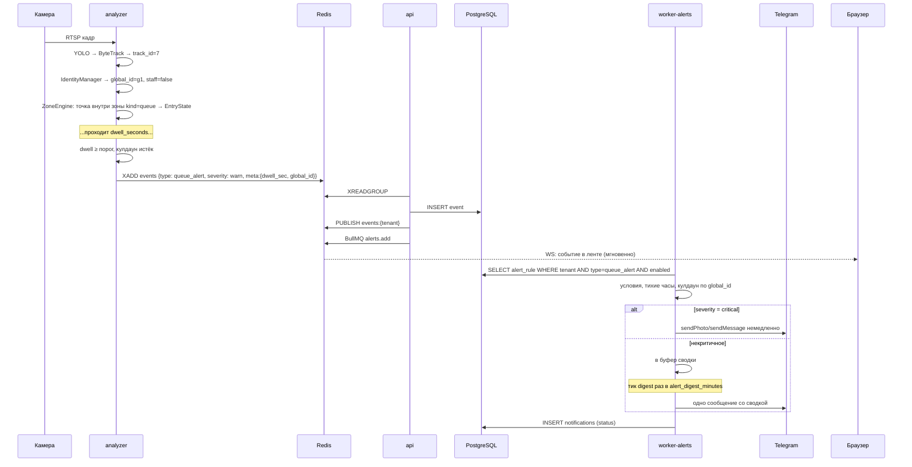

### 11.2. Владелец запрашивает клип по событию

См. диаграмму в 7.1.

### 11.3. Администратор добавляет камеру

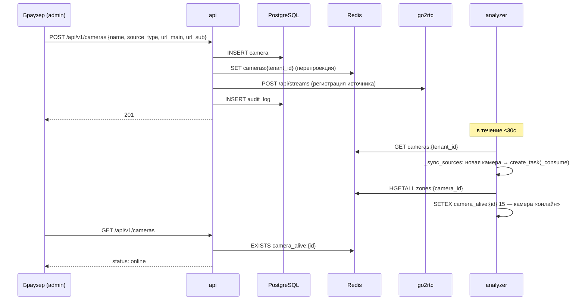

Задержка до 30 секунд — сознательный компромисс: опрос вместо подписки. Альтернатива (`PUBLISH cameras_changed` + подписка в analyzer) уменьшила бы задержку до миллисекунд, но добавила бы путь, который может «залипнуть» без самовосстановления. Опрос сходится всегда. **[Требует решения]** при росте числа тенантов: опрос каждые 30с от сотен воркеров создаст фоновую нагрузку на Redis, тогда потребуется гибрид (подписка + редкий опрос как страховка).

### 11.4. Камера пропала

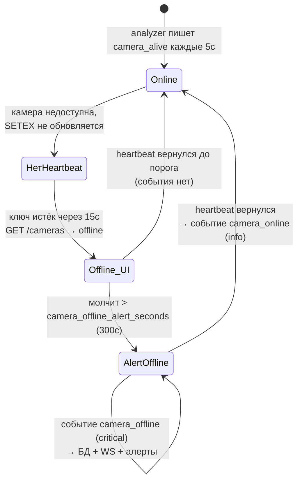

Два порога вместо одного — намеренно. 15 секунд — «бейдж в интерфейсе стал серым», это дёшево и должно быть быстрым. 300 секунд — «поднять человека ночью», это дорого и должно быть надёжным. Единый порог заставил бы выбирать между медленным интерфейсом и ложными тревогами при каждом мигании канала.

---

## 12. Режимы развёртывания

### 12.1. Cloud

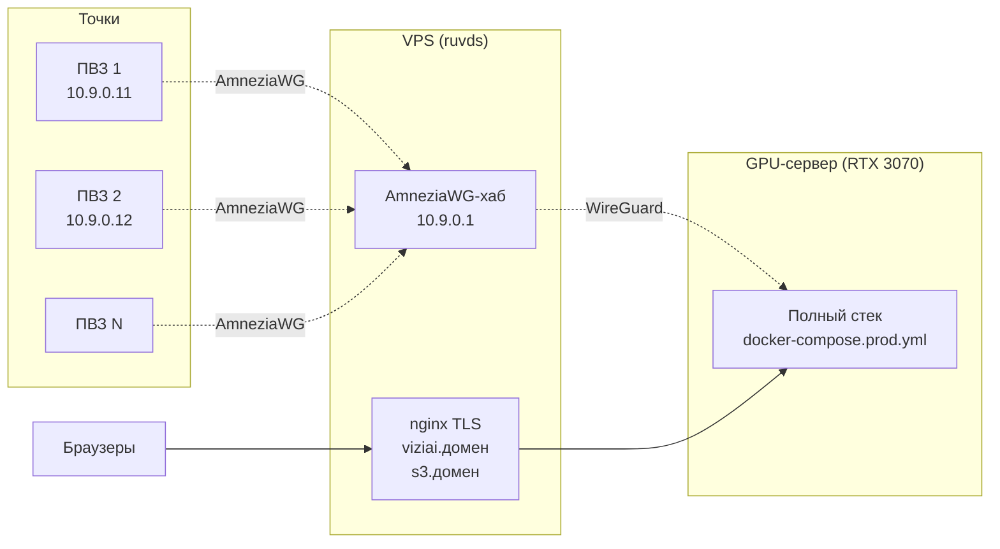

Файл: `infra/docker-compose.prod.yml`. Публичный вход — только через VPS. На сервере наружу смотрят лишь `nginx:80`, `minio:9000` и go2rtc (host network); PostgreSQL и Redis доступны только внутри сети Docker.

### 12.2. On-premise

Отличия от cloud, определяемые конфигурацией:

| Элемент | Cloud | On-premise |
|---|---|---|
| VPS | Обязателен | Отсутствует |
| TLS | На VPS | На локальном nginx (`infra/nginx/tls.conf`) |
| Туннели | AmneziaWG до точек | Не требуются, камеры в LAN |
| Telegram | Основной канал | Недоступен → webhook/SMTP |
| `MINIO_PUBLIC_ENDPOINT` | `https://s3.домен` | Внутренний адрес |
| Тенанты | Множество | Один, `tenant.mode = onpremise` |
| Обновление | `git pull` + rebuild | Офлайн-образы — **[План]** |

Код при этом не меняется — выполняется требование V-01.

### 12.3. Hybrid и Edge

**[План].** Архитектурные предпосылки уже заложены: analyzer общается с миром только через Redis Stream, значит вынос обработки на площадку не требует изменения контракта. Нерешённое — механизм переноса `events` с площадки в центр. Варианты и их оценка — в [03_DEPLOYMENT.md](03_DEPLOYMENT.md).

### 12.4. Dev

`infra/docker-compose.dev.yml` + `infra/postgres/seed.dev.sql`. Отличия: камеры типа `file` (зацикленные видеофайлы вместо RTSP), `ENABLED_PLUGINS` для принудительного включения модулей без БД, `ANALYZER_DEVICE=cpu` при отсутствии GPU. Рабочий процесс — в [02_INFRASTRUCTURE.md](02_INFRASTRUCTURE.md).

---

## 13. Свойства архитектуры

### 13.1. Масштабирование

| Ось | Текущий предел | Ограничитель | Путь расширения |
|---|---|---|---|
| Камер на анализатор | Оценочно 8–16 при `frame_skip=2` на RTX 3070 8GB (**[Данные отсутствуют]**, не измерено) | GPU: один поток инференса | TensorRT, увеличение `frame_skip`, меньшая модель, второй GPU |
| Тенантов | По числу процессов analyzer | VRAM (каждый процесс держит свою копию модели) | Разделяемый сервис инференса — [06_AI_ENGINE.md](06_AI_ENGINE.md) |
| Событий в секунду | Не измерено | Вставка в PostgreSQL по одной | Батчевая вставка в `EventConsumer` |
| Одновременных WS-клиентов | Не измерено | Память процесса api | Реплики api |
| Объём архива | Размер диска | Диск | Retention по времени и свободному месту (реализовано) |

Отсутствие измерений — прямое следствие отсутствия мониторинга. Это делает [12_MONITORING.md](12_MONITORING.md) блокером для планирования ёмкости, а не улучшением.

### 13.2. Единые точки отказа

| Компонент | Последствие отказа | Смягчение сейчас |
|---|---|---|
| GPU-сервер | Полная остановка | Нет |
| PostgreSQL | События не сохраняются; накапливаются в стриме (`maxlen 10000`), затем теряются | Нет |
| Redis | Останавливается весь обмен | AOF `appendonly yes` — переживает рестарт |
| VPS | Недоступность извне и потеря туннелей | Нет |
| go2rtc | Нет живого видео; аналитика работает | Reconciler восстанавливает потоки |
| MinIO | Нет клипов и снапшотов; события сохраняются | Деградация |

Полный разбор и план — [11_HIGH_AVAILABILITY.md](11_HIGH_AVAILABILITY.md).

### 13.3. Реализованные механизмы устойчивости

Список того, что уже работает, — чтобы это не было утрачено при рефакторинге:

1. Экспоненциальный откат при переподключении RTSP.
2. Изоляция потребителя камеры (одна камера ≠ весь воркер).
3. Изоляция плагина (один плагин ≠ весь кадр).
4. Dead-letter для событий с XACK.
5. Повторы BullMQ с экспоненциальным откатом.
6. Healthcheck у postgres, redis, minio, api; `depends_on: service_healthy`.
7. `restart: unless-stopped` у всех сервисов.
8. Reconciler go2rtc (внешний сервис теряет состояние — мы его восстанавливаем).
9. Watchdog камер (отсутствие сигнала — тоже сигнал).
10. Retention с аварийным удалением при нехватке места (диск не переполнится).
11. Переразрешение DNS в nginx (пересборка контейнеров не даёт 502).
12. Супервизор камер не выходит при нуле камер (нет цикла перезапуска).

---

## 14. Реестр архитектурных решений

| № | Решение | Обоснование | Альтернатива и почему отвергнута |
|---|---|---|---|
| A-01 | Кадры не проходят через Redis; `raw_frames` не существует | Гигабайты в секунду при нулевой пользе | Стрим кадров: пропускная способность и задержка |
| A-02 | Один процесс analyzer на тенанта, один поток инференса | Предсказуемая загрузка GPU, отсутствие OOM на 8 ГБ | Поток на камеру: борьба за GPU без выигрыша |
| A-03 | Analyzer не ходит в PostgreSQL | Независимость от БД и её схемы | Прямой доступ: связность, отказ БД останавливает аналитику |
| A-04 | Redis — проекция БД для analyzer, ресинхронизация вручную | Простота, самовосстановление опросом | Подписка: залипает без страховки |
| A-05 | Состояние зон по `global_id`, не по `track_id` | Мерцание трекера не создаёт ложных событий | По треку: ложные входы/выходы |
| A-06 | `zone_entry`/`zone_exit` не порождают алертов | Основной источник флуда | Алерт на каждое: пользователь отключает уведомления |
| A-07 | Кулдаун по личности, не по камере | Один человек = один повод | По камере: четырёхкратное дублирование |
| A-08 | Dead-letter + XACK при ошибке | Отравленное сообщение не блокирует группу | Без XACK: вечный pending |
| A-09 | Одноразовый WS-тикет | JWT в query попадает в логи | JWT в query: утечка через логи nginx |
| A-10 | Клипы через `ffmpeg -c copy` | Мгновенно, без GPU | Перекодирование: нагрузка и задержка |
| A-11 | Два порога камеры: 15с (UI) и 300с (алерт) | Разная цена ошибки | Один порог: медленный UI или ложные тревоги |
| A-12 | Настройки в БД поверх `.env` | Владелец меняет пороги без доступа к серверу | Только env: рестарт при каждом изменении |
| A-13 | Три соединения с Redis в api | BLOCK и SUBSCRIBE монополизируют соединение | Одно: взаимоблокировка |
| A-14 | `/internal/*` с токеном вместо JWT | У сервисов нет пользователя и тенанта | Системный пользователь: обход модели прав |
| A-15 | Нормализованные полигоны зон 0..1 | Смена разрешения не ломает зоны | Пиксели: привязка к разрешению |

---

## 15. Известные расхождения с исходным замыслом

Список мест, где реализация отклонилась от `CLAUDE.md`, с оценкой каждого.

| Замысел | Реальность | Оценка |
|---|---|---|
| `raw_frames` как Redis Stream | Не существует; детекция в процессе приёма | Верное решение, замысел следует считать устаревшим |
| `feature_plugins` как отдельная ступень после `zone_engine` | Плагины внутри процесса analyzer, после геофенсинга | Соответствует по смыслу, отличается по реализации |
| `FeaturePlugin.on_track_event(frame, track, zone_context, ...)` | `FeaturePlugin.on_frame(ctx: FrameContext)` — вид на весь кадр | Реализация лучше замысла: `crowd` и `counter` требуют всех треков сразу, потрековый интерфейс их не поддерживает |
| `TrackEventSchema` в `shared/events.schema.ts` | Отсутствует; схема `track_events` описана только кодом producer | Дефект. Стрим без схемы нарушает принцип 6.3. Требуется добавить |
| WebRTC через go2rtc | MSE/HLS | Осознанное изменение, см. [00_VISION.md](00_VISION.md), 7.2 |
| `event.type` без `zone_violation`, `camera_offline`, `camera_online` | Добавлены | Штатное расширение |

---

## 16. Точки расширения

Места, спроектированные под добавление функциональности без изменения ядра:

| Точка | Как расширять | Документ |
|---|---|---|
| `FeaturePlugin` | Новый класс + регистрация в `PluginManager._all` | [07_PLUGIN_SYSTEM.md](07_PLUGIN_SYSTEM.md) |
| `zone.kind` | Новое значение enum + обработка в `ZoneEngine` | [08_RULE_ENGINE.md](08_RULE_ENGINE.md) |
| `event.type` | Enum в трёх местах + метки UI | [16_API_GUIDE.md](16_API_GUIDE.md) |
| `alert_rule.channels` | Новый тип канала + Zod-схема + отправитель | [08_RULE_ENGINE.md](08_RULE_ENGINE.md) |
| `tenant_feature.feature` | Новый модуль | [07_PLUGIN_SYSTEM.md](07_PLUGIN_SYSTEM.md) |
| `system_setting` | Новая запись в `SETTING_DEFS` | [16_API_GUIDE.md](16_API_GUIDE.md) |
| `VideoSource` | Новый подкласс (ONVIF, GigE, USB) | [05_CAMERA_CONNECTION.md](05_CAMERA_CONNECTION.md) |
| Эмбеддер Re-ID | `make_embedder()` | [06_AI_ENGINE.md](06_AI_ENGINE.md) |
| `meta` события | Новые ключи без миграции | [10_DATABASE.md](10_DATABASE.md) |

---

## 17. Расширение по [REVIEW_BOARD.md](REVIEW_BOARD.md)

**Статус: [План].** Дополнения по итогам ревью (B-01, B-02, B-03).

### 17.1. Разделение control plane и data plane

Текущая архитектура — единый экземпляр (data plane) без управляющего слоя. При планке 1000+ клиентов вводится разделение:

- **Data plane** — ячейки, обслуживающие трафик ([20](20_SCALE_ARCHITECTURE.md), 3). Каждая ячейка — полный стек, описанный в разделах 2–8 этого документа.
- **Control plane** — глобальный слой над ячейками: реестр тенантов, роутинг, провижининг, метеринг ([20](20_SCALE_ARCHITECTURE.md), 4). Вне горячего пути: его отказ не останавливает обслуживание.

Существующие решения при этом сохраняются: A-01 (кадры не через Redis), A-03 (analyzer не ходит в БД), A-04 (Redis — проекция) — все усиливаются ячейками, область их действия становится ячейкой.

### 17.2. Замена A-02

Единственное отменяемое решение — A-02 (процесс на тенанта): при планке заменяется на A-02-R (пул мультитенантных анализаторов, [20](20_SCALE_ARCHITECTURE.md), 6). Причина — физическая: 1000 копий модели = 1.5 ТБ VRAM. `AnalyzerWorker` выдерживает замену без переписывания конвейера — `tenant_id` перестаёт быть свойством процесса, становится атрибутом камеры.

### 17.3. Батчинг в конвейере обработки

Раздел 4.5 (`_process`) подаёт в YOLO один кадр. При планке — динамический батчинг ([06](06_AI_ENGINE.md), 14.1): поток инференса берёт до `B` готовых кадров от разных камер. Решение A-02 (один поток инференса) сохраняется — батч собирается в том же потоке.

### 17.4. Дополнение к реестру решений

| № | Решение | Обоснование |
|---|---|---|
| A-16 | Разделение control/data plane при планке | Control plane вне горячего пути — иначе SPOF всех ([20](20_SCALE_ARCHITECTURE.md), 4.2) |
| A-17 | A-02 заменяется на A-02-R (пул) при планке; история сохраняется | 1000 копий модели неисполнимо ([20](20_SCALE_ARCHITECTURE.md), 6.1) |
