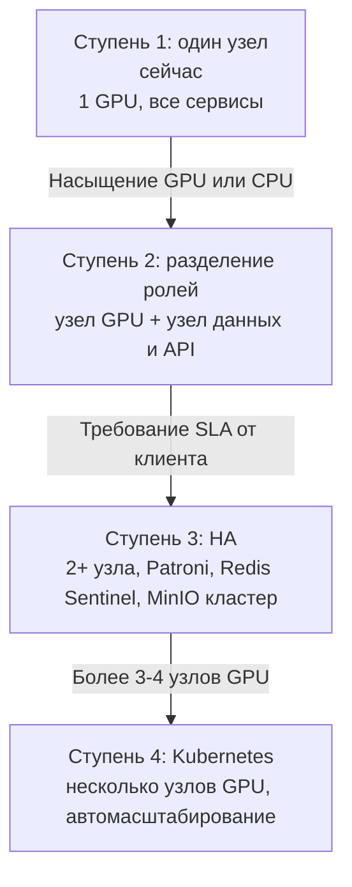

# 02. Инфраструктура

**Статус документа:** актуален на 2026-07-15
**Аудитория:** DevOps, инфраструктурные инженеры, архитекторы
**Связанные документы:** [01_SYSTEM_ARCHITECTURE.md](01_SYSTEM_ARCHITECTURE.md), [03_DEPLOYMENT.md](03_DEPLOYMENT.md), [04_NETWORK.md](04_NETWORK.md), [11_HIGH_AVAILABILITY.md](11_HIGH_AVAILABILITY.md), [12_MONITORING.md](12_MONITORING.md)

---

## 1. Назначение документа

Документ описывает физическую и виртуальную инфраструктуру платформы: контуры (разработка, тестирование, продуктив), требования к вычислительным ресурсам, хранилищам, сети, а также стратегию масштабирования и план перехода к отказоустойчивой конфигурации.

Процедуры развёртывания вынесены в [03_DEPLOYMENT.md](03_DEPLOYMENT.md); сетевая топология детализирована в [04_NETWORK.md](04_NETWORK.md).

---

## 2. Контуры

Платформа существует в трёх контурах. Различие между ними — принципиальный элемент рабочего процесса, зафиксированный как рабочее соглашение: **код пишется на dev-ПК под Windows, тестируется на отдельном сервере Ubuntu, разработчик не имеет прямого доступа к продуктивным узлам.**

```mermaid
graph LR
    subgraph Dev["Контур разработки"]
        DW["Windows-ПК<br/>GTX 1050 Ti 4GB<br/>код, typecheck"]
        DC["docker-compose.dev.yml<br/>file-камеры"]
    end
    subgraph Prod["Продуктивный контур"]
        PS["Ubuntu 24.04<br/>RTX 3070 8GB<br/>полный стек"]
        VPS["VPS ruvds<br/>TLS + AmneziaWG-хаб"]
        PVZ["Боевая точка ПВЗ<br/>4 камеры"]
    end

    DW -->|git push| GH["Git-репозиторий"]
    GH -->|git pull + rebuild| PS
    PS -.диагностика через .sh.-> DW
    PVZ -.AmneziaWG.-> VPS -.WireGuard.-> PS
```

| Контур | Состояние | Назначение |
|---|---|---|
| Разработка | Действует | Написание кода, проверка типов, локальный прогон на видеофайлах |
| Тестирование | **Отсутствует как отдельный контур** | Роль выполняет продуктивный сервер — см. 2.3 |
| Продуктив | Действует | Обслуживание боевой точки |

### 2.1. Контур разработки

**Аппаратура:** Windows-ПК, GPU NVIDIA GTX 1050 Ti 4 ГБ.

Ограничение 4 ГБ VRAM определяет практику: на dev-ПК используется `yolov8n.pt`, а не `yolov8s.pt`. Модель, работающая на dev, не гарантирует работу на проде и наоборот — расхождение по VRAM в два раза. Это принимается: dev-ПК проверяет корректность, а не производительность.

**Стек:** `infra/docker-compose.dev.yml`. Отличия от продуктива:

| Элемент | Dev | Продуктив |
|---|---|---|
| Порты БД, Redis, MinIO | Проброшены на хост (`${POSTGRES_PORT}` и т.д.) | Только внутренняя сеть Docker |
| WireGuard | Контейнер `linuxserver/wireguard`, подсеть `10.8.0.0/24` | Хаб на VPS, подсеть `10.9.0.0/24` |
| Камеры | `source_type = file`, зацикленные видеофайлы | `rtsp_pull` через туннель |
| Устройство анализатора | `cpu` при отсутствии GPU | `cuda` |
| Модули | Форсируются через `ENABLED_PLUGINS` | Из `tenant_feature` через `features:{tenant_id}` |
| nginx | Отсутствует | Единая точка входа |
| Сид данных | `infra/postgres/seed.dev.sql` | Реальные данные |

Расхождение по подсети WireGuard (`10.8.0.0/24` в dev против `10.9.0.0/24` в проде) — фактическое и не является ошибкой: контуры изолированы. Но при чтении конфигураций это регулярный источник путаницы, поэтому зафиксировано явно.

**Проверки перед коммитом** (обязательны, автоматизации нет):

```bash
cd api && npx tsc --noEmit
cd web && npx tsc --noEmit
python -m py_compile analyzer/**/*.py
# для .ps1 — проверка парсером PowerShell
```

Отсутствие CI означает, что эти проверки выполняет человек. См. [19_BEST_PRACTICES.md](19_BEST_PRACTICES.md).

### 2.2. Продуктивный контур

Три физических элемента.

**GPU-сервер (`viziai-server`)**

| Параметр | Значение | Комментарий |
|---|---|---|
| ОС | Ubuntu 24.04 LTS | |
| GPU | NVIDIA RTX 3070, 8 ГБ VRAM | Единственный ускоритель |
| Роль | Все сервисы стека | `infra/docker-compose.prod.yml` |
| Расположение | Домашний ПК | Целевое — стойка в ЦОД |
| Диск данных | `${DATA_ROOT}` (`/mnt/data`) | MinIO, архив, тестовые видео, модели |
| Диск архива | 1 ТБ | Монтируется в `${DATA_ROOT}/archive`, см. `docs/operations/ARCHIVE-DISK.md` |

**[Данные отсутствуют]** — не зафиксировано в репозитории и не должно выдумываться: модель CPU, объём RAM, тип и объём системного диска, схема питания и охлаждения, канал в интернет.
*Почему требуется:* RAM определяет число одновременных ffmpeg-процессов recorder и размер буферов PostgreSQL; канал определяет предельное число точек.
*Рекомендация:* зафиксировать спецификацию узла в этом документе при первой же инвентаризации; до тех пор планирование ёмкости невозможно.

**VPS (провайдер ruvds)**

| Параметр | Значение |
|---|---|
| Роль 1 | TLS-терминация, публичный вход (`nginx`) |
| Роль 2 | Хаб AmneziaWG, адрес `10.9.0.1` |
| Публичные имена | `viziai.<домен>`, `s3.<домен>` |
| Конфигурации | `infra/vps/nginx-viziai.conf.example`, `infra/vps/wg0-vps.conf.example` |

VPS существует по одной причине: у домашнего сервера нет статического белого IP, а у точек ПВЗ — тем более. VPS — единственный узел с постоянным публичным адресом. Он не выполняет вычислений и не хранит данных; его отказ означает недоступность извне, но не потерю данных.

**Боевая точка ПВЗ**

| Параметр | Значение |
|---|---|
| Адрес в туннеле | `10.9.0.11` |
| Камеры | 4 шт., TP-Link |
| Шлюз | Кассовый ПК, Windows 7 |
| Механизм | AmneziaWG + `netsh interface portproxy` |
| Кит настройки | `pvz-onboarding/` |
| Реальные адреса | `pvz-onboarding/CHECKLIST.md` |

### 2.3. Отсутствие контура тестирования

**Констатация:** отдельного контура тестирования нет. Продуктивный сервер выполняет обе роли.

*Почему это проблема:* каждая непроверенная функция проверяется на боевой точке живого клиента. В `PLAN.md` пометка «не проверено на проде» стоит одновременно у Re-ID, вотчдога камер, настроек сервера, ретеншена, анти-флуда и лендинга — то есть у большей части свежей функциональности. Ошибка в любой из них видна клиенту раньше, чем нам.

*Почему контур отсутствует:* второй GPU-сервер стоит денег, которых на текущей стадии нет. Это осознанный компромисс, а не недосмотр.

*Рекомендация (в порядке возрастания стоимости):*

1. **Ближайший шаг, нулевая стоимость.** Использовать `file`-камеры (`source_type = file`, загрузка тестового видео через `POST /api/v1/cameras/upload`) как воспроизводимый стенд на dev-ПК. Механизм уже реализован полностью: `TESTVIDEO_DIR` монтируется в `api`, `analyzer` и `go2rtc`. Записать 10–15 минут видео с боевой точки (день и ночь) и прогонять на нём каждую правку Re-ID и зон. Это закрывает большую часть регрессий без единого рубля.
2. **Средний шаг.** Отдельный тенант на том же продуктивном сервере с `file`-камерами. Изоляция по `tenant_id` уже гарантирована архитектурой. Стоимость — доля GPU.
3. **Целевой шаг.** Отдельный узел, разворачиваемый тем же `docker-compose.prod.yml`. Обязателен до первого корпоративного клиента: продавать заводу платформу, которую негде проверить перед обновлением, нельзя.

---

## 3. Состав контейнеров продуктива

`infra/docker-compose.prod.yml`, имя проекта `viziai`.

| Сервис | Образ / сборка | Сеть | Порты наружу | Тома |
|---|---|---|---|---|
| `postgres` | `timescale/timescaledb-ha:pg16` | Docker | Нет | `pg_data`, `init.sql:ro` |
| `redis` | `redis:7-alpine` | Docker | Нет | `redis_data` |
| `minio` | `minio/minio:latest` | Docker | `9000` | `${DATA_ROOT}/minio` |
| `go2rtc` | `alexxit/go2rtc:latest` | **host** | `1984`, `8554`, `8555` | конфиг, `/archive`, `/data:ro` |
| `api` | сборка `../api` | Docker | Нет | `/data`, `/archive` (rw) |
| `worker-clips` | сборка `../api` | Docker | Нет | `/archive:ro` |
| `worker-alerts` | сборка `../api` | Docker | Нет | Нет |
| `web` | сборка `../web` | Docker | Нет | Нет |
| `analyzer` | сборка `../analyzer` | Docker | Нет | `yolo_cache`, `/data:ro`, `/models:ro`, GPU |
| `recorder` | сборка `../analyzer` | Docker | Нет | `/archive` |
| `nginx` | `nginx:1.27-alpine` | Docker | `80` | конфиги `:ro` |

### 3.1. Принцип минимальной поверхности

Наружу на хосте слушают только три вещи: `nginx:80`, `minio:9000` и go2rtc (в host-сети). PostgreSQL и Redis не имеют проброшенных портов вообще — они достижимы исключительно из сети Docker.

Это должно быть подкреплено правилами ufw: `nginx:80` и `minio:9000` — только из подсети WireGuard. См. [04_NETWORK.md](04_NETWORK.md).

### 3.2. go2rtc в host-сети: обоснование и цена

go2rtc — единственный сервис вне сети Docker. Причина: он должен напрямую видеть интерфейс WireGuard, чтобы забирать RTSP с адресов `10.9.0.x`.

Цена этого решения — цепочка неочевидных следствий, каждое из которых уже стоило отладки:

1. `api` и `web` обращаются к go2rtc через `host.docker.internal:1984` с `extra_hosts: host.docker.internal:host-gateway`.
2. nginx проксирует `/go2rtc/` на **литеральный** адрес `host.docker.internal:1984`, а не через переменную. Причина зафиксирована в `infra/nginx/locations.inc`: переменная в `proxy_pass` заставила бы nginx резолвить имя через `resolver 127.0.0.11` (DNS Docker), который про `host.docker.internal` не знает — результат 502.
3. Для `api` и `web`, наоборот, используются **переменные** (`set $upstream_api api:3000`), чтобы nginx переразрешал имя каждые 10 секунд. Без этого пересборка контейнеров через `scripts/update.sh` меняет IP, а nginx держит устаревший — 502 до перезапуска nginx.

Итог: в одном файле сознательно сосуществуют два противоположных стиля `proxy_pass`. Это не небрежность, а следствие того, что host-gateway стабилен, а имена контейнеров — нет.

### 3.3. Профиль `recorder`

Recorder объявлен с `profiles: ["recorder"]` и не запускается по умолчанию:

```bash
docker compose -f infra/docker-compose.prod.yml --env-file infra/.env.prod --profile recorder up -d
```

Обоснование: непрерывная запись всех камер потребляет диск линейно по времени. Клипы без архива невозможны, но точка может работать и без клипов. Включение — осознанное действие.

### 3.4. Разделение прав на `/archive`

| Сервис | Монтирование | Почему |
|---|---|---|
| `recorder` | rw | Пишет сегменты |
| `api` | rw | `retention.ts` удаляет просроченные сегменты |
| `worker-clips` | **ro** | Только читает при нарезке |
| `go2rtc` | rw | Конфигурация допускает запись |

Монтирование `worker-clips` только для чтения — сознательный барьер: воркер, обрабатывающий задания из очереди, не должен иметь возможности удалить архив при ошибке в коде.

---

## 4. Образы

### 4.1. analyzer

Базовый образ: `nvidia/cuda:12.4.1-cudnn-runtime-ubuntu22.04`. Python 3.12 ставится через PPA deadsnakes, потому что Ubuntu 22.04 несёт 3.10.

Параметризация сборки:

```bash
# CUDA (по умолчанию)
docker build ./analyzer

# CPU-сборка
docker build --build-arg BASE_IMAGE=python:3.12-slim \
             --build-arg TORCH_VARIANT=cpu \
             --build-arg INSTALL_PYTHON=0 ./analyzer
```

Симлинк `/usr/local/bin/python` создаётся принудительно, чтобы одна и та же команда работала на обеих базах.

**Модели лиц скачиваются при сборке** с `media.githubusercontent.com` (git-lfs). Сбой скачивания не ломает сборку: `|| echo "WARN..."`. Отсутствие файлов отключает Face-ID сотрудников на рантайме, остальное работает.

Прямое следствие: **сборка analyzer требует интернета**. Для on-premise без интернета это блокер. См. 4.4 и [03_DEPLOYMENT.md](03_DEPLOYMENT.md).

**Дефект, требующий исправления:** комментарий в `analyzer/Dockerfile` гласит «CUDA build (RTX 3080)», фактическая карта — RTX 3070. Разночтение косметическое, но документация — источник истины, и такие расхождения обучают не доверять комментариям.

**Веса YOLO не входят в образ.** Ultralytics скачивает их при первом запуске в `/root/.cache`, который вынесен в том `yolo_cache`. Следствия: первый старт требует интернета; том нельзя терять при обновлении, иначе повторное скачивание.

### 4.2. api (общий для api и воркеров)

Один образ `node:22-bookworm-slim` обслуживает три сервиса; различие — в `command`:

| Сервис | Команда |
|---|---|
| `api` | `npm run start` → `tsx src/index.ts` |
| `worker-clips` | `npm run worker:clips` |
| `worker-alerts` | `npm run worker:alerts` |

В образ добавлены `ffmpeg` (нарезка клипов) и `fonts-dejavu-core` (шрифт водяного знака, `CLIP_FONT=/usr/share/fonts/truetype/dejavu/DejaVuSans.ttf`).

**Замечание по производительности:** несмотря на `NODE_ENV=production` и наличие скрипта `build`, запуск идёт через `tsx` — то есть с транспиляцией на лету, без предварительной компиляции. Это добавляет время старта и накладные расходы. Рекомендация: собирать `npm run build` в образ и запускать скомпилированный JavaScript. Изменение локальное, риск низкий, выигрыш — предсказуемый старт и отсутствие `tsx` в проде.

### 4.3. web

Сборка с контекстом на уровень выше (`context: ..`), потому что `web` импортирует `shared/`.

Аргументы сборки и переменные окружения разделены не случайно:

| Параметр | Тип | Причина |
|---|---|---|
| `NEXT_PUBLIC_WS_URL` | build ARG | Запекается в клиентский бандл |
| `API_URL` | ARG **и** env | ARG — для rewrite'ов `next.config`; env — потому что `route.ts` читает `process.env.API_URL` **на каждом запросе** |
| `GO2RTC_URL` | ARG и env | Аналогично |

Комментарий в compose фиксирует ошибку, которая уже случалась: без runtime-env `API_URL` route-handlers падали на `localhost:3000` — адрес, по которому внутри контейнера `web` ничего нет, что давало 500 при логине.

### 4.4. Проблема воспроизводимости сборки

Сводка рисков текущей схемы:

| Риск | Проявление |
|---|---|
| `minio/minio:latest`, `alexxit/go2rtc:latest` | Пересборка через месяц даёт другую версию. Ломающее изменение прилетит в прод без изменения кода |
| Скачивание моделей лиц при сборке | Сборка не воспроизводится офлайн и зависит от доступности GitHub |
| Скачивание весов YOLO при первом старте | Первый запуск требует интернета |
| Сборка на целевом узле (`git pull && up -d --build`) | Прод — это и сборочная машина; неудачная сборка = простой |
| Нет реестра образов | Откат означает пересборку прошлого коммита, а не запуск известного образа |

*Рекомендация (порядок обязателен):*
1. Зафиксировать теги: `minio/minio:RELEASE.2025-xx-xx`, `alexxit/go2rtc:1.9.x`. Стоимость — минуты, эффект — устранение целого класса внезапных отказов.
2. Собирать образы в CI, публиковать в реестр, на прод — только `pull`. Это одновременно решает воспроизводимость, откат и офлайн-поставку.
3. Вкладывать модели (YOLO, YuNet, SFace) в образ на этапе сборки в CI — образ становится самодостаточным, что является предусловием on-premise-поставки.

---

## 5. Требования к вычислительным ресурсам

### 5.1. GPU

Единственный потребитель GPU — `analyzer`. Модель загружается в VRAM один раз на процесс (`YOLO(settings.yolo_model).to('cuda')`).

| Модель | VRAM (оценка) | Применение |
|---|---|---|
| `yolov8n.pt` | ~1 ГБ | Dev (1050 Ti 4GB); прод при большом числе камер |
| `yolov8s.pt` | ~1.5–2 ГБ | Прод по умолчанию (`.env.prod.example`) |

Свободная VRAM на RTX 3070 после YOLO — порядка 6.5 ГБ. Это бюджет для планов блока «локальный ИИ»: VLM-описания событий (Qwen2.5-VL-3B Q4, ~3 ГБ), верификация алертов, чат по аналитике. См. [06_AI_ENGINE.md](06_AI_ENGINE.md).

**[Данные отсутствуют]** — фактическая пропускная способность (кадров в секунду на камеру, число камер до насыщения GPU) не измерена.
*Почему требуется:* это единственный параметр, определяющий, сколько точек обслуживает один сервер, а значит — юнит-экономику и момент покупки второго сервера.
*Рекомендация:* до появления метрик (см. [12_MONITORING.md](12_MONITORING.md)) применять оценку сверху: одна камера при `frame_skip=2` и 12 FPS источника даёт 4 инференса в секунду; `yolov8s` при 640px на RTX 3070 — порядка 100–150 инференсов в секунду. Отсюда теоретический потолок 25–35 камер, практический — существенно ниже из-за декодирования RTSP на CPU. **Оценку нельзя выдавать за измерение**; она годится только для планирования эксперимента.

### 5.2. CPU

Недооценённый ресурс. Потребители, в порядке значимости:

1. **Декодирование RTSP.** OpenCV декодирует H.264 на CPU. Это происходит для **каждого кадра**, включая пропущенные по `frame_skip`, — пропуск отбрасывает кадр уже после декодирования. При большом числе камер CPU насытится раньше GPU.
2. **ffmpeg в recorder.** Процесс на камеру; `-c copy` без перекодирования — нагрузка низкая.
3. **ffmpeg в worker-clips.** `-c copy` — низкая; **с водяным знаком — перекодирование**, нагрузка высокая на время нарезки.
4. **PostgreSQL, Redis, Node.js.**

Возможная оптимизация, не реализованная: аппаратное декодирование через NVDEC (`cv2.CAP_FFMPEG` с `h264_cuvid`). Перенесло бы декодирование на GPU и сняло основное ограничение по CPU. **[Требует решения]** — требует измерений до начала работ.

### 5.3. Память

| Потребитель | Оценка | Комментарий |
|---|---|---|
| analyzer | Кадры + модель + галерея Re-ID | Галерея растёт с числом посетителей за 12ч |
| PostgreSQL | Конфигурация по умолчанию образа | Не настраивался — см. [10_DATABASE.md](10_DATABASE.md) |
| Redis | Стримы (`maxlen 10000` × 2) + BullMQ + галереи | Ограничен по стримам, не ограничен по галереям |
| Node.js × 4 | Стандартный расход | |

**Риск без верхней границы:** `maxmemory` для Redis не задан. При аномальном росте (например, галерея Re-ID при массовом потоке людей) Redis займёт всю память узла и будет убит OOM-killer, что остановит платформу целиком. *Рекомендация:* задать `maxmemory` и `maxmemory-policy noeviction` — при исчерпании памяти корректная ошибка записи предпочтительнее убийства процесса. `noeviction`, а не `allkeys-lru`, потому что вытеснение молча удалило бы эталоны сотрудников (единственные данные, у которых нет источника истины в БД, см. [01_SYSTEM_ARCHITECTURE.md](01_SYSTEM_ARCHITECTURE.md), раздел 10).

---

## 6. Хранилища

### 6.1. Раскладка дисков

```
${DATA_ROOT}/                 # /mnt/data
├── minio/                    # клипы, снапшоты, кропы Re-ID
├── archive/                  # ← точка монтирования диска 1 ТБ
│   └── {camera_id}/          # сегменты по 300с
├── testvideo/                # загруженные тестовые видео (file-камеры)
└── models/                   # OSNet ONNX и прочие модели (ro в analyzer)

Docker volumes:
├── pg_data                   # PostgreSQL
├── redis_data                # AOF
└── yolo_cache                # веса YOLO
```

Решение из `docs/operations/ARCHIVE-DISK.md`: диск 1 ТБ монтируется **непосредственно в `${DATA_ROOT}/archive`**. Обоснование — ни один конфиг не меняется: пути в compose уже указывают туда. Альтернатива (монтирование в отдельную точку и правка путей) потребовала бы изменений в четырёх сервисах.

### 6.2. Расчёт объёма архива

Формула:

```
Объём (ГБ/сутки) = Битрейт (Мбит/с) × 86400 / 8 / 1024 × Камер
```

| Битрейт основного потока | 4 камеры | 8 камер |
|---|---|---|
| 2 Мбит/с | ~84 ГБ/сут | ~169 ГБ/сут |
| 4 Мбит/с | ~169 ГБ/сут | ~338 ГБ/сут |

При диске 1 ТБ и `archive_retention_days = 7` бюджет — около 143 ГБ/сутки. То есть 4 камеры по 4 Мбит/с укладываются впритык, 8 камер — нет.

**Двухуровневый ретеншен реализован** (`api/src/retention.ts`, раз в час):
1. По времени: сегменты старше `archive_retention_days`.
2. По свободному месту: если свободно меньше `archive_min_free_gb` (по умолчанию 20), удаляются старейшие записи, **даже если они свежее срока**.

Второе правило важнее первого: оно гарантирует, что диск не переполнится ни при какой конфигурации. Переполненный диск архива остановил бы recorder и, что хуже, мог бы затронуть весь узел, если бы архив лежал на системном разделе, — отдельный диск устраняет и это.

### 6.3. Ретеншен событий

`event_retention_days` (по умолчанию 90). Реализация — `drop_chunks` TimescaleDB: удаление чанка целиком вместо `DELETE`, то есть за миллисекунды и без раздувания таблицы. Это причина, по которой `event` — гипертаблица, а не обычная таблица с индексом по времени. Подробности — [10_DATABASE.md](10_DATABASE.md).

Сжатие: `add_compression_policy('event', INTERVAL '7 days')`, сегментирование по `tenant_id, camera_id`, сортировка `ts_start DESC`.

### 6.4. Панель состояния хранилищ

`GET /api/v1/admin/system` (роль `super`, страница `/admin/settings`) отдаёт: занятость диска архива, размер БД, число событий и сегментов. Это единственный реализованный элемент наблюдаемости инфраструктуры — до появления Prometheus им и следует пользоваться.

---

## 7. Сеть инфраструктуры

Полное описание — [04_NETWORK.md](04_NETWORK.md). Здесь — только инфраструктурный срез.

| Подсеть | Назначение | Контур |
|---|---|---|
| `10.9.0.0/24` | AmneziaWG: VPS (`10.9.0.1`), сервер, точки (`10.9.0.11`+) | Продуктив |
| `10.8.0.0/24` | WireGuard-контейнер | Разработка |
| Сеть Docker | Межсервисное взаимодействие по именам | Оба |

Внутренний DNS Docker (`127.0.0.11`) и его роль в конфигурации nginx разобраны в 3.2.

---

## 8. Инфраструктура: продуктив, стадия «стойка в ЦОД»

Целевое состояние, к которому идёт продуктивный контур. Обоснование перехода: домашний ПК не имеет резервного питания, канала с гарантией, физической безопасности и не может быть предъявлен корпоративному клиенту при аудите.

**Минимальная конфигурация одного узла (рекомендация, не измерение):**

| Компонент | Рекомендация | Обоснование |
|---|---|---|
| GPU | NVIDIA RTX 4000 Ada 20 ГБ или L4 24 ГБ | Профессиональная линейка допускается в ЦОД по лицензии драйвера, в отличие от GeForce; VRAM даёт запас под VLM |
| CPU | 16+ ядер | Декодирование RTSP — узкое место (5.2) |
| RAM | 64 ГБ | PostgreSQL + Redis + N процессов analyzer |
| Системный диск | 2 × NVMe 480 ГБ, RAID1 | ОС и образы |
| Диск данных | NVMe для PostgreSQL/Redis | Вставка событий чувствительна к задержке |
| Диск архива | HDD 8–16 ТБ, RAID | Последовательная запись, объём важнее скорости |
| Сеть | 1 Гбит/с и выше | |

**Юридическое ограничение, которое нельзя игнорировать:** лицензия драйвера NVIDIA GeForce ограничивает использование в ЦОД. RTX 3070 в стойке — нарушение EULA. Переход в ЦОД требует профессиональной карты. Это не техническое, а лицензионное требование, и оно влияет на бюджет.

---

## 9. Масштабирование

### 9.1. Вертикальное

Первый и самый дешёвый путь: более мощный GPU, больше CPU, больше RAM на одном узле. Работает без изменений в коде до момента, когда один узел перестаёт вмещать нагрузку.

### 9.2. Горизонтальное: по тенантам

Естественная ось платформы. Один процесс `analyzer` = один тенант (`TENANT_ID`). Добавление второго GPU-сервера означает: часть тенантов обслуживается там.

Что уже позволяет это сделать:
- Analyzer общается с миром только через Redis. Он может работать на любом узле, видящем Redis и камеры.
- Изоляция по `tenant_id` сквозная.

Что мешает:
- Нет механизма назначения тенанта узлу (сейчас — `TENANT_ID` в `.env` вручную).
- Каждый процесс держит **свою копию модели** в VRAM. Десять тенантов на одном GPU = десять копий YOLO = 15–20 ГБ. Это делает схему «процесс на тенанта» непригодной при росте числа тенантов.

*Рекомендация:* при приближении к 5–6 тенантам на узел перейти к разделяемому сервису инференса (один процесс с моделью, остальные шлют кадры через shared memory или gRPC) либо к мультитенантному процессу analyzer с одной моделью и словарём камер по тенантам. Второй вариант проще: `AnalyzerWorker` уже держит словари по камерам, добавление измерения «тенант» — локальное изменение. См. [06_AI_ENGINE.md](06_AI_ENGINE.md).

### 9.3. Горизонтальное: сервисы без состояния

| Сервис | Готовность к репликам | Что мешает |
|---|---|---|
| `web` | Готов | — |
| `nginx` | Готов | — |
| `worker-clips` | Готов | — |
| `worker-alerts` | **Почти готов** | Состояние в Redis (кулдаун через `SET NX`, буфер сводки — список); но выгрузка сводки не атомарна → две реплики могут отправить её дважды. Нужна блокировка |
| `api` | **Частично** | `CONSUMER_NAME` статичен (`api-1`) |

`api` заслуживает пояснения. WS-хаб реплицируется корректно: каждая реплика подписана на Redis PubSub и рассылает своим клиентам. Проблема в `EventConsumer`, живущем в том же процессе: consumer group требует **уникального имени потребителя** на реплику, иначе две реплики конкурируют под одним именем и поведение группы становится некорректным.

*Рекомендация:* `CONSUMER_NAME: ${HOSTNAME}` — в Docker это идентификатор контейнера, уникальный по построению. Изменение в одну строку, снимает блокер. Более строгий вариант — вынести `EventConsumer` в отдельный сервис `worker-events`, тогда `api` становится полностью stateless. Второй вариант предпочтителен архитектурно: HTTP-сервис и потребитель стрима имеют разные профили нагрузки и разные причины для масштабирования.

### 9.4. Ступени роста



Критерий перехода — не срок, а факт:

| Переход | Триггер |
|---|---|
| 1 → 2 | Загрузка GPU или CPU устойчиво выше 80% (требует [12_MONITORING.md](12_MONITORING.md)) |
| 2 → 3 | Первый клиент с договорным SLA |
| 3 → 4 | Более трёх-четырёх узлов GPU; ручное управление compose перестаёт быть выполнимым |

---

## 10. Отказоустойчивость: текущее состояние

Полный разбор — [11_HIGH_AVAILABILITY.md](11_HIGH_AVAILABILITY.md). Инфраструктурная сводка:

| Уровень | Состояние |
|---|---|
| Питание | Нет ИБП **[Данные отсутствуют]** |
| Диски | Нет RAID; отказ диска = потеря данных |
| Сеть | Один канал |
| GPU | Один |
| PostgreSQL | Один экземпляр, без реплики |
| Redis | Один экземпляр, AOF включён |
| MinIO | Один экземпляр, без erasure coding |
| VPS | Один |
| Резервные копии | **Отсутствуют** |

**Отсутствие резервных копий — главный инфраструктурный риск платформы.** Он превосходит по значимости отсутствие HA: HA защищает от простоя, резервная копия — от безвозвратной потери. Отказ диска сегодня означает потерю всех событий, настроек, пользователей и отметок сотрудников без возможности восстановления.

*Рекомендация, в порядке приоритета:*
1. `pg_dump` по расписанию на отдельный носитель + проверка восстановления. Один скрипт, один cron. Это делается за час и закрывает основной риск.
2. Резервное копирование `redis_data` (в нём — единственные экземпляры эталонов сотрудников).
3. Репликация бакетов MinIO.
4. Архив — не резервировать по объёму; принять его потерю как допустимую и зафиксировать это в договоре.

---

## 11. Дорожная карта Kubernetes

### 11.1. Когда переходить

Не раньше ступени 4 (раздел 9.4). Kubernetes до появления второго узла GPU — чистые накладные расходы: он решает задачи оркестрации множества узлов, которых нет.

Признаки готовности:
- Более трёх узлов.
- Требуется скользящее обновление без простоя.
- Требуется автоматическое восстановление после отказа узла.
- Есть человек, способный дежурить по кластеру.

Последний пункт — решающий. Kubernetes без компетенции в команде превращает один понятный отказ в один непонятный.

### 11.2. Что готово к переносу

| Свойство | Состояние |
|---|---|
| Контейнеризация | Полная |
| Конфигурация из окружения | Полная (Zod, pydantic-settings) → ConfigMap/Secret напрямую |
| Healthcheck | Есть у postgres, redis, minio, api |
| Stateless-сервисы | web, nginx, worker-clips |
| Изоляция отказов | Реализована на уровне приложения |

### 11.3. Что потребуется

| Задача | Решение |
|---|---|
| GPU в подах | NVIDIA GPU Operator, `resources.limits.nvidia.com/gpu` |
| Проверки готовности | Добавить readiness-эндпоинты (сейчас только `/api/v1/health` = liveness) |
| PostgreSQL | Оператор (CloudNativePG или Patroni), не под в StatefulSet вручную |
| Redis | Redis Sentinel или оператор |
| MinIO | MinIO Operator, erasure coding |
| go2rtc в host-сети | `hostNetwork: true` — работает, но конфликтует с моделью сети K8s; вероятно, потребуется DaemonSet |
| Хранилище архива | PV с ReadWriteMany (NFS/CephFS) — recorder пишет, api удаляет, clips читает |
| Секреты | External Secrets + Vault, см. [13_SECURITY.md](13_SECURITY.md) |
| Реестр образов | Обязателен (см. 4.4) |

### 11.4. Что не переносится напрямую

**Analyzer как процесс на тенанта** плохо ложится на модель Deployment: это не масштабируемые реплики одного сервиса, а именованные экземпляры с разной конфигурацией. Варианты:
1. StatefulSet с индексом → тенант. Хрупко: удаление тенанта из середины ломает соответствие.
2. Deployment на тенанта, генерируемый оператором. Многословно, но явно.
3. **Предпочтительно:** сначала сделать analyzer мультитенантным (9.2), тогда он становится обычным Deployment с шардированием по тенантам. Это ещё один аргумент за переход к разделяемой модели инференса **до** Kubernetes, а не после.

**go2rtc в host-сети** — постоянный источник трения. При переходе стоит рассмотреть перенос RTSP-прокси внутрь сети кластера с маршрутизацией WireGuard через шлюз-под.

---

## 12. Аварийное восстановление

Сценарии и фактическая готовность. Значения RTO/RPO — целевые, недостижимые в текущей конфигурации; они приведены как ориентир, а не как обещание.

| Сценарий | Целевой RTO | Целевой RPO | Готовность сейчас |
|---|---|---|---|
| Отказ контейнера | < 1 мин | 0 | **Есть**: `restart: unless-stopped` |
| Отказ go2rtc | < 60 с | 0 | **Есть**: reconciler восстанавливает потоки |
| Отказ Redis | < 5 мин | Секунды | Частично: AOF; проекции требуют `/admin/resync` |
| Отказ PostgreSQL | < 15 мин | 0 при живом стриме | Частично: события ждут в стриме (`maxlen 10000`) |
| Отказ диска данных | Часы | **∞ (потеря)** | **Нет**: ни RAID, ни копий |
| Отказ узла | Дни | **∞ (потеря)** | **Нет** |
| Отказ VPS | Часы | 0 | Частично: данные целы, доступа нет |
| Отказ канала точки | 0 (автоматически) | Пропуск аналитики за период | **Есть**: backoff + `camera_offline` |

Строки с «∞» — это то, что делает раздел 10 приоритетным перед всем остальным содержимым этого документа.

Процедуры восстановления — [03_DEPLOYMENT.md](03_DEPLOYMENT.md).

---

## 13. Эксплуатационные скрипты

`scripts/`, запускаются на сервере; вывод разработчик получает от пользователя (прямого доступа к продуктиву у разработчика нет).

| Скрипт | Назначение |
|---|---|
| `install.sh` | Первичная установка узла |
| `init.sh` | Инициализация данных |
| `deploy.sh` | Развёртывание |
| `update.sh` | `git pull` + пересборка + миграции |
| `diag-camera.sh` | Диагностика одной камеры по всей цепочке |
| `diag-tunnel-camera.sh` | Камеры точки со стороны сервера |
| `diag-stream.sh`, `diag-stream2.sh`, `diag-stream-verify.sh`, `diag-mse.sh` | Диагностика видеопотока |
| `diag-home.sh` | Диагностика сервера |
| `fix-vps-nginx-ws.sh` | Исправление WebSocket на VPS — **выполняется на VPS, не на сервере** |
| `wg-watchdog.sh` | Наблюдение за туннелем |

Формат «диагностика скриптом, вывод присылает пользователь» — не временное неудобство, а следствие модели доступа. Из этого вытекает требование к скриптам: вывод должен быть самодостаточным (что проверялось, что получилось, что это значит), потому что задать уточняющий вопрос стоит один цикл переписки.

Документация установки: `docs/operations/INSTALL_UBUNTU_SERVER.md`, `docs/operations/DEPLOY.md` в корне репозитория. Их следует считать источником процедур; при расхождении с [03_DEPLOYMENT.md](03_DEPLOYMENT.md) приоритет у проверенного на практике корневого файла, а расхождение — устранять.

---

## 14. Сводка инфраструктурного долга

| № | Проблема | Влияние | Приоритет |
|---|---|---|---|
| I-01 | Нет резервных копий | Безвозвратная потеря всех данных при отказе диска | **Критический** |
| I-02 | Нет контура тестирования | Каждая функция проверяется на клиенте | **Критический** |
| I-03 | Теги `latest` у внешних образов | Внезапное ломающее обновление | Высокий |
| I-04 | Нет реестра образов, сборка на проде | Откат невозможен без пересборки; неудачная сборка = простой | Высокий |
| I-05 | Нет мониторинга | Ёмкость и экономика не поддаются расчёту | Высокий |
| I-06 | Нет `maxmemory` у Redis | OOM-killer останавливает платформу | Средний |
| I-07 | Единственный экземпляр каждого хранилища | Простой при любом отказе | Средний |
| I-08 | Эталоны сотрудников только в Redis | Потеря тома = потеря ручной работы владельца | Средний |
| I-09 | Сборка требует интернета | Блокер on-premise-поставки | Средний |
| I-10 | Запуск через `tsx` вместо сборки | Медленный старт, лишняя зависимость в проде | Низкий |
| I-11 | Нет RAID, ИБП, гарантий по каналу | Отказ железа = длительный простой | Низкий до ЦОД |
| I-12 | GeForce в ЦОД нарушает EULA | Юридический блокер переезда | Проявится при переезде |

---

## 12. Расширение по [REVIEW_BOARD.md](REVIEW_BOARD.md)

**Статус: [План].** Дополнения по итогам ревью (B-03, B-05, B-75).

### 12.1. Ячейка как единица инфраструктуры

При планке инфраструктура строится ячейками ([20](20_SCALE_ARCHITECTURE.md), 3): каждая ячейка — полный стек (PostgreSQL, Redis, MinIO, api, воркеры, analyzer-pool, go2rtc, nginx) на 50 площадок (≈200 камер). 1000 площадок ≈ 20 ячеек ≈ 40 узлов GPU (при батчинге; без — ~130).

Автоматизация создания ячейки (IaC) обязательна: 20 ячеек вручную = линейный toil ([22](22_SRE_OPERATIONS.md), 12).

### 12.2. Модель ёмкости

Разделы 5.1–5.2 дают оценки числа камер на узел. Ревью формализует их в параметрическую модель ([20](20_SCALE_ARCHITECTURE.md), 8) с явными неизвестными (`T_inf`, `T_dec`). Ключевой вывод модели: **CPU-декодирование упирается раньше GPU** (декодируются все кадры, `frame_skip` их не разгружает), значит NVDEC важнее TensorRT ([06](06_AI_ENGINE.md), 14.3).

### 12.3. GPU-серверы

Раздел про железо дополняется требованием: узел рассчитывается по модели ёмкости, а не по числу камер «на глаз». До появления измерений ([12](12_MONITORING.md)) число камер на узел — гипотеза (SC-D-01).

### 12.4. Дополнение к реестру решений и долгу

| № | Решение | Обоснование |
|---|---|---|
| I-06 | Инфраструктура строится ячейками при планке | Радиус поражения + резидентность + выкат — следствия ([20](20_SCALE_ARCHITECTURE.md)) |
| I-07 | Создание ячейки — через IaC | 20 ячеек вручную = toil |

| № | Долг | Приоритет |
|---|---|---|
| I-D-06 | Модель ёмкости не заполнена измерениями | **Высокий** (закрывается [12](12_MONITORING.md)) |
| I-D-07 | Нет IaC для ячеек | Средний |
