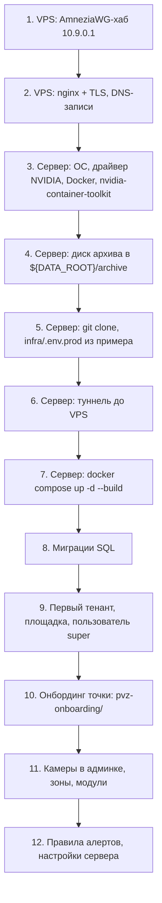
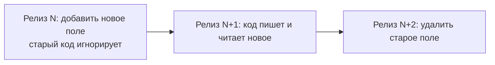
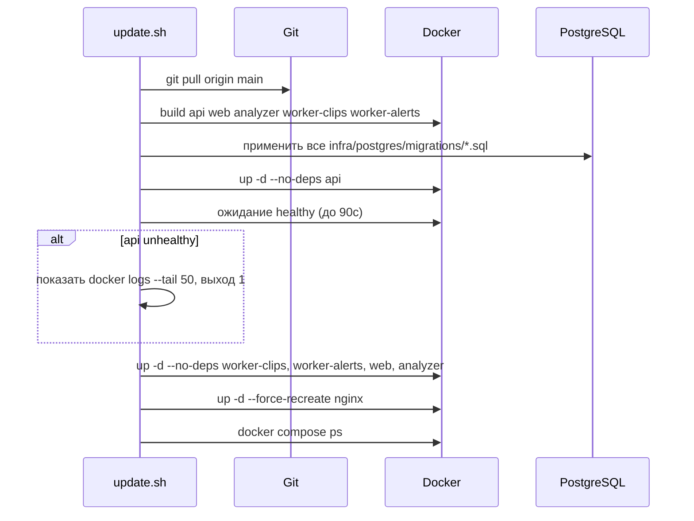
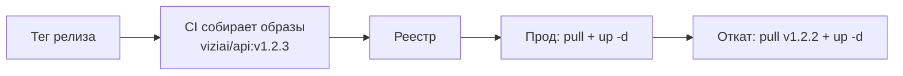
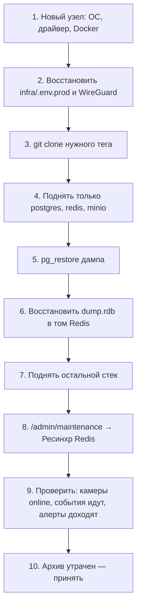
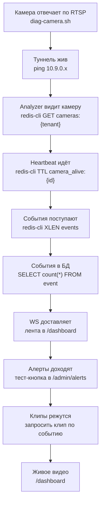

# 03. Развёртывание

**Статус документа:** актуален на 2026-07-15
**Аудитория:** DevOps, инженеры сопровождения
**Связанные документы:** [02_INFRASTRUCTURE.md](02_INFRASTRUCTURE.md), [04_NETWORK.md](04_NETWORK.md), [10_DATABASE.md](10_DATABASE.md), [11_HIGH_AVAILABILITY.md](11_HIGH_AVAILABILITY.md)
**Практические инструкции в корне репозитория:** `docs/operations/INSTALL_UBUNTU_SERVER.md`, `docs/operations/DEPLOY.md`, `pvz-onboarding/README.md`, `docs/operations/ARCHIVE-DISK.md`

---

## 1. Назначение и приоритет источников

Документ описывает процедуры развёртывания, обновления, отката, миграции и восстановления во всех режимах.

**Приоритет источников.** Корневые файлы `docs/operations/INSTALL_UBUNTU_SERVER.md` и `docs/operations/DEPLOY.md` содержат проверенные на практике пошаговые инструкции. Настоящий документ описывает **модель развёртывания и обоснование решений**, а не заменяет их. При расхождении приоритет у проверенного файла, а расхождение подлежит устранению.

---

## 2. Матрица режимов

| Режим | Состояние | Compose | Внешние зависимости |
|---|---|---|---|
| Разработка | Действует | `infra/docker-compose.dev.yml` | Нет |
| Cloud (мультитенант) | Действует, в проде | `infra/docker-compose.prod.yml` | VPS, Telegram, интернет |
| On-premise | Архитектурно поддержан, не поставлялся | `infra/docker-compose.prod.yml` + конфигурация | Нет |
| Hybrid | **[План]** | — | — |
| Edge | **[План]** | — | — |

Все режимы используют один код. Переключение — конфигурацией (`DEPLOYMENT_MODE=cloud|on-premise`). Это решение V-01 из [00_VISION.md](00_VISION.md).

---

## 3. Развёртывание: Cloud

### 3.1. Порядок первичной установки

Порядок обязателен: каждый шаг — предусловие следующего.



Критичные предусловия:

| Шаг | Проверка перед переходом дальше |
|---|---|
| 3 | `nvidia-smi` внутри контейнера отдаёт карту |
| 4 | Диск смонтирован **до** первого запуска: иначе архив пишется на системный раздел, а после монтирования исчезает под точкой монтирования |
| 6 | `ping 10.9.0.1` с сервера |
| 7 | `docker compose ps` — все healthy |
| 8 | Миграции применены **до** старта нового кода |

### 3.2. Конфигурация

Источник — `infra/.env.prod.example`. Секреты генерируются, не придумываются:

```bash
openssl rand -hex 32   # JWT_SECRET, INTERNAL_TOKEN
```

Параметры, ошибки в которых проявляются не сразу:

| Переменная | Типичная ошибка | Симптом |
|---|---|---|
| `PUBLIC_WS_URL` | Забыли, что это **build ARG** | Значение запечено в бандл; изменение в `.env` без пересборки `web` не действует |
| `MINIO_PUBLIC_ENDPOINT` | Указан внутренний адрес | Presigned-ссылки открываются браузером и ведут в никуда: клипы и снапшоты не грузятся |
| `VPS_PUBLIC_IP` | Не задан | WebRTC-кандидаты go2rtc неверны (на транспорт по умолчанию не влияет) |
| `TENANT_ID` | Не совпадает с UUID тенанта в БД | Analyzer читает `cameras:{неверный uuid}` — пусто, камеры не запускаются, ошибок нет |
| `DATA_ROOT` | Изменён после первого запуска | Данные остаются по старому пути, платформа стартует «пустой» |

Ошибка с `TENANT_ID` — самая коварная: система выглядит исправной, логи чисты, но аналитика не идёт. Диагностика: `redis-cli GET cameras:{TENANT_ID}`.

### 3.3. Запуск

```bash
cd /opt/viziai   # или иной путь установки
docker compose -f infra/docker-compose.prod.yml --env-file infra/.env.prod up -d --build

# С видеоархивом (нужен для клипов):
docker compose -f infra/docker-compose.prod.yml --env-file infra/.env.prod \
               --profile recorder up -d --build
```

Порядок старта обеспечен `depends_on: service_healthy` для postgres, redis, minio. Analyzer ждёт только redis — это верно: PostgreSQL ему не нужен (решение A-03).

### 3.4. Инициализация данных

`infra/postgres/init.sql` выполняется **только один раз**, на пустом каталоге данных. Он создаёт расширения (`timescaledb`, `uuid-ossp`, `vector`), перечисления, таблицы, гипертаблицы и политику сжатия.

Ключевое следствие, которое регулярно упускают: **изменение `init.sql` не влияет на существующую установку**. Все изменения схемы после первого запуска — только миграциями.

Расширение `vector` (pgvector) создаётся, но в схеме нет ни одного столбца этого типа. Это задел под поиск по архиву на естественном языке (CLIP + pgvector) из блока «локальный ИИ». Образ `timescale/timescaledb-ha:pg16` включает pgvector, поэтому задел бесплатен.

---

## 4. Миграции

### 4.1. Два механизма, один работающий

В репозитории присутствуют **два несовместимых механизма миграций**. Это дефект, который необходимо зафиксировать явно, чтобы новый инженер не применил неработающий.

| Механизм | Путь | Состояние |
|---|---|---|
| SQL-файлы через psql | `infra/postgres/migrations/*.sql`, применяет `scripts/update.sh` | **Действующий** |
| Drizzle migrator | `api/db/migrate.ts`, папка `./db/migrations` | **Не используется**: каталог `api/db/migrations/` отсутствует, `npm run migrate` выполнит ноль миграций и завершится успешно |

Опасность: `npm run db:migrate` завершается с сообщением «Migrations complete» **и не делает ничего**. Инженер, доверившийся этому, получит рассогласование схемы и кода.

*Рекомендация:* выбрать один механизм и удалить второй.
- **Оставить SQL-файлы** (рекомендуется): миграции TimescaleDB (`create_hypertable`, `add_compression_policy`, `ALTER TYPE ... ADD VALUE`) всё равно требуют сырого SQL, который Drizzle не генерирует. Тогда `api/db/migrate.ts`, `drizzle.config.ts` и скрипты `db:generate`/`db:migrate` следует удалить, а `api/db/schema.ts` оставить как источник типов, явно пометив, что схема ведётся вручную и синхронизируется с SQL.
- Альтернатива — перейти на Drizzle с ручными SQL-вставками в сгенерированные файлы. Сложнее, выигрыш неочевиден.

### 4.2. Действующие миграции

| Файл | Содержимое |
|---|---|
| `0001_add_crowd_counter_features.sql` | `feature_kind` += `crowd`, `counter` |
| `0002_notifications.sql` | Таблица `notifications`, тип `notification_status` |
| `0003_reid_feature.sql` | `feature_kind` += `reid` |
| `0004_camera_offline_events.sql` | `event_type` += `camera_offline`, `camera_online` |
| `0005_system_settings.sql` | Таблица `system_setting` |

Свежая установка: `init.sql` создаёт базу, затем **обязательно** применяются все миграции по порядку. `init.sql` не эквивалентен «init.sql + миграции»: например, `feature_kind` в `init.sql` не содержит `crowd`, `counter`, `reid`.

*Рекомендация:* привести `init.sql` к состоянию «финальная схема», а миграции применять только к существующим базам, либо (надёжнее) свести `init.sql` к минимуму (расширения) и создавать всю схему миграциями. Второй вариант устраняет целый класс расхождений «новая установка не равна обновлённой».

### 4.3. Требование идемпотентности

`scripts/update.sh` применяет **все** файлы миграций при каждом обновлении:

```bash
for f in infra/postgres/migrations/*.sql; do
  $COMPOSE exec -T postgres psql -v ON_ERROR_STOP=1 -U "$POSTGRES_USER" -d "$POSTGRES_DB" < "$f"
done
```

Таблицы версий нет. Следовательно, **каждая миграция обязана быть идемпотентной**: `CREATE TABLE IF NOT EXISTS`, `ADD VALUE IF NOT EXISTS`, `CREATE INDEX IF NOT EXISTS`. Неидемпотентная миграция уронит `update.sh` на `ON_ERROR_STOP=1` при следующем обновлении.

Плюс подхода: невозможна рассинхронизация состояния «применено/не применено». Минус: неотменяемые операции (`DROP COLUMN`, `UPDATE` данных) выразить нельзя — они не идемпотентны по смыслу.

*Рекомендация:* при появлении первой миграции с преобразованием данных ввести таблицу `schema_migration(version, applied_at)` и применять только новые. До тех пор правило идемпотентности — жёсткое требование к каждому файлу, и его нарушение ломает обновление на всех установках сразу.

### 4.4. Порядок относительно кода

`update.sh` применяет миграции **до** перезапуска сервисов. Это верно только для совместимых вперёд изменений (добавление столбца, значения enum). Для несовместимых требуется схема «расширить — переключить — сузить»:



Одношаговое несовместимое изменение при работающем старом коде гарантирует ошибки в промежутке между миграцией и перезапуском.

---

## 5. Обновление

### 5.1. Процедура

```bash
./scripts/update.sh          # режим определяется автоматически по наличию infra/.env.prod
./scripts/update.sh --prod   # явно
```

Шаги скрипта:



### 5.2. Решения, заложенные в скрипт

| Решение | Обоснование |
|---|---|
| `--no-deps` при перезапуске | Хранилища (postgres, redis, minio) не трогаются: обновление приложения не должно ронять данные |
| Миграции **до** выката | Новый код не должен встретить старую схему |
| Ожидание healthy у `api` с выходом при ошибке | Остановка на сломанном api вместо каскадного перезапуска остальных |
| `--force-recreate nginx` | **Не оптимизируемо.** Причина в inode: `git pull` заменяет файл конфигурации новым inode, а смонтированный в контейнер старый inode остаётся. `nginx -s reload` перечитал бы **старый** файл. Только пересоздание контейнера перемонтирует конфиг. Дополнительно пересоздание подхватывает новые IP контейнеров api/web |
| Сборка на целевом узле | Следствие отсутствия реестра образов — см. [02_INFRASTRUCTURE.md](02_INFRASTRUCTURE.md), 4.4 |

Инцидент с inode стоит запомнить: он относится к классу ошибок, где всё выглядит корректным (файл на диске новый, nginx перезагружен), а поведение старое.

### 5.3. Простой при обновлении

`update.sh` — не rolling update в строгом смысле: каждый сервис существует в одном экземпляре, и `up -d --no-deps api` останавливает старый контейнер до старта нового.

Фактический простой:

| Сервис | Простой | Последствие |
|---|---|---|
| `api` | Секунды–десятки секунд (плюс сборка) | REST/WS недоступны; события копятся в стриме и не теряются |
| `analyzer` | Секунды + загрузка модели | **Аналитика за этот интервал потеряна безвозвратно**: кадры нигде не буферизуются |
| `web` | Секунды | Интерфейс недоступен |
| `nginx` | Секунды | Всё недоступно |

Потеря аналитики при перезапуске analyzer неустранима в текущей архитектуре и является платой за решение A-01 (кадры не проходят через Redis). Для обновления в непиковые часы это приемлемо; для SLA — нет. Устранение требует второго экземпляра analyzer и координации переключения — см. [11_HIGH_AVAILABILITY.md](11_HIGH_AVAILABILITY.md).

### 5.4. Обязательные действия после обновления

Не автоматизированы и потому регулярно забываются. Это чек-лист, а не рекомендация:

| Когда | Действие | Последствие пропуска |
|---|---|---|
| После рестарта Redis | «Ресинхр Redis» в `/admin/maintenance` (`POST /api/v1/admin/resync`) | Analyzer не получит часовые пояса и расписания зон: расписания не работают, ошибок нет |
| После `0004` | Создать правило «Камера не в сети» с chat_id в `/admin/alerts` | Событие создаётся, уведомление не приходит |
| После лендинга | Задать `lead_telegram_chat_id` в `/admin/settings` | Форма «Запросить демо» отвечает 503 |
| После анти-флуда | Удалить старые правила на «Вход в зону» | Правила мертвы (тип в `NO_ALERT_TYPES`), но вводят в заблуждение |
| После пересборки analyzer | Убедиться, что модели лиц скачались | Face-ID сотрудников молча отключён |

Общая черта всех строк: **пропуск не вызывает ошибки, а вызывает тихое отсутствие функции**. Это худший класс отказов. *Рекомендация:* добавить в `update.sh` пост-проверки (наличие ключей проекции в Redis, наличие файлов моделей) с явным предупреждением в вывод.

---

## 6. Откат

### 6.1. Текущая процедура

```bash
git log --oneline
git checkout <предыдущий-коммит>
./scripts/update.sh --prod
```

Свойства: медленно (полная пересборка), не гарантирует идентичности образа (внешние `latest`-образы и зависимости могли измениться), **не откатывает схему БД**.

### 6.2. Откат схемы

Обратных миграций нет. Откат кода при применённой миграции работает только для совместимых назад изменений (добавленный столбец старый код игнорирует).

Для несовместимых изменений отката нет вообще — есть только восстановление из резервной копии, которой тоже нет (см. [02_INFRASTRUCTURE.md](02_INFRASTRUCTURE.md), I-01).

*Рекомендация:* правило релиза — **никогда не выпускать несовместимую назад миграцию без предварительной резервной копии, снятой непосредственно перед выкатом**. Это организационное правило, не требующее кода, и его следует ввести немедленно.

### 6.3. Целевая процедура



Откат становится операцией на секунды и гарантированно возвращает тот же артефакт. Предусловия: реестр и CI ([19_BEST_PRACTICES.md](19_BEST_PRACTICES.md)).

---

## 7. Развёртывание: On-premise

### 7.1. Отличия

Тот же compose, другая конфигурация:

| Элемент | Изменение |
|---|---|
| `DEPLOYMENT_MODE` | `on-premise` |
| VPS | Отсутствует; nginx на сервере терминирует TLS (`infra/nginx/tls.conf`) |
| Туннели | Не нужны: камеры в LAN |
| `MINIO_PUBLIC_ENDPOINT` | Внутренний адрес, достижимый браузерами LAN |
| `PUBLIC_WS_URL` | `wss://<внутреннее-имя>` |
| Telegram | Недоступен → webhook или SMTP **[План]** |
| `tenant.mode` | `onpremise` |

### 7.2. Блокеры офлайн-установки

Установка в сети без интернета сегодня **невозможна**. Причины:

| Зависимость | Где | Решение |
|---|---|---|
| Базовые образы (`nvidia/cuda`, `node`, `nginx`, `redis`, `minio`, `timescaledb`, `go2rtc`) | Сборка и запуск | Реестр образов; `docker save`/`load` как временная мера |
| Пакеты pip (`ultralytics`, `torch`, ...) | Сборка analyzer | Вложить в образ на этапе сборки в CI |
| Модели YuNet и SFace | Сборка analyzer, `media.githubusercontent.com` | Вложить в образ |
| Веса YOLO | **Первый запуск** analyzer | Вложить в образ и указать локальный путь в `YOLO_MODEL` |
| Пакеты npm | Сборка api и web | Вложены в образ через `npm ci` при сборке |

Веса YOLO — самая неприятная строка: они скачиваются не при сборке, а при **первом запуске**, то есть уже у заказчика. Установка в изолированной сети завершится сборкой образов и падением analyzer.

*Рекомендация — обязательное предусловие первой on-premise-поставки:*
1. Собирать образы в CI с вложенными весами (`YOLO_MODEL=/opt/models/yolov8s.pt`).
2. Поставлять `docker save`-архив образов.
3. Проверить установку на стенде **без сети** — единственный способ убедиться, что незамеченной зависимости не осталось.

### 7.3. Требования корпоративного заказчика

Появляются вместе с рынком и сейчас не закрыты:

| Требование | Состояние | Документ |
|---|---|---|
| LDAP / Active Directory | Нет | [13_SECURITY.md](13_SECURITY.md) |
| SSO (SAML/OIDC) | Нет | [13_SECURITY.md](13_SECURITY.md) |
| Аудит действий | **Есть** (`audit_log`, гипертаблица) | [13_SECURITY.md](13_SECURITY.md) |
| Резервное копирование | Нет | Раздел 10 |
| Мониторинг и передача в SIEM | Нет | [12_MONITORING.md](12_MONITORING.md) |
| Сертификация ФСТЭК | Не рассматривалась **[Требует решения]** | — |
| Отечественная ОС (Astra Linux) | Не проверялось | Раздел 7.4 |

### 7.4. Astra Linux

**[Данные отсутствуют]** — совместимость не проверялась.
*Почему требуется:* в госсекторе и на ряде предприятий Astra Linux — обязательное требование.
*Рекомендация:* проверить связку «Astra Linux SE + драйвер NVIDIA + nvidia-container-toolkit» до включения госсектора в план продаж. Основной риск — драйвер и контейнерный рантайм GPU, а не сама платформа. Проверка занимает день и снимает неопределённость по целому сегменту.

---

## 8. Развёртывание: Hybrid **[План]**

Обработка на площадке, агрегация в облаке. Мотивация: сеть из 200 ПВЗ, где передача субпотоков в центр дороже локального мини-ПК.

Архитектурная готовность высока: analyzer взаимодействует с миром только через Redis Stream `events`. Нужен транспорт событий с площадки в центр.

### 8.1. Варианты и оценка

| Вариант | Как | Плюсы | Минусы |
|---|---|---|---|
| Репликация Redis | Локальный Redis реплицируется в центральный | Нет нового кода | Реплицируется всё, включая BullMQ и heartbeat; направление реплики противоречит модели (реплика только для чтения) |
| Forwarder-сервис | Читает локальный `events`, шлёт по HTTPS в центр, подтверждает после ответа | Полный контроль, буферизация при обрыве, минимальный трафик | Новый сервис |
| Брокер (Kafka / NATS / MQTT) | Площадки публикуют, центр подписан | Промышленное решение, гарантии доставки | Тяжело для мини-ПК; ещё одна инфраструктура |

*Рекомендация:* **forwarder-сервис**. Он ложится на существующую модель: это ещё один consumer group на `events`, как `EventConsumer`. Ему нужны те же свойства, что уже реализованы (XREADGROUP, XACK после успеха, dead-letter). Kafka оправдан только при десятках площадок и требовании гарантированного порядка — сейчас это преждевременно.

### 8.2. Нерешённые вопросы

- Идентификация площадки при регистрации в центре (сертификат? токен?).
- Что делать с живым видео: смотреть площадку из центра — это опять туннель.
- Обновление ПО на 200 мини-ПК без ручного доступа.
- Хранение архива: локально на площадке или в центре.

Последний вопрос — определяющий: если архив локальный, то нарезка клипов должна выполняться на площадке, значит `worker-clips` тоже переезжает, и центр становится только витриной. Это существенное изменение модели, требующее решения до начала работ.

---

## 9. Развёртывание: Edge **[План]**

Аналитика на устройстве рядом с камерами: Jetson Orin Nano, мини-ПК с iGPU.

Что уже соответствует:
- Analyzer параметризован по устройству (`ANALYZER_DEVICE`).
- Dockerfile умеет собираться под CPU.
- Никакой привязки к конкретной модели в бизнес-логике.

Что потребуется:
- Сборка под ARM64 (Jetson): базовый образ NVIDIA L4T, не `nvidia/cuda`.
- Модель под целевое устройство: TensorRT для Jetson, OpenVINO для iGPU Intel.
- Слой абстракции инференса — [06_AI_ENGINE.md](06_AI_ENGINE.md). Сейчас `worker.py` вызывает `YOLO(...)` напрямую; это единственное место, требующее изменения, и оно должно быть изолировано **до** начала работ по edge.
- Автообновление устройств.

Edge и Hybrid — одна дорога: edge-устройство должно куда-то отдавать события, то есть требует forwarder из 8.1. Логичный порядок: сначала forwarder и hybrid на мини-ПК x86, затем ARM и оптимизация модели.

---

## 10. Резервное копирование и восстановление

### 10.1. Состояние

**Резервное копирование отсутствует полностью.** Это критический риск I-01 из [02_INFRASTRUCTURE.md](02_INFRASTRUCTURE.md). Раздел описывает требуемое, а не существующее.

### 10.2. Что резервировать

| Данные | Объём | Ценность | Частота | Потеря означает |
|---|---|---|---|---|
| PostgreSQL | Мегабайты–гигабайты | **Критично** | Ежедневно + WAL | Потеря всего: событий, настроек, пользователей, камер |
| Redis (`redis_data`) | Мегабайты | **Высокая** | Ежедневно | Потеря эталонов сотрудников — ручной работы владельца |
| MinIO (клипы, снапшоты, кропы) | Гигабайты | Средняя | Еженедельно | Потеря доказательной базы по событиям |
| `/archive` | Терабайты | Низкая | **Не резервировать** | Приемлемо: retention всё равно 7 дней |
| `infra/.env.prod` | Килобайты | **Критично** | При изменении | Невозможность восстановить установку |
| Конфигурации WireGuard | Килобайты | **Критично** | При изменении | Все точки требуют переподключения вручную |

Две последние строки недооценивают систематически: без `.env.prod` восстановленный дамп PostgreSQL бесполезен — `JWT_SECRET` другой, все сессии недействительны, `INTERNAL_TOKEN` не совпадает, сервисы не аутентифицируются. **Резервная копия базы без резервной копии секретов не является резервной копией.**

### 10.3. Минимальная реализация

Приоритет — сделать сегодня, а не проектировать идеальное:

```bash
#!/usr/bin/env bash
# Минимальный бэкап. Cron: 0 3 * * *
set -euo pipefail
BACKUP_DIR=/mnt/backup/$(date +%F)
mkdir -p "$BACKUP_DIR"

# PostgreSQL
docker compose -f infra/docker-compose.prod.yml --env-file infra/.env.prod \
  exec -T postgres pg_dump -U "$POSTGRES_USER" -d "$POSTGRES_DB" -Fc \
  > "$BACKUP_DIR/postgres.dump"

# Redis (форсировать снимок)
docker compose ... exec -T redis redis-cli SAVE
docker cp "$(docker compose ... ps -q redis)":/data/dump.rdb "$BACKUP_DIR/redis.rdb"

# Секреты и конфигурации
cp infra/.env.prod "$BACKUP_DIR/"
tar czf "$BACKUP_DIR/wireguard.tgz" /etc/wireguard/

# Ротация
find /mnt/backup -maxdepth 1 -type d -mtime +30 -exec rm -rf {} +
```

Требования, без которых это не бэкап:
1. **Отдельный носитель.** Копия на том же диске не защищает от отказа диска.
2. **Проверка восстановления.** Непроверенная копия — гипотеза. Раз в квартал разворачивать дамп на dev-ПК.
3. **Шифрование при выносе за периметр.** Дамп содержит хеши паролей и токен Telegram.

### 10.4. Целевая схема

| Уровень | Механизм | RPO |
|---|---|---|
| PostgreSQL | Непрерывная архивация WAL (pgBackRest / WAL-G) на S3 | Минуты |
| Redis | AOF + периодический снимок | Минуты |
| MinIO | Репликация бакетов на второй экземпляр | Часы |
| Конфигурации | Приватный git-репозиторий с шифрованием (SOPS / git-crypt) | При изменении |

### 10.5. Процедура восстановления узла



Шаг 8 обязателен: даже при восстановленном Redis проекции могут не соответствовать восстановленной БД.

Шаг 9 — не формальность. Критерий успеха восстановления — не «контейнеры запустились», а «событие с камеры дошло до Telegram». Проверять следует сквозным сценарием.

---

## 11. Онбординг точки ПВЗ

Кит: `pvz-onboarding/`. Рассчитан на владельца точки без технических навыков: запуск `.cmd`-файлов двойным кликом.

| Шаг | Файл | Действие |
|---|---|---|
| 1 | `ШАГ-1-найти-камеры.cmd` | Сканирование LAN, поиск камер |
| 2 | `ШАГ-2-проверить-камеру.cmd` | Проверка RTSP |
| 3 | `ШАГ-3-установить-туннель.cmd` | Установка AmneziaWG, подключение к хабу |
| 4 | `ШАГ-4-пробросить-камеру.cmd` | `netsh interface portproxy` — камера доступна из туннеля |
| 5 | `ШАГ-5-проверить-всё.cmd` | Сквозная проверка |
| — | `УДАЛИТЬ-проброс.cmd` | Откат проброса |

Со стороны VPS: `pvz-onboarding/vps/add-site.sh` — выдача peer'а и адреса `10.9.0.x`.

Технические требования к скриптам, вытекающие из среды:

1. **Совместимость с PowerShell 2.0** — на Windows 7 нет ничего новее.
2. **Только UTF-8 с BOM для `.ps1` с кириллицей.** Без BOM PowerShell 5.1 неверно определяет кодировку и ломает разбор файла. Это не стилистика — файл перестаёт исполняться.
3. **`.cmd`-обёртки** — владелец не будет разбираться с политикой выполнения PowerShell.

Реальные данные первой точки (адреса, RTSP, порты) — `pvz-onboarding/CHECKLIST.md`.

Подробности сети — [04_NETWORK.md](04_NETWORK.md).

---

## 12. Проверка после развёртывания

Порядок диагностики — снизу вверх по конвейеру. Каждый шаг имеет однозначный критерий.



| Проверка | Команда | Норма |
|---|---|---|
| Все сервисы подняты | `docker compose ps` | healthy / running |
| GPU виден | `docker compose exec analyzer nvidia-smi` | Карта в выводе |
| Проекция камер | `redis-cli GET cameras:{TENANT_ID}` | Непустой JSON |
| Heartbeat | `redis-cli TTL camera_alive:{camera_id}` | 0 < TTL ≤ 15 |
| Поток событий | `redis-cli XLEN events` | Растёт |
| Dead-letter | `redis-cli XLEN events:failed` | **0** |
| События в БД | `SELECT count(*) FROM event WHERE ts_start > now() - interval '5 min'` | > 0 |
| API жив | `curl -fsS http://localhost/api/v1/health` | `{"status":"ok"}` |

Ненулевой `events:failed` — единственный однозначный признак несовместимости схемы между analyzer и api. Он же — первое, что нужно смотреть после обновления. Содержимое доступно в `/admin/dead-letter` с возможностью повторной обработки.

---

## 13. Реестр решений по развёртыванию

| № | Решение | Обоснование |
|---|---|---|
| D-01 | Один compose для cloud и on-premise, различие в конфигурации | Требование V-01 |
| D-02 | Миграции — идемпотентные SQL-файлы, применяются все при каждом обновлении | Невозможна рассинхронизация состояния; цена — запрет неидемпотентных операций |
| D-03 | Миграции до перезапуска сервисов | Новый код не должен встретить старую схему |
| D-04 | Хранилища не трогаются при обновлении (`--no-deps`) | Обновление приложения не имеет права ронять данные |
| D-05 | `nginx` пересоздаётся, а не перезагружается | `git pull` меняет inode конфига; reload читал бы старый файл |
| D-06 | Recorder в отдельном профиле | Архив стоит диска; включение — осознанное действие |
| D-07 | Онбординг точки — `.cmd` с двойным кликом, PS 2.0, UTF-8 BOM | Целевая среда — Windows 7 и владелец без навыков |
| D-08 | Архив не резервируется | Терабайты при retention 7 дней; потеря приемлема |
| D-09 | Сборка на целевом узле | Временное следствие отсутствия реестра; подлежит устранению |

---

## 14. Долг по развёртыванию

| № | Проблема | Влияние | Приоритет |
|---|---|---|---|
| DP-01 | Нет резервного копирования | Безвозвратная потеря данных | **Критический** |
| DP-02 | Два механизма миграций, один тихо не работает | Рассогласование схемы и кода | **Высокий** |
| DP-03 | `init.sql` ≠ `init.sql` + миграции | Новая установка отличается от обновлённой | Высокий |
| DP-04 | Офлайн-установка невозможна (веса YOLO при первом старте) | Блокер on-premise | Высокий |
| DP-05 | Откат = пересборка, схема не откатывается | Долгое восстановление после неудачного релиза | Высокий |
| DP-06 | Обязательные ручные шаги после обновления | Тихое отсутствие функции | Средний |
| DP-07 | Простой analyzer = потеря аналитики | Пробел в данных при каждом обновлении | Средний |
| DP-08 | Нет таблицы версий миграций | Невозможны неидемпотентные изменения | Средний |
| DP-09 | Astra Linux не проверялась | Неопределённость по госсектору | Низкий |

---

## 11. Расширение по [REVIEW_BOARD.md](REVIEW_BOARD.md)

**Статус: [План].** Дополнения по итогам ревью (B-52, B-53, B-56, B-57).

### 11.1. Version skew и матрица обновления (B-56)

При планке одновременно работают разные версии: ячейки в процессе поэтапного выката ([20](20_SCALE_ARCHITECTURE.md), 9.2), on-premise-установки на LTS-версиях ([14](14_FACTORY_MODULES.md), 12.7). Требуется:

| Артефакт | Назначение |
|---|---|
| **Матрица обновления** | С какой версии на какую можно перейти напрямую |
| Совместимость N-1 (облако), N-3 (on-prem) | Сколько версий поддерживаем |
| Паттерн «расширить → переключить → сузить» | Обязателен, не рекомендуем: версии сосуществуют неделями |

Первый вопрос при 1000 on-prem-установок: «можно ли с 1.0 на 3.0 напрямую?». Без матрицы ответа нет.

### 11.2. Изолированный контур air-gap (B-52)

Раздел 7.2 (офлайн-установка) уточняется: **air-gap** — это не «офлайн-установка», а отдельный класс:

| | Офлайн-установка | Air-gap |
|---|---|---|
| Интернет при установке | Нет | Нет |
| Исходящие соединения в работе | Возможны | **Запрещены полностью** |
| Обновление | Загрузка образов | **Физический носитель** |
| Модели ИИ | В образе | В образе, без докачки |
| Лицензирование | Онлайн | **Офлайн-лицензия** |

Face-модели, качающиеся при сборке ([Dockerfile]), для air-gap должны быть **вложены в образ**, а не докачиваться. То же — веса YOLO, OSNet.

### 11.3. Мультирегион и резидентность (B-53)

Развёртывание в конкретном регионе — через привязку ячейки к региону ([21](21_TENANT_LIFECYCLE.md), 8). Резервные копии — в том же регионе ([11](11_HIGH_AVAILABILITY.md), 10.6). BYOC (в облаке заказчика) — **[Требует решения]** для среднего корпоративного сегмента.

### 11.4. Феатур-флаги (B-57)

Сегодня выкат функции = выкат кода всем. При планке нужны феатур-флаги: отделение выката кода от включения функции. Это позволяет: канареечное включение по тенантам, быстрый откат функции без отката кода, A/B продуктовых гипотез. Механизм `tenant_feature` уже даёт это для модулей ([07](07_PLUGIN_SYSTEM.md)) — распространить на функции платформы.

### 11.5. Дополнение к реестру решений и долгу

| № | Решение | Обоснование |
|---|---|---|
| D-09 | Матрица обновления + N-1/N-3 совместимость | 1000 on-prem спросят «с 1.0 на 3.0?» первым |
| D-10 | Air-gap отделён от офлайн-установки; модели вложены в образ | Air-gap запрещает докачку |
| D-11 | Феатур-флаги отделяют выкат кода от включения функции | Иначе выкат = включение всем |

| № | Долг | Приоритет |
|---|---|---|
| D-D-06 | Нет матрицы обновления и политики поддержки версий | **Критично** при on-prem |
| D-D-07 | Модели качаются при сборке — несовместимо с air-gap | Высокий |
| D-D-08 | Нет феатур-флагов | Средний |
