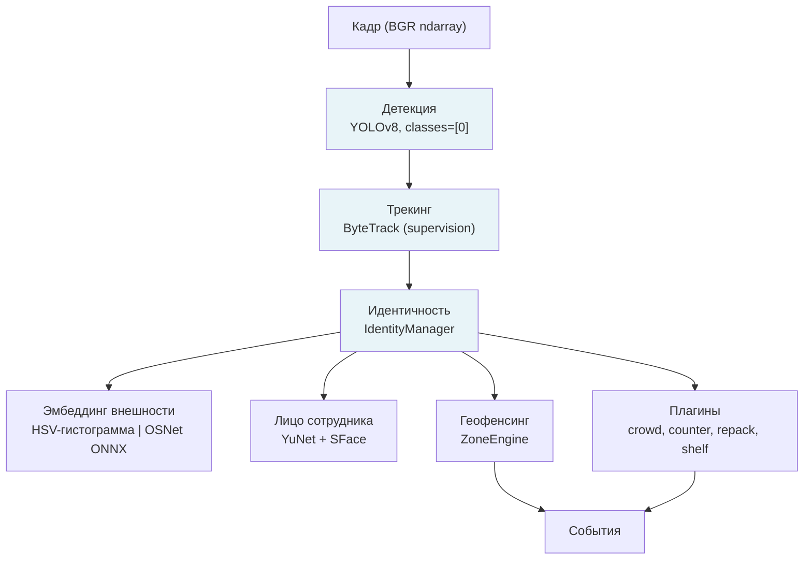
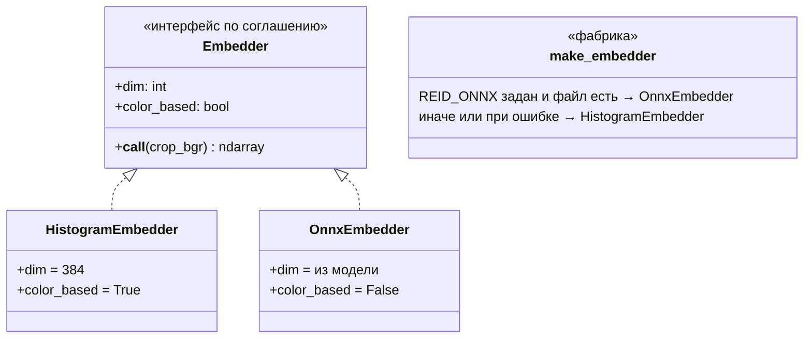
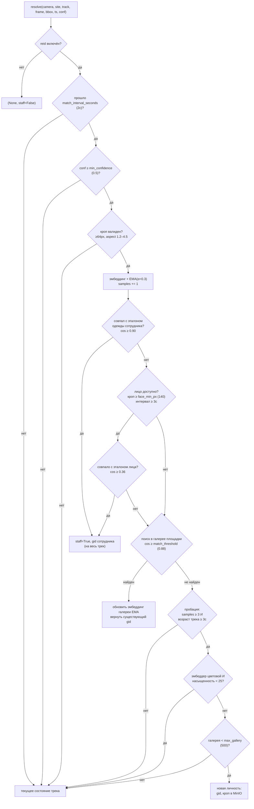
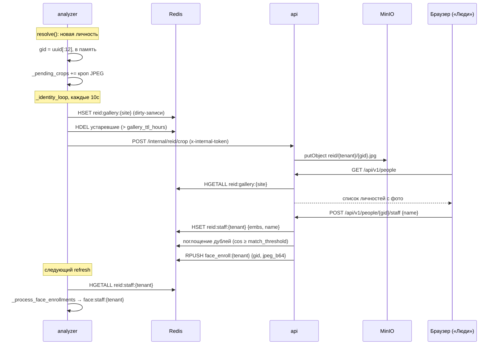
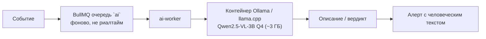
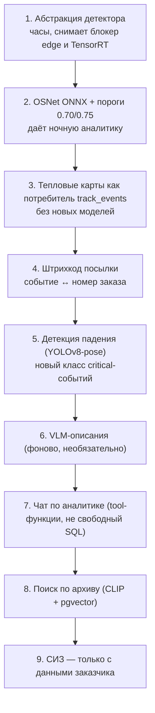
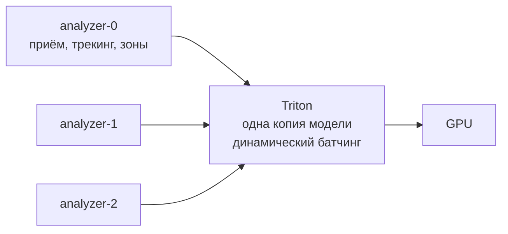
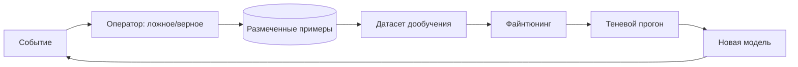

# 06. ИИ-подсистема

**Статус документа:** актуален на 2026-07-16
**Аудитория:** инженеры компьютерного зрения, ИИ-инженеры, архитекторы
**Связанные документы:** [01_SYSTEM_ARCHITECTURE.md](01_SYSTEM_ARCHITECTURE.md), [07_PLUGIN_SYSTEM.md](07_PLUGIN_SYSTEM.md), [05_CAMERA_CONNECTION.md](05_CAMERA_CONNECTION.md), [15_PVZ_MODULES.md](15_PVZ_MODULES.md), [14_FACTORY_MODULES.md](14_FACTORY_MODULES.md)
**Практические заметки в репозитории:** `docs/product/AI-IMPROVEMENTS.md`, `docs/operations/REID-OSNET.md`

---

## 1. Назначение документа

Документ описывает ИИ-подсистему платформы: детекцию, трекинг, повторную идентификацию, распознавание лиц сотрудников, а также планируемые направления (OCR, сегментация, оценка позы, VLM, эмбеддинги, RAG).

Раздел 10 формулирует требование, определяющее срок жизни архитектуры: **ни одна модель не должна быть зашита в код**.

---

## 2. Состав подсистемы



| Компонент | Реализация | Модель | Устройство | Состояние |
|---|---|---|---|---|
| Детекция | Ultralytics YOLOv8 | `yolov8s.pt` (прод), `yolov8n.pt` (dev) | CUDA | **В проде** |
| Трекинг | supervision ByteTrack | Без модели (геометрия + IoU) | CPU | **В проде** |
| Эмбеддинг внешности | Свой | HSV-гистограмма, 384 измерения | CPU | **В проде** |
| Эмбеддинг внешности (план) | onnxruntime | OSNet x0.25 ONNX | CPU | Готово к включению |
| Детекция лиц | OpenCV | YuNet 2023mar | CPU | В проде (сотрудники) |
| Распознавание лиц | OpenCV | SFace 2021dec | CPU | В проде (сотрудники) |
| Сегментация | — | — | — | Нет |
| Оценка позы | — | — | — | Нет |
| OCR | — | — | — | Нет |
| VLM | — | — | — | План |
| RAG / поиск по архиву | — | — | — | План |

---

## 3. Детекция

### 3.1. Реализация

```python
PERSON_CLASS = 0  # COCO person

def _infer(self, frame: Frame) -> sv.Detections:
    result = self.model.predict(
        frame.data,
        classes=[PERSON_CLASS],
        conf=self.settings.yolo_conf,      # 0.3
        imgsz=self.settings.yolo_imgsz,    # 640
        device=self.settings.analyzer_device,
        verbose=False,
    )[0]
    return sv.Detections.from_ultralytics(result)
```

Модель загружается один раз при создании воркера и переносится на устройство. Инференс выполняется в единственном потоке `ThreadPoolExecutor(max_workers=1)` — обоснование в [01_SYSTEM_ARCHITECTURE.md](01_SYSTEM_ARCHITECTURE.md), 4.1.

### 3.2. Детектируется только человек

`classes=[0]` — фильтр на уровне вызова, а не постобработки. Модель COCO знает 80 классов, но платформе нужен один.

Выигрыш: NMS выполняется только по одному классу, лишние детекции не доходят до трекера, `sv.Detections` компактнее.

Ограничение: любая задача, требующая иных объектов (погрузчик, каска, посылка, огонь), потребует изменения этого фильтра. Это единственная строка, отделяющая платформу от [14_FACTORY_MODULES.md](14_FACTORY_MODULES.md) на уровне детекции — и одновременно место, где закончится модель COCO: касок и СИЗ в ней нет.

### 3.3. Выбор модели

| Модель | Параметры | Скорость | Точность | Применение |
|---|---|---|---|---|
| `yolov8n.pt` | 3.2 млн | Максимальная | Базовая | Dev (1050 Ti 4 ГБ), прод при большом числе камер |
| `yolov8s.pt` | 11.2 млн | Высокая | Хорошая | **Прод по умолчанию** |
| `yolov8m.pt` | 25.9 млн | Средняя | Выше | Не используется |
| `yolov8l/x.pt` | 43.7 / 68.2 млн | Низкая | Максимальная | Избыточно |

Комментарий в `.env.prod.example` фиксирует правило: «RTX 3070 8GB: yolov8s.pt is a good default; yolov8n.pt if >8 cameras».

**[Данные отсутствуют]:** сравнение точности `n` против `s` на реальных кадрах точки не проводилось. Выбор `s` сделан по общим соображениям.
*Почему требуется:* если `n` даёт сопоставимое качество на данных ПВЗ (люди крупные, камер мало, сцена простая), переход на `n` освободит порядка 1 ГБ VRAM и заметно поднимет пропускную способность — то есть напрямую увеличит число точек на сервер.
*Рекомендация:* прогнать обе модели на эталонной записи с точки (механизм `file`-камер, [05_CAMERA_CONNECTION.md](05_CAMERA_CONNECTION.md), 7.3), сравнить число детекций и стабильность треков. Стоимость — часы, влияние — на юнит-экономику.

### 3.4. Порог уверенности

`yolo_conf = 0.3` — ниже типичного значения 0.5. Обоснование: пропущенный человек ломает подсчёт посетителей и dwell, а лишняя слабая детекция отсеивается дальше по конвейеру — ByteTrack не подхватит её в устойчивый трек, а Re-ID отбросит по `min_confidence = 0.5`.

Это пример правильного эшелонирования: детектор работает «щедро», фильтрация происходит там, где есть временной контекст.

### 3.5. TensorRT

Помечен в `CLAUDE.md` как «TODO после MVP». Не реализован; используется `device='cuda'` напрямую.

Ожидаемый выигрыш — двух-трёхкратное ускорение инференса. Цена: движок TensorRT собирается под конкретную комбинацию GPU, версии драйвера и CUDA. Это означает, что образ перестаёт быть переносимым: собранный под RTX 3070 движок не запустится на другой карте.

*Рекомендация:* не внедрять TensorRT до появления измерений. Если ограничителем окажется декодирование RTSP на CPU (что вероятно, см. [02_INFRASTRUCTURE.md](02_INFRASTRUCTURE.md), 5.2), ускорение инференса не даст ничего вообще. Порядок работ: сначала мониторинг, затем поиск настоящего узкого места, затем оптимизация. Оптимизация без измерения — это угадывание, которое к тому же ломает переносимость образа.

---

## 4. Трекинг

### 4.1. ByteTrack

```python
tracker = self._trackers.setdefault(frame.camera_id, sv.ByteTrack())
tracked = tracker.update_with_detections(detections)
```

Экземпляр — на камеру, создаётся лениво, живёт вместе с процессом. Все параметры — по умолчанию библиотеки `supervision`.

ByteTrack не использует нейросеть: он связывает детекции между кадрами по IoU и движению, причём в два прохода — сначала по уверенным детекциям, затем по слабым, которые обычно отбрасывают. Именно второй проход даёт устойчивость при частичном перекрытии.

### 4.2. Ограничения и как они смягчены

| Ограничение | Проявление | Смягчение в платформе |
|---|---|---|
| Смена `track_id` при потере | Один человек → несколько треков | **Состояние зон по `global_id`**, а не по треку (решение A-05) |
| Нет памяти о внешности | Человек вышел и вернулся → новый трек | Re-ID возвращает прежний `global_id` |
| Перекрытие людей | Слияние или обмен треками | Фильтр по соотношению сторон в Re-ID отбрасывает такие кропы |
| Зависимость от частоты кадров | При `frame_skip=2` объект успевает уйти дальше | Не смягчено; см. ниже |

Последнее заслуживает внимания. `frame_skip = 2` означает анализ каждого третьего кадра: при 15 к/с источника — 5 анализируемых кадров в секунду, интервал 200 мс. Идущий человек за 200 мс проходит порядка 30 см, что для ByteTrack по IoU приемлемо. Но при увеличении `frame_skip` до 5–6 (соблазнительно ради экономии GPU) IoU между кадрами может обнулиться, и трекинг развалится.

*Правило:* `frame_skip` — не свободный параметр производительности. Его увеличение выше 3 требует проверки, что треки не рвутся. Это ограничение нигде не зафиксировано в коде и потому будет нарушено при первой же попытке «немного разгрузить GPU».

### 4.3. Параметры по умолчанию

`sv.ByteTrack()` вызывается без аргументов: `track_activation_threshold`, `lost_track_buffer`, `minimum_matching_threshold`, `frame_rate` — все по умолчанию.

`frame_rate` по умолчанию равен 30, тогда как фактическая частота анализа при `frame_skip=2` — около 5 кадров в секунду. ByteTrack использует этот параметр для расчёта буфера потерянных треков: `lost_track_buffer` в кадрах при 30 к/с означает совсем другой интервал времени при 5 к/с. Фактически буфер удержания трека оказывается в шесть раз короче задуманного.

*Рекомендация:* передавать в `sv.ByteTrack(frame_rate=...)` фактическую частоту анализа камеры (вычисляется из FPS источника и `frame_skip`). Это, вероятно, заметно повысит устойчивость треков при кратковременном перекрытии — и объясняет часть «мерцания трекинга», которое пришлось компенсировать через Re-ID. **[Требует проверки]** на эталонной записи.

---

## 5. Повторная идентификация (Re-ID)

### 5.1. Назначение и принципиальное ограничение

Задача: присвоить человеку `global_id`, стабильный между камерами одной площадки, и определить, сотрудник ли он.

**Ограничение, которое является продуктовым решением, а не техническим компромиссом:** посетители идентифицируются **без биометрии** — по одежде и силуэту. См. [00_VISION.md](00_VISION.md), 7.1. Face-ID применяется только к сотрудникам, с их ведома.

### 5.2. Эмбеддер: две реализации, один интерфейс



**HistogramEmbedder** (по умолчанию):

| Параметр | Значение |
|---|---|
| Вход | Кроп человека, масштабируется до 64×128 |
| Признак | Гистограмма HSV по двум половинам тела (верх/низ) |
| Разбиение | H=12, S=4, V=4 → 192 на половину |
| Размерность | 384 |
| Нормализация | L2 → косинусная близость = скалярное произведение |
| Зависимости | Только OpenCV |
| Слабое место | Два посетителя в похожей одежде; **слепота на ИК-картинке** |

**OnnxEmbedder** (готов, не включён):

| Параметр | Значение |
|---|---|
| Модель | OSNet-подобная, ONNX |
| Вход | 128×256, RGB, нормализация ImageNet |
| Провайдер | CPUExecutionProvider |
| Размерность | Из модели |
| Включение | `REID_ONNX=/models/osnet_x0_25.onnx` |

Флаг `color_based` — не декоративный: он управляет применением гейта по насыщенности (5.5). Гистограммы слепнут ночью, нейросетевой эмбеддер — нет.

Фабрика делает правильную вещь: при любой ошибке загрузки ONNX происходит откат на гистограммы, а не падение воркера.

```python
def make_embedder() -> HistogramEmbedder | OnnxEmbedder:
    path = os.environ.get("REID_ONNX", "")
    if path and os.path.isfile(path):
        try:
            return OnnxEmbedder(path)
        except Exception:  # fall back rather than kill the worker
            pass
    return HistogramEmbedder()
```

### 5.3. Алгоритм `resolve()`



Пояснения к неочевидным местам:

**EMA (α = 0.3).** Эмбеддинг трека — скользящее среднее, а не последнее наблюдение. Один неудачный кадр (частичное перекрытие, блик) не разрушает накопленное представление. После смешивания — обязательная перенормировка, иначе косинусная близость перестанет быть скалярным произведением.

**Липкость флага сотрудника.** Однажды опознанный как сотрудник трек остаётся сотрудником до конца жизни трека — повторная проверка не выполняется. Обоснование: сотрудник не может «перестать быть сотрудником» в середине прохода по кадру, а повторные проверки стоят CPU. Риск: ложное срабатывание делает посетителя невидимым для всей аналитики на время трека.

**Порядок «одежда → лицо».** Одежда проверяется первой: это дёшево (скалярное произведение) и обычно достаточно. Лицо — дорогая операция (два инференса ONNX), выполняется только на крупных кропах (≥ 140 px) и не чаще раза в 3 секунды. При этом лицо переживает смену одежды — сотрудник, надевший куртку, всё равно будет опознан.

**Обновление галереи при совпадении.** Найденная личность тоже обновляется по EMA. Это позволяет представлению «дрейфовать» вместе с изменением освещения по мере перемещения человека по площадке.

### 5.4. Инцидент «2 курьера ночью = 44 посетителя»

Зафиксирован в `PLAN.md`. Это наиболее поучительный случай в истории проекта, и его следует разобрать полностью — он породил половину защитных механизмов подсистемы.

**Симптом.** Ночью на точке было два курьера. Система показала 44 посетителя.

**Причины (две, действовавшие совместно):**

1. **HSV-гистограммы слепнут на ИК-картинке.** Ночью камера переключается в ИК-режим, картинка становится почти монохромной. Насыщенность близка к нулю → гистограмма вырождается → эмбеддинги любых двух людей похожи друг на друга не больше, чем на самих себя при следующем появлении. Порог 0.88 не достигался никогда, и каждое появление создавало новую личность.
2. **Личность создавалась с одного кадра.** При мерцании трекинга (потеря и переприсвоение `track_id`) каждый фрагмент трека регистрировал нового человека.

**Внесённые исправления** (все в `analyzer/reid/`):

| Механизм | Параметр | Что предотвращает |
|---|---|---|
| Пробация по числу сэмплов | `min_samples = 3` | Личность с одного кадра |
| Пробация по возрасту трека | `min_track_age_seconds = 3.0` | Личность от фрагмента мерцающего трека |
| Порог уверенности | `min_confidence = 0.5` | Слабые детекции отравляют эмбеддинг |
| Минимальный размер кропа | `min_crop_px = 64` | Мелкие кропы неинформативны |
| Соотношение сторон | `1.2 ≤ h/w ≤ 4.5` | Широкие боксы — это слияния или части людей |
| Гейт по насыщенности | `min_saturation = 25`, **только для `color_based`** | Создание личностей из бесцветных кропов |
| Исключение `pending` из подсчёта | `IdentityResult.pending` | Треки без личности не считаются посетителями |
| Предел галереи | `max_gallery = 500` | Неограниченный рост при системном сбое |

**Ключевое свойство гейта по насыщенности:** он применяется только к цветовому эмбеддеру:

```python
if getattr(self.embedder, "color_based", False) \
        and self._mean_saturation(crop) < self._f("min_saturation", 25.0):
    return _res()
```

Ночью с гистограммами новые личности **не создаются вообще**. Это осознанный выбор: лучше не посчитать ночного посетителя, чем посчитать его двадцать раз. Прямое следствие принципа «точность важнее полноты» ([00_VISION.md](00_VISION.md), 11.3).

**Общий урок, вынесенный в принцип:** новая сущность создаётся только после накопления доказательств, а не по первому наблюдению.

### 5.5. Полный перечень параметров Re-ID

Настраиваются в `/admin/features` для модуля `reid` (`tenant_feature.config`).

| Параметр | Умолчание | Смысл | Влияние при изменении |
|---|---|---|---|
| `match_threshold` | 0.88 | Порог совпадения с галереей | Ниже → слияние разных людей; выше → двойной счёт |
| `staff_threshold` | 0.90 | Порог совпадения с эталоном одежды сотрудника | Ниже → посетители становятся невидимыми |
| `match_interval_seconds` | 2.0 | Как часто пересчитывать эмбеддинг трека | Ниже → нагрузка на CPU |
| `min_confidence` | 0.5 | Минимальная уверенность детекции | |
| `min_crop_px` | 64 | Минимальный размер кропа | |
| `min_samples` | 3 | Сэмплов до создания личности | Ниже → возврат к инциденту 5.4 |
| `min_track_age_seconds` | 3.0 | Возраст трека до создания личности | То же |
| `min_saturation` | 25.0 | Гейт ночной слепоты (только гистограммы) | |
| `max_gallery` | 500 | Предел личностей на площадку | |
| `gallery_ttl_hours` | 12.0 | Время жизни личности | **Не только техника: это граница 152-ФЗ** |
| `face_threshold` | 0.36 | Порог совпадения лица (SFace) | |
| `face_min_px` | 140 | Минимальная высота кропа для лица | |
| `face_interval_seconds` | 3.0 | Интервал попыток распознавания лица | |

`gallery_ttl_hours = 12` заслуживает отдельного внимания: это не параметр производительности. Именно суточное обнуление галереи делает эмбеддинг непригодным для долговременной идентификации и удерживает решение вне режима биометрических персональных данных. Увеличение этого значения до, например, 720 часов превратило бы галерею в базу отслеживания посетителей — с иными правовыми последствиями. *Рекомендация:* ограничить параметр сверху в интерфейсе (например, 24 часами) и снабдить пояснением.

### 5.6. Переход на OSNet

Инструкция — `docs/operations/REID-OSNET.md`. Состояние: `onnxruntime` в зависимостях, `REID_ONNX` и монтирование `/models` в prod-compose. Осталось выполнить экспорт и подстроить пороги.

| Параметр | HSV-гистограммы | OSNet |
|---|---|---|
| `match_threshold` | 0.88 | **0.70** |
| `staff_threshold` | 0.90 | **0.75** |
| Работа ночью | **Нет** (гейт блокирует) | Да |
| Похожая одежда | Путает | Различает |
| Стоимость CPU | Пренебрежимая | Заметная |

**Пороги обязаны меняться вместе с эмбеддером.** Косинусные близости распределены по-разному: 0.88 для нейросетевого эмбеддера — недостижимо высокий порог, при котором не совпадёт никто, и система вернётся к двойному счёту. Это ловушка: включение `REID_ONNX` без изменения порогов ухудшит работу, и вывод «OSNet не помог» будет ошибочным.

*Рекомендация:* связать пороги с типом эмбеддера в коде — например, задавать умолчания через свойство эмбеддера (`embedder.default_match_threshold`), а конфигурацию тенанта применять поверх. Тогда включение ONNX автоматически принесёт корректные пороги. Сейчас это ручное знание, живущее в отдельном файле документации, и оно будет утрачено.

Дополнительный выигрыш от OSNet: снимается гейт по насыщенности, то есть **появляется ночная аналитика посетителей**, которой сегодня нет вовсе.

### 5.7. Хранение и жизненный цикл



Существенные детали:

**Отложенная запись.** Галерея живёт в памяти анализатора, в Redis пишутся только изменённые записи (`dirty`) раз в 10 секунд. Это устраняет запись в Redis на каждом кадре.

**Двусторонняя синхронизация.** `sync()` не только пишет, но и **вычитывает удаления**, сделанные API:

```python
redis_gids = set(await self.redis.hkeys(key))
for gid in [g for g, e in entries.items() if g not in redis_gids and not e.dirty]:
    del entries[gid]
```

Без этого удалённая через интерфейс личность продолжала бы жить в памяти анализатора и совпадать. Механизм нужен для сценария «отметить сотрудника»: отметка поглощает его дубли в галерее, и анализатор обязан об этом узнать.

**Устойчивость выгрузки кропов.** При недоступности API кропы не теряются, но и не копятся бесконечно: сохраняются последние 20 (`self._pending_crops = (crops + self._pending_crops)[-20:]`). Ограниченная очередь вместо неограниченной — верное решение: кроп личности не настолько ценен, чтобы ради него исчерпать память.

**Ограниченный батч зачисления лиц.** `for _ in range(5)` за тик — очередь не может заблокировать цикл синхронизации.

### 5.8. Риск: Redis как система записи

Ключи `reid:staff:{tenant_id}` и `face:staff:{tenant_id}` — бессрочные и **не имеют источника истины в PostgreSQL**. Это единственные такие данные в платформе.

Потеря тома Redis = потеря всех отметок сотрудников, сделанных владельцем вручную. Владелец обнаружит это не сразу: система просто начнёт считать персонал посетителями и слать алерты на сотрудников.

*Рекомендация:* перенести эталоны сотрудников в PostgreSQL (таблица `staff_identity(tenant_id, gid, name, embeddings jsonb, face_embeddings jsonb)`), оставив Redis проекцией — по той же схеме, что `cameras:` и `zones:`. Это устраняет единственное место, где Redis является системой записи, и попутно делает отметки сотрудников частью резервной копии PostgreSQL. См. [10_DATABASE.md](10_DATABASE.md).

---

## 6. Распознавание лиц сотрудников

### 6.1. Границы применения

| Субъект | Face-ID | Основание |
|---|---|---|
| Сотрудники | **Да** | Трудовые отношения, ведома, для исключения из подсчёта |
| Посетители | **Никогда** | 152-ФЗ, решение V-02 |

Граница проходит по коду: лицевой путь вызывается только внутри проверки на сотрудника, до поиска по галерее посетителей. Посетитель не проходит через `FaceEngine` ни при каких условиях.

### 6.2. Модели

| Роль | Модель | Источник | Размер |
|---|---|---|---|
| Детекция лиц | YuNet 2023mar | opencv_zoo | ~300 КБ |
| Распознавание | SFace 2021dec | opencv_zoo | ~40 МБ |

Скачиваются при сборке образа (`analyzer/Dockerfile`) с `media.githubusercontent.com`. Сбой скачивания не ломает сборку — только отключает Face-ID:

```dockerfile
RUN mkdir -p /opt/models && (curl ... && curl ...) \
    || echo "WARN: face models download failed — staff face-id will be disabled"
```

Обоснование выбора: обе модели входят в OpenCV Zoo, работают через `cv2.FaceDetectorYN` и `cv2.FaceRecognizerSF` без дополнительных зависимостей, исполняются на CPU за единицы миллисекунд. Для задачи «узнать одного из 3–5 сотрудников» этого достаточно с запасом; более тяжёлые модели (ArcFace, InsightFace) решали бы задачу идентификации среди миллионов — она здесь не стоит.

`FaceEngine.ready` = False при отсутствии файлов; все вызовы обходятся стороной. Деградация корректна.

### 6.3. Зачисление эталона

Владелец отмечает сотрудника на странице «Люди»: автоматический кроп с камеры либо загруженное фото. API кладёт задание в `face_enroll:{tenant_id}`, анализатор извлекает эмбеддинг и добавляет в `face:staff:{tenant_id}` (до 10 эталонов).

Учёт неудач ведётся явно: `{embs, photos, failed}` — сколько фото загружено, сколько не содержали пригодного лица. Это позволяет интерфейсу объяснить владельцу, почему сотрудник не опознаётся: загружено 5 фото, лицо найдено на одном.

### 6.4. Порог 0.36

Для SFace косинусный порог 0.36 — рекомендация OpenCV Zoo. Он ниже, чем у эмбеддингов одежды (0.88/0.90), потому что распределение близостей у SFace иное. Сравнивать эти числа между собой бессмысленно.

---

## 7. Отсутствующие возможности

Раздел описывает то, чего нет, с честной оценкой ценности.

### 7.1. Сегментация

| Аспект | Оценка |
|---|---|
| Что | Попиксельная маска объекта вместо прямоугольника |
| Модели | YOLOv8-seg, SAM 2 |
| Ценность для ПВЗ | **Низкая.** Прямоугольника достаточно для зон и dwell |
| Ценность для производства | Средняя: точные границы опасной зоны, разливы, утечки |
| Стоимость | Модель `-seg` тяжелее в 1.5–2 раза |
| **Рекомендация** | Не внедрять для ПВЗ. Рассматривать при задачах «разлив/утечка» ([14_FACTORY_MODULES.md](14_FACTORY_MODULES.md)), где прямоугольник бессмыслен |

### 7.2. Оценка позы

| Аспект | Оценка |
|---|---|
| Что | Скелет человека, 17 ключевых точек |
| Модели | YOLOv8-pose, RTMPose |
| Ценность | Падение человека, поза «руки вверх», нагибание, эргономика |
| Стоимость | Сопоставима с детекцией |
| **Рекомендация** | Средний приоритет. Первый реальный сценарий — **детекция падения** (работник упал, посетителю плохо): это critical-событие, которое сегодня платформа не видит. Реализуемо как плагин на YOLOv8-pose |

Замечание: на лендинге уже есть процедурные скелеты (13 суставов) в hero-сцене — но это анимация, а не оценка позы. Не путать при чтении кода.

### 7.3. OCR

| Аспект | Оценка |
|---|---|
| Что | Распознавание текста в кадре |
| Модели | PaddleOCR, EasyOCR, TrOCR |
| Ценность для ПВЗ | **Высокая:** штрихкод/номер посылки → связь события с конкретным заказом |
| Ценность для производства | Средняя: номера деталей, маркировка |
| **Рекомендация** | Высокий приоритет для ПВЗ, но начинать не с OCR |

Обоснование: в `analyzer/plugins/shelf.py` уже стоит пометка «TODO: identify the specific parcel via QR/label OCR on the changed crop». Однако для посылок маркетплейсов используются штрихкоды и QR, а не текст. **Распознавание штрихкода (pyzbar, zbar) на порядок проще и надёжнее OCR** и решает ту же задачу: связать событие с номером заказа. Начинать следует с этого; OCR добавлять, только если штрихкод физически не виден камере.

Ценность связки «событие ↔ номер заказа» велика: она превращает «на полке что-то изменилось» в «посылку №12345 взяли в 14:32», то есть в доказательство для разбора претензии.

### 7.4. Детекция объектов, не входящих в COCO

Для [14_FACTORY_MODULES.md](14_FACTORY_MODULES.md) требуются: каска, жилет, перчатки, очки, погрузчик, огонь, дым, разлив.

В COCO из этого нет ничего. Значит, требуется:
1. **Готовая модель.** Существуют открытые модели СИЗ (обычно на базе YOLO, обученные на публичных наборах). Качество на реальном заводе — непредсказуемо.
2. **Собственное обучение.** Разметка данных заказчика.

*Рекомендация:* не обещать СИЗ до появления пилота с заказчиком, готовым дать данные для разметки. Модель СИЗ, обученная на чужом наборе, на конкретном заводе с конкретными касками и освещением, скорее всего, покажет неприемлемую точность. Это не техническая проблема, а свойство задачи. Правильная последовательность: пилот → сбор данных → разметка → обучение → внедрение; и её нужно закладывать в сроки продаж.

Архитектурно платформа к этому готова: `classes=[PERSON_CLASS]` меняется, `FeaturePlugin` уже получает кадр целиком.

---

## 8. Планируемое: локальный ИИ

Блок C из `PLAN.md`. Бюджет VRAM: YOLO занимает около 1 ГБ, свободно порядка 6.5 ГБ.

### 8.1. Архитектура



Принципиальное решение: **LLM работает асинхронно, вне горячего пути.** Событие сохраняется и доставляется независимо от того, ответила ли модель. LLM обогащает, но не блокирует. Если контейнер Ollama недоступен — алерт уходит без описания.

Это соответствует принципу деградации ([00_VISION.md](00_VISION.md), 6.7) и является обязательным условием: система видеонаблюдения не может ждать нейросеть, чтобы отправить критическое уведомление.

### 8.2. Направления

| № | Возможность | Модель | Ценность | Риск |
|---|---|---|---|---|
| 9 | VLM-описание события | Qwen2.5-VL-3B Q4 | Алерт «у стойки 4 человека, ожидание ~3 мин» вместо `queue_alert` | Галлюцинации в описании кадра |
| 10 | VLM-верификация перед алертом | То же | Отсев ложных срабатываний | **Пропуск настоящего события** |
| 11 | Текстовая сводка дня | LLM поверх цифр | Читаемый отчёт | Низкий: числа известны |
| 12 | Чат по аналитике | LLM → SQL | «Сколько людей было вчера в обед?» | SQL-инъекция, утечка между тенантами |
| 13 | Поиск по архиву на естественном языке | CLIP + pgvector | «Найди человека в красной куртке» | Объём вычислений |

### 8.3. Оценка рисков по направлениям

**Направление 10 (верификация) — самое опасное.** Оно ставит вероятностную модель на путь принятия решения об алерте. VLM, ошибочно решившая, что нарушения нет, приведёт к пропуску события — а именно пропуск в системе безопасности недопустим.

*Рекомендация:* если внедрять, то **только в одну сторону**: VLM может **понизить** уверенность и добавить пометку «возможно, ложное срабатывание», но не может отменить алерт. Решение остаётся за правилом. Схема «VLM отменяет алерт» не должна быть реализована никогда.

**Направление 12 (чат → SQL)** требует особой осторожности: LLM генерирует SQL, который выполняется в базе с данными всех тенантов. Уязвимость здесь означает межтенантную утечку.

*Рекомендация:* не давать модели генерировать произвольный SQL. Вместо этого — фиксированный набор параметризованных запросов, где LLM выбирает запрос и заполняет параметры. Функция `tool` с валидируемыми аргументами вместо свободного SQL. Дополнительно: отдельная роль БД только на чтение и с фильтром по тенанту на уровне представлений.

**Направление 13** уже подготовлено инфраструктурно: расширение `vector` создаётся в `init.sql`, хотя ни одного столбца этого типа пока нет.

### 8.4. Выбор среды исполнения

**[Требует решения]:** Ollama против llama.cpp против vLLM.

*Рекомендация:* Ollama на текущем этапе. Обоснование: простота (один контейнер, REST API), достаточная производительность для фоновых задач, поддержка GGUF-квантований. vLLM даёт лучшую пропускную способность при пакетной обработке, но она не нужна: задачи фоновые и редкие. Переход на vLLM оправдан, только если появится поток из десятков запросов в секунду.

Риск делить GPU между YOLO и LLM: всплеск потребления VRAM у LLM может привести к OOM в YOLO — то есть фоновая необязательная функция уронит основную. *Рекомендация:* задать жёсткий лимит VRAM для контейнера LLM и рассматривать вынос LLM на CPU при первых признаках конкуренции. Аналитика важнее описаний.

---

## 9. Тепловые карты

Пункт 5 блока B из `PLAN.md`. Заслуживает отдельного упоминания как **единственная новая возможность, не требующая ни одной новой модели**.

Замысел: накапливать центры треков в Redis (сетка 32×18, по часам), накладывать на кадр.

Данные уже есть: `TrackInfo.center_norm` вычисляется на каждом кадре для каждого трека и сегодня используется только для проверки принадлежности зоне. Стрим `track_events` содержит те же данные и **не имеет ни одного потребителя** ([01_SYSTEM_ARCHITECTURE.md](01_SYSTEM_ARCHITECTURE.md), 9.1).

*Рекомендация:* реализовать тепловые карты как потребителя `track_events`, а не как ещё один плагин в анализаторе. Это одновременно: даёт стриму назначение, снимает вопрос о его отключении, выносит агрегацию из горячего пути и создаёт первый пример сервиса-потребителя событий, который затем послужит образцом для forwarder'а гибридного режима ([03_DEPLOYMENT.md](03_DEPLOYMENT.md), 8.1).

Соотношение «ценность / стоимость» здесь лучшее среди всех пунктов плана ИИ: результат выглядит эффектно на демонстрации, закрывает пункт продуктового каталога, не требует ни GPU, ни модели, ни разметки.

---

## 10. Слой абстракции ИИ

### 10.1. Требование

Из [00_VISION.md](00_VISION.md), 11.4: срок жизни архитектуры — 10 лет; ни одна модель компьютерного зрения столько не живёт. Живёт только контракт.

Формальное требование: **ни одна модель не должна быть зашита в код. Каждый ИИ-модуль обязан быть заменяемым.**

### 10.2. Текущее состояние

| Модуль | Заменяемость | Как |
|---|---|---|
| Эмбеддер Re-ID | **Хорошая** | `make_embedder()`, фабрика с откатом, `REID_ONNX` |
| Модели лиц | **Хорошая** | Пути в конфигурации, `FaceEngine.ready` при отсутствии |
| Детекция | **Слабая** | `YOLO(settings.yolo_model)` вызывается напрямую в `AnalyzerWorker.__init__` |
| Трекинг | **Слабая** | `sv.ByteTrack()` создаётся напрямую |

Эмбеддер — образцовая реализация принципа: интерфейс, две реализации, фабрика, корректный откат, флаг свойств (`color_based`), влияющий на логику.

Детекция — противоположность: класс `YOLO` из Ultralytics используется напрямую, тип `sv.Detections` от `supervision` проходит через весь конвейер. Смена детектора на RT-DETR, DAMO-YOLO или собственную модель потребует правок в нескольких местах.

### 10.3. Предлагаемая абстракция

```python
# analyzer/detect/base.py  [План]
from typing import Protocol
import numpy as np

@dataclass(slots=True)
class Detection:
    bbox: tuple[float, float, float, float]  # x1,y1,x2,y2 пиксели
    confidence: float
    class_id: int

class Detector(Protocol):
    """Заменяемый детектор объектов. Реализация не должна протекать наружу."""
    name: str
    classes: list[int]

    def detect(self, frame: np.ndarray) -> list[Detection]: ...


class Tracker(Protocol):
    """Заменяемый трекер. Состояние — на камеру."""
    def update(self, detections: list[Detection], camera_id: str) -> list[Track]: ...


def make_detector(settings: Settings) -> Detector:
    """Фабрика по образцу make_embedder(): выбор по конфигурации, откат при ошибке."""
```

Реализации: `YoloDetector` (сейчас), `TensorRtDetector` (при внедрении TensorRT), `OnnxDetector` (edge), `OpenVinoDetector` (iGPU).

*Обоснование срочности:* абстракция нужна **до** начала работ по edge и TensorRT, а не после. Edge-режим требует OpenVINO или TensorRT для Jetson; без слоя абстракции это будет сделано ветвлением `if device == ...` внутри `worker.py`, и через год конвейер обрастёт условиями. Стоимость введения абстракции сейчас — часы; после трёх реализаций — дни рефакторинга с риском регрессий.

### 10.4. Правила для ИИ-модулей

Обязательны для любого нового модуля:

| Правило | Причина |
|---|---|
| Модель задаётся конфигурацией, не кодом | Замена без пересборки |
| Фабрика с откатом при ошибке загрузки | Отсутствие модели ≠ падение воркера |
| Тип модели не протекает в конвейер | Смена модели не должна менять `TrackInfo`, `Event` |
| Свойства модели выражены явно (`color_based`, `dim`) | Логика адаптируется, а не гадает |
| Пороги привязаны к модели | Смена эмбеддера без смены порогов ломает систему (5.6) |
| Модуль обязан отвечать при отсутствии модели | Деградация вместо отказа |
| Веса вложены в образ | Условие офлайн-поставки ([03_DEPLOYMENT.md](03_DEPLOYMENT.md), 7.2) |

---

## 11. Дорожная карта ИИ

Порядок определяется отношением «ценность / риск», а не привлекательностью технологии.



| № | Работа | Ценность | Риск | Предусловие |
|---|---|---|---|---|
| 1 | Абстракция детектора | Разблокирует edge и TensorRT | Низкий | — |
| 2 | OSNet + пороги | **Ночная аналитика, которой нет** | Средний: пороги | Эталонная запись |
| 3 | Тепловые карты | Высокая при нулевой стоимости моделей | Низкий | — |
| 4 | Штрихкод | Событие ↔ заказ | Низкий | Видимость кода камерой |
| 5 | Детекция падения | Новый класс critical | Средний: ложные | — |
| 6 | VLM-описания | Качество уведомлений | Средний: галлюцинации | Мониторинг VRAM |
| 7 | Чат по аналитике | Эффектно | **Высокий: межтенантная утечка** | Tool-функции |
| 8 | Поиск по архиву | Аналог BriefCam | Высокий: объём | UI архива |
| 9 | СИЗ | Открывает производство | **Высокий: точность** | Данные заказчика |

Общее правило приоритизации: сначала то, что использует уже собираемые данные (3), затем то, что снимает известное ограничение (2), затем новое.

---

## 12. Реестр решений ИИ

| № | Решение | Обоснование | Альтернатива и почему отвергнута |
|---|---|---|---|
| AI-01 | Re-ID посетителей без лиц | 152-ФЗ; критерий допуска в тендерах | Лица: точнее, но недопустимо |
| AI-02 | Face-ID только для сотрудников | Трудовые отношения, ведома | Для всех: биометрия посетителей |
| AI-03 | `gallery_ttl_hours = 12` | Граница правового режима, не производительности | Больше: база отслеживания |
| AI-04 | HSV-гистограммы по умолчанию | Ноль зависимостей, работает днём | Только ONNX: тяжёлый порог входа |
| AI-05 | Гейт по насыщенности только для `color_based` | Гистограммы слепнут ночью, нейросеть — нет | Общий гейт: отключил бы OSNet ночью |
| AI-06 | Пробация (3 сэмпла, 3 секунды) | Инцидент «2 курьера = 44 посетителя» | С первого кадра: личность на каждый фрагмент |
| AI-07 | `pending`-треки не считаются | Шум не является посетителем | Считать: двойной счёт |
| AI-08 | Липкий флаг сотрудника на трек | Сотрудник не меняется в середине кадра | Перепроверка: расход CPU |
| AI-09 | Одежда до лица | Дёшево и обычно достаточно | Лицо первым: дорого на каждом треке |
| AI-10 | `classes=[0]` на уровне вызова | NMS по одному классу | Постфильтр: лишняя работа |
| AI-11 | `yolo_conf = 0.3` | Детектор щедр, фильтрация — где есть контекст | 0.5: пропуск людей |
| AI-12 | LLM вне горячего пути | Алерт не ждёт нейросеть | Синхронно: LLM ломает доставку |
| AI-13 | VLM не отменяет алерт | Пропуск недопустим | Отмена: вероятностная модель решает |
| AI-14 | TensorRT отложен | Узкое место не измерено; ломает переносимость образа | Внедрять сейчас: оптимизация вслепую |

---

## 13. Долг ИИ-подсистемы

| № | Проблема | Влияние | Приоритет |
|---|---|---|---|
| AI-D-01 | Нет абстракции детектора и трекера | Блокер edge, TensorRT, смены модели | **Высокий** |
| AI-D-02 | Пороги Re-ID не связаны с типом эмбеддера | Включение OSNet без правки порогов ухудшит работу | **Высокий** |
| AI-D-03 | Эталоны сотрудников только в Redis | Потеря тома = потеря ручной работы владельца | **Высокий** |
| AI-D-04 | Ночью личности не создаются (гистограммы) | Нет ночной аналитики посетителей | Высокий |
| AI-D-05 | `ByteTrack(frame_rate)` не задан | Буфер удержания трека короче задуманного | Средний |
| AI-D-06 | `frame_skip` > 3 может развалить трекинг; нигде не зафиксировано | Скрытая ловушка при «оптимизации» | Средний |
| AI-D-07 | Нет измерений производительности и точности | Планирование ёмкости невозможно | **Высокий** |
| AI-D-08 | `track_events` без потребителя | Трафик и CPU без пользы | Средний |
| AI-D-09 | Нет регрессионного набора записей | Каждая правка порогов — эксперимент на клиенте | **Высокий** |
| AI-D-10 | Нет детекции падения | Не видим критический класс событий | Средний |

---

## 14. Производительность и MLOps (расширение по [REVIEW_BOARD.md](REVIEW_BOARD.md))

**Статус раздела: [План] целиком.** Добавлен по итогам ревью совета (находки B-04, B-05, B-36..B-42).

### 14.1. Батчинг инференса — главный неиспользованный рычаг

Совет квалифицировал отсутствие батчинга как **блокер** ([REVIEW_BOARD.md](REVIEW_BOARD.md), 3.2). Текущий конвейер подаёт в YOLO **один кадр за вызов** (`_infer(frame)`). GPU при этом недоутилизирован в разы.

Свойство GPU: обработка батча из 16 кадров занимает **почти столько же времени**, что и одного, потому что накладные расходы на запуск ядра доминируют над вычислением при малом входе. Иллюстрация из модели ёмкости ([20](20_SCALE_ARCHITECTURE.md), 8.4):

| Размер батча | Время инференса | Кадров/с | Камер на узел (оценка) |
|---|---|---|---|
| 1 (сейчас) | ~8 мс | 125 | ~31 |
| 8 | ~24 мс | 333 | ~83 |
| 16 | ~40 мс | 400 | ~100 |
| 32 | ~72 мс | 444 | ~111 |

Числа — гипотеза до измерения, но **форма кривой достоверна**: до определённого размера батч почти бесплатен, затем насыщение. Оптимум обычно 8–32.

### 14.2. Совместимость с текущей архитектурой

| Опасение | Ответ |
|---|---|
| Ломает «один поток инференса» (A-02) | **Нет**: батч собирается в том же одном потоке |
| Ломает переносимость образа (в отличие от TensorRT) | **Нет**: батчинг — свойство вызова `predict`, не сборки |
| Требует синхронизации камер | Нет: батч из кадров, готовых к моменту, а не по расписанию |
| Увеличивает задержку | Незначительно: ожидание сбора — единицы мс при активном потоке |

Механизм — **динамический (оппортунистический) батчинг**: поток инференса берёт до `B` кадров, готовых прямо сейчас, не ждёт заполнения. При низкой нагрузке задержка не растёт, при высокой растёт пропускная способность. Кадры приходят от всех камер процесса ([20](20_SCALE_ARCHITECTURE.md), 6 — пул мультитенантных анализаторов).

### 14.3. Приоритет: батчинг прежде TensorRT и прежде NVDEC

Дискуссия в 3.5 велась мимо главного рычага. Правильный порядок:

| № | Оптимизация | Выигрыш | Ломает переносимость | Условие |
|---|---|---|---|---|
| 1 | **Батчинг** | Кратный (×3) | Нет | Немедленно |
| 2 | **NVDEC (декодирование на GPU)** | Снимает узкое место CPU ([20](20_SCALE_ARCHITECTURE.md), 8.3) | Нет | CPU > 70% |
| 3 | TensorRT | ×2–3 инференса | **Да** | Только если инференс — узкое место после 1–2 |

NVDEC второй, потому что модель ёмкости ([20](20_SCALE_ARCHITECTURE.md), 8.3) показывает: CPU-декодирование упирается раньше GPU, а `frame_skip` его не разгружает (декодируются все кадры, отбрасываются после).

### 14.4. DeepStream (B-41)

NVIDIA DeepStream закрывает батчинг и NVDEC одновременно: декодирование (NVDEC), препроцессинг и инференс (TensorRT) — единый GPU-конвейер с аппаратным батчингом потоков.

| Аспект | Текущий стек | DeepStream |
|---|---|---|
| Декодирование | CPU | NVDEC (GPU) |
| Батчинг | Нет | Аппаратный |
| Переносимость (edge не-NVIDIA) | Есть | **Только NVIDIA** |
| Порог входа | Низкий | Высокий |

*Рекомендация:* **не переходить целиком**, рассмотреть как реализацию за абстракцией `Detector` (10.3) для NVIDIA-узлов. Прямой переход запирает платформу в NVIDIA навсегда, что противоречит планам edge на Intel ([24](24_EDGE_FLEET.md), 8.5).

### 14.5. Сервер инференса (Triton) как ответ на B-03

Альтернатива/дополнение к пулу процессов ([20](20_SCALE_ARCHITECTURE.md), 6): вынести инференс в отдельный сервис с одной копией модели.



| Аспект | Пул процессов | Triton |
|---|---|---|
| Копий модели в VRAM | По числу процессов | **Одна** |
| Батчинг, версии, A/B, теневой прогон | Сами | **Встроено** |
| Сложность | Ниже | Выше (ещё сервис, gRPC) |

*Рекомендация:* Triton — правильный конечный ответ на масштаб инференса, но не первый шаг (сначала батчинг внутри процесса). Встаёт за абстракцию `Detector`. Это подтверждает: **абстракция детектора (AI-D-01) блокирует три улучшения сразу** — edge, TensorRT, Triton, — и потому имеет высший приоритет. Кадр в Triton передавать через CUDA shared memory, не gRPC покадрово (иначе выигрыш съест передача).

### 14.6. MLOps: жизненный цикл модели (B-36..B-39)

Сегодня модель — файл в переменной окружения. Неизвестно: какая версия работает, какая породила событие, деградирует ли. При планке и спорах невосстановимо.

**Реестр моделей (B-36).**

```sql
-- [План], control plane
CREATE TABLE model_registry (
  id uuid PRIMARY KEY, kind text, name text, version text,
  format text, sha256 text, metrics jsonb,
  released_at timestamptz, status text  -- candidate|shadow|active|retired
);
```

Требование: **каждое событие несёт `event.meta.model_version`**. При споре «система ошиблась» нужно знать, какая модель работала. Стоимость — одно поле в `meta` (расширяется без миграции, [01](01_SYSTEM_ARCHITECTURE.md), 9.3).

**Теневой прогон и A/B (B-37).** Теневая модель обрабатывает те же кадры, результат не влияет на события — только сравнивается. Решение о переключении — по данным. Стоимость — удвоение инференса на подмножестве камер (канареечная ячейка) ограниченное время.

**Контроль дрейфа (B-38)** без разметки, по прокси-метрикам:

| Индикатор | Метрика | Признак дрейфа |
|---|---|---|
| Уверенность детекций | `viziai_detection_confidence` | Сдвиг вниз |
| Отклонённые кропы Re-ID | `viziai_reid_rejected_total{reason}` | Рост `low_saturation` |
| Стабильность треков | Средняя длина трека | Падение |

Инцидент «2 курьера = 44» (5.4) метрика `reid_rejected{reason=low_saturation}` показала бы всплеском за минуту — контроль дрейфа поймал бы его до клиента.

**Петля обратной связи (B-39).** Исход разбора ([09](09_WORKFLOW_ENGINE.md), 3.3) содержит `false_positive`/`true_positive` — разметку, порождённую эксплуатацией. Сегодня она выбрасывается.



Замкнуть петлю: оператор всё равно размечает, разбирая события — это бесплатный источник улучшения. *Ограничение:* датасет содержит изображения людей (ПДн); дообучение в контуре, обезличенно (кропы без лиц либо согласие). Связь с [13](13_SECURITY.md), [21](21_TENANT_LIFECYCLE.md), 8.

### 14.7. SLO инференса (B-42)

«Сколько камер на GPU» не имеет ответа без определения качества — при какой задержке.

| SLI | Определение |
|---|---|
| `viziai_inference_duration_seconds` | Время инференса батча |
| `viziai_inference_queue_depth` | Глубина очереди кадров |
| `viziai_frames_dropped_total` | Отброшено из-за перегрузки |

SLO: «p99 инференса < 100 мс И очередь < 2×батч». Нарушение → admission control и деградация ([20](20_SCALE_ARCHITECTURE.md), 7). Без SLO число камер на узел — произвольная цифра.

### 14.8. Дополнения к реестрам

Решения:

| № | Решение | Обоснование | Альтернатива |
|---|---|---|---|
| AI-15 | Батчинг прежде TensorRT и NVDEC | Кратно, не ломает переносимость | TensorRT первым: вслепую, ломает образ |
| AI-16 | DeepStream/Triton за абстракцией `Detector` | Иначе запирание в NVIDIA | Прямой переход: блокирует edge не-NVIDIA |
| AI-17 | Каждое событие несёт `model_version` | Спор неразрешим без версии | Без версии: разбор невозможен |
| AI-18 | Смена модели только после теневого прогона | Иначе риск на всех сразу | Прямое переключение: прыжок в неизвестность |
| AI-19 | Исходы разбора → датасет (в контуре, обезличенно) | Эксплуатация даёт разметку бесплатно | Выбрасывать: теряем источник улучшения |

Долг:

| № | Проблема | Влияние | Приоритет |
|---|---|---|---|
| AI-D-11 | **Нет батчинга** | GPU недоутилизирован втрое | **Блокер при планке** |
| AI-D-12 | CPU-декодирование упирается раньше GPU; нет NVDEC | Настоящее узкое место не снято | **Критично** |
| AI-D-13 | Нет реестра моделей и `model_version` | Спор с клиентом неразрешим | **Критично** |
| AI-D-14 | Нет теневого прогона | Смена модели — риск на всех | **Критично** |
| AI-D-15 | Нет контроля дрейфа | Деградация незаметна до жалобы | **Критично** |
| AI-D-16 | Петля обратной связи разомкнута | Теряем бесплатную разметку | **Критично** |
| AI-D-17 | Нет SLO инференса | «Камер на GPU» без определения качества | Высокий |
