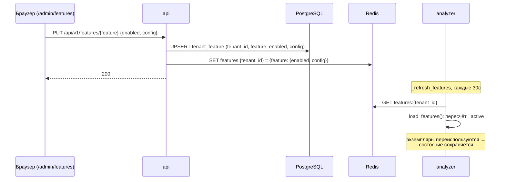
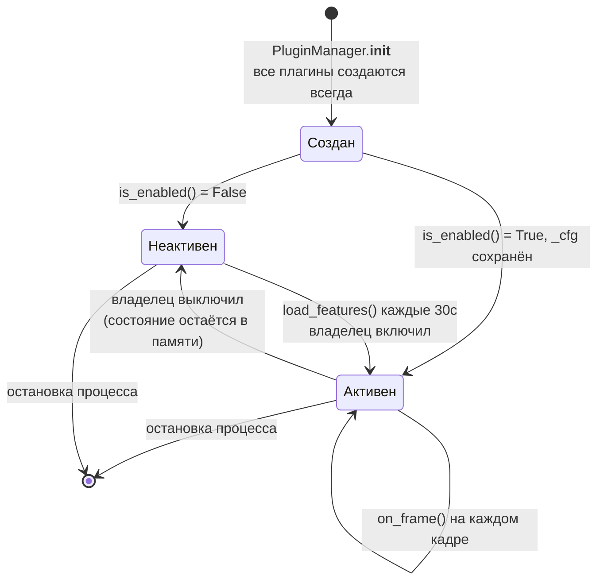
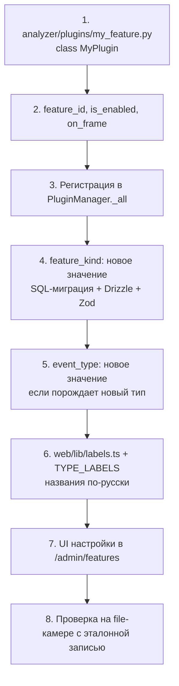

# 07. Система плагинов

**Статус документа:** актуален на 2026-07-16
**Аудитория:** инженеры компьютерного зрения, архитекторы, будущие разработчики отраслевых модулей
**Связанные документы:** [01_SYSTEM_ARCHITECTURE.md](01_SYSTEM_ARCHITECTURE.md), [06_AI_ENGINE.md](06_AI_ENGINE.md), [15_PVZ_MODULES.md](15_PVZ_MODULES.md), [14_FACTORY_MODULES.md](14_FACTORY_MODULES.md), [08_RULE_ENGINE.md](08_RULE_ENGINE.md)

---

## 1. Назначение документа

Документ описывает механизм расширения платформы отраслевой логикой: контракт плагина, жизненный цикл, управление включением, изоляцию отказов, а также план развития до полноценного SDK и маркетплейса.

Важное разграничение, которое следует установить сразу: **сегодняшние «плагины» — это не плагины в смысле динамически загружаемых сторонних модулей.** Это классы в кодовой базе платформы, включаемые конфигурацией. Раздел 9 описывает, что требуется, чтобы они стали настоящими плагинами, и почему этого пока не сделано.

---

## 2. Зачем нужен слой плагинов

Долгосрочная цель платформы ([00_VISION.md](00_VISION.md), 12): ядро поставляем мы (приём видео, детекция, трекинг, идентичность, зоны, события, правила, доставка), отраслевую экспертизу — плагины.

Граница между ядром и плагином проходит по вопросу: **«меняется ли это от отрасли?»**

| Принадлежит ядру | Принадлежит плагину |
|---|---|
| Как получить кадр из RTSP | Что считать нарушением выкладки |
| Как найти человека на кадре | Сколько людей — это скопление |
| Как связать человека между кадрами | Когда взаимодействие у стойки — это перепаковка |
| Как понять, что человек в полигоне | Как измерять OEE |
| Как доставить уведомление | Что такое «правильно надетая каска» |

Ядро не должно знать слово «ПВЗ». Плагин не должен знать слово «RTSP».

---

## 3. Контракт плагина

### 3.1. Интерфейс

`analyzer/plugins/base.py`:

```python
@runtime_checkable
class FeaturePlugin(Protocol):
    """Per-frame feature detector. One instance per worker; plugins own their
    own state and must not raise — the manager isolates failures, but a plugin
    should return [] rather than throw on bad input.

    on_frame is async so plugins may do IO (metrics, later VLM/face calls).
    Geometry-only plugins just define it async and never await.
    """

    feature_id: str

    def is_enabled(self, tenant_features: dict[str, Any]) -> bool: ...

    async def on_frame(self, ctx: FrameContext) -> list[Event]: ...
```

Контракт минимален: три элемента. Идентификатор, проверка включения, обработка кадра.

Используется `typing.Protocol`, а не абстрактный базовый класс. Это структурная типизация: плагином является всё, что имеет нужные атрибуты, — наследование не требуется. Для будущей загрузки сторонних модулей это правильный выбор: стороннему коду не нужно импортировать наш базовый класс, достаточно соблюсти форму.

### 3.2. FrameContext — вид на кадр

```python
@dataclass(slots=True)
class FrameContext:
    tenant_id: str
    site_id: str
    camera_id: str
    frame_w: int
    frame_h: int
    ts: float
    tracks: list[TrackInfo]
    zones: list[Zone]
    frame: Any = None   # сырой BGR ndarray

    def tracks_in_zone(self, zone_id: str) -> list[TrackInfo]:
        return [t for t in self.tracks if zone_id in t.zone_ids]
```

```python
@dataclass(slots=True)
class TrackInfo:
    track_id: int
    bbox: tuple[float, float, float, float]   # пиксели x1,y1,x2,y2
    center_norm: tuple[float, float]          # 0..1
    confidence: float
    zone_ids: frozenset[str] = frozenset()    # активные зоны, содержащие центр
    global_id: str | None = None              # None, когда reid выключен
    staff: bool = False
    reid_pending: bool = False
```

### 3.3. Ключевое решение: кадр целиком, а не трек

Исходный замысел в `CLAUDE.md` предполагал потрековый интерфейс:

```python
def on_track_event(self, frame, track, zone_context, camera_id, tenant_id) -> list[Event]
```

Реализация отклонилась осознанно и, как показала практика, к лучшему.

Обоснование: **большинство содержательных признаков не выводятся из одного трека.**

| Плагин | Что требуется | Возможно потреково? |
|---|---|---|
| `crowd` | Число людей в кадре одновременно | **Нет** |
| `counter` | Все присутствующие для подсчёта занятости | **Нет** |
| `shelf` | Пиксели области полки + все треки для проверки перекрытия | **Нет** |
| `repack` | Трек в зоне + опционально «есть ли второй человек» | Частично |

Три плагина из четырёх потрековым интерфейсом реализовать нельзя. Плагин, получающий вид на весь кадр, может вести себя потреково (просто пройти циклом по `ctx.tracks`), обратное неверно.

Это пример, когда реализация обоснованно расходится с замыслом; замысел в `CLAUDE.md` следует считать устаревшим.

### 3.4. Асинхронность

`on_frame` объявлен `async`, хотя три плагина из четырёх не выполняют операций ввода-вывода. Обоснование зафиксировано в docstring: плагины могут понадобиться для метрик, вызовов VLM или распознавания лиц. Геометрические плагины просто объявляют метод асинхронным и никогда не используют `await`.

Решение верное: сделать интерфейс асинхронным потом — значит переписать всех потребителей.

Риск, вытекающий отсюда: плагин, выполняющий долгий `await`, **задерживает обработку кадра для своей камеры** — `dispatch` вызывает плагины последовательно. Плагин с сетевым вызовом на каждом кадре остановит конвейер камеры.

*Правило:* плагин не имеет права выполнять неограниченный по времени ввод-вывод в `on_frame`. Долгие операции — через очередь (положить задание, вернуть `[]`), как это делает `IdentityManager` с кропами и зачислением лиц.

### 3.5. Возврат событий, а не побочные эффекты

Плагин возвращает `list[Event]` и не публикует их сам. Публикацию выполняет вызывающий код:

```python
plugin_events = await self.plugins.dispatch(ctx)
if plugin_events:
    await self.zones.emit(plugin_events)
```

Обоснование: плагин остаётся чистой функцией от контекста, не знает про Redis, имя стрима, формат сообщения. Его можно тестировать без инфраструктуры. Изменение транспорта событий не затронет ни один плагин.

Исключение: `CounterPlugin` получает Redis в конструктор и пишет метрики напрямую, возвращая `[]`. Разбор — в 5.2.

---

## 4. Диспетчер

### 4.1. Реализация

`analyzer/plugins/registry.py`:

```python
class PluginManager:
    def __init__(self, settings: Settings, redis: aioredis.Redis) -> None:
        self._all: list[FeaturePlugin] = [
            CrowdPlugin(settings),
            CounterPlugin(settings, redis),
            RepackPlugin(settings),
            ShelfPlugin(settings),
        ]
        self._active: list[FeaturePlugin] = []

    async def load_features(self) -> None:
        raw = await self.redis.get(f"features:{self.settings.tenant_id}")
        feats: dict[str, Any] = json.loads(raw) if raw else {}
        for fid in self.settings.enabled_plugin_ids():
            feats.setdefault(fid, {"enabled": True, "config": {}})
        self._active = [p for p in self._all if p.is_enabled(feats)]
        logger.info("plugins active: %s", [p.feature_id for p in self._active] or "none")

    async def dispatch(self, ctx: FrameContext) -> list[Event]:
        out: list[Event] = []
        for plugin in self._active:
            try:
                out.extend(await plugin.on_frame(ctx))
            except Exception:  # noqa: BLE001 — one plugin must not kill the frame
                logger.exception("plugin %s failed", plugin.feature_id)
        return out
```

Реестр — статический список в конструкторе. Все плагины создаются всегда; включение решает, какие попадут в `_active`.

### 4.2. Изоляция отказов

`try/except` вокруг каждого вызова — реализация принципа 6.2 из [00_VISION.md](00_VISION.md). Исключение в одном плагине:

- не прерывает обработку кадра;
- не затрагивает другие плагины;
- не затрагивает другие камеры;
- логируется с полной трассировкой.

Оговорка в docstring существенна: «the manager isolates failures, but a plugin should return `[]` rather than throw on bad input». Перехват — страховочная сетка, а не проектная модель обработки ошибок. Плагин, бросающий исключение на каждом кадре, будет работать — и засыпать журнал трассировками, съедая CPU на их формирование.

### 4.3. Ограничение изоляции

Изолируются **исключения**, но не:

| Проблема | Последствие |
|---|---|
| Бесконечный цикл | Задача камеры зависает навсегда |
| Долгий `await` | Задержка кадров для этой камеры |
| Утечка памяти | Рост процесса; в пределе OOM всего анализатора |
| Потребление CPU | Замедление всех камер тенанта |
| Порча `ctx` | Плагины получают один и тот же объект — см. 4.4 |

Для собственных плагинов это приемлемо: код наш, ревью наше. Для сторонних — недопустимо. Раздел 9.

### 4.4. Общий изменяемый контекст

`FrameContext` передаётся всем плагинам **по ссылке**. Плагин, изменивший `ctx.tracks`, повлияет на следующие плагины в списке.

Сейчас все плагины ведут себя корректно (только читают), но контракт этого не запрещает и не проверяет.

*Рекомендация:* зафиксировать в контракте требование неизменяемости `ctx`. Технически: `tracks` и `zones` — списки, `TrackInfo` — `dataclass(slots=True)` без заморозки. Минимальный шаг — передавать `tuple` вместо `list` и объявить датаклассы `frozen=True`. Стоимость — минуты, устраняет класс ошибок, диагностика которых крайне тяжела (поведение плагина зависит от порядка в реестре).

### 4.5. Порядок вызова

Определяется порядком в `_all`: crowd → counter → repack → shelf. Зависимостей между плагинами нет, поэтому порядок сегодня не значим.

*Правило:* межплагинные зависимости запрещены. Плагин, требующий, чтобы другой отработал раньше, — это признак того, что общая логика должна быть в ядре, а не в плагине.

---

## 5. Реализованные плагины

Сводка. Подробности алгоритмов — в [15_PVZ_MODULES.md](15_PVZ_MODULES.md).

| `feature_id` | Класс | Порождает | Требует кадр | Требует зоны |
|---|---|---|---|---|
| `crowd` | `CrowdPlugin` | `crowd` | Нет | Опционально |
| `counter` | `CounterPlugin` | **Ничего** (метрики в Redis) | Нет | Опционально (`kind=counter`) |
| `repack` | `RepackPlugin` | `repack_event` | Нет | Да (`kind=desk`) |
| `shelf` | `ShelfPlugin` | `shelf_violation` | **Да** | Да (`kind=shelf`) |

Плюс `reid` — модуль, не являющийся плагином (см. 5.3).

### 5.1. Общий шаблон `is_enabled`

Все четыре плагина реализуют его одинаково:

```python
def is_enabled(self, tenant_features: dict[str, Any]) -> bool:
    feat = tenant_features.get(self.feature_id)
    if not feat or not feat.get("enabled"):
        return False
    self._cfg = feat.get("config") or {}
    return True
```

Метод делает **две вещи**: отвечает на вопрос о включении и **сохраняет конфигурацию как побочный эффект**. Название обещает предикат, поведение — инициализацию.

Практическое следствие полезно: `load_features()` вызывается каждые 30 секунд, поэтому изменение конфигурации в админке применяется без перезапуска, а экземпляр плагина переиспользуется — накопленное состояние (визиты, эталоны полок) сохраняется.

Но реализация хрупкая: если плагин выключен, `self._cfg` не обновляется и хранит старое значение. Сейчас это безвредно (выключенный плагин не вызывается), однако предикат с побочным эффектом — ловушка для следующего разработчика.

*Рекомендация:* разделить на `is_enabled(feats) -> bool` (чистый) и `configure(cfg) -> None` (явный). Диспетчер вызывает оба. Стоимость — минуты, устраняет неожиданность в контракте, который увидят авторы будущих плагинов.

### 5.2. `CounterPlugin`: исключение из правил

Единственный плагин, который:
1. получает Redis в конструктор;
2. **никогда не возвращает событий** — всегда `[]`;
3. пишет метрики напрямую (`occupancy:{tenant_id}`, `visitors:{tenant_id}`).

Обоснование: занятость и число посетителей — это **метрики**, а не события. Событие «сейчас в кадре 3 человека» на каждом кадре создало бы миллионы бесполезных строк в гипертаблице.

Метрики пишутся с ограничением частоты (`interval_seconds`, по умолчанию 60): раз в минуту на камеру для занятости и раз в минуту на площадку для посетителей.

Однако это же — **нарушение принципа 3.5** (плагин не должен иметь побочных эффектов). Плагин знает про Redis и формат ключей.

*Оценка:* нарушение оправданное, но оно указывает на пробел в контракте. Контракт умеет только «вернуть событие» и не умеет «записать метрику». Это тот самый пробел, который придётся закрыть при появлении сторонних плагинов: давать им Redis нельзя.

*Рекомендация:* расширить контракт вторым каналом вывода:

```python
@dataclass(slots=True)
class PluginOutput:
    events: list[Event] = field(default_factory=list)
    metrics: list[Metric] = field(default_factory=list)   # {name, labels, value}

async def on_frame(self, ctx: FrameContext) -> PluginOutput: ...
```

Тогда `CounterPlugin` перестаёт быть исключением, а метрики получают единое место обработки — и это же напрямую пригодится для Prometheus ([12_MONITORING.md](12_MONITORING.md)). Одно изменение закрывает две задачи.

### 5.3. `reid` — модуль, а не плагин

`reid` присутствует в перечислении `feature_kind` и настраивается в `/admin/features` наравне с плагинами, но `FeaturePlugin` не реализует: это `IdentityManager`, вызываемый напрямую из `AnalyzerWorker._process`.

Обоснование корректно: Re-ID должен отработать **до** плагинов и до зонного движка, потому что его результат (`global_id`, `staff`) — это входные данные для них. Плагин, выполняющийся в `dispatch`, опоздал бы: `TrackInfo` уже сформирован.

Итог: `reid` — часть ядра, управляемая как модуль. Расхождение уместно, но его следует знать: одинаковый интерфейс управления не означает одинаковой природы.

---

## 6. Управление включением

### 6.1. Путь конфигурации



Источник истины — PostgreSQL (`tenant_feature`), Redis — проекция. Анализатор в PostgreSQL не ходит (решение A-03).

Задержка применения — до 30 секунд. Приемлемо: переключение модуля не является операцией реального времени.

### 6.2. Модель данных

```sql
CREATE TABLE tenant_feature (
  tenant_id uuid NOT NULL REFERENCES tenant(id) ON DELETE CASCADE,
  feature   feature_kind NOT NULL,
  enabled   boolean NOT NULL DEFAULT false,
  config    jsonb NOT NULL DEFAULT '{}',
  PRIMARY KEY (tenant_id, feature)
);
```

`feature_kind`: `ppe`, `face_id`, `shelf`, `repack`, `queue`, `crowd`, `counter`, `reid`.

Расхождение между перечислением и реализацией:

| Значение | Плагин | Состояние |
|---|---|---|
| `crowd` | `CrowdPlugin` | Реализован |
| `counter` | `CounterPlugin` | Реализован |
| `repack` | `RepackPlugin` | Реализован |
| `shelf` | `ShelfPlugin` | Реализован |
| `reid` | `IdentityManager` | Реализован как модуль ядра |
| `queue` | **Нет** | Логика в `ZoneEngine` (`kind ∈ DWELL_KINDS` → `queue_alert`) |
| `ppe` | **Нет** | Не реализовано |
| `face_id` | **Нет** | Реализовано внутри `reid`, отдельного модуля нет |

Три значения перечисления не соответствуют ничему. Владелец может включить `ppe` в интерфейсе и не получить ничего — без объяснения.

*Рекомендация:* либо реализовать, либо убрать из интерфейса и пометить в перечислении как зарезервированные. Переключатель, который ничего не делает, — это обещание, которое продукт не выполняет.

Отдельно `queue`: логика очереди живёт в `ZoneEngine`, а не в плагине, и включается не флагом модуля, а созданием зоны `kind=queue` с параметром `dwell_seconds`. Значение `queue` в `feature_kind` при этом не влияет ни на что. Это следует либо исправить (перенести очередь в плагин), либо задокументировать в интерфейсе.

### 6.3. Dev-переопределение

```python
for fid in self.settings.enabled_plugin_ids():
    feats.setdefault(fid, {"enabled": True, "config": {}})
```

`ENABLED_PLUGINS=crowd,counter` в окружении принудительно включает модули без участия БД и API. Назначение — локальная разработка. В продуктиве пусто.

Существенно, что использован `setdefault`, а не присваивание: конфигурация из Redis **имеет приоритет**. Переменная окружения только добавляет отсутствующее. Это верно — иначе dev-переменная, случайно попавшая в прод, переопределила бы настройки владельца.

### 6.4. Модули как продуктовая упаковка

`tenant_feature` — техническая основа тарификации ([00_VISION.md](00_VISION.md), 9.1). Тариф есть набор включённых `feature`. Механизм реализован, продуктовая упаковка на него ещё не наложена.

---

## 7. Жизненный цикл плагина

### 7.1. Текущий



Отсутствующие фазы:

| Фаза | Есть? | Последствие отсутствия |
|---|---|---|
| Инициализация (загрузка моделей, ресурсов) | **Нет** | Плагину с моделью придётся загружать её в `__init__` — то есть всегда, даже если он выключен |
| Освобождение ресурсов | **Нет** | Выключенный плагин продолжает держать память |
| Сброс состояния | **Нет** | Выключение и включение сохраняют старое состояние |
| Проверка работоспособности | **Нет** | Неизвестно, работает ли плагин |
| Версионирование | **Нет** | Нет способа понять, какая версия логики работает |

Пункт про инициализацию станет блокером при первом же плагине с нейросетью (СИЗ, поза): загрузка модели в `__init__` означает потребление VRAM всеми тенантами, включая тех, у кого модуль выключен.

*Рекомендация:* добавить фазы в контракт до появления первого тяжёлого плагина:

```python
class FeaturePlugin(Protocol):
    feature_id: str
    version: str

    async def setup(self, cfg: dict[str, Any]) -> None: ...     # при включении
    async def teardown(self) -> None: ...                       # при выключении
    async def on_frame(self, ctx: FrameContext) -> PluginOutput: ...
    def health(self) -> PluginHealth: ...                       # для мониторинга
```

Диспетчер вызывает `setup` при переходе в активное состояние и `teardown` при выходе. Это устраняет сразу три пробела и не ломает существующие плагины (методы могут быть пустыми).

### 7.2. Состояние плагина

Каждый плагин владеет собственным состоянием в памяти:

| Плагин | Состояние | Ключ |
|---|---|---|
| `crowd` | Время последнего алерта | `camera_id` |
| `counter` | Множество увиденных за день, время сброса | `site_id`, `camera_id` |
| `repack` | Визиты | `(camera_id, (track_id, zone_id))` |
| `shelf` | Эталон, флаг перекрытия | `(camera_id, zone_id)` |

**Последствия того, что состояние в памяти:**

1. Перезапуск анализатора обнуляет состояние. Для `shelf` это означает переустановку эталона — приемлемо. Для `counter` — обнуление счётчика посетителей за день. Последнее заметно: после обновления платформы владелец увидит, что посетители за день начали считаться заново.
2. Плагин привязан к процессу, то есть к тенанту. Горизонтальное масштабирование анализатора потребует решения вопроса состояния.
3. Состояние растёт. `RepackPlugin` очищает завершённые визиты, `CounterPlugin` — сбрасывает множество при смене суток. `ShelfPlugin` хранит по записи на зону — ограничено. Утечек нет, но это следствие аккуратности авторов, а не механизма.

*Рекомендация:* для `CounterPlugin` перенести множество увиденных в Redis (`SET` с TTL до конца суток). Обоснование: это единственное состояние, обнуление которого видно владельцу как ошибка данных. Остальные состояния восстанавливаются сами за секунды.

---

## 8. Написание плагина

Пошагово, для будущего инженера.

### 8.1. Порядок



Шаги 4–6 совершаются в трёх-четырёх местах одновременно; пропуск любого даёт либо ошибку валидации, либо английское слово в русском интерфейсе (нарушение решения V-06).

### 8.2. Шаблон

```python
from __future__ import annotations

from dataclasses import dataclass
from typing import Any

from analyzer.config import Settings
from analyzer.plugins.base import FrameContext
from analyzer.zones.engine import Event


@dataclass(slots=True)
class _State:
    """Состояние на (камера, зона) или (камера, трек) — по смыслу задачи."""
    last_seen: float
    emitted: bool = False


class MyPlugin:
    """Одна фраза: что детектирует.

    config:
      threshold  float  что означает и умолчание
    """

    feature_id = "my_feature"

    def __init__(self, settings: Settings) -> None:
        self.settings = settings
        self._cfg: dict[str, Any] = {}
        self._state: dict[tuple[str, str], _State] = {}

    def is_enabled(self, tenant_features: dict[str, Any]) -> bool:
        feat = tenant_features.get(self.feature_id)
        if not feat or not feat.get("enabled"):
            return False
        self._cfg = feat.get("config") or {}
        return True

    async def on_frame(self, ctx: FrameContext) -> list[Event]:
        # 1. Быстрый выход, если работать не с чем
        zones = [z for z in ctx.zones if z.kind == "my_kind"]
        if not zones:
            return []

        # 2. Ограничение частоты, если проверка дорогая
        # 3. Сотрудники не считаются, если задача про посетителей
        people = [t for t in ctx.tracks if not t.staff]

        # 4. Логика
        out: list[Event] = []
        # ...

        # 5. Очистка состояния для исчезнувших субъектов
        return out
```

### 8.3. Обязательные правила

| Правило | Причина |
|---|---|
| Не бросать исключений | Диспетчер перехватит, но `[]` лучше трассировки на каждом кадре |
| Быстрый выход в начале | `on_frame` вызывается на каждом кадре каждой камеры; выключенная логика не должна стоить ничего |
| Ограничение частоты для дорогих проверок | Образец: `ShelfPlugin.check_interval` (1с), `CounterPlugin.interval_seconds` (60с) |
| Кулдаун для алертов | Иначе флуд. Образец: `CrowdPlugin._last_alert` по камере |
| Фильтровать `staff` | Сотрудник не посетитель и не нарушитель ([00_VISION.md](00_VISION.md), 11.2) |
| Пропускать `reid_pending` при подсчёте уникальных | Иначе двойной счёт (инцидент 5.4 в [06_AI_ENGINE.md](06_AI_ENGINE.md)) |
| Очищать состояние | Утечка в долгоживущем процессе |
| Не изменять `ctx` | Общий объект для всех плагинов |
| Не выполнять долгий ввод-вывод | Блокирует конвейер камеры |
| Все пороги — в `config`, не в коде | Настройка без релиза |
| Документировать `config` в docstring | Единственное место, где параметры описаны |

### 8.4. Что должно быть в ядре, а не в плагине

Признаки того, что логика написана не на своём уровне:

| Признак | Куда переносить |
|---|---|
| Плагин нуждается в результате другого плагина | В ядро |
| Логика одинакова для всех отраслей | В ядро |
| Плагину нужен доступ к Redis или БД | Расширить контракт, не давать доступ |
| Плагин должен работать раньше геофенсинга | В ядро (образец: `reid`) |
| Плагин порождает метрику, а не событие | Расширить контракт (5.2) |

---

## 9. Путь к настоящим плагинам

### 9.1. Разрыв

| Свойство | Сейчас | Требуется для сторонних плагинов |
|---|---|---|
| Загрузка | Статический список в коде | Динамическая по манифесту |
| Распространение | В составе репозитория | Пакет |
| Изоляция | `try/except` вокруг вызова | Процесс или песочница |
| Ресурсы | Не ограничены | Лимиты CPU, памяти, времени |
| Версионирование | Нет | Версия плагина и версия API |
| Зависимости | Общие с платформой | Свои, изолированные |
| Права | Полный доступ к процессу | Явные разрешения |
| Обновление | Пересборка образа | Установка пакета |
| Проверка | Ревью в репозитории | Подпись, модерация |

### 9.2. Почему это ещё не сделано и правильно

Настоящая система плагинов имеет смысл тогда, когда есть **кому** писать плагины. Сегодня плагины пишет та же команда, что и ядро; динамическая загрузка не дала бы ничего, кроме сложности.

Признак готовности: **внешняя команда хочет написать модуль и не должна получить доступ к нашему коду.** До этого момента статический реестр — правильное решение.

Однако решения, принимаемые сейчас, определяют, будет ли переход возможен. Раздел 8.3 и рекомендации 4.4, 5.2, 7.1 — это подготовка контракта к тому моменту.

### 9.3. Варианты изоляции

Когда придёт время, выбор будет между тремя моделями.

| Модель | Как | Плюсы | Минусы |
|---|---|---|---|
| Модули Python в процессе | `importlib`, точки входа | Просто; кадр передаётся без копирования | **Нет изоляции**: сторонний код в нашем процессе, с GIL, с нашими зависимостями |
| Отдельный процесс на плагин | gRPC/IPC, кадр через разделяемую память | Настоящая изоляция, лимиты ресурсов, свои зависимости | Накладные расходы на передачу кадра; сложность |
| WASM | Плагин компилируется в WebAssembly | Песочница по построению, лимиты, кроссплатформенность | Нет доступа к OpenCV, PyTorch; неприменимо к CV-плагинам |

*Рекомендация:* **отдельный процесс с передачей кадра через разделяемую память.** Обоснование:
- Модули в процессе непригодны: сторонний плагин, установивший свою версию numpy, сломает YOLO. Это не гипотеза, а типовой отказ экосистемы Python.
- WASM неприменим: CV-плагину нужны OpenCV и, вероятно, ONNX Runtime.
- Разделяемая память устраняет главный аргумент против отдельного процесса — стоимость передачи кадра. Кадр 640×360 BGR — около 690 КБ; копирование через сокет на каждом кадре недопустимо, размещение в `/dev/shm` — бесплатно.

Архитектурно это тот же контракт: плагин получает `FrameContext` (где `frame` — ссылка на разделяемый буфер) и возвращает события. Смена транспорта не меняет форму.

### 9.4. Манифест плагина

Гипотеза формата, для обсуждения при реализации:

```yaml
# plugin.yaml
id: forklift_safety
name: Безопасность погрузчиков
version: 1.2.0
api_version: "1"          # версия контракта FeaturePlugin
vendor: ООО «Пример»
entry: forklift.plugin:ForkliftPlugin

requires:
  detector_classes: [0, 7]      # человек, грузовик — плагин заявляет потребности
  zone_kinds: [forbidden, aisle]
  frame: true                   # нужен сырой кадр
  models:
    - path: models/forklift.onnx
      sha256: ...

emits:
  - type: forklift_violation
    severity: [warn, critical]

config_schema:                  # для генерации UI настроек
  min_distance_m:
    type: number
    default: 2.0
    label: Минимальная дистанция, м

limits:
  memory_mb: 512
  cpu_percent: 25
  frame_timeout_ms: 100
```

Ключевые идеи: плагин **декларирует** потребности (какие классы детекции, нужен ли кадр, какие модели) и ограничения. Ядро на основе манифеста настраивает детектор, генерирует интерфейс настроек и применяет лимиты. Это устраняет главную проблему сегодняшнего контракта: платформа не знает, что плагину нужно, пока он не выполнится.

### 9.5. Маркетплейс

**[План, горизонт — стадия 4]** ([00_VISION.md](00_VISION.md), 10).

Предусловия, без которых обсуждать бессмысленно:
1. Стабильный версионированный контракт.
2. Изоляция (9.3).
3. SDK и документация для внешних разработчиков.
4. Механизм установки без пересборки.
5. Модерация и подпись пакетов.
6. Расчёты с авторами.

Вопросы, требующие ответа до начала:

| Вопрос | Почему важен |
|---|---|
| Кто отвечает за ложный алерт стороннего плагина? | Клиент придёт к нам, а не к автору плагина |
| Кто отвечает за пропущенное нарушение? | Тем более, если речь о безопасности |
| Как проверять качество модели плагина? | «Работает на данных автора» ≠ «работает у клиента» |
| Что делать с плагином, автор которого исчез? | Клиент зависит от кода, который никто не поддерживает |

*Рекомендация:* маркетплейс — не первый шаг к экосистеме. Первый шаг — **партнёрская модель**: 2–3 отраслевых партнёра пишут плагины по нашему SDK, мы проверяем и включаем в поставку, отвечаем за качество сами. Это даёт проверку контракта в реальных условиях без правовых и репутационных рисков открытого маркетплейса. Открывать каталог имеет смысл, когда контракт выдержал 5–10 внешних плагинов.

---

## 10. Расширение платформы вне плагинов

Плагин — не единственная точка расширения. Полная карта:

| Что добавляется | Где | Требует изменения ядра |
|---|---|---|
| Отраслевая логика по кадру | `FeaturePlugin` | Нет (регистрация в реестре) |
| Новый тип зоны | `zone_kind` + `ZoneEngine` | Да |
| Новый тип события | `event_type` (3 места) + метки | Да |
| Новый канал уведомлений | `alert_rule.channels` + отправитель | Да |
| Новый источник видео | `VideoSource` | Минимально |
| Новый эмбеддер Re-ID | `make_embedder()` | Нет |
| Новый детектор | **Нет точки расширения** | Да — см. [06_AI_ENGINE.md](06_AI_ENGINE.md), 10.3 |
| Новая настройка сервера | `SETTING_DEFS` | Нет |
| Новое поле события | `meta jsonb` | **Нет** |

`meta jsonb` — недооценённая точка расширения: новые данные события добавляются без миграции, без изменения схемы, без согласования. Именно так появились `dwell_sec`, `global_id`, `staff`, `count`, `threshold`, `change`.

Цена: `meta` не типизирована и не валидируется. Что в ней лежит — известно только из кода производителя и таблицы в [01_SYSTEM_ARCHITECTURE.md](01_SYSTEM_ARCHITECTURE.md), 9.3.

*Рекомендация:* при появлении внешних потребителей API (SDK, интеграции) описать `meta` схемами Zod по типам событий — дискриминированное объединение по полю `type`. Пока потребитель один (наш UI), текущее состояние приемлемо.

---

## 11. Реестр решений

| № | Решение | Обоснование | Альтернатива и почему отвергнута |
|---|---|---|---|
| P-01 | `on_frame(ctx)` вместо `on_track_event(track)` | 3 плагина из 4 требуют вида на весь кадр | Потрековый: `crowd`, `counter`, `shelf` нереализуемы |
| P-02 | `Protocol` вместо абстрактного класса | Структурная типизация; сторонний код не импортирует наш базовый класс | ABC: обязательное наследование |
| P-03 | `on_frame` асинхронный, хотя ввода-вывода почти нет | Задел под VLM, метрики, лица | Синхронный: переписывание потребителей потом |
| P-04 | Плагин возвращает события, не публикует | Чистая функция; тестируется без Redis | Публикация: связность с транспортом |
| P-05 | `try/except` вокруг каждого плагина | Один плагин не роняет кадр | Без перехвата: ошибка автора останавливает камеру |
| P-06 | Статический реестр вместо динамической загрузки | Нет внешних авторов — нет задачи | Динамическая: сложность без пользы |
| P-07 | Плагины создаются всегда, включение решает вызов | Простота; переключение без перезапуска | Ленивое создание: усложняет `load_features` |
| P-08 | Экземпляры переиспользуются при перечитывании флагов | Состояние (эталоны, визиты) сохраняется | Пересоздание: сброс эталонов каждые 30с |
| P-09 | `ENABLED_PLUGINS` через `setdefault` | Конфигурация тенанта имеет приоритет | Присваивание: dev-переменная переопределит прод |
| P-10 | `reid` — модуль ядра, не плагин | Его результат — вход для плагинов и зон | Плагин: опоздал бы к формированию `TrackInfo` |
| P-11 | `counter` пишет метрики, а не события | События на каждом кадре = миллионы строк | События: гипертаблица засоряется |

---

## 12. Долг системы плагинов

| № | Проблема | Влияние | Приоритет |
|---|---|---|---|
| P-D-01 | `ppe`, `face_id`, `queue` в перечислении без реализации | Переключатель в интерфейсе ничего не делает | **Высокий** |
| P-D-02 | Нет фаз `setup`/`teardown` | Блокер для плагина с моделью (СИЗ, поза) | **Высокий** |
| P-D-03 | Контракт не умеет метрики; `counter` — исключение | Пробел проявится при внешних плагинах | Средний |
| P-D-04 | `is_enabled` — предикат с побочным эффектом | Ловушка для авторов будущих плагинов | Средний |
| P-D-05 | `ctx` изменяемый и общий | Скрытая связь между плагинами | Средний |
| P-D-06 | Состояние `counter` в памяти | Перезапуск обнуляет посетителей за день — видно владельцу | Средний |
| P-D-07 | Нет версионирования плагинов | Неизвестно, какая логика работает | Низкий |
| P-D-08 | Нет проверки работоспособности | Неизвестно, работает ли модуль | Низкий |
| P-D-09 | Нет изоляции ресурсов | Блокер сторонних плагинов | Низкий (пока авторы свои) |
| P-D-10 | `meta` не типизирована | Проявится при внешних потребителях API | Низкий |

---

## 13. Расширение по [REVIEW_BOARD.md](REVIEW_BOARD.md)

**Статус: [План].** Дополнения по итогам ревью (B-15, B-57).

### 13.1. Квоты и изоляция ресурсов плагина

При планке и особенно при сторонних плагинах ([9](#9-путь-к-настоящим-плагинам)) плагин обязан иметь лимиты ресурсов, иначе он — переборка, которой нет ([11](11_HIGH_AVAILABILITY.md), 10.2). Манифест плагина (9.4) декларирует `limits` (память, CPU, таймаут на кадр). Диспетчер применяет: плагин, превысивший таймаут кадра, пропускается с метрикой, а не тормозит конвейер камеры.

Это усиливает пункт 4.3 (изолируются исключения, но не время/память/CPU): при планке изоляция времени становится обязательной, а не желательной.

### 13.2. Феатур-флаги на базе tenant_feature

Механизм включения модулей (раздел 6) — готовая основа феатур-флагов платформы ([03](03_DEPLOYMENT.md), 11.4). Тариф = набор `feature`; феатур-флаг = тот же механизм для функций, не проданных как модуль. Канареечное включение по тенантам, быстрый откат функции без отката кода.

### 13.3. Метрики плагина

Расширение контракта каналом метрик (5.2) прямо питает наблюдаемость: `PluginOutput.metrics` → `/metrics` Prometheus ([12](12_MONITORING.md)). Каждый плагин экспортирует, сколько событий породил, сколько кадров обработал, время на кадр — что закрывает контроль дрейфа ([06](06_AI_ENGINE.md), 14.6) для плагинных детекторов.

### 13.4. Дополнение к реестру решений и долгу

| № | Решение | Обоснование |
|---|---|---|
| P-12 | Плагин декларирует лимиты ресурсов; превышение таймаута = пропуск | Плагин без лимитов — отсутствующая переборка |
| P-13 | tenant_feature — основа феатур-флагов платформы | Механизм уже есть, расширить на функции |

| № | Долг | Приоритет |
|---|---|---|
| P-D-11 | Нет лимитов ресурсов плагина (кроме isolation исключений) | Средний (высокий при сторонних плагинах) |
