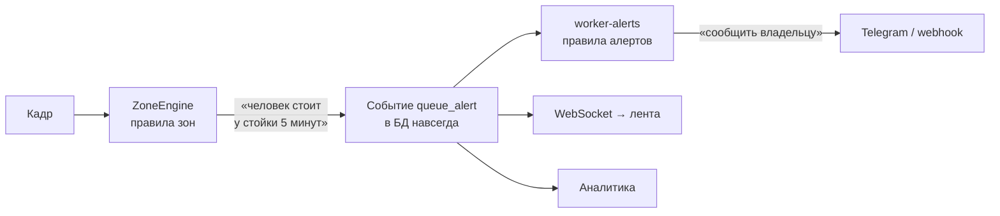
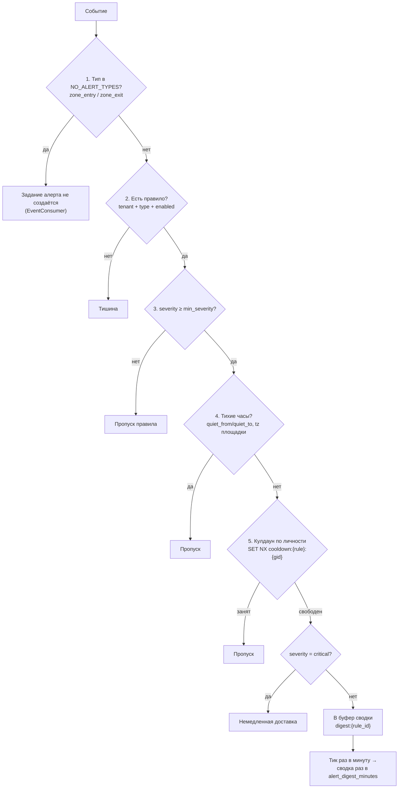

# 08. Движок правил

**Статус документа:** актуален на 2026-07-16
**Аудитория:** backend-инженеры, продуктовые менеджеры, инженеры сопровождения
**Связанные документы:** [01_SYSTEM_ARCHITECTURE.md](01_SYSTEM_ARCHITECTURE.md), [09_WORKFLOW_ENGINE.md](09_WORKFLOW_ENGINE.md), [07_PLUGIN_SYSTEM.md](07_PLUGIN_SYSTEM.md), [10_DATABASE.md](10_DATABASE.md)

---

## 1. Назначение документа

Документ описывает подсистему принятия решения о реагировании: как событие превращается (или не превращается) в уведомление. Охватывает правила, условия, временные окна, расписания, действия, каналы доставки и механизмы подавления шума.

Раздел 4 — центральный: он описывает анти-флуд, который является не оптимизацией, а условием пригодности продукта.

---

## 2. Два уровня правил

Терминологическая ясность необходима сразу: в платформе **два независимых механизма правил**, и их путают.

| Уровень | Где | Что решает | Единица настройки |
|---|---|---|---|
| **Правила зон** | `analyzer/zones/engine.py` | Произошло ли событие | `zone.kind`, `zone.config`, `zone.schedule` |
| **Правила алертов** | `api/src/workers/alerts.worker.ts` | Нужно ли о нём сообщить | `alert_rule` |



Разделение принципиально: **событие фиксируется всегда, уведомление — только если правило так решило.** Событие — это факт, уведомление — это решение побеспокоить человека. Отключение всех правил алертов не влияет на аналитику: данные продолжают собираться.

Это отличает ViziAI от систем, где «правило» одновременно определяет и детекцию, и реакцию: там отключение уведомления означает потерю данных.

---

## 3. Уровень 1: правила зон

### 3.1. Модель данных

```sql
CREATE TABLE zone (
  id        uuid PRIMARY KEY,
  camera_id uuid NOT NULL REFERENCES camera(id) ON DELETE CASCADE,
  name      text NOT NULL,
  polygon   jsonb NOT NULL,               -- [[x,y],...] нормализованные 0..1
  kind      zone_kind NOT NULL,
  config    jsonb NOT NULL DEFAULT '{}',
  active    boolean NOT NULL DEFAULT true,
  schedule  jsonb NOT NULL DEFAULT '{}'
);
```

`zone_kind`: `counter`, `desk`, `shelf`, `queue`, `forbidden`, `required_ppe`.

Полигон нормализован (0..1) — смена разрешения камеры не ломает зону (решение A-15).

### 3.2. Тип зоны определяет логику

```python
DWELL_KINDS = {"counter", "desk", "queue"}                  # + queue_alert по dwell
ENTRY_EXIT_KINDS = {"counter", "desk", "queue", "shelf"}    # zone_entry / zone_exit
# forbidden → zone_violation немедленно
# required_ppe → нет обработчика
```

| `kind` | Вход/выход | Dwell → алерт | Немедленный алерт | Используется плагином |
|---|---|---|---|---|
| `counter` | Да | `queue_alert` | Нет | `counter` (подсчёт занятости) |
| `desk` | Да | `queue_alert` | Нет | `repack` |
| `queue` | Да | `queue_alert` | Нет | — |
| `shelf` | Да | Нет | Нет | `shelf` |
| `forbidden` | Нет | Нет | **`zone_violation` (critical)** | — |
| `required_ppe` | **Нет** | Нет | Нет | **Нет обработчика** |

`required_ppe` — мёртвое значение перечисления. Зона такого типа не порождает ничего: она отсутствует и в `ENTRY_EXIT_KINDS`, и в `DWELL_KINDS`, и в ветке `forbidden`. Владелец может её создать и не получить никакого поведения. См. [07_PLUGIN_SYSTEM.md](07_PLUGIN_SYSTEM.md), 6.2 — та же проблема с `feature_kind.ppe`.

### 3.3. Параметры `zone.config`

| Параметр | Умолчание | Применяется к | Смысл |
|---|---|---|---|
| `dwell_seconds` | не задан | `DWELL_KINDS` | Порог `queue_alert`. **Не задан → алерта нет** |
| `cooldown_seconds` | `default_cooldown_seconds` (60) | `DWELL_KINDS`, `forbidden` | Пауза между повторными алертами |
| `ignore_staff` | **`true`** | Все | Сотрудники невидимы для зоны |

Умолчание `ignore_staff = true` — важное решение. Оно означает, что **по умолчанию персонал исключён из всей зонной аналитики**. Сотрудник за стойкой не создаёт `zone_entry`, не накапливает dwell, не порождает `queue_alert`. Без этого зона `desk` алармила бы непрерывно: сотрудник стоит там весь день.

### 3.4. Расписание зоны

```json
{
  "active_from": "09:00",
  "active_to": "21:00",
  "all_from": "22:00",
  "all_to": "08:00"
}
```

Два независимых окна с разным смыслом:

| Окно | Смысл | Поведение вне окна |
|---|---|---|
| `active_from` / `active_to` | Когда зона работает | Состояние удаляется молча, события не порождаются |
| `all_from` / `all_to` | «Ночной режим»: алертить всех, включая сотрудников | Обычное поведение (`ignore_staff` действует) |

Реализация окна:

```python
def _in_window(hhmm: str, frm: Any, to: Any) -> bool:
    """[frm, to) window in HH:MM, may wrap midnight. Empty/equal → False."""
    if not isinstance(frm, str) or not isinstance(to, str) or not frm or not to or frm == to:
        return False
    return (frm <= hhmm < to) if frm < to else (hhmm >= frm or hhmm < to)
```

Свойства, каждое из которых существенно:

- **Полуинтервал `[frm, to)`.** Окно 09:00–21:00 включает 09:00 и исключает 21:00. Иначе два смежных окна пересекались бы в граничной минуте.
- **Переход через полночь.** `22:00 → 08:00`: если `frm > to`, условие меняется на «после начала ИЛИ до конца». Без этого ночное окно было бы невыразимо.
- **Пустые или равные значения → `false`.** Окно 09:00–09:00 не означает «круглые сутки»; оно означает «не задано». Это защита от опечатки, при которой зона молча замолчала бы навсегда.
- **Сравнение строк, а не времени.** `"09:00" <= "14:30" < "21:00"` работает благодаря лексикографическому порядку формата `HH:MM` с ведущими нулями. Дёшево и корректно — при условии, что формат соблюдён. Валидация формата на входе обязательна; **[Требует проверки]**, выполняется ли она в API.

### 3.5. Часовой пояс

Время вычисляется в часовом поясе **площадки**, не сервера и не браузера:

```python
def _local_hhmm(ts: float, tz_name: str) -> str:
    if tz_name not in _TZ_CACHE:
        try:
            _TZ_CACHE[tz_name] = ZoneInfo(tz_name)
        except Exception:  # unknown tz → UTC fallback
            _TZ_CACHE[tz_name] = None
    dt = datetime.fromtimestamp(ts, tz=_TZ_CACHE[tz_name] or timezone.utc)
    return dt.strftime("%H:%M")
```

Часовой пояс приходит из `site.timezone` → `cameras:{tenant_id}` → `CameraConfig.tz` → `TrackEvent.tz`. Кеш `_TZ_CACHE` избегает разбора имени зоны на каждом кадре.

Это критично для платформы, работающей в РФ с 11 часовыми поясами: «ночной режим 22:00–08:00» для точки во Владивостоке и в Калининграде — разное абсолютное время.

**Ловушка, зафиксированная в `PLAN.md`:** после перезапуска Redis необходимо нажать «Ресинхр Redis» в `/admin/maintenance`, иначе анализатор не получит часовые пояса и расписания зон. Симптом: расписания молча не работают. Ошибок в журнале нет.

### 3.6. Состояние по личности

```python
@staticmethod
def _subject(te: TrackEvent) -> str:
    # identity survives tracker churn and re-entries; track id is the fallback
    return te.global_id or f"trk:{te.track_id}"
```

Ключ состояния — `(camera_id, subject, zone_id)`. Субъект — **личность**, а не трек.

Значение: мерцание трекера (потеря и переприсвоение `track_id`) не создаёт ложную пару «выход + вход». Человек, чей трек распался на три фрагмента, остаётся одним субъектом с непрерывным dwell.

Запасной вариант `trk:{track_id}` действует, когда Re-ID выключен, — поведение возвращается к прежнему.

### 3.7. Полная таблица переходов

| Текущее | Условие | Действие | Событие |
|---|---|---|---|
| Нет | Вне окна `active` | Удалить состояние | — |
| Нет | `staff` и `ignore_staff` и не `night_all` | Удалить состояние | — |
| Нет | Внутри, `kind = forbidden` | Создать, `alerted = true` | `zone_violation` (critical) |
| Нет | Внутри, `kind ∈ ENTRY_EXIT_KINDS` | Создать | `zone_entry` (info) |
| Нет | Внутри, `kind = required_ppe` | Создать | **— (мёртвая ветка)** |
| Есть | Внутри, `kind ∈ DWELL_KINDS`, `dwell ≥ dwell_seconds`, кулдаун истёк | `alerted = true` | `queue_alert` (warn) |
| Есть | Внутри, `kind = forbidden`, кулдаун истёк | Обновить `last_alert_at` | `zone_violation` (critical) |
| Есть | Внутри, прочее | Обновить `last_seen_at`, `track_id` | — |
| Есть | Вне полигона, `kind ∈ ENTRY_EXIT_KINDS` | Удалить | `zone_exit` (info) с `dwell_sec` |
| Есть | Не виден > `track_lost_seconds` (5с) | Удалить (`sweep`) | `zone_exit` с `lost: true` |

### 3.8. `sweep` — синтетические выходы

Вызывается из цикла обновления зон (раз в 30с). Назначение: человек, покинувший кадр, никогда не породит события «вне полигона» — его просто перестанут видеть.

```python
def sweep(self, now: float) -> list[Event]:
    """Emit zone_exit for tracks not seen within track_lost_seconds."""
```

Без этого `zone_exit` терялся бы для всех, кто ушёл из кадра, а состояние копилось бы вечно. Событие помечается `meta.lost = true`, что отличает «ушёл из зоны» от «пропал из виду».

Следствие для аналитики: `dwell_sec` при `lost = true` — это время до последнего наблюдения, а не до фактического ухода. Оно занижено на величину до 5 секунд.

### 3.9. Ограничения уровня зон

| Ограничение | Влияние |
|---|---|
| Зона привязана к одной камере | Зона, охватываемая двумя камерами, невыразима |
| Только полигон | Нет линий пересечения (счёт входящих/выходящих по направлению) |
| Условие только по dwell | Нет «более N человек в зоне более M секунд» |
| Нет комбинации зон | «В зоне A, но не в зоне B» невыразимо |
| Нет условий по классу объекта | Только человек |

Второй пункт заслуживает внимания: **линия пересечения** — базовый примитив любого VMS (Milestone, Nx Witness). Она даёт направленный подсчёт (вошёл/вышел), тогда как полигон даёт только присутствие. Для ПВЗ подсчёт входящих через дверь — очевидный сценарий, реализуемый сейчас косвенно (зона у входа + `zone_entry`), но без направления: невозможно отличить входящего от выходящего.

*Рекомендация:* добавить `zone_kind = 'line'` с полигоном из двух точек и вычислением стороны пересечения. Реализация в `ZoneEngine` — десятки строк (знак векторного произведения до и после). Ценность высокая: закрывает разрыв с VMS-конкурентами и даёт точный подсчёт посетителей без Re-ID.

---

## 4. Анти-флуд

Раздел описывает механизм, который в `PLAN.md` появился после инцидента: **пять тысяч уведомлений в сутки**. Это не оптимизация — это условие того, что продуктом можно пользоваться.

Принцип из [00_VISION.md](00_VISION.md), 11.2: алерт, который начали игнорировать, хуже отсутствия алерта.

### 4.1. Пять рубежей подавления



### 4.2. Рубеж 1: entry/exit никогда не алармят

```typescript
// entries/exits are statistics, not alarms — they persist and hit the WS feed
// but never spawn alert jobs (this alone was most of the 5k-a-day flood)
const NO_ALERT_TYPES = new Set(['zone_entry', 'zone_exit'])
```

Фильтр стоит в `EventConsumer`, то есть **до** очереди: задание вообще не создаётся.

Обоснование: вход в зону — это статистика. На точке с четырьмя камерами и потоком людей это тысячи событий в сутки. Ни одно из них не является поводом побеспокоить владельца.

Следствие, отмеченное в `PLAN.md`: старые правила алертов на «Вход в зону» **мертвы** — тип отфильтрован раньше, чем правило будет прочитано. Их следует удалить из интерфейса: правило, которое существует и никогда не сработает, вводит владельца в заблуждение.

*Рекомендация:* не давать создавать правило на тип из `NO_ALERT_TYPES` — валидация в API с понятным сообщением. Сейчас интерфейс позволяет создать правило, которое гарантированно не сработает.

### 4.3. Рубеж 5: кулдаун по личности

```typescript
// cooldown per (rule, person) — camera is only the fallback subject,
// so a person flickering between cameras can't re-trigger the rule
const key = `cooldown:${rule.id}:${gid ?? ctx.cameraId}`
const ok = await redis.set(key, '1', 'EX', Math.max(1, rule.cooldownSeconds), 'NX')
if (ok !== 'OK') continue
```

Это ключевое изменение относительно наивной реализации. Разница:

| Схема ключа | Что происходит с человеком, попавшим в кадр 4 камер |
|---|---|
| `cooldown:{rule}` | Одно уведомление, но и второй человек будет подавлен |
| `cooldown:{rule}:{camera}` | **Четыре уведомления об одном человеке** |
| `cooldown:{rule}:{gid}` | **Одно уведомление** (текущая реализация) |

Атомарность: `SET ... NX` — единственная операция, выполняющая проверку и установку неразрывно. Проверка через `GET` с последующим `SET` создала бы гонку, при которой два задания прошли бы одновременно. `concurrency: 5` в воркере делает эту гонку не теоретической.

`Math.max(1, rule.cooldownSeconds)` — защита от `EX 0`, который Redis отвергает ошибкой.

Запасной вариант `ctx.cameraId` действует, когда Re-ID выключен или личность не определена. Тогда поведение возвращается к «на камеру».

### 4.4. Сводка

Некритичные события накапливаются и уходят одним сообщением.

**Структуры в Redis:**

| Ключ | Тип | Содержимое |
|---|---|---|
| `digest:{rule_id}` | list | Записи `{type, zone, camera, gid, tz, ts}` |
| `digest:rules` | set | Правила с непустым буфером |
| `digest:last:{rule_id}` | string | Время последней выгрузки (мс) |

**Тик:** повторяемое задание BullMQ раз в минуту (`repeat: { every: 60_000 }, jobId: 'digest-tick'`). Тик проверяет, у каких правил буфер старше `alert_digest_minutes`, и выгружает их.

Разделение «тик раз в минуту / выгрузка раз в N минут» верно: тик дёшев, а фактический интервал остаётся настраиваемым без перепланирования задания.

**Группировка при выгрузке:**

```typescript
// group by type+zone, count events and distinct people
const groups = new Map<string, { count: number; people: Set<string> }>()
for (const e of entries) {
  const label = `${TYPE_LABELS[e.type] ?? e.type}${e.zone ? ` — ${e.zone}` : ''}`
  const g = groups.get(label) ?? { count: 0, people: new Set<string>() }
  g.count++
  if (e.gid) g.people.add(e.gid)
  groups.set(label, g)
}
```

Результат:

```
📊 Сводка за 30 мин
• Очередь — Зона ожидания: 12, людей: 4
• Скопление людей: 3, людей: 7
```

Подсчёт **уникальных людей** отдельно от числа событий — существенная деталь: «12 событий очереди» и «12 разных людей ждали» — разные утверждения, и второе владельцу важнее.

**Сводка удерживается через тихие часы:**

```typescript
// hold the digest through quiet hours; it goes out in the morning
if (inQuietHours(rule.schedule, tz, new Date())) continue
```

Буфер не очищается — выгрузка откладывается. Утром владелец получает сводку за всю ночь. Это верно: тихие часы означают «не буди», а не «забудь».

**Самоочистка:** если правило удалено или выключено, буфер удаляется, правило исключается из `digest:rules`. Иначе список рос бы вечно.

### 4.5. Кулдаун и сводка вместе

Порядок важен: **кулдаун проверяется до сводки**. Событие, подавленное кулдауном, не попадает и в сводку.

Следствие: сводка не является полным журналом. Она показывает то, что прошло кулдаун. Если кулдаун правила — 60 секунд, а человек стоял в очереди 10 минут, в сводке будет не 10 событий, а столько, сколько прошло через кулдаун.

Это осознанно (сводка — это тоже уведомление, и она тоже не должна быть шумной), но неочевидно. Владелец, сверяющий сводку с журналом событий, увидит расхождение.

*Рекомендация:* добавить в текст сводки ссылку на журнал событий за период. Формулировка «показаны уведомления, полный журнал — в интерфейсе» устраняет ложное ожидание полноты.

---

## 5. Уровень 2: правила алертов

### 5.1. Модель данных

```sql
CREATE TABLE alert_rule (
  id               uuid PRIMARY KEY,
  tenant_id        uuid NOT NULL REFERENCES tenant(id) ON DELETE CASCADE,
  event_type       event_type NOT NULL,
  conditions       jsonb NOT NULL DEFAULT '{}',
  channels         jsonb NOT NULL DEFAULT '[]',
  cooldown_seconds integer NOT NULL DEFAULT 60,
  enabled          boolean NOT NULL DEFAULT true,
  schedule         jsonb NOT NULL DEFAULT '{}'
);
```

Правило = «тип события + условия + каналы + кулдаун + расписание».

Отбор правил:

```typescript
const rules = await db.select().from(alertRule).where(and(
  eq(alertRule.tenantId, tenant_id),
  eq(alertRule.eventType, ctx.type),
  eq(alertRule.enabled, true),
))
```

Правило привязано к **одному** типу события. Правило «на все критичные события» невыразимо — потребуется по одному правилу на тип.

### 5.2. Условия

Реализовано **одно** условие:

```typescript
// conditions.min_severity: skip events below the rule's threshold
const minSev = typeof rule.conditions.min_severity === 'string' ? rule.conditions.min_severity : 'info'
if ((SEVERITY_RANK[ctx.severity] ?? 0) < (SEVERITY_RANK[minSev] ?? 0)) continue
```

`SEVERITY_RANK = { info: 0, warn: 1, critical: 2 }`.

`conditions` — это `jsonb`, то есть структура позволяет произвольные условия. Фактически поддерживается только `min_severity`.

Не реализовано, но напрашивается:

| Условие | Смысл | Сложность |
|---|---|---|
| `camera_ids` | Правило только для конкретных камер | Низкая |
| `zone_ids` | Только для конкретных зон | Низкая |
| `site_ids` | Только для площадки (сеть точек) | Низкая |
| `meta.dwell_sec > N` | Алерт только при ожидании дольше N | Средняя |
| `meta.count > N` | Скопление больше N | Средняя |
| `exclude_staff` | Явное исключение (сейчас — на уровне зоны) | Низкая |

*Рекомендация:* `camera_ids` и `zone_ids` — первоочередные. Причина: тенант с 50 точками сегодня не может настроить алерт для одной проблемной точки — правило действует на весь тенант. Это блокер продажи сети ПВЗ, а не улучшение.

Реализация: добавить проверку после `min_severity`, схема условий — Zod с необязательными полями. Обратная совместимость сохраняется: `conditions = {}` означает «все камеры».

### 5.3. Тихие часы

```typescript
function inQuietHours(schedule: Record<string, unknown>, tz: string, now: Date): boolean {
  const from = typeof schedule.quiet_from === 'string' ? schedule.quiet_from : null
  const to = typeof schedule.quiet_to === 'string' ? schedule.quiet_to : null
  if (!from || !to || from === to) return false
  const hhmm = new Intl.DateTimeFormat('ru-RU', {
    timeZone: tz, hour: '2-digit', minute: '2-digit', hour12: false,
  }).format(now)
  return from < to ? hhmm >= from && hhmm < to : hhmm >= from || hhmm < to  // wraps midnight
}
```

Та же семантика, что у окон зон (3.4): полуинтервал, переход через полночь, пустые значения → выключено, часовой пояс площадки.

**Дублирование логики.** Окна реализованы дважды: `_in_window` на Python в `zones/engine.py` и `inQuietHours` на TypeScript в воркере. Семантика совпадает, реализации независимы.

*Оценка:* дублирование неизбежно (разные языки, разные процессы), но семантика обязана совпадать. Расхождение в трактовке границы или полуночи даст поведение, которое невозможно объяснить владельцу. *Рекомендация:* зафиксировать семантику окна в этом документе (сделано в 3.4) как нормативную и покрыть обе реализации тестами с одинаковым набором случаев: обычное окно, полуночное, граница начала, граница конца, пустое, равное.

**Существенная деталь:** тихие часы проверяются по `ctx.tsStart` — времени **события**, а не времени доставки. Для события, обработанного с задержкой (очередь BullMQ забита, повторы), решение принимается по моменту его возникновения. Это верно: событие, произошедшее в тихие часы, не становится будящим оттого, что мы обработали его позже.

### 5.4. Каналы

```typescript
const TelegramChannel = z.object({ type: z.literal('telegram'), chat_id: z.union([z.string(), z.number()]) })
const WebhookChannel = z.object({ type: z.literal('webhook'), url: z.string().url() })
const Channel = z.union([TelegramChannel, WebhookChannel, z.object({ type: z.string() }).passthrough()])
```

Третий вариант объединения — `passthrough` — принимает любой неизвестный тип. При доставке он даст `throw new Error('unsupported channel: ...')`, что зафиксируется в `notifications` со статусом `failed`.

Это верное решение: неизвестный канал — это данные из будущей версии, и они не должны ронять валидацию всего правила. Отказ фиксируется явно, а не молча.

| Канал | Состояние | Реализация |
|---|---|---|
| `telegram` | **Работает** | `sendMessage` + `sendPhoto` со снапшотом |
| `webhook` | **Работает** | POST JSON, таймаут 10с |
| `email` | **Нет** | Заявлен в `CLAUDE.md` |
| SMS, push, звонок | Нет | — |

Отсутствие email — пробел для on-premise: Telegram там недоступен ([03_DEPLOYMENT.md](03_DEPLOYMENT.md), 7.1), остаётся только webhook. Для корпоративного заказчика без webhook-приёмника каналов не остаётся вовсе.

*Рекомендация:* SMTP — обязательное предусловие первой on-premise-поставки, а не пожелание.

### 5.5. Telegram

```typescript
async function sendTelegram(chatId: string | number, ctx: EventCtx): Promise<void> {
  const token = await tgToken()
  if (!token) throw new Error('telegram bot token not configured (settings/env)')
  const text = buildText(ctx)
  await tgJson(token, 'sendMessage', { chat_id: chatId, text, parse_mode: 'HTML' })

  if (ctx.snapshotKey) {
    const url = await minio.presignedGetObject(config.MINIO_BUCKET_SNAPSHOTS, ctx.snapshotKey, 300)
    const img = await fetch(url)
    if (!img.ok) return // message already sent; skip photo on fetch failure
    // ... sendPhoto
  }
}
```

Формат сообщения:

```
🔴 Нарушение зоны
📹 Камера у входа
📍 Запретная зона
🕐 16.07.26, 03:14:22
```

Решения:

| Решение | Обоснование |
|---|---|
| Эмодзи в Telegram | Исключение из решения V-07 ([00_VISION.md](00_VISION.md), 7.6): в ленте мессенджера текст без визуальных маркеров теряется |
| Русские метки `TYPE_LABELS` | Решение V-06: владелец не обязан знать `zone_violation` |
| Время в часовом поясе площадки | `Intl.DateTimeFormat` с `timeZone: ctx.tz` |
| `escapeHtml` | `parse_mode: 'HTML'`: имя камеры с `<` сломало бы разбор |
| Текст → затем фото | Сообщение уже доставлено; сбой фото не отменяет уведомление |
| Presigned на 300с | Telegram скачивает сразу; долгая ссылка не нужна |

Порядок «сначала текст, потом фото» с ранним `return` при сбое загрузки — правильная деградация: лучше уведомление без картинки, чем исключение и повтор всего задания, который продублировал бы текст.

**Дублирование `TYPE_LABELS`.** Метки типов событий существуют в двух местах: `web/lib/labels.ts` и `api/src/workers/alerts.worker.ts`. Добавление типа события требует правки обоих; пропуск даёт английский идентификатор в русском интерфейсе или в уведомлении.

*Рекомендация:* перенести метки в `shared/` — каталог для этого и существует, и `web` уже импортирует оттуда схемы. Это устраняет один из четырёх шагов, забываемых при добавлении типа события.

### 5.6. Webhook

```json
{
  "type": "queue_alert",
  "type_label": "Очередь",
  "severity": "warn",
  "camera": "Камера у стойки",
  "zone": "Зона ожидания",
  "ts": "2026-07-16T03:14:22.000Z"
}
```

Таймаут 10 секунд (`AbortSignal.timeout`). Не-2xx → исключение → `notifications.status = 'failed'` → повтор BullMQ (до 3 попыток, экспоненциальный откат от 3с).

Пробелы:

| Пробел | Влияние |
|---|---|
| Нет подписи (HMAC) | Приёмник не может проверить подлинность |
| Нет `event_id` | Невозможно связать с событием через API |
| Нет `tenant_id`, `site_id`, `camera_id` | Только человекочитаемые имена |
| Нет `meta` | `dwell_sec`, `count` недоступны |
| Нет ключа идемпотентности | Повтор создаст дубль у приёмника |

*Рекомендация:* полезная нагрузка webhook — это публичный API ([16_API_GUIDE.md](16_API_GUIDE.md)), и её следует спроектировать до появления первого внешнего потребителя: добавить `event_id`, идентификаторы, `meta`, заголовок с HMAC-подписью и `Idempotency-Key`. Изменять её после интеграции заказчика будет уже нельзя.

### 5.7. Тестовое уведомление

```typescript
// «Отправить тестовое» from the admin page: synthetic message straight to the
// rule's channels — no event, no cooldown, no quiet hours (that's the point).
```

Кнопка в `/admin/alerts`. Обходит все рубежи подавления — это и есть назначение: проверить, что `chat_id` верен и бот добавлен в чат.

Верное решение: без такой кнопки владелец узнает о неверном `chat_id` в момент реального критического события.

### 5.8. Журнал доставки

```sql
CREATE TABLE notifications (
  id       uuid PRIMARY KEY,
  event_id uuid NOT NULL,        -- без FK: event — гипертаблица
  rule_id  uuid NOT NULL REFERENCES alert_rule(id) ON DELETE CASCADE,
  channel  varchar(32) NOT NULL,
  status   notification_status NOT NULL DEFAULT 'pending',
  error    text,
  sent_at  timestamptz
);
```

Каждая попытка доставки фиксируется, включая неудачные, с текстом ошибки. Это даёт ответ на вопрос «почему я не получил уведомление» — самый частый вопрос в поддержку любой системы алертов.

Отсутствие FK на `event_id` — вынужденное: `event` является гипертаблицей с составным первичным ключом `(id, ts_start)`, поэтому `id` сам по себе не уникален и не может быть целью внешнего ключа. Причина зафиксирована комментарием и в схеме, и в SQL. См. [10_DATABASE.md](10_DATABASE.md).

Не реализовано: **сводки не попадают в `notifications`**. `processDigest` отправляет сообщение и логирует в stdout, но записи о доставке не создаёт. Следствие: по журналу невозможно установить, была ли сводка доставлена.

*Рекомендация:* писать запись и для сводки (`event_id` — нулевой UUID либо новое поле `kind: 'event' | 'digest'`). Иначе половина исходящих уведомлений остаётся вне журнала.

---

## 6. Настройки, влияющие на правила

`api/src/settings.ts`, таблица `system_setting`, страница `/admin/settings`. Приоритет: БД → `.env`.

| Ключ | Группа | Умолчание | Влияние |
|---|---|---|---|
| `alert_digest_minutes` | alerts | 30 | Интервал сводки |
| `telegram_bot_token` | alerts | из `.env` | Токен бота; секрет, наружу не отдаётся |
| `lead_telegram_chat_id` | alerts | — | Заявки с лендинга; пусто → форма отвечает 503 |
| `camera_offline_alert_seconds` | cameras | 300 | Порог `camera_offline` |
| `clip_pre_roll_sec` | clips | 10 | Секунд до события |
| `clip_post_roll_sec` | clips | 5 | Секунд после |
| `clip_watermark` | clips | true | Водяной знак |
| `event_retention_days` | events | 90 | Хранение событий |
| `archive_retention_days` | archive | 7 | Хранение архива |
| `archive_min_free_gb` | archive | 20 | Аварийное удаление |

Токен из настроек имеет приоритет над окружением:

```typescript
const tgToken = async (): Promise<string> =>
  (await settingSecret('telegram_bot_token')) || config.TELEGRAM_BOT_TOKEN
```

Пустое значение секрета удаляет строку в БД и возвращает fallback на `.env` — механизм описан в [01_SYSTEM_ARCHITECTURE.md](01_SYSTEM_ARCHITECTURE.md), 6.7.

---

## 7. Отсутствующее

### 7.1. Визуальный конструктор правил

Сейчас правило создаётся формой: тип события, `chat_id`, кулдаун, тихие часы. Условия — только `min_severity`.

Визуальный конструктор (граф «событие → условие → действие», как в Node-RED или в правилах Milestone) имеет смысл только тогда, когда есть что соединять. При одном условии и двух каналах конструктор был бы декорацией.

*Рекомендация:* порядок работ — сначала условия (5.2), затем действия (7.2), и только затем — интерфейс их комбинирования. Конструктор поверх бедной модели создаст ложное впечатление гибкости.

### 7.2. Действия, кроме уведомления

| Действие | Состояние | Ценность |
|---|---|---|
| Уведомление | Есть | — |
| **Автоматическая нарезка клипа** | Нет (только по запросу) | **Высокая** |
| Пометка события | Нет | Средняя |
| Создание инцидента | Нет | См. [09_WORKFLOW_ENGINE.md](09_WORKFLOW_ENGINE.md) |
| Вызов внешней системы | Через webhook | — |
| Эскалация | Нет | Средняя |

Автоматическая нарезка клипа — наиболее очевидный пробел. Инфраструктура готова полностью: очередь `clips`, воркер, `ClipJob`. Не хватает действия в правиле: «при `zone_violation` (critical) — нарезать клип автоматически».

Ценность: критическое ночное событие сегодня даёт уведомление, а клип владелец должен запросить руками — и к этому моменту сегмент архива может быть удалён ретеншеном (7 дней). Автоматическая нарезка сохраняет доказательство в MinIO, где ретеншен другой.

*Рекомендация:* реализовать как `alert_rule.actions: [{type: 'clip'}, {type: 'notify', channels: [...]}]`. Это обобщает `channels` до `actions` и открывает путь остальным действиям. Обратная совместимость: при отсутствии `actions` использовать `channels` как раньше.

### 7.3. Эскалация

Не реализована. Сценарий: критическое событие не разобрано за 15 минут → уведомить руководителя.

Требует: планировщика отложенных проверок (BullMQ `delay` — уже доступен), понятия «разобрано» (`event.resolved` — уже есть), иерархии получателей (**нет**).

Относится скорее к [09_WORKFLOW_ENGINE.md](09_WORKFLOW_ENGINE.md).

### 7.4. Правила по агрегату

Все правила — по одному событию. Невыразимо: «более 10 нарушений за час», «средняя очередь за смену выше 5 минут», «посетителей сегодня вдвое меньше обычного».

Это класс правил по временному ряду, а не по событию. Данные для них есть (гипертаблица TimescaleDB), механизма нет.

*Рекомендация:* реализовать как отдельный периодический воркер, выполняющий запросы к непрерывным агрегатам TimescaleDB, а не как расширение `alert_rule`. Разная природа: одно правило реагирует на событие, другое — опрашивает состояние. Смешение в одной таблице усложнит обе.

Ближайший практический сценарий — пункт 2 блока A из `PLAN.md`: ежедневная сводка в Telegram (посетители, пик, события, необработанные). Это то же самое: периодический запрос + отправка. Реализация ежедневной сводки создаст основу для правил по агрегату.

---

## 8. Примеры настройки

### 8.1. ПВЗ: очередь

| Что | Настройка |
|---|---|
| Зона | `kind = queue`, полигон зоны ожидания |
| `config` | `{"dwell_seconds": 300, "cooldown_seconds": 600, "ignore_staff": true}` |
| Правило | `event_type = queue_alert`, `conditions = {"min_severity": "warn"}` |
| Каналы | `[{"type": "telegram", "chat_id": "123456"}]` |
| Кулдаун | 600 |
| Расписание | `{"quiet_from": "22:00", "quiet_to": "08:00"}` |

Результат: человек ждёт дольше 5 минут → `queue_alert` (warn) → некритично → в сводку → раз в 30 минут владелец получает «Очередь — Зона ожидания: 4, людей: 3». Ночью тихо, утром — сводка за ночь.

### 8.2. ПВЗ: ночная охрана

| Что | Настройка |
|---|---|
| Зона | `kind = forbidden`, полигон торгового зала |
| `config` | `{"cooldown_seconds": 300}` |
| `schedule` | `{"active_from": "22:00", "active_to": "08:00"}` |
| Правило | `event_type = zone_violation`, `min_severity = critical` |
| Расписание правила | **Пусто** — тихих часов нет |

Результат: днём зона неактивна. С 22:00 любой человек в зале → `zone_violation` (critical) → немедленное уведомление, минуя сводку.

Обратите внимание на взаимодействие: тихие часы правила **обязаны быть пустыми**, иначе ночное правило замолчит ровно тогда, когда нужно. Это неочевидная ловушка конфигурации: два расписания (зоны и правила) действуют независимо и могут противоречить друг другу.

*Рекомендация:* предупреждать в интерфейсе при пересечении окна активности зоны и тихих часов правила того же типа события.

### 8.3. ПВЗ: ночная охрана, включая персонал

Добавить к 8.2: `zone.schedule = {"active_from": "22:00", "active_to": "08:00", "all_from": "22:00", "all_to": "08:00"}`.

`all_*` отключает `ignore_staff` в этом окне: ночью в зале не должно быть никого, включая сотрудников.

### 8.4. Камера не в сети

| Что | Настройка |
|---|---|
| Источник | `camera_watchdog` (не зона) |
| Порог | `camera_offline_alert_seconds = 300` в `/admin/settings` |
| Правило | `event_type = camera_offline`, `min_severity = critical` |
| Каналы | Telegram |

Watchdog не алармит по камерам типа `file` и по камерам, ни разу не выходившим в онлайн, — иначе каждое развёртывание порождало бы шквал ложных критических событий.

Из `PLAN.md`: после применения миграции `0004` правило нужно создать вручную. Событие создаётся, но без правила уведомления не будет.

### 8.5. Производство: запретная зона

| Что | Настройка |
|---|---|
| Зона | `kind = forbidden`, полигон опасной зоны |
| `config` | `{"cooldown_seconds": 60, "ignore_staff": false}` |
| Правило | `event_type = zone_violation`, `min_severity = critical` |
| Каналы | Telegram + webhook в систему предприятия |

`ignore_staff: false` — здесь важен именно персонал: посторонних на участке нет, нарушитель — это работник.

Ограничение, которое необходимо проговаривать при продаже ([04_NETWORK.md](04_NETWORK.md), 11.3): это **предупреждение**, а не средство функциональной безопасности. Платформа не останавливает оборудование.

---

## 9. Реестр решений

| № | Решение | Обоснование | Альтернатива и почему отвергнута |
|---|---|---|---|
| R-01 | Два уровня: событие фиксируется всегда, уведомление — по правилу | Отключение алертов не ломает аналитику | Единое правило: отключение теряет данные |
| R-02 | `zone_entry`/`zone_exit` не алармят никогда | Основной источник флуда в 5000/сутки | Алерт на каждое: пользователь отключает уведомления |
| R-03 | Кулдаун по `global_id`, камера — запасной вариант | Один человек = один повод | По камере: четырёхкратное дублирование |
| R-04 | `SET NX EX` для кулдауна | Атомарно; `concurrency: 5` делает гонку реальной | GET+SET: гонка |
| R-05 | Некритичные — в сводку, critical — сразу | Разная цена ошибки | Всё сразу: шум; всё в сводку: пропуск критичного |
| R-06 | Буфер сводки в Redis, не в памяти | Воркер без состояния | В памяти: перезапуск теряет буфер |
| R-07 | Сводка удерживается через тихие часы | «Не буди» ≠ «забудь» | Отбрасывать: потеря информации |
| R-08 | Тихие часы по времени события, не доставки | Задержка обработки не меняет природу события | По доставке: событие «переезжает» в будящее |
| R-09 | Часовой пояс площадки везде | 11 часовых поясов в РФ | Время сервера: расписания не работают |
| R-10 | Состояние зоны по личности | Мерцание трекера не рвёт dwell | По треку: ложные вход/выход |
| R-11 | `ignore_staff = true` по умолчанию | Сотрудник за стойкой алармил бы весь день | `false`: непрерывный шум |
| R-12 | Тестовое уведомление обходит все рубежи | Проверить `chat_id` до реального события | С рубежами: тест не доходит, причина неясна |
| R-13 | Неизвестный канал → `failed`, не ошибка валидации | Данные из будущей версии не роняют правило | Строгая схема: правило целиком невалидно |
| R-14 | Пустое или равное окно = выключено | Защита от опечатки, замолкающей зону навсегда | Трактовать как «всегда»: тихий отказ |

---

## 10. Долг движка правил

| № | Проблема | Влияние | Приоритет |
|---|---|---|---|
| R-D-01 | Нет условий `camera_ids` / `zone_ids` / `site_ids` | **Блокер продажи сети точек**: правило действует на весь тенант | **Высокий** |
| R-D-02 | Нет email-канала | Блокер on-premise (Telegram недоступен) | **Высокий** |
| R-D-03 | Нет автоматической нарезки клипа по правилу | Доказательство теряется вместе с ретеншеном архива | **Высокий** |
| R-D-04 | `required_ppe` — мёртвый тип зоны | Владелец создаёт зону без поведения | Средний |
| R-D-05 | Правило на `NO_ALERT_TYPES` создаётся, но не работает | Вводит в заблуждение | Средний |
| R-D-06 | Сводки не пишутся в `notifications` | Половина уведомлений вне журнала | Средний |
| R-D-07 | Полезная нагрузка webhook бедна и без подписи | Изменить после интеграции будет нельзя | Средний |
| R-D-08 | `TYPE_LABELS` продублированы в web и api | Пропуск даёт английский текст владельцу | Средний |
| R-D-09 | Логика окон продублирована на Python и TypeScript без тестов | Расхождение семантики необъяснимо для владельца | Средний |
| R-D-10 | Нет линии пересечения (`zone_kind = line`) | Нет направленного подсчёта; разрыв с VMS | Средний |
| R-D-11 | Нет правил по агрегату | Нет «более N за час», нет ежедневной сводки | Средний |
| R-D-12 | Расписание зоны и тихие часы правила могут противоречить молча | Ночное правило замолкает ночью | Низкий |
| R-D-13 | Выгрузка сводки не атомарна | Две реплики воркера отправят дважды | Низкий (пока одна реплика) |

---

## 11. Расширение по [REVIEW_BOARD.md](REVIEW_BOARD.md)

**Статус: [План].** Дополнения по итогам ревью (B-72).

### 11.1. Квоты на правила и уведомления

При планке тенант без лимитов может создать тысячи правил и залить систему уведомлениями. Квоты ([21](21_TENANT_LIFECYCLE.md), 4.1): `max_alert_rules`, `notifications_per_day`.

Лимит уведомлений — не только защита нас, но и защита клиента от собственной ошибки конфигурации (правило без кулдауна на частый тип). При достижении `notifications_per_day` — принудительный переход в режим сводки с предупреждением владельцу, а не молчание.

### 11.2. OPC UA как источник активации зоны

Расписание зоны (3.4) расширяется с временных окон на состояние оборудования через `active_when` ([23](23_ENTERPRISE_INTEGRATION.md), 5.2): `{"source": "opcua", "key": "machine_42_running", "equals": true}`. Это закрывает главную проблему зон на производстве — постоянно активная зона у станка алармит на наладчика ([14](14_FACTORY_MODULES.md), 12.1).

### 11.3. Действие «нарезать клип» и петля обратной связи

Раздел 7.2 (действия кроме уведомления) дополняется: автоматическая нарезка клипа по правилу сохраняет доказательство в MinIO с цепочкой владения ([13](13_SECURITY.md), 12.2) до истечения ретеншена архива. Исход разбора события ([09](09_WORKFLOW_ENGINE.md)) — `false_positive`/`true_positive` — питает петлю дообучения ([06](06_AI_ENGINE.md), 14.6): разметка, порождённая правилами и разбором, улучшает модель.

### 11.4. Дополнение к реестру решений и долгу

| № | Решение | Обоснование |
|---|---|---|
| R-15 | Квоты на правила и уведомления | Тенант без лимита заливает систему |
| R-16 | Лимит уведомлений → принудительная сводка с предупреждением | Защита клиента от своей ошибки конфигурации |
| R-17 | `active_when` (OPC UA/MQTT) расширяет расписание зон | Зона у станка активна только при работе станка |

| № | Долг | Приоритет |
|---|---|---|
| R-D-14 | Нет квот на правила и уведомления | Средний |
| R-D-15 | Нет `active_when` по состоянию оборудования | Высокий для производства |
