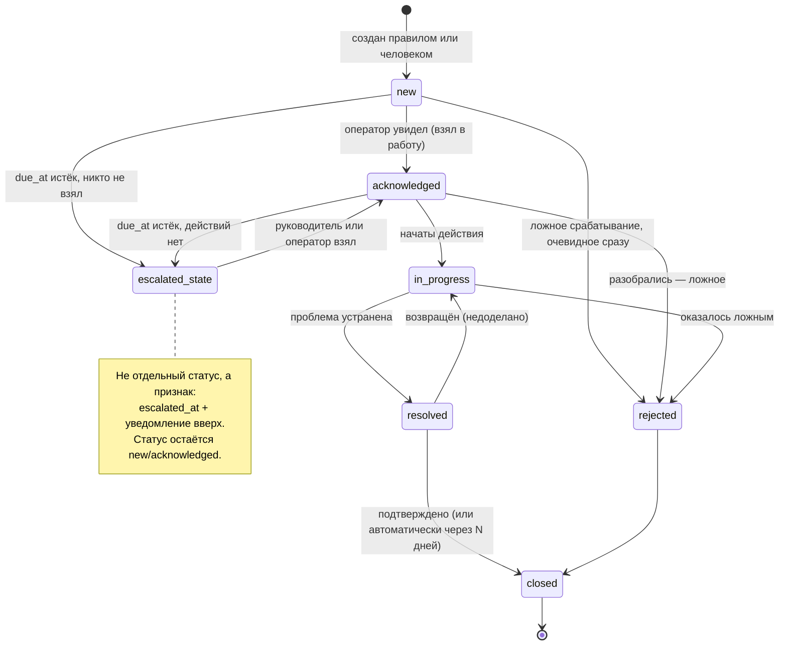
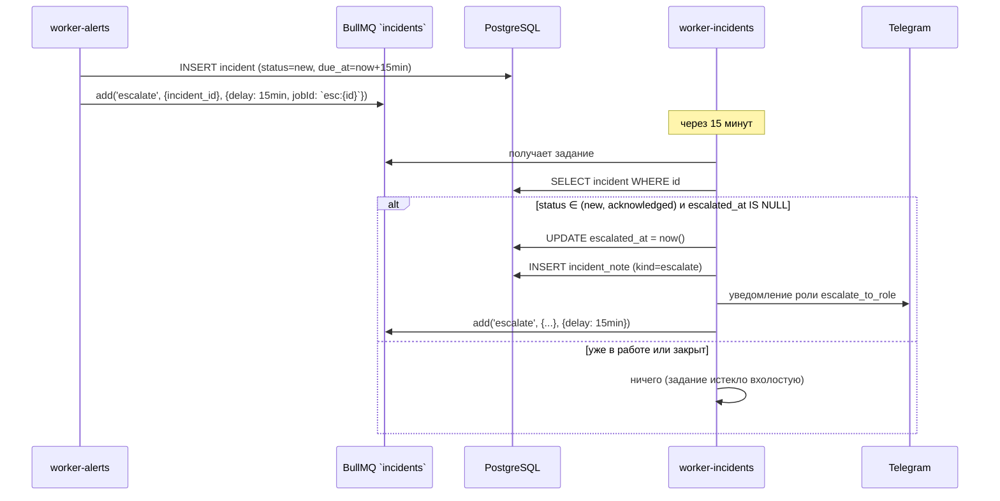
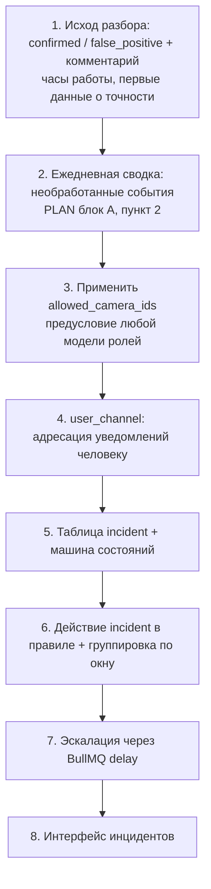

+# 09. Движок процессов и управление инцидентами

**Статус документа:** актуален на 2026-07-16
**Аудитория:** архитекторы, продуктовые менеджеры, backend-инженеры
**Связанные документы:** [08_RULE_ENGINE.md](08_RULE_ENGINE.md), [10_DATABASE.md](10_DATABASE.md), [13_SECURITY.md](13_SECURITY.md), [18_ROADMAP.md](18_ROADMAP.md)

---

## 1. Назначение и статус документа

Документ описывает управление инцидентами, задачами, согласованиями и эскалациями.

**Статус реализации: подсистема отсутствует.** В коде есть единственный элемент — булев признак `event.resolved` с полями `resolved_by` и `resolved_at`.

Поэтому документ по своей природе отличается от предыдущих: он на 90% проектный. Он не описывает существующее, а фиксирует:
- что есть сегодня (раздел 3);
- почему полноценный BPM платформе не нужен (раздел 4) — это главный вывод документа;
- какая модель нужна вместо него и как она ложится на существующую архитектуру (разделы 5–8).

Ни одна структура из разделов 5–8 не реализована. Все они помечены **[План]** и являются рекомендацией, а не описанием.

---

## 2. Постановка задачи

Событие — это факт. Инцидент — это факт, который требует человеческого действия и учёта того, было ли действие выполнено.

Разница видна на вопросах, на которые платформа сегодня не может ответить:

| Вопрос | Ответ сегодня |
|---|---|
| Сколько критических событий за неделю осталось без внимания? | Частично: `resolved = false`, но без сроков и ответственных |
| Кто разобрал вчерашнее нарушение? | `resolved_by` — есть |
| Почему разобрал именно так? | **Нет**: комментария не существует |
| Сколько времени в среднем занимает реакция? | **Нет**: нет метки «взято в работу» |
| Что делать с событием оператору? | **Нет**: нет инструкций |
| Кого поднять, если оператор не среагировал? | **Нет**: нет эскалации |

Для владельца одного ПВЗ эти вопросы не стоят: он сам себе оператор и сам себе руководитель. Они возникают вместе с двумя рынками: **сеть точек** (управляющая компания контролирует территориальных менеджеров) и **производство** (служба охраны труда обязана вести учёт нарушений).

---

## 3. Что реализовано

### 3.1. `event.resolved`

```sql
resolved     boolean NOT NULL DEFAULT false,
resolved_by  uuid,
resolved_at  timestamptz
```

Роут: `PATCH /api/v1/events/:id/resolve`. Интерфейс: журнал событий (`/events`).

Это полный объём подсистемы: событие можно пометить разобранным.

### 3.2. Что даёт этот минимум

Больше, чем кажется. Признак «разобрано» — это семантическая граница между «система заметила» и «человек отреагировал». Она:

- даёт фильтр «необработанные» в журнале;
- входит в план ежедневной сводки (`PLAN.md`, блок A, пункт 2: «посетители, пик, события, необработанные»);
- является точкой, к которой пристыковывается любая будущая модель инцидентов.

### 3.3. Чего не хватает даже в этом минимуме

| Пробел | Следствие |
|---|---|
| Нет комментария при разборе | «Разобрано» без объяснения — бесполезно для аудита |
| Нет исхода | Неотличимо «нарушение подтверждено и устранено» от «ложное срабатывание» |
| `resolved_by` без FK на `app_user` | Ссылочная целостность не гарантирована |
| Нет обратного действия | Ошибочно помеченное событие нельзя вернуть в работу |
| Нет записи в `audit_log` | **[Требует проверки]**, пишется ли аудит при разборе |

**Отсутствие исхода — самый значимый пробел.** Различение «это было настоящее нарушение» и «это ложное срабатывание» — единственный способ измерить точность системы в эксплуатации. Сегодня платформа не знает, сколько её алертов оказались ложными, а без этого невозможно ни настроить пороги, ни доказать клиенту качество.

*Рекомендация, реализуемая до и вне всякой модели инцидентов:* добавить к разбору поле исхода:

```
resolution: 'confirmed' | 'false_positive' | 'ignored'
resolution_note: text
```

Это часы работы и немедленная польза: первый в истории проекта источник данных о точности. Прямо связано с AI-D-07 из [06_AI_ENGINE.md](06_AI_ENGINE.md) — «нет измерений точности». Владелец, нажимающий «ложное срабатывание», размечает данные для нас бесплатно.

---

## 4. Почему полноценный BPM не нужен

Вывод раздела определяет всё дальнейшее и потому вынесен вперёд.

### 4.1. Что такое BPM-движок

Camunda, Activiti, Flowable, jBPM: исполнение процессов, описанных в BPMN 2.0. Возможности: параллельные ветви, шлюзы, таймеры, компенсирующие транзакции, подпроцессы, пользовательские задачи, графический редактор.

### 4.2. Оценка применимости

| Возможность BPM | Нужна ViziAI? | Почему |
|---|---|---|
| Графический редактор процессов | **Нет** | Целевой пользователь — владелец ПВЗ. Он не будет рисовать BPMN |
| Параллельные ветви и шлюзы | **Нет** | Процесс разбора инцидента линеен |
| Компенсирующие транзакции | **Нет** | Нечего откатывать: уведомление отправлено — назад не вернуть |
| Подпроцессы | **Нет** | Глубина процесса — один уровень |
| Таймеры | **Да** | Эскалация по времени |
| Пользовательские задачи | **Да** | «Разобрать инцидент» |
| Версионирование процессов | Нет | Процесс один и меняется раз в год |
| Аудит исполнения | **Да** | Уже есть `audit_log` |

Нужны два элемента из восьми: таймеры и задачи. Оба реализуемы существующими средствами.

### 4.3. Цена внедрения BPM

| Стоимость | Значение |
|---|---|
| Инфраструктура | Ещё один сервис, ещё одна БД (у Camunda своя схема), ещё один узел отказа |
| Компетенция | BPMN — отдельный навык; в команде его нет |
| Модель данных | Состояние процесса живёт в BPM, состояние события — у нас. Два источника истины |
| Отладка | Отказ внутри процесса BPM диагностируется в чужом инструменте |
| On-premise | Ещё один компонент в дистрибутиве изолированной сети |
| Java | Camunda и Activiti — JVM. Третий язык в платформе после TypeScript и Python |

Последний пункт решающий. Платформа сознательно держит два языка: Python там, где GPU и CV, TypeScript везде остальном. Третий язык означает третий набор образов, третий стиль отладки, третьего специалиста.

### 4.4. Вывод

**BPM-движок для ViziAI — избыточен и вреден.** Он решает задачу, которой нет (сложные ветвящиеся процессы, рисуемые аналитиком), и создаёт стоимость, которой не оправдывает.

Требуемое — это **линейная машина состояний инцидента + таймеры эскалации**, реализуемая на существующем стеке: PostgreSQL для состояния, BullMQ с `delay` для таймеров.

Это решение следует зафиксировать явно, потому что «нужен ли нам Camunda» — вопрос, который будет возникать при каждом корпоративном пилоте.

*Оговорка, при которой вывод меняется:* если появится заказчик, у которого разбор нарушения ОТ — это регламентированный процесс с несколькими согласующими, комиссией и предписаниями, интеграция с **его** BPM (по webhook) окажется правильнее, чем реализация процесса у нас. Мы поставляем событие, его система ведёт процесс. Это ещё один аргумент за качественную полезную нагрузку webhook ([08_RULE_ENGINE.md](08_RULE_ENGINE.md), 5.6).

---

## 5. Предлагаемая модель инцидента **[План]**

### 5.1. Событие против инцидента

| Свойство | Событие (`event`) | Инцидент (`incident`) |
|---|---|---|
| Природа | Факт, зафиксированный машиной | Задача для человека |
| Источник | Analyzer | Правило или человек |
| Количество | Тысячи в сутки | Единицы |
| Хранение | Гипертаблица, ретеншен 90 дней | Обычная таблица, хранить долго |
| Изменяемость | Неизменяемо | Меняет состояние |
| Соотношение | — | Один инцидент ↔ много событий |

Ключевое решение: **инцидент — не переименованное событие.** Иначе достаточно было бы полей в `event`.

Отношение «один ко многим» — суть модели. Двадцать событий `queue_alert` за час — это один инцидент «очередь в час пик», а не двадцать задач. Это тот же принцип агрегации, что уже реализован в сводке ([08_RULE_ENGINE.md](08_RULE_ENGINE.md), 4.4): человеку нужна проблема, а не поток её проявлений.

### 5.2. Схема **[План]**

```sql
-- Не реализовано. Предложение.
CREATE TYPE incident_status AS ENUM
  ('new','acknowledged','in_progress','resolved','closed','rejected');
CREATE TYPE incident_resolution AS ENUM
  ('confirmed','false_positive','no_action','duplicate');

CREATE TABLE incident (
  id           uuid PRIMARY KEY DEFAULT uuid_generate_v4(),
  tenant_id    uuid NOT NULL REFERENCES tenant(id) ON DELETE CASCADE,
  site_id      uuid NOT NULL REFERENCES site(id) ON DELETE CASCADE,
  title        text NOT NULL,
  status       incident_status NOT NULL DEFAULT 'new',
  severity     event_severity NOT NULL,
  resolution   incident_resolution,
  assignee_id  uuid REFERENCES app_user(id) ON DELETE SET NULL,
  created_at   timestamptz NOT NULL DEFAULT now(),
  acked_at     timestamptz,
  resolved_at  timestamptz,
  closed_at    timestamptz,
  due_at       timestamptz,              -- срок реакции (SLA)
  escalated_at timestamptz,
  meta         jsonb NOT NULL DEFAULT '{}'
);
CREATE INDEX idx_incident_tenant_status ON incident(tenant_id, status, created_at DESC);
CREATE INDEX idx_incident_assignee ON incident(assignee_id) WHERE status IN ('new','acknowledged','in_progress');
CREATE INDEX idx_incident_due ON incident(due_at) WHERE status IN ('new','acknowledged');

-- Связь: инцидент ↔ события (многие ко многим не нужны — событие в одном инциденте)
CREATE TABLE incident_event (
  incident_id uuid NOT NULL REFERENCES incident(id) ON DELETE CASCADE,
  event_id    uuid NOT NULL,             -- без FK: event — гипертаблица
  event_ts    timestamptz NOT NULL,      -- вместе с event_id даёт доступ к строке
  PRIMARY KEY (incident_id, event_id)
);

-- Журнал действий по инциденту
CREATE TABLE incident_note (
  id          uuid PRIMARY KEY DEFAULT uuid_generate_v4(),
  incident_id uuid NOT NULL REFERENCES incident(id) ON DELETE CASCADE,
  user_id     uuid REFERENCES app_user(id) ON DELETE SET NULL,
  kind        text NOT NULL,             -- comment | status_change | assign | escalate
  body        text,
  created_at  timestamptz NOT NULL DEFAULT now()
);
```

Замечания по проектированию:

**`incident_event.event_ts` рядом с `event_id`.** Гипертаблица `event` имеет составной первичный ключ `(id, ts_start)`, поэтому внешний ключ на неё невозможен — та же причина, что у `notifications` ([10_DATABASE.md](10_DATABASE.md)). Хранение метки времени рядом решает практическую задачу: без неё выборка события по одному `id` заставит PostgreSQL просканировать **все чанки** гипертаблицы, потому что не сможет отсечь партиции. С `event_ts` запрос попадает точно в нужный чанк.

**Частичные индексы.** `idx_incident_assignee` и `idx_incident_due` покрывают только открытые инциденты. Закрытых со временем станет большинство, и держать их в индексе «мои задачи» бессмысленно.

**Инцидент не гипертаблица.** Их единицы в сутки, они изменяемы, у них нет ретеншена. Гипертаблица здесь дала бы только издержки.

### 5.3. Машина состояний **[План]**



Обоснование деталей:

**`acknowledged` отдельно от `in_progress`.** Это две разные метрики: время реакции (заметили) и время решения (устранили). Слияние сделало бы невозможным измерение первого, а именно оно является предметом SLA.

**`rejected` отдельно от `resolved`.** «Ложное срабатывание» — не «решено». Смешение уничтожило бы данные о точности системы (3.3).

**`closed` отдельно от `resolved`.** Разделение исполнителя и приёмщика. Для одного ПВЗ избыточно, поэтому — автоматическое закрытие через N дней. Для сети и производства — обязательно.

**Эскалация — признак, а не статус.** Инцидент, эскалированный и не взятый, остаётся `new`. Отдельный статус `escalated` потребовал бы дублирования всех переходов из `new` и `acknowledged`.

### 5.4. Правило порождает инцидент **[План]**

Расширение `alert_rule.actions` из [08_RULE_ENGINE.md](08_RULE_ENGINE.md), 7.2:

```json
{
  "actions": [
    {"type": "notify", "channels": [{"type": "telegram", "chat_id": "123"}]},
    {"type": "clip"},
    {"type": "incident",
     "title": "Нарушение запретной зоны",
     "assignee_role": "manager",
     "due_minutes": 15,
     "group_window_minutes": 60,
     "escalate_to_role": "admin"}
  ]
}
```

`group_window_minutes` — механизм агрегации: событие того же типа на той же площадке в пределах окна прикрепляется к существующему открытому инциденту, а не создаёт новый. Это то, что предотвращает «двадцать задач вместо одной».

Реализация группировки — тот же приём, что у кулдауна ([08_RULE_ENGINE.md](08_RULE_ENGINE.md), 4.3): атомарная проверка через Redis `SET NX` по ключу `incident_group:{rule_id}:{site_id}` со значением `incident_id`.

### 5.5. Эскалация через BullMQ **[План]**

BPM-движок не требуется: у BullMQ есть отложенные задания.



Решения:

| Решение | Обоснование |
|---|---|
| `jobId: esc:{incident_id}` | Дедупликация: повторное создание задания для того же инцидента не создаст второе |
| Проверка статуса при исполнении, а не отмена задания | Отмена задания при переходе статуса — лишняя связность. Дешевле проверить при срабатывании |
| Повторное планирование для следующего уровня | Многоуровневая эскалация без планировщика |
| `due_at` в БД, не только в задании | Инцидент «просрочен» видно в интерфейсе и без срабатывания задания |

Ключевая мысль: **отложенное задание — это таймер, а проверка условия при его срабатывании — это шлюз.** Два элемента BPM, которые действительно нужны, получены бесплатно из уже используемой библиотеки.

---

## 6. Задачи и согласования

### 6.1. Задачи

Задача = инцидент с `assignee_id`. Отдельной сущности не требуется.

Модель назначения:

| Способ | Когда |
|---|---|
| По роли (`assignee_role`) | Правило не знает конкретных людей |
| Конкретному пользователю | Ручное назначение или эскалация |
| Никому (`assignee_id IS NULL`) | Одна точка: владелец сам себе оператор |

Для ПВЗ на одного человека назначение бессмысленно и должно быть скрыто в интерфейсе. Появляется вместе с профилем «сеть точек».

### 6.2. Согласования **[Требует решения]**

Согласование — это переход, требующий одобрения другой роли.

Реалистичные сценарии для платформы:

| Сценарий | Нужно? |
|---|---|
| Закрытие инцидента подтверждает руководитель | Для производства — да |
| Удаление события или клипа требует одобрения | **Требует решения**: см. ниже |
| Изменение зон и правил требует одобрения | Маловероятно |

Второй сценарий важнее, чем кажется. Платформа фиксирует нарушения; сотрудник, у которого есть право удалить запись о собственном нарушении, обесценивает систему. Это не гипотетическая угроза, а типовое требование службы безопасности.

*Рекомендация:* решать это не согласованиями, а **запретом удаления**. События неизменяемы и не удаляются — только истекают по ретеншену. Изменение статуса пишется в `audit_log`. Это проще согласований и надёжнее: нечего согласовывать, если действие невозможно. Данная модель уже фактически действует (роутов удаления события нет), и её следует зафиксировать как решение, а не как случайность.

### 6.3. Ответственность и права

Модель ролей — `super`, `admin`, `manager`, `operator` ([13_SECURITY.md](13_SECURITY.md)).

Предлагаемое соответствие **[План]**:

| Действие | operator | manager | admin | super |
|---|---|---|---|---|
| Видеть инциденты своих камер | Да | — | — | — |
| Видеть все инциденты тенанта | Нет | Да | Да | Да |
| Взять в работу | Да | Да | Да | Да |
| Отклонить как ложное | Нет | Да | Да | Да |
| Решить | Да | Да | Да | Да |
| Закрыть | **Нет** | Да | Да | Да |
| Назначить другому | Нет | Да | Да | Да |

Разделение «решить» и «закрыть» — единственное место, где нужна двухступенчатость. Отклонение как ложного тоже недоступно оператору: иначе оператор сможет молча закрывать собственные нарушения.

Существенно: у `app_user` уже есть поле `allowed_camera_ids uuid[]`, но оно **не применяется нигде** (`PLAN.md`, блок D, пункт 15). Модель прав оператора не работает. Инциденты без этого поля бессмысленны: оператор увидит инциденты всех точек сети.

*Вывод:* применение `allowed_camera_ids` — предусловие модели инцидентов, а не сопутствующая задача.

---

## 7. Уведомления в процессе

Отличие от уведомлений по событию ([08_RULE_ENGINE.md](08_RULE_ENGINE.md)): адресуются человеку и связаны с состоянием.

| Повод | Кому | Канал |
|---|---|---|
| Инцидент назначен | Исполнителю | Telegram |
| Срок истекает | Исполнителю | Telegram |
| Эскалация | Роли выше | Telegram |
| Инцидент решён | Постановщику | Интерфейс |
| Ежедневная сводка открытых | Руководителю | Telegram |

Все реализуемы существующим воркером алертов. Требуется одно, чего нет: **связь пользователя с каналом доставки.**

Сегодня `chat_id` задаётся в правиле, то есть уведомление адресуется чату, а не человеку. Для инцидентов нужно `app_user.telegram_chat_id` (либо отдельная таблица `user_channel`).

*Рекомендация:* `user_channel(user_id, type, address, verified)` вместо поля в `app_user` — заранее допускает email и push, и позволяет подтверждение адреса. Подтверждение обязательно: уведомление об инциденте, ушедшее не туда, — это утечка.

---

## 8. Интеграции **[План]**

| Система | Направление | Ценность |
|---|---|---|
| Telegram | Исходящее (есть) | Основной канал ПВЗ |
| Email | Исходящее | **Обязательно для on-premise** |
| Webhook | Исходящее (есть) | Универсальная точка |
| 1С | Двустороннее | Учёт нарушений и персонала |
| Jira / Service Desk | Исходящее | Инцидент как задача |
| СКУД | Входящее | Сопоставление прохода и видео |
| Bitrix24 | Исходящее | Распространён в среднем бизнесе РФ |
| АСУ ТП | Исходящее | **Не делать** — см. ниже |

Приоритеты: email (блокер on-premise), затем СКУД, затем 1С.

**СКУД заслуживает пояснения.** Интеграция с системой контроля доступа даёт то, чего не даёт видеоаналитика: достоверную идентификацию сотрудника по пропуску. Это позволило бы связать `global_id` из Re-ID с конкретным работником без биометрии — то есть усилить платформу, не нарушая решение V-02. Обмен — по событию прохода: время, точка, идентификатор пропуска.

**АСУ ТП — граница, которую нельзя переходить.** Платформа не должна останавливать оборудование ([04_NETWORK.md](04_NETWORK.md), 11.3). Она может предупредить оператора; решение принимает человек или сертифицированная система защиты. Это фиксируется как продуктовое ограничение, а не как отсутствующая функция.

---

## 9. Что делать сейчас

Порядок, отражающий реальную последовательность потребностей.



| № | Работа | Ценность | Стоимость | Зачем именно сейчас |
|---|---|---|---|---|
| 1 | Исход разбора | **Высокая** | Часы | Единственный источник данных о точности; закрывает AI-D-07 |
| 2 | Ежедневная сводка | Высокая | День | Владелец видит пользу ежедневно; уже в плане |
| 3 | `allowed_camera_ids` | Высокая | Дни | Предусловие ролей и инцидентов; поле есть, не работает |
| 4 | `user_channel` | Средняя | Дни | Без этого инцидент некому адресовать |
| 5–8 | Инциденты | Средняя | Недели | **Только с приходом сети или производства** |

**Главный вывод по срокам:** пункты 5–8 не следует делать до появления заказчика, которому они нужны. Для одного ПВЗ инциденты — избыточная сущность: владелец видит алерт в Telegram и идёт разбираться. Модель инцидентов, построенная без реального процесса перед глазами, будет угадана неверно.

Пункты 1–4 полезны немедленно и независимо от инцидентов.

---

## 10. Реестр решений

| № | Решение | Обоснование | Альтернатива и почему отвергнута |
|---|---|---|---|
| W-01 | **BPM-движок не внедряется** | Нужны 2 возможности из 8; цена — третий язык (JVM), второй источник истины, ещё один узел отказа | Camunda/Activiti: сложность без соответствующей пользы |
| W-02 | Инцидент — отдельная сущность, не поля в `event` | 20 событий = 1 инцидент; событие неизменяемо, инцидент изменяем | Флаги в `event`: невозможна агрегация |
| W-03 | Эскалация — BullMQ `delay` + проверка при срабатывании | Таймер и шлюз получены из уже используемой библиотеки | Планировщик или BPM: новая инфраструктура |
| W-04 | `jobId: esc:{id}` для дедупликации | Повторное планирование не создаёт второе задание | Без jobId: дубли эскалаций |
| W-05 | Статус проверяется при срабатывании, задание не отменяется | Отмена — лишняя связность | Отмена: связь состояния и очереди |
| W-06 | `acknowledged` и `in_progress` раздельно | Время реакции и время решения — разные метрики SLA | Слияние: SLA неизмерим |
| W-07 | `rejected` и `resolved` раздельно | Ложное срабатывание — не решение | Слияние: данные о точности уничтожены |
| W-08 | Эскалация — признак, а не статус | Иначе дублирование всех переходов | Статус: удвоение машины состояний |
| W-09 | События не удаляются, только истекают | Нарушитель не должен удалять запись о себе | Удаление с согласованием: сложнее и слабее |
| W-10 | `incident_event.event_ts` рядом с `event_id` | Без метки времени выборка сканирует все чанки гипертаблицы | Только `event_id`: полный скан |
| W-11 | Инцидент — не гипертаблица | Единицы в сутки, изменяемы, без ретеншена | Гипертаблица: издержки без пользы |
| W-12 | Интеграция с чужим BPM вместо своего | Регламент ОТ — процесс заказчика, не наш | Свой BPM: воспроизводим чужую систему |
| W-13 | АСУ ТП: только предупреждение | Функциональная безопасность требует SIL, недостижимого для вероятностной модели | Остановка оборудования: ответственность за жизнь |

---

## 11. Долг

| № | Проблема | Влияние | Приоритет |
|---|---|---|---|
| W-D-01 | Нет исхода разбора (`confirmed`/`false_positive`) | **Точность системы неизмерима**; данные не размечаются | **Высокий** |
| W-D-02 | `allowed_camera_ids` не применяется | Модель прав оператора не работает; блокер инцидентов | **Высокий** |
| W-D-03 | Нет комментария при разборе | «Разобрано» без объяснения бесполезно для аудита | Средний |
| W-D-04 | Нет связи пользователя с каналом уведомления | Уведомление адресуется чату, а не человеку | Средний |
| W-D-05 | Нет ежедневной сводки необработанных | Владелец не видит накопленное | Средний |
| W-D-06 | `resolved_by` без FK на `app_user` | Ссылочная целостность не гарантирована | Низкий |
| W-D-07 | Нельзя вернуть ошибочно разобранное событие | Необратимое действие в один клик | Низкий |
| W-D-08 | Нет модели инцидентов | Блокер продажи сети точек и производства | Средний (при появлении рынка) |
| W-D-09 | Нет email | Блокер on-premise | **Высокий** |
| W-D-10 | **[Требует проверки]** пишется ли `audit_log` при разборе | Пробел в аудите | Средний |

---

## 11. Расширение по [REVIEW_BOARD.md](REVIEW_BOARD.md)

**Статус: [План].** Дополнения по итогам ревью (B-39, B-60, B-74).

### 11.1. Петля обратной связи в модель (B-39)

Исход разбора события (3.3) содержит `false_positive`/`true_positive` — размеченный экспертом пример. Сегодня он сохраняется в исходе и **выбрасывается**. Ревью требует замкнуть петлю: исходы разбора → датасет дообучения → теневой прогон → новая модель ([06](06_AI_ENGINE.md), 14.6).

Это превращает разбор из чистой траты в источник улучшения: оператор всё равно размечает, разбирая. Ограничение: датасет содержит изображения людей (ПДн), дообучение в контуре, обезличенно.

Практическое следствие для workflow: исход разбора должен сохранять **достаточный контекст** для дообучения — снапшот, bbox, версию модели ([06](06_AI_ENGINE.md), 14.6, `model_version`). Сегодня исход — только флаг; нужно добавить привязку к снапшоту события.

### 11.2. ITSM-интеграция инцидентов (B-60)

Инцидент workflow → заявка в ServiceNow/Jira/Bitrix24 клиента через webhook с качественной полезной нагрузкой ([23](23_ENTERPRISE_INTEGRATION.md), 7.1). Не родные коннекторы — webhook покрывает все ITSM. Это возвращает приоритет проектированию полезной нагрузки webhook ([08](08_RULE_ENGINE.md), 5.6).

### 11.3. Связь с моделью поддержки (B-74)

Workflow инцидентов клиента (эскалации, SLA реагирования) — отдельно от нашей поддержки платформы ([22](22_SRE_OPERATIONS.md), 11). Не путать: инцидент **у клиента** (нарушение на его точке) идёт по его workflow; инцидент **платформы** (мы лежим) — по нашему дежурству. Оба используют понятие эскалации, но это разные процессы с разными участниками.

### 11.4. Дополнение к реестру решений и долгу

| № | Решение | Обоснование |
|---|---|---|
| W-04 | Исход разбора сохраняет контекст для дообучения (снапшот, bbox, model_version) | Замыкает петлю обратной связи ([06](06_AI_ENGINE.md), 14.6) |
| W-05 | ITSM через webhook, не родные коннекторы | Один webhook покрывает все ITSM |
| W-06 | Инцидент клиента и инцидент платформы — разные процессы | Разные участники, не смешивать |

| № | Долг | Приоритет |
|---|---|---|
| W-D-04 | Исход разбора не сохраняет контекст для дообучения | Средний (блокирует петлю [06](06_AI_ENGINE.md), 14.6) |
