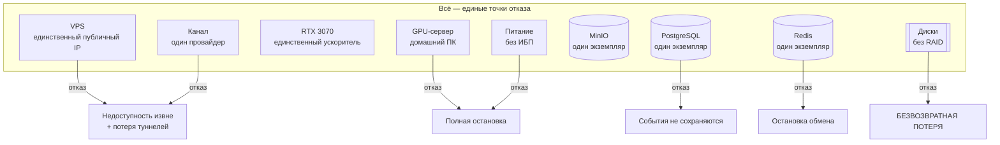
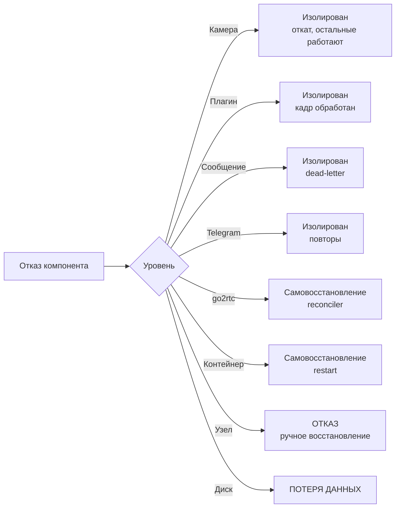
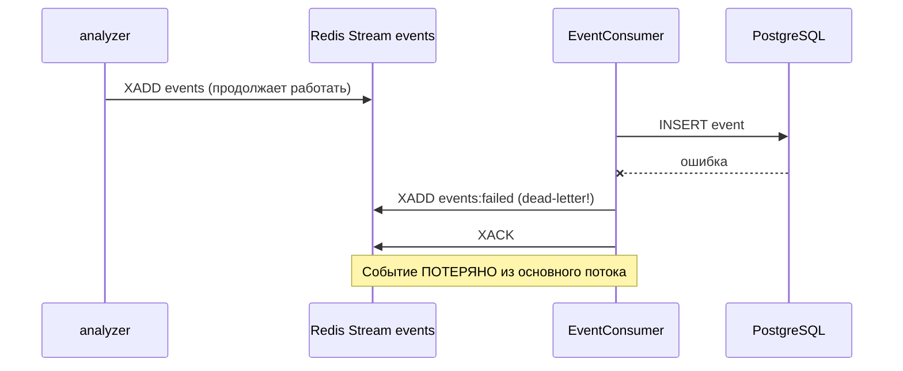
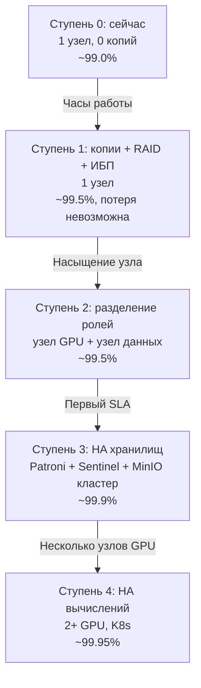
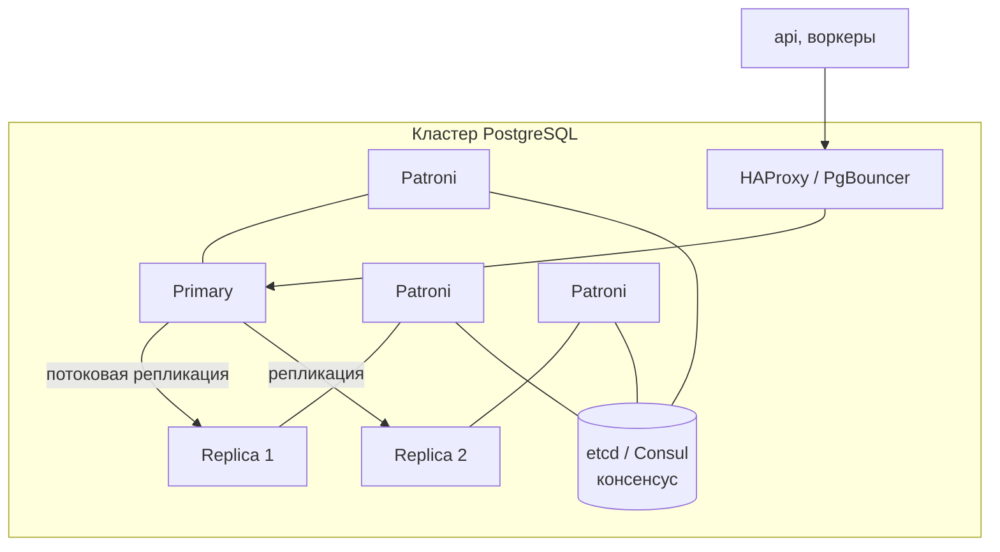

# 11. Отказоустойчивость

**Статус документа:** актуален на 2026-07-16
**Аудитория:** архитекторы, DevOps, технические руководители
**Связанные документы:** [02_INFRASTRUCTURE.md](02_INFRASTRUCTURE.md), [03_DEPLOYMENT.md](03_DEPLOYMENT.md), [10_DATABASE.md](10_DATABASE.md), [12_MONITORING.md](12_MONITORING.md)

---

## 1. Назначение и честная позиция

Документ описывает текущее состояние отказоустойчивости, реализованные механизмы устойчивости и план перехода к конфигурации, пригодной для договорного SLA.

**Позиция, которую документ фиксирует и защищает:** сегодняшняя платформа — это **один узел без резервных копий**. Она не является отказоустойчивой ни в каком смысле. Любой SLA выше «best effort» на текущей конфигурации — это обещание, которое будет нарушено.

Это не упрёк архитектуре: одноузловая конфигурация — верное решение для стадии одного клиента. Ошибкой была бы не она, а её сокрытие при продаже.

---

## 2. Текущее состояние

### 2.1. Карта единых точек отказа



| Компонент | Экземпляров | Отказ означает | Восстановление |
|---|---|---|---|
| GPU-сервер | 1 | Полная остановка | Ручное, часы–дни |
| GPU | 1 | Нет аналитики | Замена карты |
| PostgreSQL | 1 | События не сохраняются | Рестарт контейнера |
| Redis | 1 | Остановка всего обмена | Рестарт (AOF) |
| MinIO | 1 | Нет клипов и снапшотов | Рестарт |
| Диск данных | 1, без RAID | **Потеря всех данных** | **Невозможно** |
| VPS | 1 | Недоступность извне | Ручное пересоздание |
| Питание | Без ИБП | Полная остановка | Ожидание |
| Канал | 1 | Недоступность извне | Ожидание |
| Резервные копии | **0** | — | — |

### 2.2. Фактическая доступность

**[Данные отсутствуют]:** доступность не измеряется — мониторинга нет ([12_MONITORING.md](12_MONITORING.md)).

Оценка сверху для домашнего ПК без ИБП и резервирования: **не выше 99.0%** в месяц, что означает до 7 часов простоя. Реалистично — ниже, поскольку обновление платформы также является простоем ([03_DEPLOYMENT.md](03_DEPLOYMENT.md), 5.3).

Из этого следует решение V-10 ([00_VISION.md](00_VISION.md), 9.2): **SLA не декларируется выше best effort до реализации HA.**

### 2.3. Приоритет: резервные копии выше HA

Наиболее частая ошибка при планировании — начинать с кластеризации.

| Задача | От чего защищает | Стоимость | Приоритет |
|---|---|---|---|
| **Резервные копии** | **Безвозвратная потеря данных** | Часы | **Первый** |
| RAID | Отказ диска (простой) | Стоимость дисков | Второй |
| ИБП | Отключение питания | Десятки тысяч рублей | Третий |
| Репликация PostgreSQL | Простой при отказе БД | Второй узел | Четвёртый |
| Кластер | Простой при отказе узла | Кратный рост инфраструктуры | Пятый |

Обоснование порядка: HA защищает от **простоя**, резервная копия — от **безвозвратной потери**. Простой обратим; потеря — нет. Кластер из двух узлов без резервных копий защищён хуже, чем один узел с проверенным бэкапом: ошибочный `DELETE`, повреждение данных или ошибка миграции реплицируются на все узлы мгновенно.

Раздел 10 из [02_INFRASTRUCTURE.md](02_INFRASTRUCTURE.md) и раздел 10 из [03_DEPLOYMENT.md](03_DEPLOYMENT.md) описывают минимальную реализацию. **Это то, что следует сделать до чтения остального документа.**

---

## 3. Реализованные механизмы устойчивости

Платформа не отказоустойчива на уровне инфраструктуры, но на уровне приложения содержит зрелый набор механизмов. Их следует перечислить явно — чтобы они не были утрачены при рефакторинге и чтобы не переизобретались.

### 3.1. Реестр

| № | Механизм | Где | От чего защищает |
|---|---|---|---|
| 1 | Экспоненциальный откат RTSP (1→60с, сброс при успехе) | `video_source.py` | Обрыв камеры или канала |
| 2 | Изоляция потребителя камеры | `worker.py::_consume` | Одна камера ≠ весь воркер |
| 3 | Супервизор камер не выходит при нуле камер | `worker.py::run` | Цикл перезапуска Docker при пустом развёртывании |
| 4 | Изоляция плагина | `registry.py::dispatch` | Один плагин ≠ весь кадр |
| 5 | Dead-letter + XACK | `event_consumer.ts` | Отравленное сообщение блокирует группу |
| 6 | Повторы BullMQ (3 попытки, экспоненциальный откат) | `queues.ts` | Временная недоступность Telegram |
| 7 | Healthcheck + `depends_on: service_healthy` | compose | Старт до готовности зависимостей |
| 8 | `restart: unless-stopped` | compose | Падение процесса |
| 9 | Reconciler go2rtc (60с) | `cameras.ts` | go2rtc теряет потоки при рестарте |
| 10 | Watchdog камер (300с) | `camera_watchdog.ts` | Тихая пропажа камеры |
| 11 | Heartbeat с TTL (15с) | `worker.py` | Ложный статус «онлайн» |
| 12 | Ретеншен с аварийным удалением по свободному месту | `retention.ts` | Переполнение диска архива |
| 13 | Переразрешение DNS в nginx (10с) | `nginx.prod.conf` | 502 после пересборки контейнеров |
| 14 | Откат эмбеддера Re-ID при ошибке ONNX | `embedding.py` | Отсутствие модели ≠ падение воркера |
| 15 | `FaceEngine.ready = false` при отсутствии моделей | `face.py` | Сбой скачивания при сборке |
| 16 | Ограниченная очередь кропов (последние 20) | `identity.py` | Недоступность API исчерпывает память |
| 17 | Ограниченный батч зачисления лиц (5 за тик) | `identity.py` | Очередь блокирует цикл синхронизации |
| 18 | Атомарный кулдаун (`SET NX EX`) | `alerts.worker.ts` | Гонка при `concurrency: 5` |
| 19 | Ранний `return` при сбое загрузки снапшота | `alerts.worker.ts` | Сбой фото отменяет доставленный текст |
| 20 | Валидация конфигурации на старте (Zod, pydantic) | `config.ts`, `config.py` | Запуск с неверной конфигурацией |
| 21 | `stream_maxlen ≈ 10000` | `worker.py` | Неограниченный рост стрима |
| 22 | AOF Redis (`appendonly yes`) | compose | Потеря данных при рестарте Redis |

Это зрелый набор. Большинство пунктов появились после реального инцидента, а не из общих соображений, — что и делает их ценными.

### 3.2. Что этот набор даёт



Вывод: **всё, что может быть изолировано на уровне приложения, изолировано.** Пробел — исключительно инфраструктурный.

---

## 4. Анализ отказов по компонентам

### 4.1. PostgreSQL

**Отказ:** контейнер упал либо БД недоступна.

**Что происходит:**



**Критическая находка.** Отказ PostgreSQL приводит не к ожиданию, а к **отправке событий в dead-letter**. Логика `handle()` не различает «невалидное сообщение» и «БД недоступна»: оба случая обрабатываются одинаково — dead-letter + XACK.

Последствие: при недоступности БД на 10 минут все события за этот период уходят в `events:failed` и подтверждаются. Они не потеряны физически (доступны в `/admin/dead-letter` с повтором), но:
- они не попадут в БД автоматически;
- никто не узнает, пока не откроет админку;
- при большом объёме `events:failed` растёт без ограничения по длине.

Ранее в [01_SYSTEM_ARCHITECTURE.md](01_SYSTEM_ARCHITECTURE.md), 13.2 указано «события накапливаются в стриме» — это **неверно** для отказа БД, и здесь формулировка уточняется: накопление в стриме произошло бы, только если бы потребитель не подтверждал сообщения.

*Рекомендация (высокий приоритет):* различать классы ошибок в `handle()`:

```typescript
catch (err) {
  if (isTransient(err)) {   // недоступность БД, таймаут соединения
    // НЕ XACK: сообщение останется в pending и будет переобработано
    await new Promise(r => setTimeout(r, 1000))
    return
  }
  // невалидные данные → dead-letter + XACK
}
```

Это отличает «сообщение плохое» (наша вина, чинить кодом) от «хранилище недоступно» (пройдёт само). Первое требует dead-letter, второе — повтора. Сейчас оба лечатся dead-letter.

Оговорка: без XACK сообщения останутся в pending, и для их переобработки после восстановления потребуется `XAUTOCLAIM` — которого нет (4.6). Обе работы связаны.

**RPO/RTO:** RTO — секунды (рестарт контейнера). RPO — **все события за время недоступности** уходят в dead-letter и требуют ручного повтора.

### 4.2. Redis

**Отказ:** контейнер упал.

Redis — самый связанный компонент платформы:

| Потребитель | Последствие |
|---|---|
| `analyzer` → XADD events | **События теряются безвозвратно** |
| `analyzer` → heartbeat | Все камеры «offline» |
| `analyzer` → проекции | Работает на памяти до перезапуска |
| `api` → EventConsumer | Остановка |
| `api` → WS PubSub | Лента не работает |
| `api` → ws-тикеты | Невозможно открыть WebSocket |
| BullMQ | Клипы и алерты не обрабатываются |
| Re-ID галерея | Не сохраняется |
| Кулдауны | Сброшены → возможен всплеск алертов |

**Событие, порождённое при недоступности Redis, теряется навсегда.** `ZoneEngine.emit` вызывает `XADD` без буфера и без обработки исключения — исключение поднимется в `_process`, будет перехвачено в `_consume` и **завершит задачу камеры**. Камера восстановится через 30 секунд супервизором.

Принцип из `CLAUDE.md` — «Падение Redis: analyzer буферизует последние N событий в памяти» — **не реализован**.

*Рекомендация:* реализовать буфер в `ZoneEngine.emit`:

```python
async def emit(self, events: list[Event]) -> None:
    self._buffer.extend(events)
    self._buffer = self._buffer[-MAX_BUFFER:]   # ограничен, как _pending_crops
    try:
        while self._buffer:
            ev = self._buffer[0]
            await self.redis.xadd(...)
            self._buffer.pop(0)
    except RedisError:
        pass  # останется в буфере до следующего вызова
```

Образец уже есть в коде — `IdentityManager._flush_crops` с ограниченной очередью. Приём проверен, остаётся применить его к более важным данным. Это закрывает единственное место, где кратковременный сбой инфраструктуры уничтожает продуктовые данные.

**AOF.** `appendonly yes` включён — Redis переживает рестарт. Но `appendfsync` не задан (умолчание `everysec`): при аварийном завершении теряется до секунды записей. Для галереи Re-ID приемлемо.

**Отсутствие `maxmemory`** ([02_INFRASTRUCTURE.md](02_INFRASTRUCTURE.md), 5.3): при исчерпании памяти узла OOM-killer убьёт Redis, что остановит платформу целиком.

**RPO/RTO:** RTO — секунды. RPO — события за время недоступности **теряются**.

### 4.3. Analyzer

**Отказ:** процесс упал или перезапускается.

| Данные | Судьба |
|---|---|
| Кадры за время простоя | **Потеряны безвозвратно** |
| Состояние зон (кто где) | Потеряно → возможны ложные `zone_entry` после старта |
| Галерея Re-ID | Сохранена в Redis (запись раз в 10с) — потеряны последние 10 секунд |
| Состояние плагинов | Потеряно → `counter` обнуляет посетителей за день |
| Треки | Потеряны → новые `track_id`, но `global_id` восстановятся из галереи |

Восстановление автоматическое (`restart: unless-stopped`), время — секунды плюс загрузка модели.

**Потеря аналитики за время простоя неустранима** в текущей архитектуре: это плата за решение A-01 (кадры не проходят через Redis). Устранение потребовало бы буферизации видео — то есть отказа от главного решения по производительности.

Наиболее заметное следствие — обнуление счётчика посетителей за день ([07_PLUGIN_SYSTEM.md](07_PLUGIN_SYSTEM.md), 7.2): владелец видит это как ошибку данных. *Рекомендация:* перенести множество увиденных в Redis с TTL до конца суток.

### 4.4. MinIO

**Отказ:** контейнер упал.

| Функция | Последствие |
|---|---|
| События | Работают: `snapshot_key` пуст |
| Алерты | Работают: текст без фото (ранний `return`) |
| Клипы | Задание падает → повтор BullMQ |
| Кропы Re-ID | Остаются в очереди (последние 20) |
| Страница «Люди» | Фото не грузятся |

**Образцовая деградация.** Отказ хранилища объектов не останавливает ни один основной сценарий. Это следствие того, что MinIO нигде не находится на критическом пути.

**RPO/RTO:** RTO — секунды. RPO — 0 при рестарте; **∞ при отказе диска** (нет репликации, нет копий).

### 4.5. go2rtc

**Отказ:** контейнер упал или перезапустился.

Особенность: go2rtc хранит конфигурацию потоков **в памяти** (`streams: {}` на диске). Рестарт стирает все камеры.

Решение — reconciler в API (60с):

```typescript
// go2rtc's stream config is empty on disk and rebuilt at runtime, so every
// go2rtc restart wipes them — without this the dashboard goes blank until a
// camera is manually re-saved. Healthy, matching streams are left untouched so
// we never interrupt an active viewer.
```

Два верных решения внутри одного механизма:
1. **Не трогать корректные потоки** — иначе переподключение прервало бы просмотр у зрителя.
2. **Best effort** — недоступность go2rtc просто откладывает попытку до следующего тика.

Последствие отказа: нет живого видео. Аналитика не затронута — analyzer тянет RTSP независимо.

**RTO:** до 60 секунд, автоматически.

### 4.6. Пробел: XAUTOCLAIM

`EventConsumer` не вызывает `XAUTOCLAIM`. Сообщения, доставленные потребителю, который упал до XACK, остаются в pending **навсегда**.

Сценарий: `api` получил 20 сообщений (`COUNT 20`), обработал 5, контейнер убит при обновлении. Оставшиеся 15 — в pending. После рестарта потребитель читает `>` (только новые) и никогда к ним не вернётся.

Масштаб: до 20 событий на каждый перезапуск `api`. При ежедневном обновлении — незначительно, но это тихая потеря.

*Рекомендация:* периодический `XAUTOCLAIM` с `min-idle-time` порядка 60 секунд. **Обязательно вместе с идемпотентностью вставки** ([10_DATABASE.md](10_DATABASE.md), 9.2) — иначе переобработка создаст дубли.

---

## 5. Целевая архитектура HA

### 5.1. Ступени



| Ступень | Триггер перехода | Что даёт |
|---|---|---|
| 0 → 1 | **Немедленно** | Потеря данных становится невозможной |
| 1 → 2 | GPU или CPU выше 80% | Ёмкость |
| 2 → 3 | Первый договорный SLA | Отказ хранилища ≠ простой |
| 3 → 4 | Более 3–4 узлов GPU | Отказ узла ≠ простой |

### 5.2. Ступень 1: минимум (сделать сейчас)

| Работа | Стоимость | Эффект |
|---|---|---|
| `pg_dump` по cron на отдельный носитель | Час | Потеря данных исключена |
| Копия `redis_data` | Час | Эталоны сотрудников сохранены |
| Копия `.env.prod` + WireGuard | Минуты | Восстановление вообще возможно |
| **Проверка восстановления** | День | Копия перестаёт быть гипотезой |
| RAID1 на диске данных | Стоимость диска | Отказ диска ≠ простой |
| ИБП | Десятки тысяч рублей | Отключение питания ≠ отказ |
| `maxmemory` для Redis | Минуты | OOM-killer не убивает платформу |
| Буфер событий в analyzer | День | Сбой Redis ≠ потеря событий |
| Различение ошибок в EventConsumer | День | Сбой БД ≠ dead-letter |
| `XAUTOCLAIM` + идемпотентность | Дни | Рестарт `api` ≠ потеря событий |

Первые четыре строки — приоритет над всем остальным содержимым документа.

### 5.3. Ступень 3: HA хранилищ

**PostgreSQL: Patroni**



Требования: 3 узла (два для кворума недостаточно — нужен нечётный), etcd, HAProxy.

**Замечание по TimescaleDB:** потоковая репликация с ним работает штатно (это расширение PostgreSQL). Но фоновые задания (сжатие, ретеншен) выполняются **только на primary** — при переключении они должны корректно продолжиться на новом. Это требует проверки на стенде, а не веры в документацию.

**Redis: Sentinel**

| Вариант | Оценка |
|---|---|
| Redis Sentinel | Достаточно: 3 sentinel + 1 master + 1 replica. Клиенты (ioredis, redis-py) поддерживают Sentinel штатно |
| Redis Cluster | **Избыточен**: шардирование не нужно, объём мал. Ломает многоключевые операции |

*Рекомендация:* Sentinel. Redis Cluster потребовал бы пересмотра ключей (хеш-теги для операций над несколькими ключами) без единого выигрыша.

**Существенное ограничение:** репликация Redis асинхронна. При переключении теряются записи, не успевшие дойти до реплики. Для стримов это означает потерю событий. Полностью синхронная репликация в Redis недоступна.

Вывод: **Redis в роли шины событий не даёт гарантии «не потеряем ни одного события»** ни при какой конфигурации HA. Если такая гарантия потребуется договором — потребуется брокер с подтверждённой записью (Kafka, NATS JetStream). Это следует знать заранее, чтобы не обещать невозможного.

**MinIO: erasure coding**

Минимум 4 диска, лучше 4 узла. Даёт устойчивость к отказу дисков и узлов.

### 5.4. Ступень 4: HA вычислений

**Analyzer — самый сложный случай.**

Analyzer stateful и привязан к тенанту (`TENANT_ID`). Две реплики одного тенанта означали бы **двойную обработку**: два процесса тянут одну камеру, порождают два комплекта событий, ведут независимые галереи Re-ID.

Варианты:

| Вариант | Оценка |
|---|---|
| Active-passive с блокировкой | Один процесс держит лидерство (Redis-блокировка с TTL), второй ждёт. При потере лидерства — подхватывает. **Простой на время выборов: секунды** |
| Шардирование камер | Каждый процесс берёт часть камер по консистентному хешированию. Сложнее, но даёт и HA, и масштабирование |
| Active-active | **Невозможен**: двойные события |

*Рекомендация:* **active-passive с лидерством через Redis.** Обоснование: реализуется просто (`SET lock:analyzer:{tenant} NX EX 30` с продлением), даёт RTO в секунды, не требует перепроектирования. Шардирование решает другую задачу (ёмкость) и должно вводиться тогда, когда она возникнет.

Оговорка: при подхвате состояние зон и плагинов пусто — возможны ложные `zone_entry`. Приемлемо: аналог штатного перезапуска.

**api, воркеры, web:** реплицируются, требуются два изменения — `CONSUMER_NAME` из hostname и блокировка выгрузки сводки ([02_INFRASTRUCTURE.md](02_INFRASTRUCTURE.md), 9.3).

**go2rtc:** stateful в памяти, но состояние восстанавливается reconciler'ом. Две реплики за балансировщиком дали бы два независимых набора потоков и удвоение соединений к камерам ([05_CAMERA_CONNECTION.md](05_CAMERA_CONNECTION.md), 10.2). *Рекомендация:* не реплицировать; принять как компонент без HA. Отказ go2rtc не затрагивает аналитику — это приемлемая деградация.

### 5.5. VPS

Единственный публичный узел. Его отказ — недоступность извне и потеря туннелей.

| Вариант | Оценка |
|---|---|
| Второй VPS + DNS round-robin | DNS кешируется; переключение — минуты. Дёшево |
| Второй VPS + keepalived / floating IP | Мгновенно; требует поддержки провайдером |
| Anycast | Дорого; избыточно |

*Рекомендация:* второй VPS с тем же хабом AmneziaWG и DNS с низким TTL. Существенная деталь: точки хранят `Endpoint = <VPS_IP>:51820` **в конфигурации, а не по имени**. Переключение на второй VPS потребует изменения конфигурации на каждой точке.

*Следствие, требующее решения заранее:* использовать в конфигурациях точек **доменное имя вместо IP** (`Endpoint = vpn.домен:51820`). AmneziaWG разрешает имя при подъёме туннеля. Это делается сейчас, бесплатно, и является предусловием любого будущего резервирования VPS. Если этого не сделать до подключения 50 точек — переключение потребует визита на каждую.

---

## 6. Скользящие обновления и Blue/Green

### 6.1. Текущее состояние

`update.sh` — не rolling update: каждый сервис в одном экземпляре, старый контейнер останавливается до старта нового ([03_DEPLOYMENT.md](03_DEPLOYMENT.md), 5.3).

### 6.2. Целевое

При наличии реплик (ступень 4):

| Сервис | Стратегия | Простой |
|---|---|---|
| `web` | Rolling: по одной реплике | 0 |
| `api` | Rolling | 0 для REST; **WS-клиенты переподключаются** |
| Воркеры | Rolling | 0 (задания в очереди) |
| `analyzer` | Passive обновляется → переключение лидерства | Секунды |
| `nginx` | Rolling | 0 |
| PostgreSQL | Обновление реплики → switchover → обновление бывшего primary | Секунды |

### 6.3. Blue/Green

Две полные среды, переключение трафика.

*Оценка для ViziAI:* **малоприменимо.** Blue/Green требует, чтобы среды были независимы, а состояние — общим или мигрируемым. У нас: PostgreSQL с данными (не дублируется), analyzer тянет RTSP (обе среды тянули бы камеры одновременно — двойные события), go2rtc держит потоки.

Blue/Green разумен для stateless-веба. Для платформы обработки видео он означал бы удвоение нагрузки на камеры и GPU.

*Рекомендация:* не планировать Blue/Green. Rolling с active-passive для analyzer даёт тот же результат без удвоения.

### 6.4. Канареечные развёртывания

Не применимы по той же причине: нельзя направить «5% камер» на новую версию analyzer, не разделив тенантов.

*Однако:* тенант — естественная граница канареечного выката. «Обновить analyzer одного тестового тенанта с `file`-камерами, убедиться, остальным выкатить» — рабочая схема, не требующая инфраструктуры. Это же — реализация контура тестирования из [02_INFRASTRUCTURE.md](02_INFRASTRUCTURE.md), 2.3, вариант 2.

---

## 7. Проверки работоспособности

### 7.1. Реализованные

| Сервис | Проверка | Интервал |
|---|---|---|
| `postgres` | `pg_isready` | 10с |
| `redis` | `redis-cli ping` | 10с |
| `minio` | `mc ready local` | 15с |
| `api` | `curl /api/v1/health` | 15с |
| `analyzer` | **Нет** | — |
| `recorder` | **Нет** | — |
| `web` | **Нет** | — |
| `go2rtc` | **Нет** | — |
| Воркеры | **Нет** | — |

`/api/v1/health` выполняет `redisCmd.ping()` и возвращает `{status: 'ok'}`. Это liveness: процесс жив и Redis доступен. PostgreSQL не проверяется — api считается живым при недоступной БД.

### 7.2. Пробел: analyzer без проверки

`analyzer` — самый важный сервис и единственный без healthcheck. Docker перезапустит его только при выходе процесса.

Сценарии, при которых процесс жив, а работы нет:
- все камеры отвалились, супервизор крутится вхолостую;
- поток инференса заблокирован;
- зависшая камера ([05_CAMERA_CONNECTION.md](05_CAMERA_CONNECTION.md), 10.3);
- утечка памяти без OOM.

*Рекомендация:* HTTP-эндпоинт в analyzer:

```
GET /health  → 200 {status, cameras_total, cameras_alive, last_frame_age_sec, gpu_ok}
```

Критерий неработоспособности: **ни одного кадра ни с одной камеры дольше N секунд** при наличии сконфигурированных камер. Это ловит все четыре сценария одним условием.

Тот же эндпоинт станет источником метрик Prometheus ([12_MONITORING.md](12_MONITORING.md)) — одна работа закрывает две задачи.

### 7.3. Liveness против readiness

Различие не проводится: `/api/v1/health` — единственная проверка.

Разница существенна при репликах:

| Проверка | Вопрос | Действие при отказе |
|---|---|---|
| Liveness | Процесс жив? | Перезапустить |
| Readiness | Готов принимать трафик? | Убрать из балансировки |

При старте `api` liveness проходит сразу, но до подключения к БД запросы будут падать. Балансировщик направил бы трафик на неготовую реплику.

*Рекомендация:* добавить `/api/v1/ready` с проверкой PostgreSQL, Redis и MinIO — предусловие Kubernetes и балансировки.

---

## 8. SLA

### 8.1. Что можно обещать

| Конфигурация | Реалистичная доступность | Простой в месяц |
|---|---|---|
| Сейчас (1 узел, без копий) | **не выше 99.0%** | ~7 часов |
| Ступень 1 (копии, RAID, ИБП) | ~99.5% | ~3.5 часа |
| Ступень 3 (HA хранилищ) | ~99.9% | ~43 минуты |
| Ступень 4 (HA вычислений) | ~99.95% | ~22 минуты |

Значения — оценки, а не измерения. Измерение требует мониторинга.

### 8.2. Что означает «доступность» для ViziAI

Определение обязано быть в договоре, иначе спор неизбежен. Платформа имеет несколько независимых функций с разной критичностью:

| Функция | Определение отказа | Критичность |
|---|---|---|
| Приём и сохранение событий | Событие не попало в БД | **Высшая** |
| Доставка алертов | Уведомление не отправлено | Высокая |
| Веб-интерфейс | 5xx или недоступен | Средняя |
| Живое видео | Поток не открывается | Низкая |
| Клипы | Задание не выполнено | Низкая |
| Архив | Сегменты не пишутся | Средняя |

*Рекомендация:* декларировать SLA **только на первые две функции**. Живое видео зависит от go2rtc и канала точки; архив — от диска. Обещать доступность живого видео при отказе канала клиента — значит отвечать за чужого провайдера.

### 8.3. Что вне нашей ответственности

Обязательно фиксируется в договоре:

| Фактор | Почему вне |
|---|---|
| Канал точки | Провайдер клиента |
| Питание точки | Клиент |
| Кассовый ПК выключили | Клиент |
| Камера сломалась | Оборудование клиента |
| Telegram недоступен | Внешний сервис |

Отсюда следует, что метрика «камера онлайн» **не может** входить в SLA: она зависит от клиента больше, чем от нас. Входить может «событие, дошедшее до платформы, обработано и доставлено».

Watchdog камер здесь работает на нас: он даёт объективную фиксацию того, что камера была недоступна, и на чьей стороне.

### 8.4. Условия декларирования SLA

Ни одно не выполнено:

| Условие | Состояние |
|---|---|
| Доступность измеряется | **Нет** ([12_MONITORING.md](12_MONITORING.md)) |
| Резервные копии есть и проверены | **Нет** |
| Отказ узла не приводит к потере | **Нет** |
| Есть дежурство | **Нет** |
| Есть процедуры восстановления | Частично |
| Простой при обновлении исключён | **Нет** |

**Пункт «дежурство» недооценивают.** SLA 99.9% означает 43 минуты простоя в месяц. Отказ в 3 часа ночи должен быть замечен и устранён за это время. Без дежурного никакая архитектура этого не обеспечит: автоматика восстанавливает не всё.

*Рекомендация:* до появления дежурства не декларировать SLA выше best effort **независимо от того, сколько узлов в кластере.**

---

## 9. Аварийное восстановление

### 9.1. RTO/RPO по сценариям

| Сценарий | RTO сейчас | RPO сейчас | RTO цель | RPO цель |
|---|---|---|---|---|
| Падение контейнера | Секунды | 0 | Секунды | 0 |
| Рестарт go2rtc | ≤60с (авто) | 0 | ≤60с | 0 |
| Отказ Redis | Секунды | **События за период** | Секунды | 0 (буфер) |
| Отказ PostgreSQL | Секунды | **События в dead-letter** | Секунды | 0 (повтор) |
| Отказ analyzer | Секунды | **Аналитика за период** | Секунды | Неустранимо |
| Отказ диска | **∞** | **∞** | Часы | 24ч (копия) |
| Отказ узла | **∞** | **∞** | Часы | 24ч |
| Отказ VPS | Часы | 0 | Минуты | 0 |
| Отказ канала точки | 0 (авто) | Аналитика за период | 0 | 0 (edge) |
| Ошибочное удаление данных | **∞** | **∞** | Часы | 24ч |

Строки с «∞» — это то, что делает раздел 5.2 приоритетным.

Последняя строка важна отдельно: **от ошибочного удаления не защищает никакой HA.** Только резервная копия.

### 9.2. Процедура восстановления узла

Описана в [03_DEPLOYMENT.md](03_DEPLOYMENT.md), 10.5. Ключевое: критерий успеха — не «контейнеры запустились», а «событие с камеры дошло до Telegram».

### 9.3. Учения

**[Требует решения]:** учения по восстановлению не проводились.

*Рекомендация:* раз в квартал — восстановление из резервной копии на dev-ПК с замером времени. Обоснование: непроверенная процедура восстановления не существует. Первое учение обычно выявляет, что забыли `.env.prod`, что дамп не восстанавливается из-за фоновых заданий TimescaleDB, что не помнят порядок шагов. Узнавать это следует не во время аварии.

---

## 10. Реестр решений

| № | Решение | Обоснование | Альтернатива и почему отвергнута |
|---|---|---|---|
| HA-01 | **Резервные копии приоритетнее HA** | HA защищает от простоя, копия — от безвозвратной потери | Начать с кластера: реплицирует ошибку на все узлы |
| HA-02 | SLA не декларируется до HA и дежурства | Обещание, которое будет нарушено | Обещать: гарантированное нарушение договора |
| HA-03 | Изоляция отказов на уровне приложения | Реализовано 22 механизма; всё изолируемое изолировано | Полагаться на инфраструктуру: не спасает от логических отказов |
| HA-04 | go2rtc без HA | Отказ = нет живого видео; аналитика работает; reconciler восстанавливает | Реплики: два набора потоков, удвоение соединений к камерам |
| HA-05 | Analyzer: active-passive с лидерством, не active-active | Две реплики = двойные события | Active-active: дублирование данных |
| HA-06 | Redis Sentinel, не Cluster | Шардирование не нужно; Cluster ломает многоключевые операции | Cluster: сложность без выигрыша |
| HA-07 | Blue/Green не применяется | Две среды тянули бы камеры одновременно | Blue/Green: удвоение нагрузки на камеры и GPU |
| HA-08 | Канареечный выкат по тенантам | Тенант — естественная граница; инфраструктура не нужна | По процентам трафика: неприменимо к обработке видео |
| HA-09 | SLA только на приём событий и доставку алертов | Живое видео и архив зависят от клиента | SLA на всё: ответственность за чужого провайдера |
| HA-10 | Потеря аналитики при рестарте analyzer принимается | Плата за решение A-01 | Буферизация видео: отказ от главного решения по производительности |
| HA-11 | `Endpoint` точек — доменное имя, не IP | Предусловие резервирования VPS; бесплатно сейчас | IP: переключение потребует визита на каждую точку |

---

## 11. Долг отказоустойчивости

| № | Проблема | Влияние | Приоритет |
|---|---|---|---|
| HA-D-01 | Нет резервных копий | Безвозвратная потеря всего | **Критический** |
| HA-D-02 | Отказ PostgreSQL → события в dead-letter | Тихая потеря потока событий при сбое БД | **Критический** |
| HA-D-03 | Нет буфера событий при сбое Redis | События теряются безвозвратно; принцип из `CLAUDE.md` не реализован | **Высокий** |
| HA-D-04 | Нет `XAUTOCLAIM` | До 20 событий теряются при каждом рестарте `api` | **Высокий** |
| HA-D-05 | Нет healthcheck у analyzer | Самый важный сервис без проверки | **Высокий** |
| HA-D-06 | Нет RAID, ИБП | Отказ железа = длительный простой | Высокий |
| HA-D-07 | Нет `maxmemory` у Redis | OOM-killer останавливает платформу | Средний |
| HA-D-08 | `Endpoint` точек — IP, не имя | Резервирование VPS потребует визита на каждую точку | Средний |
| HA-D-09 | Нет readiness-проверок | Блокер балансировки и Kubernetes | Средний |
| HA-D-10 | Не измеряется доступность | SLA невозможен | Высокий |
| HA-D-11 | Учения по восстановлению не проводились | Процедура — гипотеза | Высокий |
| HA-D-12 | Нет дежурства | SLA невозможен независимо от архитектуры | Средний |
| HA-D-13 | Обновление = простой | Ежедневный плановый простой | Средний |
| HA-D-14 | Redis не гарантирует сохранность событий даже в HA | Ограничение, которое нельзя обещать закрыть | Знать при продаже |

---

## 10. Расширение по [REVIEW_BOARD.md](REVIEW_BOARD.md)

**Статус: [План].** Добавлено по итогам ревью (B-12..B-19). Ключевой сдвиг оптики: HA — это не «сделать компоненты надёжнее», а **ограничить радиус поражения**.

### 10.1. Радиус поражения важнее аптайма (B-12)

Совет зафиксировал: все механизмы HA в разделах выше отвечают на вопрос «как сделать компонент надёжнее» и ни один — на вопрос «скольких клиентов затронет отказ». При планке 1000+ второй вопрос важнее.

Формулировка: **клиент не утешится тем, что платформа доступна на 99.9% в среднем, если его ячейка лежала два часа.** Средний аптайм скрывает систематический отказ у меньшинства.

Полная модель радиусов — [20](20_SCALE_ARCHITECTURE.md), 5. Здесь — следствие для HA:

| Подход к HA | При 1 клиенте | При 1000 клиентах |
|---|---|---|
| Делать один кластер надёжнее | Верно | Недостаточно: один отказ = 1000 клиентов |
| **Дробить на ячейки** | Избыточно | **Обязательно**: отказ = ячейка |

Вывод: **ячеистая архитектура ([20](20_SCALE_ARCHITECTURE.md)) — это и есть главный механизм HA при планке.** Резервирование PostgreSQL внутри ячейки (Patroni) снижает вероятность отказа; ячейки ограничивают его последствия. Нужно и то, и другое, но второе важнее, потому что вероятность отказа никогда не ноль.

### 10.2. Переборки между тенантами (B-15)

Даже внутри ячейки один тенант не должен утопить остальных. Механизмы (bulkheads):

| Ресурс | Переборка | Ссылка |
|---|---|---|
| GPU | `gpu_share`, сброс нагрузки | [20](20_SCALE_ARCHITECTURE.md), 7; [21](21_TENANT_LIFECYCLE.md), 4.3 |
| Соединения БД | Пул на тенанта либо приоритеты | **[План]** |
| Redis | `maxmemory` + вытеснение по политике | **[План]** |
| Очереди BullMQ | Отдельная конкуренция на класс задач | Частично |
| Приём событий | Rate-limit на тенанта | **[План]** |

Принцип: ни один тенант не может занять более своей доли **любого** разделяемого ресурса. Сегодня это верно только для будущего `gpu_share`; для соединений БД и Redis — нет.

### 10.3. Размыкатели (circuit breakers) (B-15)

Отказ внешней зависимости не должен исчерпывать наши ресурсы попытками.

| Зависимость | Без размыкателя | С размыкателем |
|---|---|---|
| Telegram недоступен | Каждый алерт ждёт таймаут, очередь растёт | После N отказов — быстрый отказ, пауза, проба |
| Webhook клиента висит | Воркер занят ожиданием | Размыкатель отключает канал, метит `failed` |
| MinIO медленный | Клипы копятся | Быстрый отказ, повтор позже |
| OPC UA сервер лёг | Мост зависает | Размыкатель, зона переходит в безопасный режим |

*Рекомендация:* размыкатель на каждый исходящий внешний вызов (Telegram, webhook, MinIO presign, OPC UA). Состояния: закрыт (работает) → открыт (быстрый отказ после порога) → полуоткрыт (пробный запрос). Без этого одна зависшая интеграция клиента заминает воркер алертов для всех.

### 10.4. Триггер durable-брокера (B-13)

Находка HA-14 (Redis теряет события при асинхронной репликации) честно зафиксирована выше. Дополнение: **триггер** перехода.

При 1 клиенте потеря ≤1с событий при переключении — приемлемо. При договорном SLA на приём событий (SLI-1, [22](22_SRE_OPERATIONS.md), 4.1: SLO 99.95%) — материально.

*Триггер:* договорное обязательство «ни одно событие не потеряно» → переход на NATS JetStream на ячейку ([20](20_SCALE_ARCHITECTURE.md), 9.4). До этого — Redis + AOF `everysec` и **честная формулировка в SLA**: при аварийном отказе узла возможна потеря событий за ≤1 секунду. Обещать больше без durable-брокера — гарантировать нарушение договора.

### 10.5. Восстановление зависших сообщений (HA-D-04, углубление)

Дополнение к [01](01_SYSTEM_ARCHITECTURE.md), 6.3: `XAUTOCLAIM` не вызывается, сообщения доставленные-но-не-подтверждённые (потребитель упал до XACK) не восстанавливаются.

При планке и SLO 99.95% на приём это материальная доля потерь. Механизм:

```
XAUTOCLAIM events api-consumers api-1 60000 0
# забрать сообщения, висящие в pending дольше 60с у любого потребителя
```

Периодический (раз в 30–60с) `XAUTOCLAIM` в `EventConsumer` восстанавливает застрявшие. Это единственный класс потерь, невидимый метриками dead-letter и pending ([22](22_SRE_OPERATIONS.md), 3.3) — и потому самый опасный.

*Приоритет:* высокий — прямо влияет на SLI-1, главный SLI платформы.

### 10.6. Вторая площадка (DR) (B-16)

RTO/RPO при потере ЦОД не определены ([9.1](#91-аварийное-восстановление) выше).

| Сценарий | RTO (цель восстановления) | RPO (допустимая потеря данных) |
|---|---|---|
| Отказ узла в ячейке | Минуты (Patroni, Sentinel) | ~0 |
| Отказ ячейки | Часы (пересоздание из копии) | До последней копии |
| **Потеря ЦОД** | **Не определён** | **Не определён** |

*Рекомендация:*
1. Резервные копии — **в другом ЦОД того же региона** (резидентность, [21](21_TENANT_LIFECYCLE.md), 8.3), но иной площадке.
2. Определить целевые RTO/RPO по тарифу: Базовый — «восстановление из копии, RPO 24ч»; Корпоративный — «горячий резерв, RPO минуты».
3. DR-учение раз в полгода ([22](22_SRE_OPERATIONS.md), 10.2).

Честно: полноценный горячий DR для всех — дорого и преждевременно. Минимум — копии в другом ЦОД и проверенная процедура восстановления. Горячий резерв — премиальный тариф.

### 10.7. Blue/Green по ячейкам (B-17)

Выше Blue/Green отвергнут глобально (дублирование stateful-компонентов). Но **по ячейкам он работает**:

- Обновление выкатывается ячейка за ячейкой ([20](20_SCALE_ARCHITECTURE.md), 3.3).
- Канареечная ячейка (внутренние тенанты) — «green», остальные — «blue».
- Ошибка в green не доходит до blue.

То есть отвергнутое глобально решение возвращается на уровне ячеек — как и предсказал [20](20_SCALE_ARCHITECTURE.md), 3.3. Это не противоречие: глобальный Blue/Green дублировал бы всю платформу; поячеечный использует ячейки как естественные единицы выката.

### 10.8. Дополнения к реестрам

| № | Решение | Обоснование | Альтернатива |
|---|---|---|---|
| HA-15 | Радиус поражения важнее среднего аптайма | Клиент упавшей ячейки не утешится средним | Только аптайм: систематический отказ меньшинства не виден |
| HA-16 | Размыкатель на каждый внешний вызов | Зависшая интеграция клиента минает воркер для всех | Без: одна зависимость исчерпывает ресурсы |
| HA-17 | `XAUTOCLAIM` периодически | Единственный класс потерь, невидимый метриками | Без: тихая потеря, бьёт по SLI-1 |
| HA-18 | Копии в другом ЦОД региона | Потеря ЦОД иначе теряет и данные, и копии | Копии рядом: общий отказ |
| HA-19 | SLA не выше того, что даёт durable-транспорт | Обещать сохранность без брокера = гарантировать нарушение | Обещать 100%: невыполнимо на Redis |

Долг (дополнение):

| № | Проблема | Влияние | Приоритет |
|---|---|---|---|
| HA-D-05 | Радиус поражения не ограничен (нет ячеек) | Любой отказ = 1000 клиентов | **Блокер при планке** |
| HA-D-06 | Нет размыкателей | Зависшая зависимость исчерпывает ресурсы | **Критично** |
| HA-D-07 | `XAUTOCLAIM` не вызывается | Тихая потеря событий, бьёт по SLI-1 | **Критично** |
| HA-D-08 | Нет переборок между тенантами (кроме будущего gpu_share) | Один тенант топит соседей | Высокий |
| HA-D-09 | RTO/RPO при потере ЦОД не определены | DR не спланирован | Высокий |
