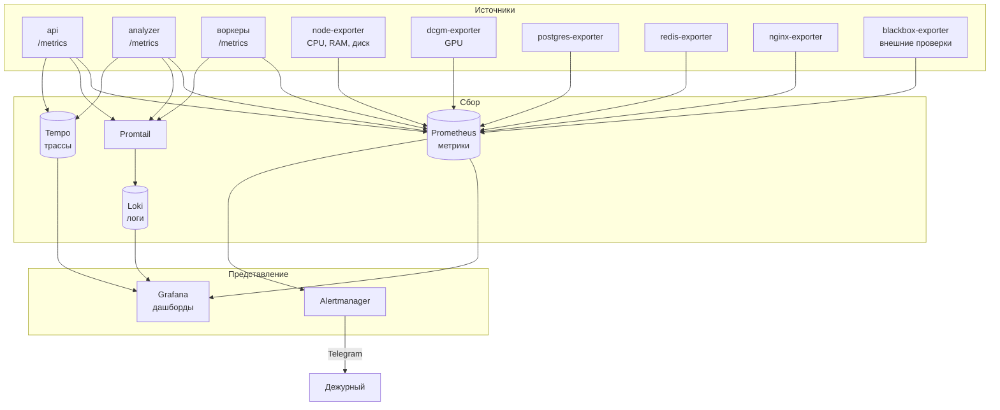
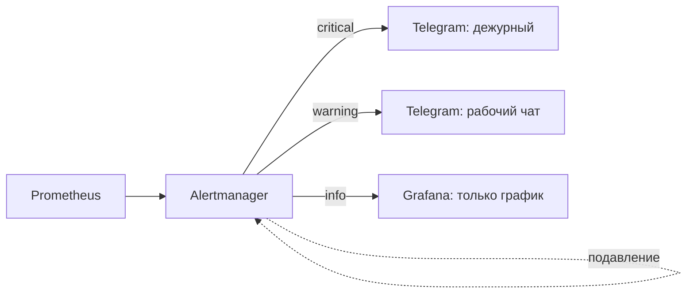
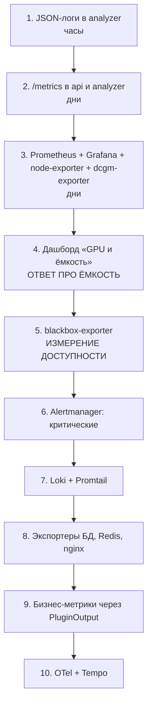

# 12. Мониторинг и наблюдаемость

**Статус документа:** актуален на 2026-07-16
**Аудитория:** DevOps, backend-инженеры, архитекторы
**Связанные документы:** [11_HIGH_AVAILABILITY.md](11_HIGH_AVAILABILITY.md), [02_INFRASTRUCTURE.md](02_INFRASTRUCTURE.md), [06_AI_ENGINE.md](06_AI_ENGINE.md), [18_ROADMAP.md](18_ROADMAP.md)

---

## 1. Назначение документа и статус

Документ описывает наблюдаемость платформы: метрики, логи, трассировку, дашборды, оповещения.

**Статус: подсистема отсутствует.** Prometheus, Grafana, Loki, Tempo, OpenTelemetry — ничего из этого не развёрнуто и не подключено.

Документ проектный: разделы 2–3 фиксируют, что есть и почему отсутствие мониторинга является блокером, а не улучшением; разделы 4–11 описывают целевую систему. Всё в разделах 4–11 помечено **[План]**.

---

## 2. Почему это блокер

Отсутствие мониторинга обычно воспринимают как «нехватку удобства». Для ViziAI это иное: **отсутствие измерений блокирует принятие решений, от которых зависит бизнес.**

Список вопросов, на которые платформа сегодня не может ответить, и последствия каждого:

| Вопрос | Что заблокировано | Ссылка |
|---|---|---|
| Сколько камер тянет один GPU? | Планирование ёмкости; момент покупки второго сервера | [02](02_INFRASTRUCTURE.md), 5.1 |
| Сколько стоит обслуживание одной точки? | **Юнит-экономика; цена подписки** | [00](00_VISION.md), 9.2 |
| Что является узким местом — GPU или CPU? | Выбор оптимизации: TensorRT или NVDEC | [06](06_AI_ENGINE.md), 3.5 |
| Какая фактическая доступность? | **SLA** | [11](11_HIGH_AVAILABILITY.md), 8 |
| `yolov8n` хуже `yolov8s` на наших данных? | Освобождение ~1 ГБ VRAM и рост пропускной способности | [06](06_AI_ENGINE.md), 3.3 |
| Какая доля алертов ложная? | Настройка порогов; доказательство качества клиенту | [09](09_WORKFLOW_ENGINE.md), 3.3 |
| Растёт ли `events:failed`? | Обнаружение рассогласования схем | [03](03_DEPLOYMENT.md), 12 |
| Какая задержка от события до алерта? | Обещания в договоре | [04](04_NETWORK.md), 10.3 |

Три из них — прямо коммерческие: цена подписки, SLA, момент капитальных затрат. **Мониторинг — не инженерное удобство, а условие того, чтобы бизнес-решения перестали быть догадками.**

Отсюда следует приоритет: мониторинг идёт сразу после резервных копий и до любой функциональной разработки.

---

## 3. Что есть сегодня

### 3.1. Реализованное

| Механизм | Что даёт | Ограничение |
|---|---|---|
| `GET /api/v1/admin/system` | Занятость диска архива, размер БД, число событий и сегментов | По запросу, без истории |
| `GET /api/v1/admin/health` | Состояние сервисов (роль `super`) | Мгновенный снимок |
| `GET /api/v1/admin/timescale` | Состояние гипертаблиц | Диагностика |
| `GET /api/v1/admin/dead-letter` | Содержимое `events:failed` + повтор | Ручной просмотр |
| `GET /api/v1/health` | Liveness api | Для healthcheck Docker |
| Healthcheck Docker | postgres, redis, minio, api | Нет у analyzer, web, воркеров, go2rtc |
| `camera_alive:{id}` (TTL 15с) | Живость камеры | Не метрика, а состояние |
| Watchdog камер | Событие `camera_offline` | Бизнес-событие, а не метрика |
| `notifications` | Журнал доставки с ошибками | Есть данные, нет агрегации |
| Логи в stdout | `docker logs` | Не собираются, теряются при ротации |
| Скрипты `scripts/diag-*.sh` | Диагностика по требованию | Ручной запуск |

### 3.2. Оценка

Платформа наблюдаема **точечно и вручную**. Есть всё для ответа на вопрос «что сейчас», нет ничего для ответа «что было» и «что меняется».

Два механизма заслуживают отдельного отношения:

**Watchdog камер — это уже мониторинг**, реализованный на уровне продукта. Он делает ровно то, что делал бы Prometheus Alertmanager: обнаруживает отсутствие сигнала и уведомляет. Разница в том, что он встроен в продукт и адресован клиенту, а не нам.

**`admin/system` — прообраз дашборда.** Он показывает то, что действительно важно (диск, размер БД), и до появления Grafana им и следует пользоваться.

### 3.3. Логи

Формат неоднороден:

| Сервис | Формат |
|---|---|
| `api` | Fastify logger (pino) — **JSON** |
| Воркеры | Свой `log()` → `JSON.stringify({ts, msg, extra})` — **JSON** |
| `analyzer` | `logging.basicConfig(format="%(asctime)s %(levelname)s %(name)s %(message)s")` — **текст** |
| `nginx`, `postgres`, `redis`, `go2rtc` | Свои форматы |

Логи не собираются, не хранятся, не ищутся. При ротации Docker теряются.

Практическое следствие: разбор инцидента недельной давности невозможен. Логи «2 курьера = 44 посетителя» — того самого инцидента, который породил половину защит Re-ID, — недоступны для повторного анализа.

Формат analyzer текстовый, тогда как остальные — JSON. Для Loki это означает невозможность единообразной фильтрации по полям.

*Рекомендация:* перевести analyzer на JSON-логирование (`python-json-logger` либо свой `Formatter`). Стоимость — часы; предусловие Loki.

---

## 4. Целевая архитектура **[План]**

### 4.1. Стек



### 4.2. Выбор компонентов

| Компонент | Назначение | Почему он |
|---|---|---|
| Prometheus | Метрики | Отраслевой стандарт; модель pull подходит к контейнерам; PromQL |
| Grafana | Дашборды | Единый интерфейс к Prometheus, Loki, Tempo |
| Loki | Логи | Индексирует метки, а не содержимое → на порядок дешевле Elasticsearch по ресурсам |
| Tempo | Трассы | Тот же принцип; интегрирован с Grafana |
| Alertmanager | Оповещения | Группировка, подавление, маршрутизация |
| OpenTelemetry | Инструментирование | Вендоронезависимо: смена бэкенда не трогает код |

**Почему не Elasticsearch (ELK):** для объёма логов ViziAI полнотекстовый индекс избыточен, а Elasticsearch требует памяти и обслуживания, сопоставимых с самой платформой. Loki хранит логи как сжатые чанки и индексирует только метки — при потребности «показать логи analyzer за период по камере X» этого достаточно.

**Почему не Zabbix:** заслуживает пояснения, поскольку в РФ он распространён. Zabbix ориентирован на мониторинг узлов и сетевого оборудования, работает по модели push с агентами и слабо подходит для метрик приложений с высокой размерностью (метки по тенанту, камере, типу события). Prometheus проектировался ровно под это. Оговорка: если on-premise-заказчик уже эксплуатирует Zabbix, интеграция потребуется — но как экспорт, а не как замена стека.

**Почему OpenTelemetry, а не клиенты Prometheus напрямую:** OTel даёт единый API для метрик, логов и трасс и позволяет сменить бэкенд конфигурацией. Для платформы, которая поставляется on-premise и должна встраиваться в чужой мониторинг, это существенно: заказчик со своим Prometheus, Datadog или VictoriaMetrics подключается без изменения кода.

### 4.3. Развёртывание

Отдельный `infra/docker-compose.monitoring.yml`, подключаемый профилем.

Обоснование: мониторинг не должен быть обязательным для запуска платформы. Точка ПВЗ с одним GPU-сервером не обязана нести Prometheus + Grafana + Loki. Профиль позволяет включать по необходимости.

Оговорка для on-premise: мониторинг платформы, работающий на том же узле, что и платформа, не увидит отказ узла. Это принимается: наша задача — метрики приложения, а инфраструктурный мониторинг у корпоративного заказчика свой.

---

## 5. Метрики **[План]**

### 5.1. Принципы

| Принцип | Обоснование |
|---|---|
| RED для сервисов: Rate, Errors, Duration | Стандарт для запросов |
| USE для ресурсов: Utilization, Saturation, Errors | Стандарт для CPU, GPU, дисков |
| Метки ограниченной мощности | `camera_id` допустим (десятки); `track_id` — **никогда** (миллионы рядов) |
| Бизнес-метрики наравне с техническими | «Событий в секунду» важнее «GC pause» |
| Единицы в имени | `_seconds`, `_bytes`, `_total` |

**Про мощность меток.** Prometheus создаёт отдельный временной ряд на каждую комбинацию меток. Метка `track_id` при тысяче людей в сутки на камеру породила бы миллионы рядов и вывела бы Prometheus из строя. Это самая частая ошибка при инструментировании, и её следует запретить явно.

Допустимые метки: `tenant_id`, `site_id`, `camera_id`, `type`, `severity`, `feature_id`, `channel`.
Запрещённые: `track_id`, `global_id`, `event_id`, `url`.

### 5.2. Analyzer — важнейший источник

Сервис, от которого зависят все незакрытые вопросы раздела 2.

```
# Приём видео
viziai_camera_frames_total{tenant_id, camera_id}                counter
viziai_camera_frames_skipped_total{tenant_id, camera_id}        counter
viziai_camera_reconnects_total{tenant_id, camera_id}            counter
viziai_camera_last_frame_timestamp{tenant_id, camera_id}        gauge
viziai_camera_connected{tenant_id, camera_id}                   gauge (0|1)

# Инференс — ключ к вопросу «сколько камер на GPU»
viziai_inference_duration_seconds{model}                        histogram
viziai_inference_queue_depth                                    gauge
viziai_detections_total{tenant_id, camera_id}                   counter

# Трекинг
viziai_tracks_active{tenant_id, camera_id}                      gauge
viziai_track_lost_total{tenant_id, camera_id}                   counter

# Re-ID — ключ к вопросу качества идентификации
viziai_reid_resolve_duration_seconds{embedder}                  histogram
viziai_reid_gallery_size{site_id}                               gauge
viziai_reid_identities_created_total{site_id}                   counter
viziai_reid_matches_total{site_id, kind="gallery|staff|face"}   counter
viziai_reid_pending_total{site_id}                              counter
viziai_reid_rejected_total{site_id, reason}                     counter

# Плагины
viziai_plugin_duration_seconds{feature_id}                      histogram
viziai_plugin_errors_total{feature_id}                          counter
viziai_plugin_events_total{feature_id, type}                    counter

# Зоны
viziai_zone_events_total{tenant_id, camera_id, type}            counter
viziai_zone_state_size{tenant_id}                               gauge

# Вывод
viziai_events_emitted_total{tenant_id, type, severity}          counter
viziai_redis_emit_errors_total{tenant_id}                       counter
```

Три метрики закрывают ключевые вопросы:

- **`viziai_inference_duration_seconds` + `viziai_inference_queue_depth`** отвечают «сколько камер тянет GPU». Растущая очередь означает, что инференс не успевает — это и есть точка насыщения.
- **`viziai_reid_rejected_total{reason}`** отвечает, почему Re-ID не создаёт личности: `low_confidence`, `small_crop`, `bad_aspect`, `probation`, `low_saturation`, `gallery_full`. Ночная слепота гистограмм ([06](06_AI_ENGINE.md), 5.4) была бы видна как всплеск `reason="low_saturation"` — то есть инцидент «2 курьера = 44 посетителя» диагностировался бы за минуту вместо расследования.
- **`viziai_camera_last_frame_timestamp`** ловит зависшую камеру ([05](05_CAMERA_CONNECTION.md), 10.3) — класс тихих отказов, невидимых сегодня.

### 5.3. API

```
# HTTP (RED)
viziai_http_requests_total{method, route, status}               counter
viziai_http_duration_seconds{method, route}                     histogram

# Потребитель событий
viziai_events_consumed_total{tenant_id, type}                   counter
viziai_events_failed_total{tenant_id, reason}                   counter
viziai_stream_lag                                               gauge
viziai_stream_pending                                           gauge
viziai_event_insert_duration_seconds                            histogram

# Ключевая метрика качества конвейера
viziai_event_e2e_latency_seconds{type}                          histogram

# WebSocket
viziai_ws_connections{tenant_id}                                gauge
viziai_ws_messages_sent_total{tenant_id}                        counter

# Фоновые процессы
viziai_reconciler_fixes_total                                   counter
viziai_watchdog_offline_total{camera_id}                        counter
viziai_retention_chunks_dropped_total                           counter
viziai_retention_segments_deleted_total                         counter
viziai_archive_free_bytes                                       gauge
```

**`viziai_event_e2e_latency_seconds`** — вычисляется как `now() - event.ts_start` при вставке. Это единственная метрика, измеряющая конвейер целиком: от момента кадра до записи в БД. Она отвечает на вопрос из [04](04_NETWORK.md), 10.3, где сегодня стоит «оценка, не измерено».

**`viziai_stream_pending`** — число неподтверждённых сообщений в группе. Рост означает отставание потребителя. Именно эта метрика показала бы потерю сообщений при отсутствии `XAUTOCLAIM` ([11](11_HIGH_AVAILABILITY.md), 4.6).

### 5.4. Воркеры

```
viziai_job_duration_seconds{queue, status}                      histogram
viziai_job_total{queue, status}                                 counter
viziai_queue_depth{queue}                                       gauge
viziai_queue_delayed{queue}                                     gauge

viziai_clip_duration_seconds{watermark}                         histogram
viziai_clip_size_bytes                                          histogram
viziai_clip_segments_used                                       histogram

viziai_alert_dispatched_total{channel, status}                  counter
viziai_alert_suppressed_total{reason}                           counter
viziai_digest_sent_total{rule_id}                               counter
viziai_digest_buffer_size{rule_id}                              gauge
```

**`viziai_alert_suppressed_total{reason}`** — метрика, делающая анти-флуд наблюдаемым. Причины: `no_alert_type`, `min_severity`, `quiet_hours`, `cooldown`, `digest`. Она отвечает на вопрос «почему я не получил уведомление» — самый частый вопрос в поддержку любой системы алертов — не по логам, а графиком.

### 5.5. Бизнес-метрики

Отдельный класс: измеряют не платформу, а продукт.

```
viziai_visitors_current{tenant_id, site_id}                     gauge
viziai_occupancy{tenant_id, camera_id}                          gauge
viziai_queue_wait_seconds{tenant_id, site_id}                   histogram
viziai_events_unresolved{tenant_id, severity}                   gauge
viziai_cameras_online_ratio{tenant_id}                          gauge
```

Первые две **уже собираются** — `CounterPlugin` пишет их в `occupancy:{tenant_id}` и `visitors:{tenant_id}`. Требуется только экспортировать.

Это же — тот самый пробел контракта плагинов ([07](07_PLUGIN_SYSTEM.md), 5.2): плагин умеет вернуть событие, но не метрику, поэтому `CounterPlugin` пишет в Redis напрямую. Предложенный там `PluginOutput.metrics` закрыл бы обе задачи одним изменением: плагины получили бы штатный канал метрик, а Prometheus — источник.

### 5.6. Экспортеры инфраструктуры

| Экспортер | Метрики | Зачем |
|---|---|---|
| node-exporter | CPU, RAM, диск, сеть | Гипотеза «узкое место — CPU декодирования» |
| **dcgm-exporter** | Загрузка GPU, VRAM, температура | **Ключевой**: отвечает «GPU или CPU» |
| postgres-exporter | Соединения, размер, репликация, медленные запросы | |
| redis-exporter | Память, ключи, длина стримов, клиенты | Контроль `maxmemory` |
| nginx-exporter | Запросы, статусы, задержка | |
| blackbox-exporter | Доступность извне | Единственная честная метрика SLA |

**blackbox-exporter заслуживает выделения.** Все прочие метрики собираются изнутри и не увидят отказ узла, VPS или канала. Проверка извне (с независимой площадки) — это то, что измеряет доступность так, как её видит клиент. Без неё SLA неизмерим по определению.

---

## 6. Логи **[План]**

### 6.1. Единый формат

Требование: все сервисы — структурированный JSON.

```json
{
  "ts": "2026-07-16T03:14:22.123Z",
  "level": "error",
  "service": "analyzer",
  "tenant_id": "...",
  "camera_id": "...",
  "trace_id": "...",
  "msg": "camera consumer crashed",
  "error": "..."
}
```

`api` и воркеры уже пишут JSON. `analyzer` требует перевода (3.3).

`trace_id` связывает лог с трассой (раздел 7).

### 6.2. Метки Loki

| Метка | Мощность | Допустима |
|---|---|---|
| `service` | ~8 | Да |
| `level` | 4 | Да |
| `tenant_id` | Десятки | Да |
| `camera_id` | **Сотни** | **Нет** — в тело, не в метку |
| `trace_id` | Миллионы | **Нет** |

То же правило, что и в Prometheus: метка создаёт поток. `camera_id` в метке при сотнях камер породит сотни потоков. Поиск по `camera_id` выполняется фильтром по содержимому:

```logql
{service="analyzer"} | json | camera_id="..."
```

### 6.3. Уровни

| Уровень | Когда | Пример |
|---|---|---|
| `error` | Требует внимания человека | Плагин упал, событие в dead-letter |
| `warn` | Аномалия, обработанная сама | Переподключение камеры, фото не найдено |
| `info` | Значимое изменение состояния | Камера запущена, модули активны |
| `debug` | Отладка, выключено в проде | Детали кадра |

Текущее использование в целом соответствует. Одно замечание: `logger.exception("plugin %s failed")` на каждом кадре при систематической ошибке плагина зальёт хранилище трассировками ([07](07_PLUGIN_SYSTEM.md), 4.2).

*Рекомендация:* ограничение частоты для повторяющихся ошибок — логировать первое вхождение и далее агрегат («N раз за минуту»). Метрика `viziai_plugin_errors_total` при этом остаётся точной: считать следует всё, логировать — не всё.

---

## 7. Трассировка **[План]**

### 7.1. Ценность и границы

Распределённая трассировка отвечает на вопрос «где именно ушло время».

Реалистичная оценка для ViziAI: **ценность средняя, ниже метрик и логов.** Причина — конвейер преимущественно асинхронный и разорван очередями. Трасса «кадр → событие → алерт» проходит через Redis Stream и BullMQ, то есть контекст нужно протаскивать вручную через сообщения.

Сценарии, где трассировка окупается:

| Сценарий | Ценность |
|---|---|
| Медленный HTTP-запрос (аналитика) | **Высокая**: видно, что тормозит — БД или сериализация |
| Нарезка клипа | Средняя: выборка сегментов, ffmpeg, выгрузка в MinIO |
| Кадр → событие → алерт | Средняя: разорвана очередями |
| Обработка кадра | **Низкая**: метрики-гистограммы дешевле и достаточны |

### 7.2. Реализация

`trace_id` порождается на входе (HTTP-запрос или кадр) и передаётся в `meta` сообщения:

```python
payload = {
    "stream": "events",
    "tenant_id": ..., 
    "meta": {..., "trace_id": trace_id},
}
```

Это же даёт связь события с логами всех сервисов, через которые оно прошло, — что ценно и без Tempo.

*Рекомендация по порядку:* трассировку внедрять **последней**, после метрик и логов. Обоснование: метрики отвечают «что не так», логи — «почему», трассы — «где именно». Первые два вопроса стоят чаще и стоят дешевле. Внедрять OTel SDK, впрочем, следует сразу — тогда трассы включаются конфигурацией.

---

## 8. Дашборды **[План]**

| Дашборд | Аудитория | Содержание |
|---|---|---|
| **Обзор платформы** | Дежурный | Доступность, камеры онлайн, событий в секунду, ошибки, `events:failed` |
| **GPU и ёмкость** | Инженер | Загрузка GPU, VRAM, гистограмма инференса, глубина очереди, камер на узел |
| **Камеры** | Сопровождение | Онлайн/офлайн, переподключения, возраст последнего кадра, FPS |
| **Конвейер** | Инженер | Событий по типам, лаг стрима, pending, e2e-задержка, dead-letter |
| **Re-ID** | Инженер CV | Размер галереи, созданные личности, совпадения, отказы по причинам |
| **Алерты** | Продукт | Доставлено по каналам, подавлено по причинам, сводки, отказы |
| **Инфраструктура** | DevOps | CPU, RAM, диски, сеть, PostgreSQL, Redis |
| **Бизнес** | Руководство | Посетители по точкам, очередь, необработанные события |

Дашборд «GPU и ёмкость» — первый по значимости: он отвечает на вопрос, блокирующий и планирование, и экономику.

---

## 9. Оповещения **[План]**

### 9.1. Принцип

Тот же, что для продуктовых алертов ([00](00_VISION.md), 11.2): **оповещение, которое начали игнорировать, хуже отсутствия оповещения.**

Правило: оповещение создаётся, только если есть **действие**, которое дежурный должен выполнить. «CPU 80%» без действия — это график, а не оповещение.

### 9.2. Критические (будят человека)

| Оповещение | Условие | Действие |
|---|---|---|
| Платформа недоступна | blackbox: `/api/v1/health` не отвечает 2 мин | Восстановить |
| События не поступают | `rate(viziai_events_consumed_total[10m]) == 0` при камерах онлайн | Диагностика конвейера |
| Dead-letter растёт | `rate(viziai_events_failed_total[5m]) > 0` | **Рассогласование схем** |
| PostgreSQL недоступен | `pg_up == 0` | Восстановить |
| Redis недоступен | `redis_up == 0` | Восстановить |
| Диск архива заполнен | `viziai_archive_free_bytes < 5GB` | Проверить ретеншен |
| Диск данных заполнен | `node_filesystem_avail < 10%` | **Остановит PostgreSQL** |
| Analyzer не обрабатывает | `time() - viziai_camera_last_frame_timestamp > 300` для всех камер | Перезапуск |

### 9.3. Предупреждения (рабочее время)

| Оповещение | Условие |
|---|---|
| GPU насыщен | `DCGM_FI_DEV_GPU_UTIL > 90%` 30 мин |
| VRAM на исходе | `DCGM_FI_DEV_FB_FREE < 500MB` |
| Отставание стрима | `viziai_stream_pending > 100` 10 мин |
| Очередь растёт | `viziai_queue_depth{queue="clips"} > 50` |
| Алерты не доставляются | `rate(viziai_alert_dispatched_total{status="failed"}[15m]) > 0.1` |
| Камера часто переподключается | `rate(viziai_camera_reconnects_total[1h]) > 10` |
| Re-ID отклоняет всё | `rate(viziai_reid_rejected_total[1h]) / rate(...)` > 0.9 |
| Память Redis | `redis_memory_used_bytes / maxmemory > 0.8` |

Последнее предупреждение о Re-ID — пример метрики, выведенной из инцидента: ночная слепота гистограмм проявилась бы как отклонение почти всех кропов.

### 9.4. Что не должно быть оповещением

| Кандидат | Почему нет |
|---|---|
| Камера офлайн | **Продуктовое событие**, адресованное клиенту (watchdog). Не наша проблема — канал клиента |
| Высокий CPU | Без последствий — это график |
| Много событий | Норма в час пик |
| Плагин упал один раз | Изолировано; важна частота, а не факт |

Первая строка принципиальна: камера офлайн — это `camera_offline` для владельца, а не оповещение дежурному. Смешение этих двух контуров привело бы к тому, что дежурного будят из-за выключенного кассового ПК клиента.

### 9.5. Маршрутизация



Alertmanager умеет группировку и подавление (inhibition) из коробки. Подавление здесь ценно: при отказе узла не нужно 20 оповещений о каждом сервисе — достаточно одного о узле. Это тот же принцип, что реализован в сводке алертов ([08](08_RULE_ENGINE.md), 4.4), но готовым инструментом.

---

## 10. On-premise

Особенности:

| Аспект | Решение |
|---|---|
| Интернет отсутствует | Стек полностью локален; Alertmanager → SMTP вместо Telegram |
| Свой мониторинг у заказчика | Экспорт метрик; интеграция, а не замена |
| Требования СБ | Логи в SIEM заказчика (syslog / Splunk / Elastic) |
| Zabbix у заказчика | Prometheus → Zabbix через `zabbix_sender` **[Требует решения]** |

*Рекомендация:* эндпоинт `/metrics` в формате Prometheus — **достаточный интерфейс интеграции**. Любая современная система мониторинга умеет его читать. Не следует реализовывать поддержку конкретных систем заказчиков; следует отдавать стандартный формат.

---

## 11. План внедрения



| Шаг | Стоимость | Что разблокирует |
|---|---|---|
| 1–4 | ~неделя | **Ёмкость, юнит-экономика, выбор оптимизации** |
| 5 | ~день | **SLA** |
| 6 | ~день | Дежурство |
| 7–8 | ~неделя | Разбор инцидентов |
| 9 | Дни | Бизнес-дашборд |
| 10 | Недели | Оптимизация задержек |

Шаги 1–5 закрывают все восемь вопросов раздела 2. Это примерно две недели работы, разблокирующие решения о цене подписки, покупке оборудования и договорных обязательствах.

---

## 12. Реестр решений

| № | Решение | Обоснование | Альтернатива и почему отвергнута |
|---|---|---|---|
| M-01 | Мониторинг — приоритет сразу после резервных копий | Блокирует ёмкость, экономику и SLA | «Потом»: решения остаются догадками |
| M-02 | Prometheus + Grafana + Loki + Tempo | Стандарт; Loki дешевле ELK на порядок | ELK: ресурсы уровня самой платформы |
| M-03 | Не Zabbix | Ориентирован на узлы; плох для метрик с метками | Zabbix: не подходит по модели данных |
| M-04 | OpenTelemetry как API | Смена бэкенда без изменения кода; важно для on-premise | Клиенты Prometheus: привязка к бэкенду |
| M-05 | Мониторинг — отдельный профиль compose | Точка на одном сервере не обязана нести стек | В основном compose: обязательные накладные расходы |
| M-06 | Метки ограниченной мощности; `track_id` запрещён | Миллионы рядов выведут Prometheus из строя | Свободные метки: отказ мониторинга |
| M-07 | Оповещение только при наличии действия | Игнорируемое оповещение хуже отсутствия | Оповещать обо всём: шум |
| M-08 | «Камера офлайн» — продуктовое событие, не оповещение дежурному | Зависит от клиента, не от нас | Оповещать: дежурного будит чужой ПК |
| M-09 | Трассировка — последней | Конвейер асинхронный; метрики отвечают на более частые вопросы | Сначала трассы: дорого, польза ниже |
| M-10 | `/metrics` — достаточный интерфейс интеграции | Стандарт читают все | Поддержка систем заказчиков: бесконечная работа |
| M-11 | blackbox-exporter обязателен для SLA | Внутренние метрики не видят отказ узла | Только внутренние: SLA неизмерим |

---

## 13. Долг наблюдаемости

| № | Проблема | Влияние | Приоритет |
|---|---|---|---|
| M-D-01 | Нет метрик | **Ёмкость, экономика, SLA — догадки** | **Критический** |
| M-D-02 | Логи не собираются | Разбор инцидента прошлой недели невозможен | **Высокий** |
| M-D-03 | Нет измерения доступности извне | SLA неизмерим | **Высокий** |
| M-D-04 | Нет метрик GPU | Неизвестно, что узкое место | **Высокий** |
| M-D-05 | `analyzer` логирует текстом, остальные — JSON | Блокер Loki | Средний |
| M-D-06 | Нет healthcheck у analyzer | Самый важный сервис без проверки | Высокий |
| M-D-07 | Плагин может залить логи трассировками | Исчерпание хранилища | Низкий |
| M-D-08 | Метрики `occupancy`/`visitors` собираются, но не экспортируются | Данные есть, дашборда нет | Средний |
| M-D-09 | Нет оповещений | Отказ обнаруживается клиентом | **Высокий** |
| M-D-10 | Нет e2e-задержки конвейера | Нечего обещать в договоре | Средний |

---

## 13. Расширение по [REVIEW_BOARD.md](REVIEW_BOARD.md)

**Статус: [План].** Добавлено по итогам ревью (B-08, B-59, B-76). Ключевая находка: правило «`camera_id` допустим как метка» верно при 4 камерах и ложно при 5000.

### 13.1. Кардинальность при планке — критический пересмотр (B-08)

Кардинальность метрики = число уникальных комбинаций её меток. Каждая уникальная комбинация — отдельный временной ряд в памяти Prometheus. Взрыв кардинальности — способ номер один убить Prometheus.

**Что ломается при планке.** Если существующие рекомендации ставят `camera_id` меткой:

```
1000 клиентов × 4 камеры = 4000 камер
× 11 типов событий = 44 000 рядов только на счётчик событий
× по каждой метрике с camera_id → сотни тысяч рядов
```

При крупных клиентах (производство, 200 камер) — миллионы. Prometheus не выдержит.

**Правило кардинальности:**

| Метка | Допустима на метрике | Причина |
|---|---|---|
| `tenant_id` | Осторожно | 1000 значений — граница; не на всех метриках |
| `cell_id` | **Да** | Десятки значений |
| `camera_id` | **Нет на агрегатах** | Тысячи значений × метрики = взрыв |
| `zone_id` | **Нет** | Ещё больше |
| `event_type` | Да | 11 значений |
| `severity` | Да | 3 значения |
| `status` (http, job) | Да | Единицы |
| `global_id` | **Никогда** | Неограниченно; к тому же ПДн-адъяцентно |

**Разрешение.** Данные высокой кардинальности — не в метрики, а в **логи/события** (по ним другой запрос):

| Вопрос | Где отвечать |
|---|---|
| Сколько событий по типу за час? | Метрика `viziai_events_total{type, severity, cell}` |
| Сколько событий на камере X? | **Запрос к БД событий**, не метрика |
| Топ камер по нарушениям | БД, не Prometheus |
| Утилизация GPU по ячейке | Метрика `{cell_id}` |
| Задержка камеры X | Exemplar/лог, не постоянный ряд |

*Рекомендация:* пересмотреть все метрики `viziai_*` на предмет меток высокой кардинальности. Правило: **метка допустима, только если множество её значений ограничено и мало.** Вопросы «по конкретной камере» решаются запросом к БД, а не постоянным временным рядом. Это прямо противоречит части существующих рекомендаций документа и должно их заменить.

### 13.2. Долгосрочное хранение метрик при планке

Один Prometheus не хранит метрики долго и не масштабируется на 20 ячеек.

| Компонент | Роль |
|---|---|
| Prometheus на ячейку | Сбор, короткое хранение (15 дней), локальные алерты |
| **Thanos / Mimir** | Долгосрочное хранение, глобальный запрос по ячейкам, дедупликация |
| Объектное хранилище | Блоки Thanos (S3/MinIO) |

*Рекомендация:* Prometheus на ячейку + Thanos для глобального взгляда. Обоснование: центральный Prometheus, скребущий 20 ячеек, воссоздаёт единую точку отказа и кардинальность всех клиентов сразу. Thanos агрегирует, не централизуя сбор. Это сетевой аналог веерного запроса ([20](20_SCALE_ARCHITECTURE.md), 4.4): каждая ячейка наблюдает себя, глобальный слой объединяет.

### 13.3. SLI как метрики (B-76)

SLI из [22](22_SRE_OPERATIONS.md), 3.2 — это конкретные метрики. Их формулы:

| SLI | Метрики | Тип |
|---|---|---|
| SLI-1 приём | `viziai_events_consumed_total`, `viziai_events_emitted_total` | counter |
| SLI-2 своевременность | `viziai_event_e2e_latency_seconds` | histogram |
| SLI-3 крит. уведомления | `viziai_alert_dispatched_total{status, severity}` | counter |
| SLI-4 API | `viziai_http_requests_total{status}` | counter |
| SLI-6 готовность | `viziai_camera_ready` | gauge |
| SLI-7 архив | `viziai_archive_segments_total{status}` | counter |
| инференс | `viziai_inference_duration_seconds`, `viziai_inference_queue_depth` | histogram, gauge |
| дрейф | `viziai_detection_confidence`, `viziai_reid_rejected_total{reason}` | histogram, counter |
| NTP | `viziai_clock_drift_seconds` | gauge |
| парк | `viziai_fleet_devices_total{status}`, `viziai_fleet_tunnel_handshake_age_seconds` | gauge |

Оповещения по этим SLI — многооконные по скорости выгорания ([22](22_SRE_OPERATIONS.md), 5.2), не пороговые. Пороговые — только для бинарных состояний (БД недоступна, диск полон).

Метрика `viziai_clock_drift_seconds` — прямое следствие находки NTP ([04](04_NETWORK.md), 16.1): дрейф часов ломает Re-ID и клипы тихо, поэтому обязан мониториться как SLI-смежная величина.

### 13.4. SIEM-экспорт (B-59)

Разобран в [23](23_ENTERPRISE_INTEGRATION.md), 4. Здесь — связь с наблюдаемостью: логи безопасности идут двумя путями:

| Путь | Назначение |
|---|---|
| Loki (наш) | Наша эксплуатация, дежурный |
| **CEF/syslog → SIEM клиента** | Требование СБ заказчика |

Это не дублирование, а разные потребители. Аудит-события ([13](13_SECURITY.md), 7) — источник для обоих. Формат для SIEM — CEF поверх syslog TCP+TLS ([23](23_ENTERPRISE_INTEGRATION.md), 4.3), надёжная доставка обязательна (аудит терять нельзя).

### 13.5. Наблюдаемость самого мониторинга

При планке мониторинг — критическая система. Кто следит за тем, что Prometheus жив?

*Рекомендация:* мёртвый простой внешней пробы (blackbox из другого места), проверяющей, что мониторинг отвечает; алерт по независимому каналу (не через тот же стек). Иначе сценарий «мониторинг лёг, поэтому мы не узнали, что всё лежит» — классический и предсказуемый.

### 13.6. Дополнения к реестрам

| № | Решение | Обоснование | Альтернатива |
|---|---|---|---|
| M-11 | `camera_id`/`zone_id`/`global_id` не метки на агрегатах | Тысячи значений × метрики = взрыв кардинальности | Как метка: убивает Prometheus при планке |
| M-12 | Вопросы «по камере» — запрос к БД, не метрика | Разделение: агрегаты в метрики, детали в БД | Всё в метрики: неограниченная кардинальность |
| M-13 | Prometheus на ячейку + Thanos | Центральный сбор = SPOF и кардинальность всех сразу | Один Prometheus: не масштабируется |
| M-14 | Оповещения многооконные по выгоранию | Ловят медленную деградацию, число из SLO | Пороги: не связаны с обязательством |
| M-15 | Внешняя проба самого мониторинга | «Мониторинг лёг → не узнали» — предсказуемо | Без: слепое пятно на критической системе |

Долг (дополнение):

| № | Проблема | Влияние | Приоритет |
|---|---|---|---|
| M-D-05 | **Метки высокой кардинальности в рекомендациях** | Prometheus не выдержит при планке | **Критично** |
| M-D-06 | SLI не реализованы как метрики | SLA без измерения ([22](22_SRE_OPERATIONS.md)) | **Критично** |
| M-D-07 | Нет долгосрочного хранения (Thanos/Mimir) | Не масштабируется на ячейки | Высокий |
| M-D-08 | Нет `viziai_clock_drift_seconds` | Дрейф часов ломает Re-ID/клипы тихо | Высокий |
| M-D-09 | Нет наблюдения за самим мониторингом | Слепое пятно | Средний |
