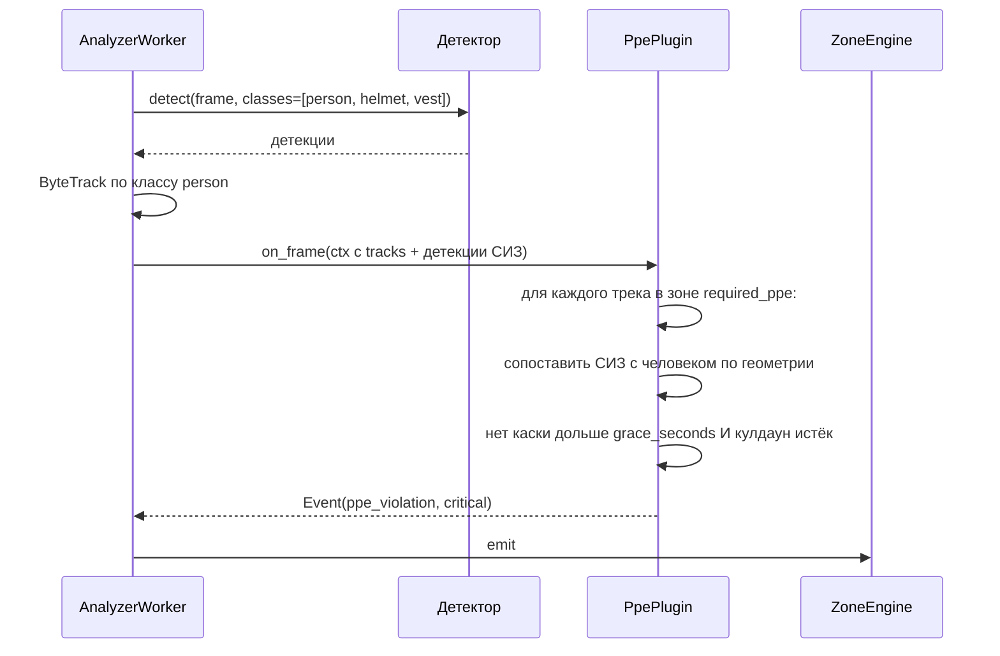
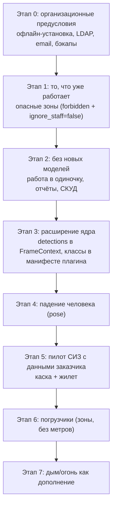

# 14. Промышленные модули

**Статус документа:** актуален на 2026-07-16
**Аудитория:** продуктовые менеджеры, инженеры компьютерного зрения, архитекторы
**Связанные документы:** [06_AI_ENGINE.md](06_AI_ENGINE.md), [07_PLUGIN_SYSTEM.md](07_PLUGIN_SYSTEM.md), [15_PVZ_MODULES.md](15_PVZ_MODULES.md), [04_NETWORK.md](04_NETWORK.md), [18_ROADMAP.md](18_ROADMAP.md)

---

## 1. Назначение и статус

Документ описывает модули для производственных площадок: контроль СИЗ, безопасность зон, погрузчики, простои, OEE, предиктивное обслуживание.

**Статус: ни один промышленный модуль не реализован.** В перечислении `feature_kind` есть значение `ppe`, в `zone_kind` — `required_ppe`, в `event_type` — `ppe_violation`. Ни одно не имеет обработчика ([07](07_PLUGIN_SYSTEM.md), 6.2; [08](08_RULE_ENGINE.md), 3.2).

Документ проектный. Его главная ценность — не список желаемых функций, а **честная оценка того, что отделяет платформу от производственного рынка** (раздел 3) и в каком порядке это преодолевать (раздел 11).

---

## 2. Почему производство

Второй целевой рынок после ПВЗ ([00_VISION.md](00_VISION.md), 4.1).

| Фактор | Оценка |
|---|---|
| Платёжеспособность | **Высокая**: бюджет на охрану труда существует и защищён |
| Мотив | Штрафы ГИТ, страховые случаи, требования заказчиков по ОТ |
| Число камер на клиента | 10–200 против 2–6 у ПВЗ |
| Цикл продажи | **Месяцы** против дней |
| Порог входа | **Высокий**: on-premise, СБ, ОТ, IT предприятия |
| Готовность платформы | **Низкая** |

Ключевое отличие от ПВЗ: у владельца ПВЗ мотив — «узнать, что происходит». У предприятия мотив — **«доказать, что мы приняли меры»**. Это меняет требования к продукту: важна не столько точность детекции, сколько полнота фиксации, аудит и отчётность.

---

## 3. Что отделяет платформу от производственного рынка

Раздел определяет содержание всего документа. Барьеры перечислены по значимости.

### 3.1. Барьер 1: модель детекции

Платформа детектирует **только человека** (`classes=[PERSON_CLASS]`, COCO класс 0).

В COCO нет: каски, жилета, перчаток, очков, погрузчика (есть `truck`, но это не то), огня, дыма, разлива, станка.

Следствие: **ни один промышленный модуль не может быть реализован на текущей модели.** Это не вопрос плагина — это вопрос новой модели детекции.

Варианты и оценка:

| Вариант | Оценка |
|---|---|
| Открытая модель СИЗ | Существуют модели на базе YOLO, обученные на публичных наборах. Качество на конкретном заводе — **непредсказуемо** |
| Дообучение на данных заказчика | Единственный надёжный путь. Требует разметки |
| Open-vocabulary модели (YOLO-World, Grounding DINO) | Детекция по текстовому описанию («person wearing hard hat»). Заманчиво; точность для контроля ОТ — **[Требует проверки]** |

*Рекомендация:* не обещать СИЗ до пилота с заказчиком, готовым дать данные. Обоснование: каски бывают разных цветов и форм, освещение цеха специфично, ракурсы камер уникальны. Модель, обученная на чужом наборе, покажет на конкретном заводе точность, которую невозможно предсказать заранее — а ложное срабатывание в системе ОТ обесценивает её мгновенно ([00](00_VISION.md), 11.3).

Правильная последовательность продажи: пилот → сбор данных → разметка → обучение → внедрение. Это **месяцы**, и их следует закладывать в договор, а не открывать после подписания.

### 3.2. Барьер 2: точность и цена ошибки

| Задача | Цена ложного срабатывания | Цена пропуска |
|---|---|---|
| Очередь в ПВЗ | Владелец пожал плечами | Никто не заметил |
| **Человек в опасной зоне** | Остановка работ впустую | **Травма** |
| **Нет каски** | Несправедливое взыскание работнику | Травма; штраф ГИТ |

На производстве ошибка стоит несопоставимо дороже. Система, дающая 10% ложных срабатываний по СИЗ, будет отключена в первую неделю: мастер не станет разбирать 50 ложных нарушений в смену.

Это же определяет требование к отчётности: каждое нарушение — потенциальное основание для взыскания, а значит, должно иметь доказательство (клип, снапшот) и возможность оспорить.

### 3.3. Барьер 3: граница функциональной безопасности

Зафиксировано в [04_NETWORK.md](04_NETWORK.md), 11.3 и повторяется здесь как продуктовое ограничение:

**Платформа не является системой функциональной безопасности и не должна останавливать оборудование.**

Обоснование:
- Защита человека у станка регулируется требованиями функциональной безопасности (SIL по МЭК 61508, PL по ISO 13849).
- Система на базе нейросети даёт вероятностный вывод. Она не может гарантировать обнаружение, а SIL требует именно гарантии с расчётной интенсивностью отказов.
- Сертификация такой системы для нейросетевой детекции сегодня недостижима.

Допустимое позиционирование: **предупреждение оператора и фиксация нарушений.** Недопустимое: «система остановит конвейер, если человек войдёт в зону».

*Практическое следствие для продаж:* формулировка в коммерческом предложении должна быть «предупреждение и фиксация», а не «блокировка». Эта граница должна быть проговорена до пилота — иначе на этапе внедрения заказчик потребует того, что мы не имеем права дать.

### 3.4. Барьер 4: организационный

| Требование | Состояние | Документ |
|---|---|---|
| On-premise в изолированной сети | Архитектурно да, офлайн-установка **невозможна** | [03](03_DEPLOYMENT.md), 7.2 |
| LDAP / Active Directory | **Нет** | [13](13_SECURITY.md), 6 |
| Аудит | Есть, но без входа в систему | [13](13_SECURITY.md), 7 |
| Отчёты для ОТ | **Нет** | Раздел 9 |
| Email вместо Telegram | **Нет** | [08](08_RULE_ENGINE.md), 5.4 |
| Резервное копирование | **Нет** | [02](02_INFRASTRUCTURE.md), 10 |
| Мониторинг и SIEM | **Нет** | [12](12_MONITORING.md) |
| Astra Linux | Не проверялось | [03](03_DEPLOYMENT.md), 7.4 |

**Вывод:** организационные барьеры сегодня закрывают рынок надёжнее, чем отсутствие моделей. Завод не купит систему без LDAP и офлайн-установки, даже если детекция СИЗ будет идеальной.

Это существенно для планирования: работы по [03](03_DEPLOYMENT.md), 7.2 (офлайн-установка) и [13](13_SECURITY.md), 6 (LDAP) являются **предусловием** промышленных модулей, а не сопутствующими задачами.

---

## 4. Что переиспользуется без изменений

Позитивная сторона: ядро платформы отраслево нейтрально и готово к производству.

| Механизм | Применимость на производстве |
|---|---|
| Приём RTSP, откат, изоляция | Полностью |
| Зоны (полигоны, расписание, dwell) | Полностью: опасные зоны, участки, проходы |
| `ignore_staff = false` в зоне | **Нужно именно здесь**: на участке все — персонал |
| Ночной режим (`all_from`/`all_to`) | Полностью |
| Правила, кулдаун, тихие часы, сводки | Полностью |
| Клипы как доказательство | **Критично для ОТ** |
| Аудит | Требование СБ |
| Re-ID без биометрии | **Преимущество**: профсоюз и юристы против биометрии работников |
| Контракт `FeaturePlugin` | Готов принять промышленные модули |
| Мультитенантность | Один завод = один тенант; цеха = площадки |

Строка про Re-ID заслуживает выделения. Биометрический контроль работников — тема, вызывающая сопротивление профсоюзов и вопросы трудовой инспекции. Идентификация по спецодежде без лиц снимает возражение и является тем же аргументом, что и на рынке ПВЗ, но с большим весом.

Дополнительно: спецодежда на производстве **однородна и стабильна** — работник в одной и той же робе всю смену. Для Re-ID по внешности это лучшие условия, чем в ПВЗ. Обратная сторона: работники в одинаковой спецодежде **неразличимы** — HSV-гистограммы дадут почти идентичные эмбеддинги. Это ломает подсчёт уникальных людей, но не мешает исключению персонала.

*Вывод:* на производстве Re-ID применим для «это работник» (одежда однородна — легко), но не для «это конкретный работник» (одежда одинакова — невозможно). Идентификация личности потребует либо Face-ID с согласия, либо интеграции со СКУД ([09](09_WORKFLOW_ENGINE.md), 8).

---

## 5. Модуль: контроль СИЗ **[План]**

### 5.1. Задача

Обнаружить работника без обязательного средства индивидуальной защиты в зоне, где оно требуется.

| СИЗ | Сложность детекции |
|---|---|
| Каска | **Низкая**: крупная, контрастная, на голове |
| Сигнальный жилет | **Низкая**: яркий, крупный |
| Защитные очки | **Высокая**: мелкие, прозрачные |
| Перчатки | **Высокая**: мелкие, сливаются с руками |
| Респиратор | Средняя |
| Спецобувь | **Очень высокая**: часто вне кадра |

*Рекомендация:* начинать **только с каски и жилета**. Они детектируются надёжно и составляют основную массу требований ОТ. Очки и перчатки на типовой камере видеонаблюдения (не крупный план) детектируются с точностью, непригодной для взысканий.

Обещать «контроль всех СИЗ» — путь к провалу пилота.

### 5.2. Архитектура

Зона `kind = required_ppe` (значение уже есть в перечислении) + плагин `ppe` (значение уже есть в `feature_kind`).



Ключевая деталь: **СИЗ детектируется, но не трекается.** Трекается человек; СИЗ сопоставляется с ним по геометрии на каждом кадре:

- Каска: центр в верхней трети bbox человека.
- Жилет: пересечение с центральной частью bbox.

Это устраняет необходимость трекать мелкие объекты — задачу, с которой ByteTrack справляется плохо.

### 5.3. Требование к контракту плагина

Сегодня `FrameContext` содержит `tracks: list[TrackInfo]` — только люди. Детекции иных классов **некуда положить**.

*Рекомендация:* расширить контракт:

```python
@dataclass(slots=True)
class FrameContext:
    ...
    tracks: list[TrackInfo]              # люди (трекаются)
    detections: list[Detection] = field(default_factory=list)  # прочие классы
```

Это же требует, чтобы плагин мог **заявить, какие классы ему нужны** — иначе детектор не будет их искать. Механизм предложен в манифесте плагина ([07](07_PLUGIN_SYSTEM.md), 9.4): `requires.detector_classes: [0, 7]`.

Два изменения ядра — предусловие всех промышленных модулей, а не только СИЗ.

### 5.4. Обязательные защиты

Выведены из уроков Re-ID ([06](06_AI_ENGINE.md), 5.4) — те же принципы применимы:

| Защита | Параметр | Что предотвращает |
|---|---|---|
| Отсрочка | `grace_seconds = 10` | Работник надевает каску на входе — не нарушение |
| Требование устойчивости | `min_frames_without = 5` | Каска не распозналась на одном кадре |
| Порог уверенности | `min_confidence = 0.6` | Слабые детекции |
| Минимальный размер | `min_person_px = 120` | Далёкий человек — не судить |
| Кулдаун по личности | `cooldown_seconds = 300` | Один работник = один повод |
| Расписание зоны | `active_from/to` | Вне смены зона не активна |

Отсрочка принципиальна: без неё каждый входящий в цех получит нарушение в момент пересечения границы зоны, пока каска ещё в руке.

### 5.5. Событие

```json
{
  "type": "ppe_violation",
  "severity": "critical",
  "zone_id": "...",
  "track_id": 42,
  "meta": {
    "missing": ["helmet"],
    "present": ["vest"],
    "confidence": 0.87,
    "duration_sec": 12.4,
    "global_id": "..."
  }
}
```

`missing` — массив: одновременно может отсутствовать несколько СИЗ. Требуемый набор задаётся в `zone.config.required: ["helmet", "vest"]` — разные участки требуют разного.

---

## 6. Модуль: безопасность зон **[План]**

### 6.1. Что уже работает

**Этот модуль реализован на 80% и не требует новых моделей.**

Зона `kind = forbidden` + `config.ignore_staff = false` даёт `zone_violation` (critical) при появлении человека. Пример настройки — [08_RULE_ENGINE.md](08_RULE_ENGINE.md), 8.5.

Это сегодня работающий промышленный сценарий: опасная зона у пресса, зона движения крана, участок под ремонтом.

### 6.2. Чего не хватает

| Возможность | Ценность | Требует |
|---|---|---|
| Дистанция до опасного объекта | Высокая | Калибровку либо стереокамеру |
| Зона, активная только при работе станка | **Высокая** | Интеграцию с АСУ ТП (сигнал «станок работает») |
| Динамическая зона вокруг погрузчика | Высокая | Детекцию погрузчика |
| Направление движения (входит/выходит) | Средняя | `zone_kind = line` ([08](08_RULE_ENGINE.md), 3.9) |
| Счёт людей в зоне (не более N) | Средняя | Расширение `CrowdPlugin` с `zone_ids` — **почти есть** |

Вторая строка — самая ценная и самая недооценённая. Зона у станка опасна **только когда станок работает**. Постоянно активная зона даст непрерывный поток нарушений (наладчик работает у остановленного станка legitimно). Сигнал «станок работает» приходит из АСУ ТП.

Это же — граница из 3.3: мы **принимаем** сигнал из АСУ ТП, но не **отправляем** в неё команд. Чтение состояния безопасно; управление — нет.

*Рекомендация:* реализовать как условие активности зоны через внешний сигнал: `zone.config.active_when: {source: "webhook", key: "machine_42_running"}`. Внешняя система шлёт состояние в API, зона активируется. Это расширяет модель расписаний зон с временного окна на произвольное условие.

---

## 7. Модуль: погрузчики **[План]**

### 7.1. Задача

Погрузчик — главный источник травм на складе. Сценарии:

| Сценарий | Приоритет |
|---|---|
| Человек в зоне движения погрузчика | **Высший** |
| Дистанция человек–погрузчик менее N метров | Высокий |
| Превышение скорости | Средний |
| Погрузчик в пешеходной зоне | Средний |
| Погрузчик с поднятыми вилами в движении | Низкий (сложно) |

### 7.2. Сложность

| Аспект | Оценка |
|---|---|
| Детекция погрузчика | Средняя: крупный, характерный; в COCO нет — нужна модель |
| Трекинг | Низкая: крупный объект |
| **Дистанция в метрах** | **Высокая**: требует калибровки камеры |
| Скорость | Высокая: то же |

**Дистанция — ключевая проблема.** Bbox даёт пиксели, а требование ОТ формулируется в метрах. Перевод требует калибровки: гомография плоскости пола либо известные размеры объектов в кадре.

Варианты:

| Вариант | Оценка |
|---|---|
| Гомография пола по 4 точкам | Работает для плоского пола; требует ручной калибровки на каждой камере |
| Оценка глубины (MiDaS, Depth Anything) | Без калибровки; точность в метрах — низкая |
| Стереокамера | Точно; иное оборудование |

*Рекомендация:* начинать **без метров**. Первая версия: зоны движения погрузчиков (полигон) + правило «человек в зоне, когда там погрузчик». Это не требует калибровки и покрывает главный сценарий. Дистанцию в метрах вводить только по требованию заказчика и с ручной калибровкой через интерфейс (тот же редактор зон, но с указанием четырёх точек и реальных размеров).

---

## 8. Модули: простои, OEE, цифровой двойник **[План]**

### 8.1. Простой оборудования

Задача: станок не работает — зафиксировать и измерить.

**Оценка применимости видеоаналитики: низкая.**

Обоснование: факт работы станка достовернее получить из АСУ ТП, счётчика циклов или датчика тока, чем из видео. Видео даёт косвенный признак (движение в области станка), который ошибается при любом изменении освещения.

Единственный оправданный сценарий: **станок не подключён к АСУ ТП** (старое оборудование). Тогда видео — единственный источник. Реализация: детекция движения в полигоне станка, состояние «работает/простаивает» по порогу.

*Рекомендация:* не позиционировать как основную функцию. Предлагать как дополнение для оборудования без телеметрии, честно проговаривая точность.

### 8.2. OEE

OEE (Overall Equipment Effectiveness) = Доступность × Производительность × Качество.

| Составляющая | Может ли дать видео |
|---|---|
| Доступность (время работы / плановое) | Частично: через 8.1 |
| Производительность (факт / норма) | Частично: счёт изделий на конвейере |
| **Качество (годные / всего)** | **Нет**: требует контроля качества — иной продукт ([05](05_CAMERA_CONNECTION.md), 9.3) |

**Вывод: платформа не может считать OEE.** Она может дать данные для одной из трёх составляющих.

*Рекомендация:* **не заявлять OEE в возможностях.** OEE — термин из MES-систем, и заказчик, услышав его, ожидает полноценного расчёта. Честная формулировка: «данные о времени работы участка для вашей MES».

Это тот случай, когда заявление функции, которую продукт не может выполнить, разрушает доверие сильнее, чем её отсутствие.

### 8.3. Цифровой двойник

**Оценка: не наш продукт.**

Цифровой двойник — это имитационная модель производства, синхронизированная с реальностью. Видеоаналитика может быть **источником данных** для двойника, но не двойником.

*Рекомендация:* не входить. Позиционирование — «поставщик событий для вашей системы» через webhook.

### 8.4. Предиктивное обслуживание

**Оценка: не наш продукт.**

Предсказание отказа оборудования строится на вибрации, температуре, токе, наработке. Видео этого не даёт.

Исключение, где видео применимо: визуальные признаки — течь под станком, дым, искрение, разрушение ограждения. Это детекция аномалий, а не предиктивное обслуживание.

*Рекомендация:* не заявлять. Заявлять «детекция утечек и задымления» — конкретно и достижимо (раздел 10).

---

## 9. Отчётность для охраны труда **[План]**

Раздел, недооценённый инженерно, но определяющий продажу.

### 9.1. Почему это важнее детекции

Служба ОТ покупает не детекцию — она покупает **доказательство того, что меры приняты**. При несчастном случае или проверке ГИТ требуется показать: нарушения фиксировались, работники уведомлялись, меры принимались.

Система с идеальной детекцией и без отчётности бесполезна для этой цели. Система с посредственной детекцией и хорошей отчётностью — полезна.

### 9.2. Требуемые отчёты

| Отчёт | Содержание | Периодичность |
|---|---|---|
| Нарушения по участкам | Число, типы, динамика | Смена, неделя, месяц |
| Нарушения по работникам | Требует идентификации — см. ниже | Месяц |
| Реакция на нарушения | Сколько разобрано, за какое время | Месяц |
| Доказательства | Клип + снапшот по каждому нарушению | По запросу |
| Сводка для ГИТ | Формализованная выгрузка | По требованию |

Второй отчёт упирается в идентификацию: Re-ID по спецодежде не различает работников в одинаковой робе (раздел 4). Требуется СКУД или Face-ID с согласия.

*Рекомендация:* интеграция со СКУД — приоритетнее Face-ID. Она даёт достоверную идентификацию без биометрии, сохраняя преимущество платформы, и предприятие обычно уже имеет СКУД.

### 9.3. Требования к формату

Отчёты PDF и Excel на почту — пункт 16 блока D из `PLAN.md`. Для ОТ это не удобство: подписанный отчёт — документ.

*Рекомендация:* реализовывать отчёты **до** промышленных модулей детекции. Обоснование: отчёты работают и на рынке ПВЗ (`PLAN.md`, блок D), тогда как детекция СИЗ — только на производстве. Одна работа, два рынка.

---

## 10. Прочие сценарии **[План]**

| Сценарий | Реалистичность | Комментарий |
|---|---|---|
| **Задымление и огонь** | **Средняя** | Модели существуют; ложные срабатывания на пар, блики. **Никогда не заменяет пожарную сигнализацию** — только дополняет |
| **Разлив жидкости** | Средняя | Требует сегментации ([06](06_AI_ENGINE.md), 7.1); прямоугольник бессмыслен |
| Утечка (пар, газ) | Низкая | Газ невидим; пар путается с паром технологическим |
| Падение человека | **Высокая** | YOLOv8-pose; **лучший кандидат** — см. ниже |
| Курение в неположенном месте | Средняя | Мелкий объект; жест распознаётся плохо |
| Работа в одиночку в опасной зоне | **Высокая** | **Не требует новых моделей**: счёт людей в зоне < 2 |
| Захламление проходов | Средняя | Требует детекции «посторонний объект в зоне» |
| Робот и человек в общей зоне | Средняя | Требует детекции робота |

Две строки выделяются как реализуемые немедленно:

**Падение человека** — YOLOv8-pose, соотношение bbox и положение ключевых точек. Новый класс critical-событий, применимый и в ПВЗ (посетителю стало плохо), и на производстве. Отмечено в [06_AI_ENGINE.md](06_AI_ENGINE.md), 7.2 как приоритет.

**Работа в одиночку** — реализуемо **на текущем коде**: `CrowdPlugin` уже считает людей в зонах (`zone_ids` в конфигурации). Требуется инверсия условия: не «более N», а «менее 2 при наличии хотя бы 1». Это требование ОТ для ряда работ повышенной опасности, и оно закрывается расширением существующего плагина, без единой новой модели.

*Рекомендация:* «работа в одиночку» — первый промышленный модуль. Дни работы, реальное требование ОТ, ноль новых моделей.

**Про пожарную безопасность отдельно.** Детекция огня и дыма привлекательна для демонстрации, но опасна в позиционировании: заказчик может воспринять её как замену пожарной сигнализации. Это недопустимо по той же логике, что и 3.3: система на нейросети не сертифицируема как средство противопожарной защиты. Формулировка: «раннее оповещение в дополнение к штатной системе».

---

## 11. План выхода на производство

Порядок отражает реальные барьеры, а не привлекательность функций.



| Этап | Содержание | Новые модели | Блокер |
|---|---|---|---|
| 0 | Офлайн-установка, LDAP, email, бэкапы, отчёты | Нет | **Без этого продажа невозможна** |
| 1 | Опасные зоны | Нет | Готово |
| 2 | Работа в одиночку, СКУД, отчёты ОТ | Нет | — |
| 3 | `detections` в контракте, заявка классов | Нет | Изменение ядра |
| 4 | Падение | YOLOv8-pose | — |
| 5 | СИЗ (каска, жилет) | **Своя, на данных заказчика** | Пилот |
| 6 | Погрузчики | Своя | Этап 5 |
| 7 | Дым, огонь | Открытая | — |

**Главный вывод:** этап 0 не содержит ни одной строчки компьютерного зрения и при этом является обязательным. Соблазн начать с СИЗ (интересно, демонстрируемо) приведёт к тому, что модель будет готова, а продать её будет некому — заказчик остановится на вопросе «а как это работает без интернета и с нашим AD».

---

## 12. Реестр решений

| № | Решение | Обоснование | Альтернатива и почему отвергнута |
|---|---|---|---|
| F-01 | **Платформа не останавливает оборудование** | Функциональная безопасность требует SIL, недостижимого для вероятностной модели | Блокировка: ответственность за жизнь без права её нести |
| F-02 | Сигналы АСУ ТП только принимаем, не отправляем | Чтение безопасно, управление — нет (F-01) | Двусторонняя: см. F-01 |
| F-03 | СИЗ — только каска и жилет на старте | Очки и перчатки на камере видеонаблюдения не детектируются с приемлемой точностью | Все СИЗ: провал пилота |
| F-04 | СИЗ — только с данными заказчика | Модель на чужом наборе даёт непредсказуемую точность на конкретном заводе | Открытая модель: ложные срабатывания обесценивают систему |
| F-05 | **OEE не заявляется** | Платформа даёт одну составляющую из трёх; «Качество» требует иного продукта | Заявлять: разрушение доверия при внедрении |
| F-06 | Цифровой двойник и предиктивное обслуживание — не наш продукт | Требуют вибрации, температуры, тока; видео их не даёт | Входить: смена продукта |
| F-07 | Простои — дополнение, не основная функция | АСУ ТП достовернее видео | Заявлять как основную: проиграем MES |
| F-08 | Дым и огонь — дополнение к сигнализации, не замена | Не сертифицируемо как средство противопожарной защиты | Как замена: недопустимо |
| F-09 | Re-ID: «работник» — да, «конкретный работник» — нет | Спецодежда однородна: эмбеддинги неразличимы | Обещать идентификацию: не работает физически |
| F-10 | СКУД приоритетнее Face-ID для идентификации | Достоверно, без биометрии, СКУД уже есть у предприятия | Face-ID: сопротивление профсоюза, 152-ФЗ |
| F-11 | Отчётность приоритетнее детекции | ОТ покупает доказательство принятых мер | Детекция первой: некому продать |
| F-12 | Организационные предусловия — этап 0 | LDAP и офлайн закрывают рынок надёжнее, чем отсутствие моделей | Начать с СИЗ: модель готова, продать некому |
| F-13 | Погрузчики — сначала зоны, потом метры | Дистанция требует калибровки каждой камеры | Сразу метры: ручная калибровка на пилоте |

---

## 13. Долг промышленного направления

| № | Проблема | Влияние | Приоритет |
|---|---|---|---|
| F-D-01 | Офлайн-установка невозможна | **Блокер рынка** | **Высокий** |
| F-D-02 | Нет LDAP / AD | **Блокер рынка** | **Высокий** |
| F-D-03 | Нет email | Блокер: Telegram недоступен | **Высокий** |
| F-D-04 | Нет отчётов | ОТ покупает отчётность | Высокий |
| F-D-05 | `required_ppe`, `ppe`, `ppe_violation` — мёртвые значения | Обещание в интерфейсе без реализации | Средний |
| F-D-06 | `FrameContext` не умеет детекции не-людей | Блокер всех промышленных модулей | Средний |
| F-D-07 | Плагин не может заявить нужные классы детекции | То же | Средний |
| F-D-08 | Нет зон, активных по внешнему сигналу | Зона у станка алармит на наладчика | Средний |
| F-D-09 | Нет интеграции со СКУД | Нет идентификации работника | Средний |
| F-D-10 | Нет детекции падения | Не видим критический класс событий | Средний |
| F-D-11 | Astra Linux не проверялась | Неопределённость по госсектору | Низкий |
| F-D-12 | «Работа в одиночку» не реализована, хотя почти готова | Требование ОТ, закрываемое за дни | Низкий |

---

## 12. Расширение по [REVIEW_BOARD.md](REVIEW_BOARD.md)

**Статус: [План].** Добавлено по итогам ревью (B-45, B-46, B-47, B-27, B-49, B-50). Оптика Siemens.

### 12.1. OPC UA — отраслевой протокол вместо абстрактного сигнала (B-45)

Выше ([6.2](#62-опасные-зоны)) предложен «внешний сигнал через webhook» для активации зоны по состоянию станка. Совет (Siemens) отмечает: **отрасль делает это через OPC UA**, и webhook означает, что интегратор пишет мост сам — плюс месяц к проекту.

Полное проектирование интеграции — [23](23_ENTERPRISE_INTEGRATION.md), 5. Здесь — отраслевой смысл:

Зона у станка опасна **только когда станок работает**. Наладчик у остановленного станка — не нарушение. Постоянно активная зона даёт поток ложных `zone_violation`, и служба ОТ отключит систему.

OPC UA даёт достоверное состояние: `Machine42.Running`, `Machine42.SpindleSpeed`, `Robot7.Moving`. Мы — **клиент только на чтение** (F-01: не управляем оборудованием).

```json
{ "active_when": { "source": "opcua", "key": "machine_42_running", "equals": true } }
```

Это расширяет расписания зон ([08](08_RULE_ENGINE.md), 3.4) с временных окон на состояние оборудования.

*Приоритет:* высокий для производства — без него зоны у станков алармят на обслуживающий персонал, что делает модуль неприменимым.

### 12.2. MQTT/Sparkplug и публикация событий (B-46)

Двусторонне ([23](23_ENTERPRISE_INTEGRATION.md), 5.4, 5.5):
- **Вход:** состояние оборудования из MQTT-шины (альтернатива OPC UA в новых IIoT-установках).
- **Выход:** наши события в шину предприятия — новый канал `alert_rule.channels` типа `mqtt`, топик `viziai/{tenant}/{site}/{camera}/{type}`.

Дёшево, высокая ценность на промышленном рынке, вписывается в существующую модель каналов без изменения ядра.

### 12.3. Интеграция в существующую VMS — разворот выхода на рынок (B-47)

**Стратегическая находка**, разобранная в [23](23_ENTERPRISE_INTEGRATION.md), 6. Здесь — следствие для производственных модулей.

Завод с Milestone на 200 камер не заменит его на нас. Но купит **нашу аналитику как дополнение** к Milestone. Это меняет способ поставки производственных модулей:

| | Модель А (замена VMS) | Модель Б (дополнение) |
|---|---|---|
| Приём видео | Наш | VMS клиента → RTSP → мы |
| Архив, живое видео, UI | Наши | **Их** |
| Наши модули дают | Всё | **Только события и метаданные** |
| Что отдаём в VMS | — | События (ONVIF Profile M, MIP SDK) |

Существенно: производственные модули (СИЗ, зоны, простои) в модели Б работают **без нашего архива и UI** — только аналитика. Архитектура к этому готова ([23](23_ENTERPRISE_INTEGRATION.md), 6.3): recorder — отдельный профиль, события уходят по webhook/MQTT/ONVIF.

*Следствие:* производственные модули следует проектировать **независимыми от нашего UI**, отдающими результат наружу. Модуль СИЗ, требующий нашего интерфейса для показа нарушений, непродаваем заводу с Milestone.

### 12.4. IEC 62443 (B-27)

Обязательная рамка кибербезопасности АСУ ТП при продаже на производство. Разобрана в [13](13_SECURITY.md), 12.6.

Специфика для производственных модулей:

| Требование | Следствие для модулей |
|---|---|
| Зоны и каналы | Сервер аналитики в отдельной зоне безопасности, не мост между IT и OT |
| Только чтение из OT | Мост OPC UA без права записи (F-01 совпадает с 62443) |
| Целостность событий | Событие ОТ-нарушения — доказательство; цепочка владения ([13](13_SECURITY.md), 12.2) |
| Документированная модель угроз | До пилота |

Удачное совпадение: решение F-01 («не управляем оборудованием») — это одновременно требование 62443 и наша граница ответственности. То, что защищает нас юридически, защищает и по стандарту.

### 12.5. Функциональная безопасность: граница (усиление F-01)

Повторяется как критическое для производства: **платформа не является системой функциональной безопасности (SIL).**

| Что можем | Что не можем |
|---|---|
| Предупредить оператора | Остановить станок как единственная защита |
| Зафиксировать нарушение | Быть барьером безопасности по нормам |
| Дать сигнал в SCADA (через интегратора) | Гарантировать детерминированное срабатывание |

Причина: вероятностная модель (нейросеть) не сертифицируется по SIL. Формулировка для продаж: **«предупреждение и фиксация», не «блокировка».**

Это должно быть в договоре и в описании каждого модуля безопасности. Заказчик, воспринявший нас как барьер SIL, при инциденте предъявит претензию, которую мы не сможем закрыть.

### 12.6. Требования к промышленному железу (B-49)

Edge-узел на заводе — не офисный мини-ПК. Отсутствовало полностью.

| Требование | Причина |
|---|---|
| Безвентиляторное исполнение | Пыль цеха забивает вентиляторы |
| Диапазон температур −20..+60°C | Неотапливаемые зоны, горячие цеха |
| DIN-рейка | Монтаж в шкаф автоматики |
| Питание 24В DC | Промышленный стандарт, не 220В розетка |
| Защита IP40+ | Пыль, влага |
| Виброустойчивость | Рядом с оборудованием |
| Промышленный Ethernet (M12) | Вибростойкие разъёмы |
| Watchdog аппаратный | Автоперезагрузка при зависании без человека |

Кандидаты: промышленные Jetson (Advantech, AAEON), безвентиляторные x86 (OnLogic-класс). **[Данные отсутствуют]:** конкретные модели не подбирались.

*Рекомендация:* при первом производственном пилоте подобрать 1–2 референсные платформы и зафиксировать. Офисный мини-ПК в цеху выйдет из строя за месяцы — и это будет наш гарантийный случай.

### 12.7. Срок жизни продукта и LTS (B-50)

Промышленный заказчик эксплуатирует версию **годами**. Он не обновляется каждый спринт; у него окна обслуживания раз в квартал и валидация каждого изменения.

| Аспект | ПВЗ (облако) | Производство (on-prem) |
|---|---|---|
| Частота обновлений | Непрерывно | Раз в квартал/год |
| Кто решает | Мы | Заказчик |
| Срок поддержки версии | Текущая | **Годы (LTS)** |
| Обратная совместимость | N-1 | **N-3 и глубже** |

*Рекомендация:*
1. **LTS-версии** для on-premise: поддержка 3 года, только исправления безопасности и критические.
2. Политика поддержки версий: сколько параллельно поддерживаем ([03](03_DEPLOYMENT.md)).
3. Матрица обновления: с какой версии на какую можно перейти напрямую (B-56).

Это обязательство компании, не только инженерия ([REVIEW_BOARD.md](REVIEW_BOARD.md), 8.3). Без него промышленный заказчик не купит: он не может зависеть от продукта, который через год потребует переписать интеграцию.

### 12.8. Дополнения к реестрам

| № | Решение | Обоснование | Альтернатива |
|---|---|---|---|
| F-05 | OPC UA (чтение) для активации зон по состоянию оборудования | Отрасль ждёт этот протокол; webhook = мост силами интегратора | Абстрактный сигнал: +месяц к проекту, минус к зрелости |
| F-06 | Производственные модули независимы от нашего UI | Завод с Milestone купит аналитику, не платформу | Требовать наш UI: непродаваемо в модели Б |
| F-07 | Промышленное железо для edge на производстве | Офисный мини-ПК выходит из строя в цеху | Обычное железо: гарантийные случаи |
| F-08 | LTS-версии для on-premise, поддержка 3 года | Заказчик эксплуатирует годами, не обновляется еженедельно | Только текущая: заказчик не купит |
| F-09 | «Предупреждение и фиксация», не «блокировка» (усиление F-01) | Вероятностная модель не сертифицируется по SIL | Позиционировать как барьер: непокрываемая претензия |

Долг (дополнение):

| № | Проблема | Влияние | Приоритет |
|---|---|---|---|
| F-D-05 | Нет OPC UA/MQTT | Зоны алармят на наладчика; модуль неприменим | **Высокий** |
| F-D-06 | Модули завязаны на наш UI (модель Б невозможна) | Закрыт рынок заводов с существующей VMS | **Высокий** |
| F-D-07 | 62443 не проработан | Не пройти промышленный аудит | Высокий |
| F-D-08 | Нет требований к промышленному железу | Гарантийные отказы edge в цеху | Средний |
| F-D-09 | Нет LTS-политики | Промышленный заказчик не купит | **Высокий** |
