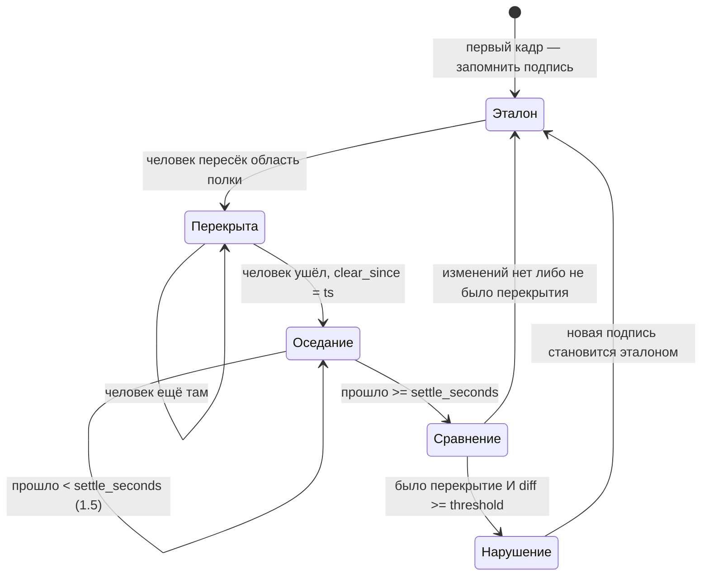
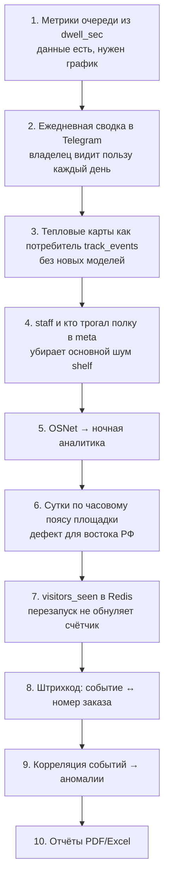

# 15. Модули для пунктов выдачи заказов

**Статус документа:** актуален на 2026-07-16
**Аудитория:** продуктовые менеджеры, инженеры компьютерного зрения, backend-инженеры
**Связанные документы:** [06_AI_ENGINE.md](06_AI_ENGINE.md), [07_PLUGIN_SYSTEM.md](07_PLUGIN_SYSTEM.md), [08_RULE_ENGINE.md](08_RULE_ENGINE.md), [14_FACTORY_MODULES.md](14_FACTORY_MODULES.md)

---

## 1. Назначение документа

Документ описывает отраслевые модули основной вертикали платформы — пунктов выдачи заказов: подсчёт посетителей, анализ очереди, контроль стеллажей, перепаковка, выявление злоупотреблений, тепловые карты, аналитика.

В отличие от [14_FACTORY_MODULES.md](14_FACTORY_MODULES.md), где всё проектное, здесь **большинство модулей работает в проде**. Документ описывает фактические алгоритмы, их ограничения и приоритеты развития.

---

## 2. Почему ПВЗ — основная вертикаль

Обоснование в [00_VISION.md](00_VISION.md), 4.1. Кратко, с инженерной стороны:

| Свойство ПВЗ | Инженерное следствие |
|---|---|
| Однородная планировка (вход, ожидание, стойка, стеллажи) | Одна конфигурация зон подходит тысячам точек — **тиражируемость без интегратора** |
| 2–6 камер | Одна точка = доля GPU |
| Люди крупные в кадре, сцена простая | YOLO работает надёжно; `yolov8s` избыточен |
| Помещение малое | Re-ID между камерами имеет смысл: человек проходит перед несколькими |
| Владелец = пользователь | Нет операторов, нет регламентов — только алерты и дашборд |
| На точке уже есть ПК и интернет | Онбординг без нового железа |

Ключевой пункт — первый. Однородность планировки — это то, что делает ПВЗ масштабируемым продуктом, а завод — проектом. Каждый завод уникален; каждый ПВЗ похож на соседний.

---

## 3. Карта модулей

| Модуль | `feature_id` | Состояние | Порождает |
|---|---|---|---|
| Подсчёт посетителей и занятость | `counter` | **В проде** | Метрики Redis |
| Сквозная идентификация | `reid` | **В проде** (не проверено на проде по `PLAN.md`) | `global_id`, `staff` |
| Очередь | — (в `ZoneEngine`) | **В проде** | `queue_alert` |
| Скопление людей | `crowd` | **В проде** | `crowd` |
| Перепаковка | `repack` | **В проде** | `repack_event` |
| Контроль стеллажей | `shelf` | **В проде** | `shelf_violation` |
| Тепловые карты | — | **[План]** | — |
| Выявление злоупотреблений | — | **[План]** | — |
| Эффективность оператора | — | **[План]** | — |
| Отчёты | — | **[План]** | — |

Замечание по `queue`: значение существует в `feature_kind`, но логика очереди живёт в `ZoneEngine`, а не в плагине, и включается созданием зоны `kind = queue` с параметром `dwell_seconds`. Флаг модуля не влияет ни на что ([07](07_PLUGIN_SYSTEM.md), 6.2).

---

## 4. Подсчёт посетителей и занятость

`analyzer/plugins/counter.py`. Единственный плагин, не порождающий событий.

### 4.1. Два показателя

| Показатель | Ключ Redis | Область | Смысл |
|---|---|---|---|
| Занятость | `occupancy:{tenant_id}` (hash по `camera_id`) | Камера | Сколько людей **сейчас** |
| Посетители | `visitors:{tenant_id}` (hash по `site_id`) | **Площадка** | Сколько уникальных **за сутки** |

Различие областей принципиально: занятость — по камере (мгновенное состояние кадра), посетители — по площадке (человек проходит перед четырьмя камерами и должен считаться один раз).

### 4.2. Алгоритм

```python
counter_zone_ids = {z.id for z in ctx.zones if z.kind == "counter"}
if counter_zone_ids:
    present = [t for t in ctx.tracks if t.zone_ids & counter_zone_ids]
else:
    present = ctx.tracks
present = [t for t in present if not t.staff]
```

Три решения:

1. **Зоны `counter` — необязательны.** Есть зоны — считаем в них, нет — весь кадр. Разумное умолчание: точка без размеченных зон получает работающий счётчик.
2. **Сотрудники исключаются всегда.** `not t.staff` — без вариантов. Сотрудник за стойкой не посетитель.
3. **Область по зонам, а не по всему кадру,** позволяет не считать людей, видимых через витрину с улицы.

Подсчёт уникальных:

```python
day = datetime.fromtimestamp(ctx.ts, tz=timezone.utc).strftime("%Y-%m-%d")
if self._day.get(ctx.site_id) != day:
    self._day[ctx.site_id] = day
    self._seen[ctx.site_id] = set()
    self._last_site_flush.pop(ctx.site_id, None)   # flush right after reset

seen = self._seen.setdefault(ctx.site_id, set())
for t in present:
    if t.reid_pending:
        continue
    seen.add(t.global_id or f"{ctx.camera_id}:{t.track_id}")
```

Ключевые детали:

**`reid_pending` пропускается.** Трек, у которого Re-ID включён, но личность ещё не присвоена (пробация), не считается. Это прямое следствие инцидента «2 курьера = 44 посетителя» ([06](06_AI_ENGINE.md), 5.4): без этой строки мерцающий трек давал бы посетителя на каждый фрагмент.

**Запасной вариант `f"{camera_id}:{track_id}"`** действует при выключенном Re-ID. Тогда возвращается прежнее поведение: подсчёт по трекам с камеры, то есть с двойным счётом между камерами. Это осознанная деградация, а не дефект: без Re-ID дедупликация невозможна в принципе.

**Сброс при смене суток** — по UTC, не по часовому поясу площадки. Разбор в 4.4.

### 4.3. Ограничение частоты записи

```python
interval = float(self._cfg.get("interval_seconds", 60.0))
last = self._last_flush.get(ctx.camera_id)
if last is None or ctx.ts - last >= interval:
    self._last_flush[ctx.camera_id] = ctx.ts
    await self.redis.hset(f"occupancy:{ctx.tenant_id}", ctx.camera_id,
                          json.dumps({"occupancy": len(present), "ts": ctx.ts}))
```

Раз в минуту на камеру и раз в минуту на площадку. Без этого — запись в Redis на каждом кадре, то есть 5 записей в секунду на камеру.

Обоснование, почему это метрики, а не события: событие «сейчас в кадре 3 человека» на каждом кадре породило бы миллионы строк в гипертаблице при нулевой аналитической ценности ([07](07_PLUGIN_SYSTEM.md), 5.2).

### 4.4. Дефект: сутки по UTC

`day` вычисляется в UTC. Для Москвы (UTC+3) счётчик посетителей обнуляется **в 03:00 по местному времени**.

Последствия:
- Владелец в Москве видит сброс среди ночи — незаметно, точка закрыта.
- Владелец во Владивостоке (UTC+10) получит сброс **в 10:00 утра**, в разгар работы. Счётчик посетителей обнулится в рабочее время.

Часовой пояс площадки доступен: он приходит в `CameraConfig.tz` и используется `ZoneEngine` для расписаний. `CounterPlugin` его не использует, хотя мог бы — `FrameContext` его, впрочем, не содержит.

*Рекомендация:* добавить `tz` в `FrameContext` и считать сутки в местном времени площадки. Это дефект, который проявится на первом же клиенте восточнее Урала. Стоимость — часы.

### 4.5. Дефект: состояние в памяти

`self._seen` — множество в памяти процесса. Перезапуск анализатора (обновление платформы, сбой) обнуляет счётчик посетителей за день.

Владелец видит это как ошибку данных: «было 40 посетителей, стало 3».

*Рекомендация:* перенести в Redis — `SADD visitors_seen:{site_id}:{day}` с TTL до конца суток. Redis сам справится с дедупликацией множества. Это же решает проблему при переходе к нескольким репликам анализатора ([07](07_PLUGIN_SYSTEM.md), 7.2).

### 4.6. Ограничение точности

Подсчёт уникальных посетителей точен настолько, насколько точен Re-ID. Известные ограничения ([06](06_AI_ENGINE.md), 5):

| Условие | Точность |
|---|---|
| День, разная одежда | Хорошая |
| День, похожая одежда | Слияние: двое считаются одним |
| **Ночь, ИК, гистограммы** | **Личности не создаются вовсе** — посетители не считаются |
| Ночь, OSNet | Ожидается хорошая **[Требует проверки]** |

Ночная слепота — не «пониженная точность», а отсутствие подсчёта: гейт по насыщенности блокирует создание личностей. Для круглосуточных ПВЗ это существенно и является главным аргументом за переход на OSNet.

---

## 5. Очередь

### 5.1. Реализация

Не плагин. Логика в `ZoneEngine`: зона `kind ∈ {counter, desk, queue}` с `config.dwell_seconds`.

```python
DWELL_KINDS = {"counter", "desk", "queue"}
...
dwell = now - state.entered_at
limit = zone.config.get("dwell_seconds")
if limit and dwell >= float(limit) and self._cooldown_ok(zone, state, now):
    state.alerted = True
    state.last_alert_at = now
    out.append(self._event(te, zone, "queue_alert", "warn",
                           {"kind": zone.kind, "dwell_sec": dwell}))
```

`dwell_seconds` не задан → алерта нет. Зона работает как счётчик входов и выходов.

### 5.2. Что делает это надёжным

| Механизм | Значение |
|---|---|
| Состояние по `global_id`, не по треку | Мерцание трекера не сбрасывает время ожидания |
| `ignore_staff = true` по умолчанию | Сотрудник за стойкой не «стоит в очереди» весь день |
| Кулдаун | Один человек в очереди = один алерт, а не поток |
| Расписание зоны | Ночью зона неактивна |
| `sweep` → `zone_exit` с `lost: true` | Ушедший из кадра фиксируется |

Первый пункт — то, ради чего Re-ID нужен очереди. Без него человек, чей трек распался на три фрагмента, «входил» в зону трижды, и dwell никогда не достигал порога — то есть **очередь не работала бы вообще**.

### 5.3. `zone_exit.meta.dwell_sec` — недоиспользованный актив

Каждое событие `zone_exit` несёт фактическое время пребывания:

```python
meta = {"kind": zone.kind, "dwell_sec": state.last_seen_at - state.entered_at}
```

Это означает, что **время ожидания каждого посетителя за всю историю уже лежит в БД** — по всем точкам, за все дни, без единой новой строки кода в анализаторе.

Пункт 3 блока A из `PLAN.md` — «метрики очереди из уже лежащих в БД `zone_exit.meta.dwell_sec`: среднее ожидание, время у стойки, динамика» — это работа только на стороне API и UI.

*Оценка:* лучшее соотношение «ценность / стоимость» среди всех модулей ПВЗ. Данные собраны, модель не нужна, требуется запрос и график. Формулировка из `PLAN.md` — «язык денег для владельца» — точна: «среднее ожидание выросло с 2 до 5 минут» понятно без объяснений, в отличие от «12 событий queue_alert».

Запрос:

```sql
SELECT time_bucket('1 hour', ts_start) AS bucket,
       avg((meta->>'dwell_sec')::float) AS avg_wait,
       percentile_cont(0.95) WITHIN GROUP (ORDER BY (meta->>'dwell_sec')::float) AS p95
FROM event
WHERE tenant_id = $1 AND type = 'zone_exit'
  AND meta->>'kind' = 'queue'
  AND ts_start >= $2 AND ts_start < $3
GROUP BY bucket ORDER BY bucket;
```

Замечание: `meta->>'dwell_sec'` не индексируется. При росте объёма запрос будет сканировать. *Рекомендация:* при появлении медленных запросов — либо выражательный индекс, либо непрерывный агрегат TimescaleDB ([10](10_DATABASE.md), 4.5).

### 5.4. Ограничения

| Ограничение | Влияние |
|---|---|
| Очередь = присутствие в полигоне | Человек, стоящий в зоне ожидания и не в очереди (ждёт спутника), считается ждущим |
| Нет порядка в очереди | Неизвестно, кто первый; нельзя измерить «обслужен вне очереди» |
| Нет длины очереди как числа | Есть занятость зоны — по сути то же |
| Зона привязана к одной камере | Очередь, выходящая за пределы кадра, не считается целиком |

Последнее существенно: в час пик очередь может выйти из зоны обзора камеры. Тогда dwell считается только для видимой части, а система покажет, что ожидание короткое, — ровно тогда, когда оно максимально.

*Рекомендация:* дополнить метрику очереди показателем «зона заполнена» (занятость зоны на уровне вместимости). Одновременный рост занятости и падение среднего dwell — признак того, что очередь вышла за кадр.

---

## 6. Скопление людей

`analyzer/plugins/crowd.py`.

```python
people = [t for t in ctx.tracks if not t.staff]
count = sum(1 for t in people if t.zone_ids & zone_ids) if zone_ids else len(people)
max_count = int(self._cfg.get("max_count", 10))
if count < max_count:
    return []
...
severity = "critical" if count >= max_count * 1.5 else "warn"
```

| Свойство | Оценка |
|---|---|
| Сотрудники не создают скопления | Верно |
| Область — кадр или зоны из `config.zone_ids` | Гибко |
| Кулдаун по камере | Приемлемо: скопление — свойство места, не человека |
| Двухуровневая severity: `warn`, при 1.5× — `critical` | Разумно: 15 человек при пороге 10 — иная ситуация, чем 11 |

Замечание: кулдаун здесь **по камере**, а не по личности — в отличие от правил алертов ([08](08_RULE_ENGINE.md), 4.3). Это правильно: скопление не привязано к конкретному человеку.

**Потенциал, не использованный:** плагин уже умеет считать людей в зонах. Инверсия условия («менее 2 при наличии хотя бы одного») даёт модуль «работа в одиночку» для производства ([14](14_FACTORY_MODULES.md), 10) — дни работы, ноль новых моделей.

---

## 7. Перепаковка

`analyzer/plugins/repack.py`.

### 7.1. Эвристика

```python
"""Heuristic MVP: a track that stays inside a `desk` zone longer than
min_seconds is a real interaction (a parcel handled), not a passer-by →
one `repack_event` per visit, re-armed once the track leaves the zone."""
```

Трек в зоне `desk` дольше `min_seconds` (8 по умолчанию) = одна выдача. Повторное срабатывание — только после выхода из зоны.

```python
config:
  min_seconds          float   dwell before it counts as a visit (default 8)
  zone_kinds           list    which zone kinds count (default ["desk"])
  require_second_person bool    only fire if >= 2 people in frame (default False)
```

### 7.2. Честная оценка

Название модуля вводит в заблуждение: **он не детектирует перепаковку.** Он детектирует «человек задержался у стойки».

Что он фактически измеряет: число взаимодействий у стойки выдачи, то есть **приблизительное число выдач**.

Что он не может отличить:
- выдачу от возврата;
- перепаковку от консультации;
- одну посылку от пяти;
- клиента от курьера, привёзшего товар.

`require_second_person` — попытка отсечь случаи, когда за стойкой только сотрудник. Но при `ignore_staff = true` сотрудник вообще невидим для зоны, поэтому связка требует внимания при настройке.

*Оценка:* эвристика приемлема для метрики «сколько выдач за день» с точностью «примерно». Она не годится для сверки с учётной системой маркетплейса.

### 7.3. Путь к настоящей ценности

Модуль станет содержательным при связке события с номером заказа. Это `TODO` из `shelf.py` — распознавание штрихкода посылки ([06](06_AI_ENGINE.md), 7.3).

Тогда `repack_event` превращается из «кто-то постоял у стойки» в «посылка №12345 выдана в 14:32» — то есть в запись, сверяемую с учётной системой и пригодную для разбора претензии.

*Рекомендация:* распознавание штрихкода (pyzbar) — а не OCR. Маркетплейсы маркируют посылки штрихкодами и QR; штрихкод распознаётся надёжнее текста на порядок. Ограничение: код должен быть виден камере, что зависит от размещения ([05](05_CAMERA_CONNECTION.md), 12).

---

## 8. Контроль стеллажей

`analyzer/plugins/shelf.py`. Самый нетривиальный плагин.

### 8.1. Алгоритм

Пиксельное сравнение области полки с эталоном:

```python
def _signature(frame, box) -> ndarray | None:
    crop = frame[y1:y2, x1:x2]
    gray = crop.mean(axis=2) if crop.ndim == 3 else crop
    ys = np.linspace(0, gh - 1, _SIG).astype(int)     # _SIG = 32
    xs = np.linspace(0, gw - 1, _SIG).astype(int)
    return np.asarray(gray[np.ix_(ys, xs)], dtype=np.float32)
```

Область полки приводится к сетке 32×32 в оттенках серого. Это «подпись» — грубое представление, устойчивое к шуму и мелким сдвигам.

### 8.2. Ключевая идея: изменение засчитывается только после перекрытия

```python
occluded = any(_overlaps(t, box) for t in ctx.tracks)
...
if occluded:
    st.occluded = True
    st.clear_since = None
    continue

if st.clear_since is None:
    st.clear_since = ctx.ts
if ctx.ts - st.clear_since < settle:
    continue

diff = float(np.mean(np.abs(sig - st.baseline))) / 255.0
if st.occluded and diff >= threshold:
    out.append(Event(type="shelf_violation", severity="warn",
                     meta={"change": round(diff, 4), "kind": "shelf"}))
st.baseline = sig     # adopt the new stable appearance either way
st.occluded = False
```

Машина состояний:



Три решения, каждое существенно:

**1. Изменение без предшествующего перекрытия — не событие.** Свет изменился, солнце ушло, лампа мигнула — подпись изменилась, но человек полку не трогал. Такое изменение **молча переустанавливает эталон**. Это устраняет главный источник ложных срабатываний пиксельных методов.

**2. Оседание (`settle_seconds = 1.5`).** Сравнение выполняется только через 1.5 секунды после ухода человека. Иначе шлейф движения или тень засчитались бы как изменение.

**3. Эталон обновляется в любом случае.** Даже после нарушения новая картинка становится эталоном. Без этого одно изменение порождало бы бесконечный поток нарушений (каждый кадр отличается от старого эталона).

Ограничение частоты: `check_interval = 1.0` секунда на камеру — сравнение выполняется не чаще раза в секунду.

### 8.3. Ограничения

| Ограничение | Влияние |
|---|---|
| **Камера должна быть неподвижна** | Сдвиг камеры = постоянные ложные срабатывания |
| Не отличает «взяли» от «положили» | `diff` — модуль разницы |
| Не знает, что именно изменилось | `meta.change` — число, не смысл |
| Не знает, кто это сделал | Перекрытие фиксируется, личность — нет |
| Эталон сбрасывается при перезапуске | Первый кадр после старта становится эталоном |

Первое ограничение критично и должно быть в инструкции по монтажу: камера над стеллажами, установленная на кронштейне, который качается от сквозняка, сделает модуль неработоспособным ([05](05_CAMERA_CONNECTION.md), 12).

### 8.4. Недоиспользованные данные

Плагин **знает, кто перекрывал полку** — `ctx.tracks` содержит `global_id` и `staff`. Но в событие эта информация не попадает: `meta` содержит только `change` и `kind`.

*Рекомендация:* добавить в `meta` идентификаторы треков, перекрывавших полку до изменения, и флаг `staff`. Тогда `shelf_violation` отвечает на вопрос «кто взял», а не только «что-то изменилось». Это превращает модуль из индикатора в инструмент разбора.

Реализация: сохранять в `_ShelfState` идентификаторы последних перекрывавших. Изменение локальное — десятки строк.

*Дополнительно:* сегодня `shelf_violation` порождается и когда полку тронул сотрудник (штатная работа), и когда посетитель. Это **основной источник шума** модуля: сотрудник раскладывает посылки весь день. Флаг `staff` в `meta` позволил бы фильтровать это правилом, а `zone.config.ignore_staff` здесь не действует — плагин работает вне зонного движка.

Это, вероятно, самый значимый практический дефект модуля.

---

## 9. Выявление злоупотреблений **[План]**

### 9.1. Постановка

Модуль в `doc.md` назван «Fraud detection». Требуется точность формулировок: платформа не может доказать хищение. Она может **зафиксировать аномалию для разбора человеком**.

Реалистичные сценарии:

| Сценарий | Реализуемость | На чём |
|---|---|---|
| Взаимодействие со стеллажом вне рабочего времени | **Высокая** | `shelf_violation` + расписание зоны — **почти готово** |
| Выдача без посетителя (сотрудник один у стойки) | **Высокая** | `repack_event` + счёт людей — **почти готово** |
| Посылка исчезла без выдачи | Средняя | `shelf_violation` без `repack_event` в окне |
| Человек в зоне хранения ночью | **Высокая** | `forbidden` + расписание — **готово** |
| Вынос посылки мимо стойки | Низкая | Требует детекции предмета в руках |
| Сверка выдач с учётной системой | **Высокая ценность** | Требует штрихкода + интеграции |

Первые четыре реализуются **комбинацией существующих механизмов**, без новых моделей. Это самый недооценённый факт документа.

### 9.2. Почему это не реализовано

Не хватает не детекции, а **корреляции событий**: «`shelf_violation` был, а `repack_event` в течение 5 минут не было» — это правило по нескольким событиям, а движок правил работает по одному ([08](08_RULE_ENGINE.md), 7.4).

*Рекомендация:* реализовать корреляцию как отдельный периодический воркер, а не расширение `alert_rule`. Он опрашивает события за окно и ищет комбинации. Это тот же механизм, что нужен для правил по агрегату и ежедневной сводки, — одна работа, три результата.

### 9.3. Граница ответственности

Событие «аномалия» не является обвинением. Формулировки в интерфейсе и уведомлениях должны это отражать: «нестандартная активность у стеллажа в 03:14» вместо «кража».

Обоснование не только этическое: ложное обвинение сотрудника разрушает отношения владельца с персоналом и приводит к отказу от системы. Позиционирование «повод посмотреть запись» безопасно и полезно.

---

## 10. Тепловые карты **[План]**

Пункт 5 блока B из `PLAN.md`. **Лучший кандидат на ближайшую реализацию среди всех модулей.**

### 10.1. Почему

| Свойство | Оценка |
|---|---|
| Новые модели | **Не нужны** |
| Новые данные | **Не нужны**: `center_norm` уже вычисляется на каждом кадре |
| Ценность на демонстрации | **Высокая**: наглядно, эффектно |
| Ценность для владельца | Средняя: где скапливаются люди, мёртвые зоны |
| Закрывает пункт каталога | Да (`heatmap` в разработке) |

### 10.2. Реализация

Замысел из `PLAN.md`: накопление центров треков в Redis (сетка 32×18, по часам), наложение на кадр.

*Рекомендация:* реализовать **как потребителя стрима `track_events`**, а не как плагин анализатора.

Обоснование:
1. Стрим `track_events` **сегодня никем не читается** ([01](01_SYSTEM_ARCHITECTURE.md), 9.1) — он содержит ровно нужные данные (`bbox`, `camera_id`, `ts`) и ограничен по длине.
2. Это даёт стриму назначение и снимает вопрос о его отключении.
3. Агрегация выносится из горячего пути анализатора.
4. Создаётся первый сервис-потребитель событий — образец для forwarder'а гибридного режима ([03](03_DEPLOYMENT.md), 8.1).

Одна работа решает четыре задачи.

Структура: `HINCRBY heatmap:{camera_id}:{YYYY-MM-DD-HH} {cell}` — счётчик по ячейкам сетки с TTL. Наложение — Canvas поверх снапшота камеры (`GET /cameras/:id/snapshot` уже есть).

---

## 11. Эффективность оператора **[План]**

### 11.1. Что можно измерить

Данные уже собираются:

| Показатель | Источник | Состояние |
|---|---|---|
| Время обслуживания | `zone_exit.meta.dwell_sec` зоны `desk` | **Данные есть** |
| Число выдач | `repack_event` | **Данные есть** |
| Присутствие на месте | Занятость зоны `desk` со `staff = true` | Требует инверсии `ignore_staff` |
| Опоздания и отлучки | Периоды отсутствия сотрудника в кадре | Требует Re-ID сотрудника |

Первые два — готовы. Требуется только отчёт.

### 11.2. Ограничение: идентификация оператора

Метрика «эффективность оператора Иванова» требует, чтобы система знала, что это Иванов. Механизм есть: отметка сотрудника на странице «Люди» с именем (`reid:staff:{tenant}` хранит `{embs, name}`).

При этом ПВЗ отличается от производства ([14](14_FACTORY_MODULES.md), 4): на ПВЗ сотрудники **в разной одежде**, поэтому Re-ID по внешности их различает. Плюс Face-ID сотрудников как страховка при смене одежды.

Следовательно, на рынке ПВЗ персональная метрика технически достижима — в отличие от завода с одинаковой спецодеждой.

### 11.3. Предостережение

Персональная оценка сотрудника видеосистемой — чувствительная тема. Даже с ведома работника метрика «Иванов обслуживает медленнее Петрова» может быть некорректной: Иванов работает в час пик, Петров — утром.

*Рекомендация:* позиционировать как **метрику точки, а не человека**: «среднее время обслуживания по часам». Персональный разрез — по явному запросу владельца и с предупреждением о трудовых аспектах. Это тот же принцип, что в 9.3: инструмент для разбора, а не для обвинения.

---

## 12. Аналитика

### 12.1. Реализовано

`api/src/routes/analytics.ts`, страница `/analytics`.

| Эндпоинт | Что даёт |
|---|---|
| `GET /analytics/summary` | Ряд по часам: `time_bucket('1 hour')`, группировка по типу |
| `GET /analytics/overview` | Всё для страницы за один запрос: ряд, разбивка по типам, по камерам |

`time_bucket` — функция TimescaleDB. Адаптивный интервал: `bucket = hour | day` в зависимости от выбранного периода (день → часы, месяц → дни).

Верное решение: одна поездка за данными вместо четырёх запросов из браузера.

### 12.2. Чего не хватает

| Показатель | Данные | Состояние |
|---|---|---|
| События по типам и камерам | Есть | **Реализовано** |
| Посетители | `visitors:{tenant}` | Реализовано |
| **Среднее ожидание в очереди** | `zone_exit.meta.dwell_sec` | **Данные есть, графика нет** |
| **Время обслуживания у стойки** | То же, зона `desk` | **Данные есть, графика нет** |
| Динамика по дням недели и часам | Есть | Нет |
| Сравнение точек | Есть | Нет |
| Доля ложных срабатываний | **Нет данных** | Требует исхода разбора ([09](09_WORKFLOW_ENGINE.md), 3.3) |
| Тепловая карта | `track_events` | Нет |

Строки, выделенные жирным, — это работа только на стороне API и UI при уже собранных данных.

### 12.3. Приоритет: язык денег

Формулировка из `PLAN.md` точна. Владелец ПВЗ не понимает «12 событий queue_alert». Он понимает:

- «Среднее ожидание в очереди: 4 минуты (было 2)».
- «Пик нагрузки: вторник, 18:00–19:00».
- «Посетителей вчера: 47».

Отсюда правило для аналитики: **показатель должен быть выражен в единицах, которыми владелец мыслит** — минуты, люди, рубли — а не в единицах системы (события, треки, зоны).

Это же — критерий приоритизации: график среднего ожидания ценнее графика числа событий, хотя строится из тех же данных.

---

## 13. Ежедневная сводка **[План]**

Пункт 2 блока A из `PLAN.md`: вечерняя сводка в Telegram — посетители, пик, события, необработанные.

*Оценка:* высокий приоритет при низкой стоимости.

Обоснование: это единственный механизм, при котором владелец **ежедневно видит пользу без своих действий**. Дашборд требует, чтобы он зашёл. Алерты приходят только при проблеме. Сводка приходит всегда и напоминает, за что он платит.

Реализация: повторяемое задание BullMQ (механизм уже используется для тика сводки алертов), запрос агрегатов, отправка в Telegram.

Это же создаёт основу для правил по агрегату ([08](08_RULE_ENGINE.md), 7.4) и отчётов.

---

## 14. Приоритеты



| № | Работа | Ценность | Стоимость | Новые модели |
|---|---|---|---|---|
| 1 | Метрики очереди | **Высшая**: язык денег | Дни | Нет |
| 2 | Ежедневная сводка | **Высшая**: ежедневная польза | День | Нет |
| 3 | Тепловые карты | Высокая: демонстрация + каталог | Дни | Нет |
| 4 | `staff` в `shelf_violation` | Высокая: убирает шум | Часы | Нет |
| 5 | OSNet | Высокая: ночная аналитика | Дни | Готова |
| 6 | Часовой пояс в счётчике | Средняя; **дефект** | Часы | Нет |
| 7 | `visitors_seen` в Redis | Средняя; **дефект** | Часы | Нет |
| 8 | Штрихкод | Высокая: связь с заказом | Недели | pyzbar |
| 9 | Корреляция | Средняя | Недели | Нет |
| 10 | Отчёты | Средняя; работает и на производство | Недели | Нет |

Первые семь пунктов не требуют ни одной новой модели и закрывают большую часть ценности. Это следствие того, что платформа **собирает больше данных, чем показывает**.

---

## 15. Реестр решений

| № | Решение | Обоснование | Альтернатива и почему отвергнута |
|---|---|---|---|
| P-01 | Посетители — по площадке, занятость — по камере | Человек перед 4 камерами = 1 посетитель | По камере: четырёхкратный счёт |
| P-02 | Сотрудники не считаются посетителями | Персонал не клиент | Считать: искажение основной метрики |
| P-03 | `reid_pending` не считается | Шум не является посетителем | Считать: инцидент «2 курьера = 44» |
| P-04 | Занятость и посетители — метрики, не события | Событие на каждый кадр = миллионы строк | События: засорение гипертаблицы |
| P-05 | Зоны `counter` необязательны | Точка без разметки получает работающий счётчик | Обязательны: не работает из коробки |
| P-06 | Очередь — в `ZoneEngine`, не плагин | dwell — свойство зоны, а не отраслевая логика | Плагин: дублирование состояния зон |
| P-07 | Состояние очереди по `global_id` | Без этого мерцание трека обнуляет ожидание — очередь не работает вовсе | По треку: модуль неработоспособен |
| P-08 | `shelf`: изменение без перекрытия переустанавливает эталон | Устраняет главный источник ложных: свет | Алармить: непрерывный шум |
| P-09 | `shelf`: оседание 1.5с перед сравнением | Шлейф и тени не засчитываются | Сразу: ложные при уходе человека |
| P-10 | `shelf`: эталон обновляется всегда | Иначе одно изменение = вечный поток нарушений | Не обновлять: неостановимый шум |
| P-11 | `repack` — эвристика по dwell | Приемлемо для «примерно сколько выдач» | Обещать точность: не сверяется с учётом |
| P-12 | Аномалия — повод посмотреть, не обвинение | Ложное обвинение разрушает отношения владельца с персоналом | «Кража»: отказ от системы |
| P-13 | Метрика точки, а не человека, по умолчанию | Персональная оценка некорректна без контекста смены | Персональная: трудовые риски |
| P-14 | Тепловые карты — потребитель `track_events` | Даёт стриму назначение; выносит агрегацию из горячего пути | Плагин: нагрузка на анализатор, стрим остаётся мёртвым |

---

## 16. Долг вертикали ПВЗ

| № | Проблема | Влияние | Приоритет |
|---|---|---|---|
| P-D-01 | `dwell_sec` собирается, но не показывается | Главная ценность для владельца не доставлена | **Высокий** |
| P-D-02 | `shelf_violation` не различает сотрудника и посетителя | Основной шум модуля: сотрудник раскладывает весь день | **Высокий** |
| P-D-03 | Ночью посетители не считаются (гистограммы) | Нет ночной аналитики | Высокий |
| P-D-04 | Сутки счётчика по UTC | Сброс в 10:00 для Владивостока | Средний |
| P-D-05 | `_seen` в памяти: перезапуск обнуляет посетителей | Владелец видит как ошибку данных | Средний |
| P-D-06 | `repack` не связан с номером заказа | «Постоял у стойки» вместо «выдал посылку №…» | Средний |
| P-D-07 | `shelf` не знает, кто трогал полку | Индикатор вместо инструмента разбора | Средний |
| P-D-08 | Нет тепловых карт | Пункт каталога «в разработке» | Средний |
| P-D-09 | Очередь за пределами кадра не считается | Занижение ровно в час пик | Средний |
| P-D-10 | Нет корреляции событий | Аномалии невыразимы при готовых данных | Средний |
| P-D-11 | `meta->>'dwell_sec'` не индексируется | Деградация запросов при росте | Низкий |
| P-D-12 | Нет ежедневной сводки | Владелец не видит пользу без своих действий | Высокий |

---

## 11. Расширение по [REVIEW_BOARD.md](REVIEW_BOARD.md)

**Статус: [План].** Дополнения по итогам ревью (B-21, B-44).

### 11.1. Доказательная ценность видео требует цепочки владения (B-21)

Раздел 7 отмечает ценность видео для разбора претензий («посылку не выдали»). Ревью уточняет: клип становится **доказательством** только с цепочкой владения ([13](13_SECURITY.md), 12.2) — хеш, подпись, журнал доступа, защита от удаления. Без этого «доказательство» оспоримо («смонтировали»).

Это превращает разбор претензий из продуктового преимущества в **обязательство с юридическими последствиями**: если мы предлагаем видео как доказательство, оно должно быть доказательством. Автоматическая нарезка клипа по критическому событию ([08](08_RULE_ENGINE.md), 7.2) + evidence_record ([13](13_SECURITY.md), 12.2) закрывают это.

Практический сценарий ПВЗ: спор о выдаче посылки. Клип с хешем, отметкой времени (NTP, [04](04_NETWORK.md), 16.1), привязкой к событию выдачи (штрихкод, [06](06_AI_ENGINE.md), 7.3) — это доказательство. Клип без этого — картинка.

### 11.2. Плотные сцены (B-44)

Раздел про подсчёт посетителей дополняется ограничением: детекция вырождается при >30 человек в кадре (перекрытия, слияния треков). Для ПВЗ в час пик и для ритейла это реально.

*Рекомендация:* при высокой плотности — переход на модель для плотных сцен либо подсчёт по головам (head detection) вместо тел. Для типового ПВЗ (2–6 человек одновременно) не требуется; фиксируется как граница применимости счётчика. Линия пересечения ([08](08_RULE_ENGINE.md), 3.9) устойчивее к плотности, чем зона присутствия — ещё аргумент за `zone_kind = line`.

### 11.3. Автокалибровка порогов как условие тиражируемости

Критическая связь из [22](22_SRE_OPERATIONS.md), 12: если каждая точка требует ручной подстройки порогов Re-ID/dwell, то 1000 точек = 1000 подстроек, и продукт нетиражируем — прямое противоречие основанию вертикали ПВЗ ([00](00_VISION.md), 4.1). Модули ПВЗ должны выводить пороги автоматически (из статистики точки за первые сутки), а не требовать настройки инженером.

### 11.4. Дополнение к реестру решений и долгу

| № | Решение | Обоснование |
|---|---|---|
| PVZ-05 | Видео как доказательство → обязательна цепочка владения | Иначе «доказательство» оспоримо |
| PVZ-06 | Пороги модулей ПВЗ выводятся автоматически | Ручная настройка = продукт нетиражуем ([22](22_SRE_OPERATIONS.md), 12) |

| № | Долг | Приоритет |
|---|---|---|
| PVZ-D-05 | Нет цепочки владения для клипов-доказательств | **Критично** |
| PVZ-D-06 | Нет автокалибровки порогов | **Критично** (тиражируемость) |
| PVZ-D-07 | Счётчик вырождается в плотных сценах | Низкий для ПВЗ |
