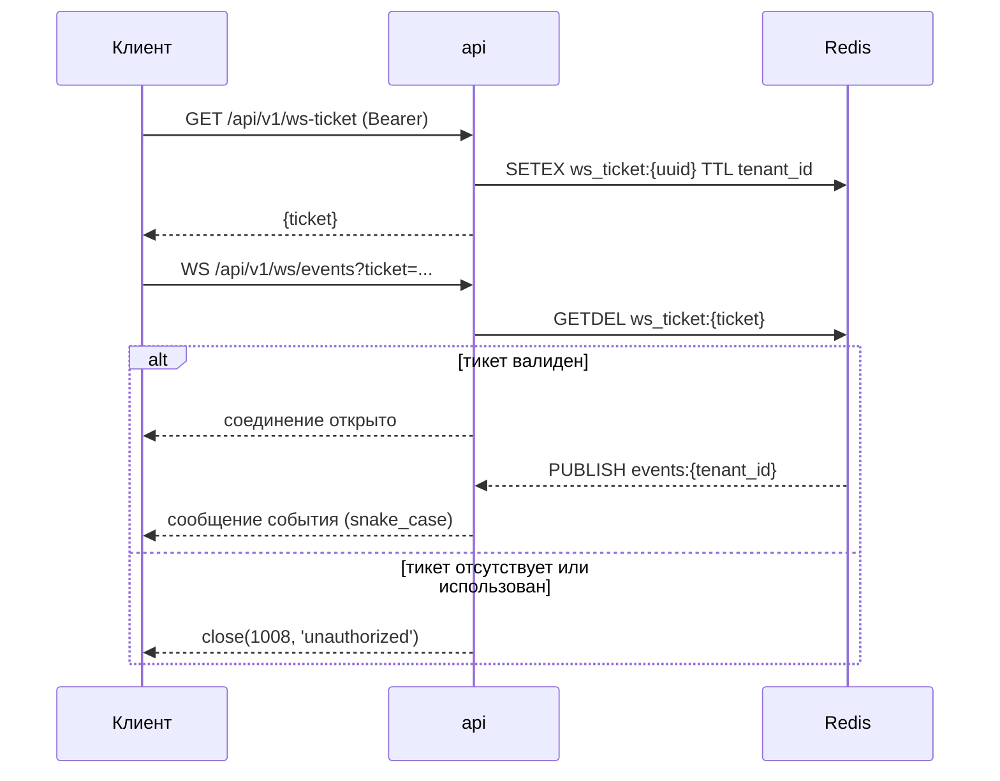

# 16. Руководство по API

**Статус документа:** актуален на 2026-07-16
**Аудитория:** backend- и frontend-инженеры, интеграторы, авторы клиентов
**Связанные документы:** [01_SYSTEM_ARCHITECTURE.md](01_SYSTEM_ARCHITECTURE.md), [10_DATABASE.md](10_DATABASE.md), [13_SECURITY.md](13_SECURITY.md), [08_RULE_ENGINE.md](08_RULE_ENGINE.md)

---

## 1. Назначение документа

Документ описывает интерфейсы платформы: REST, WebSocket, служебные эндпоинты, схему событий, аутентификацию, версионирование, обработку ошибок, а также планы по SDK и gRPC.

Источник истины — `api/src/schemas.ts` (Zod), `shared/events.schema.ts` (общие схемы), `api/src/routes/*.ts` (маршруты). Расхождение документа с кодом означает ошибку документа.

---

## 2. Основы

### 2.1. Пространства имён

| Префикс | Аутентификация | Назначение |
|---|---|---|
| `/api/v1/*` | JWT (Bearer) | Основной API |
| `/api/v1/public/*` | **Нет** | Публичные эндпоинты лендинга |
| `/api/v1/ws/*` | Одноразовый тикет | WebSocket |
| `/internal/*` | `x-internal-token` | Межсервисное взаимодействие |
| `/api/auth/*` | — | **Не наш API**: собственные route-handlers Next.js |

Последняя строка — источник регулярной путаницы и одной зафиксированной ошибки конфигурации. `/api/auth/login`, `/api/auth/logout`, `/api/auth/token` обслуживает **Next.js**, а не Fastify. Они существуют, чтобы установить httpOnly-cookie ([01](01_SYSTEM_ARCHITECTURE.md), 8.2).

Отсюда правило nginx: проксировать на Fastify **только `/api/v1`**, никогда не голый `/api` — иначе вход в систему ломается ([04](04_NETWORK.md), 7.3).

### 2.2. Валидация и типы

Fastify сконфигурирован с `fastify-type-provider-zod`:

```typescript
const app = Fastify({ logger: true }).withTypeProvider<ZodTypeProvider>()
app.setValidatorCompiler(validatorCompiler)
app.setSerializerCompiler(serializerCompiler)
```

Следствие: схема Zod одновременно является контрактом валидации входа, схемой сериализации ответа и источником типов TypeScript. Расхождение между типом и рантаймом структурно невозможно.

### 2.3. Формат

| Аспект | Решение |
|---|---|
| Кодирование | JSON, UTF-8 |
| Именование в REST | **camelCase** (из Drizzle) |
| Именование в Redis Streams и WebSocket | **snake_case** |
| Время | ISO 8601 с зоной, UTC |
| Идентификаторы | UUID v4 |

**Расхождение camelCase и snake_case** — не небрежность, а следствие двух источников. REST отдаёт строки Drizzle (camelCase); WebSocket ретранслирует сообщение стрима как есть (snake_case, поскольку его формирует Python).

Это зафиксировано в `shared/events.schema.ts` двумя схемами и функциями приведения:

```typescript
export function fromApiEvent(e: ApiEvent): UiEvent { ... }
export function fromStreamEvent(e: StreamEvent): UiEvent { ... }
```

Компоненты UI знают только `UiEvent`. Решение прагматичное: приведение стрима к camelCase в api потребовало бы перекладывания на каждом событии в горячем пути.

*Оценка:* приемлемо, пока потребитель один (наш UI). Для внешнего SDK это станет неожиданностью — одно и то же событие в двух видах. См. 11.

---

## 3. Аутентификация

### 3.1. Вход

```http
POST /api/v1/auth/login
Content-Type: application/json

{"email": "owner@example.ru", "password": "..."}
```

```json
200 {"token": "eyJhbGci..."}
401 {"message": "invalid credentials"}
```

Ответ 401 одинаков при неверном email и неверном пароле — не раскрывает существование учётной записи.

### 3.2. Использование токена

```http
GET /api/v1/events
Authorization: Bearer eyJhbGci...
```

Полезная нагрузка JWT:

```typescript
interface JwtPayload {
  tenant_id: string
  user_id: string
  role: 'super' | 'admin' | 'manager' | 'operator'
}
```

`tenant_id` берётся **только из токена**, никогда из запроса. Это граница мультитенантности ([13](13_SECURITY.md), 5.5).

### 3.3. Известные проблемы

| Проблема | Последствие | Раздел |
|---|---|---|
| **Токен без срока действия** | Украденный токен вечен; удаление пользователя не отзывает доступ | [13](13_SECURITY.md), 4.2 |
| **Нет ограничения частоты на `/login`** | Перебор пароля | [13](13_SECURITY.md), 4.4 |
| Нет обновления токена | Появится вместе со сроком действия | — |
| Нет `/me` | Клиент не может узнать свою роль, кроме как разобрав JWT | 11 |

### 3.4. Роли

| Роль | Доступ |
|---|---|
| `super` | Всё, включая `/admin/*` |
| `admin` | Камеры, зоны, «Люди», модули |
| `manager` | Чтение (**фактически идентична `operator`**) |
| `operator` | Чтение |

Реализация — `app.requireRole('super', 'admin')` в `preHandler`.

**Находка:** зоны (`POST/PATCH/DELETE /cameras/:id/zones`) защищены только `authenticate`, то есть доступны роли `operator` ([13](13_SECURITY.md), 5.2).

---

## 4. REST: события

### 4.1. Список

```http
GET /api/v1/events?camera_id=&type=&severity=&resolved=&from=&to=&limit=50&cursor=
```

| Параметр | Тип | Умолчание |
|---|---|---|
| `camera_id` | uuid | — |
| `type` | `EventTypeEnum` | — |
| `severity` | `info` \| `warn` \| `critical` | — |
| `resolved` | **`'true'` \| `'false'`** (строка) | — |
| `from`, `to` | ISO datetime | — |
| `limit` | 1–200 | 50 |
| `cursor` | ISO datetime | — |

**Деталь, зафиксированная комментарием в коде:**

```typescript
// string enum, not coerce.boolean: `?resolved=false` must mean false
resolved: z.enum(['true', 'false']).optional(),
```

`z.coerce.boolean()` превратил бы строку `"false"` в `true` (в JavaScript любая непустая строка истинна). Тогда `?resolved=false` фильтровал бы разобранные события — прямо противоположно ожиданию. Строковое перечисление устраняет ловушку.

### 4.2. Пагинация: keyset, не offset

```typescript
if (q.cursor) conds.push(lt(event.tsStart, new Date(q.cursor)))   // keyset
...
const last = rows.at(-1)
const nextCursor = rows.length === q.limit && last ? last.tsStart.toISOString() : null
```

```json
{
  "items": [...],
  "nextCursor": "2026-07-16T03:14:22.000Z"
}
```

Курсор — `ts_start` последней строки. `nextCursor: null` означает конец.

Обоснование выбора keyset вместо `OFFSET`:

| Аспект | `OFFSET` | Keyset |
|---|---|---|
| Производительность на глубине | Деградирует: СУБД считает и отбрасывает N строк | Постоянная |
| Гипертаблица | `OFFSET 10000` сканирует чанки | Отсечение по `ts_start` |
| Вставка во время листания | **Сдвиг: дубли и пропуски** | Устойчиво |

Второй пункт решающий для потока событий: новые события приходят непрерывно, и `OFFSET` показывал бы одни и те же строки дважды.

Ограничение keyset: **нельзя перейти на произвольную страницу**. Для ленты событий это несущественно.

Крайний случай: несколько событий с идентичным `ts_start` на границе страницы могут быть пропущены — курсор строгий (`lt`). Вероятность мала (метка с точностью до микросекунд), но не нулевая при пакетной вставке. *Рекомендация:* составной курсор `(ts_start, id)` при обнаружении проблемы.

### 4.3. Имена вместо UUID

```typescript
// names come along in the same round-trip so the UI never shows raw UUIDs
.leftJoin(camera, eq(event.cameraId, camera.id))
.leftJoin(zone, eq(event.zoneId, zone.id))
```

`cameraName` и `zoneName` приходят вместе с событием. `leftJoin`, а не `innerJoin`: удалённая камера не должна скрывать событие из истории.

Обоснование: без этого UI делал бы отдельный запрос за справочником, а при удалённой камере показывал бы UUID — нарушение решения V-06 (весь UI на русском и понятен владельцу).

### 4.4. Прочие эндпоинты событий

| Метод | Путь | Роль | Назначение |
|---|---|---|---|
| `POST` | `/events/:id/clip` | authenticate | Поставить нарезку клипа в очередь |
| `GET` | `/events/:id/clip` | authenticate | Presigned-ссылка на клип |
| `PATCH` | `/events/:id/resolve` | authenticate | Пометить разобранным |
| `GET` | `/events/:id/snapshot` | authenticate | Presigned-ссылка на снапшот |
| `GET` | `/ws-ticket` | authenticate | Тикет для WebSocket |

`POST /events/:id/clip` асинхронен: ставит `ClipJob` в очередь и отвечает сразу. Готовность проверяется через `GET /events/:id/clip` либо по появлению `clipKey` в событии.

*Пробел:* нет способа узнать статус задания — только опрос. При отказе нарезки клиент опрашивает вечно. *Рекомендация:* возвращать статус (`pending` / `ready` / `failed`) либо публиковать событие готовности в WebSocket.

**Скрытая проблема производительности:** все эндпоинты вида `/events/:id/*` выбирают событие по `id` без `ts_start`, что заставляет PostgreSQL сканировать все чанки гипертаблицы ([10](10_DATABASE.md), 4.2). *Рекомендация:* принимать `ts` как параметр запроса — он известен клиенту из списка.

---

## 5. REST: камеры и зоны

| Метод | Путь | Роль |
|---|---|---|
| `GET` | `/cameras` | authenticate |
| `POST` | `/cameras` | super, admin |
| `PATCH` | `/cameras/:id` | super, admin |
| `DELETE` | `/cameras/:id` | super, admin |
| `POST` | `/cameras/upload` | super, admin |
| `GET` | `/cameras/:id/snapshot` | authenticate |
| `GET` | `/cameras/:id/zones` | authenticate |
| `POST` | `/cameras/:id/zones` | **authenticate** ← должно быть admin |
| `PATCH` | `/cameras/:id/zones/:zoneId` | **authenticate** ← должно быть admin |
| `DELETE` | `/cameras/:id/zones/:zoneId` | **authenticate** ← должно быть admin |

### 5.1. Статус камеры вычисляется

`GET /cameras` не отдаёт `camera.status` из БД напрямую: статус вычисляется по наличию ключа `camera_alive:{id}` в Redis (heartbeat анализатора, TTL 15с).

Обоснование: поле в БД неизбежно устарело бы — его некому обновлять при внезапной пропаже камеры. Отсутствие сигнала — единственный достоверный признак ([01](01_SYSTEM_ARCHITECTURE.md), 11.4).

Значение `error` перечисления `camera_status` не устанавливается никогда ([05](05_CAMERA_CONNECTION.md), 10.4).

### 5.2. Утечка паролей камер

`GET /cameras` возвращает `urlMain` и `urlSub` — RTSP-адреса **с логином и паролем**. Доступно любой роли.

Это критическая находка S-02 ([13](13_SECURITY.md), 5.4). Для авторов клиентов существенно: **не логировать ответ `GET /cameras`** — он содержит учётные данные.

### 5.3. Зоны

```typescript
export const CreateZoneBody = z.object({
  name: z.string().min(1),
  kind: ZoneKindEnum,
  polygon: z.array(z.tuple([z.number(), z.number()])).min(3),
  config: z.record(z.unknown()).default({}),
  active: z.boolean().default(true),
  schedule: z.record(z.unknown()).default({}),
})
```

`polygon` — нормализованные координаты 0..1, минимум 3 точки. Валидация диапазона `[0,1]` **отсутствует**: точка `[5, -3]` будет принята. `_point_in_polygon` не сломается, но зона окажется вне кадра — то есть молча неработающей.

`config` и `schedule` — `z.record(z.unknown())`, то есть **любой объект**. Опечатка `dwell_second` вместо `dwell_seconds` принимается без ошибки; зона не алармит, причина не диагностируется ([10](10_DATABASE.md), 3.5).

*Рекомендация:* типизировать `config` и `schedule` по `kind` через дискриминированное объединение Zod; ограничить координаты `z.number().min(0).max(1)`. Стоимость — часы; устраняет класс ошибок, которые владелец не может диагностировать.

### 5.4. Загрузка тестового видео

```http
POST /api/v1/cameras/upload
Content-Type: multipart/form-data
```

Ограничения: `UPLOAD_MAX_BYTES` (5 ГБ), один файл, расширения `.mp4`, `.mkv`, `.avi`, `.mov`, `.webm`, `.m4v`. Файл пишется потоком на диск в `TESTVIDEO_DIR` под именем `<uuid>.<ext>`, создаётся камера `source_type = file`.

`client_max_body_size 5g` должен совпадать в трёх местах: nginx VPS, nginx сервера, `UPLOAD_MAX_BYTES`. Расхождение даёт 413 на одном из прыжков ([04](04_NETWORK.md), 7.4).

---

## 6. REST: прочее

| Метод | Путь | Роль | Назначение |
|---|---|---|---|
| `GET` | `/analytics/summary` | authenticate | Ряд по часам, группировка по типу |
| `GET` | `/analytics/overview` | authenticate | Всё для страницы за один запрос |
| `GET` | `/features` | authenticate | Модули тенанта |
| `PUT` | `/features/:feature` | authenticate | Включение и конфигурация модуля |
| `GET` | `/occupancy` | authenticate | Занятость из Redis |
| `GET` | `/people` | super, admin | Галерея личностей |
| `POST` | `/people/:gid/staff` | super, admin | Отметить сотрудником |
| `POST` | `/people/:gid/face-photo` | super, admin | Фото для Face-ID |
| `DELETE` | `/people/:gid` | super, admin | Удалить личность |
| `GET` | `/health` | — | Liveness |

**Находка:** `PUT /features/:feature` защищён только `authenticate`. Оператор может включать и настраивать модули тенанта, включая пороги Re-ID. *Рекомендация:* `requireRole('super', 'admin')`.

### 6.1. Административные

Все — роль `super`, префикс `/api/v1/admin`.

| Путь | Назначение |
|---|---|
| `/health`, `/system`, `/timescale` | Состояние |
| `/dead-letter`, `/dead-letter/:id/replay`, `/dead-letter/clear` | Разбор `events:failed` |
| `/sites` | Площадки |
| `/users`, `/users/:id` | Пользователи |
| `/alert-rules`, `/alert-rules/:id`, `/alert-rules/:id/test` | Правила |
| `/simulate/event` | Синтетическое событие для проверки |
| `/audit` | Аудит |
| `/resync` | **Пересборка проекций Redis** |
| `/settings` | Настройки сервера |

`POST /admin/resync` — обязательная операция после перезапуска Redis; без неё анализатор не получит часовые пояса и расписания зон ([03](03_DEPLOYMENT.md), 5.4).

`POST /admin/simulate/event` — верное решение: позволяет проверить весь конвейер (БД, WebSocket, правила, доставку) без камеры.

### 6.2. Публичные

```http
POST /api/v1/public/demo-request
```

Единственный неаутентифицированный эндпоинт. Ограничение: **5 запросов в час на IP**. При отсутствии `lead_telegram_chat_id` в настройках отвечает 503.

Примечательно: ограничение частоты реализовано здесь, но **отсутствует на `/login`** — эндпоинте несопоставимо более ценном ([13](13_SECURITY.md), 4.4).

---

## 7. WebSocket

### 7.1. Подключение



Одноразовость обеспечивается `GETDEL`. Обоснование: браузерный WebSocket-клиент не позволяет задать заголовок `Authorization`, поэтому передать JWT можно только в query — где он попал бы в логи nginx и историю браузера. Перехваченный из логов тикет уже израсходован ([13](13_SECURITY.md), SEC-05).

### 7.2. Формат сообщений

Ретрансляция сообщения стрима **как есть** — snake_case:

```json
{
  "stream": "events",
  "tenant_id": "...",
  "site_id": "...",
  "camera_id": "...",
  "zone_id": "...",
  "type": "queue_alert",
  "severity": "warn",
  "track_id": 42,
  "confidence": 0.87,
  "bbox": {"x1": 100, "y1": 200, "x2": 180, "y2": 400},
  "meta": {"kind": "queue", "dwell_sec": 312.5, "global_id": "a1b2c3d4e5f6"},
  "ts_start": "2026-07-16T03:14:22Z",
  "ts_end": null
}
```

**Существенно:** сообщение WebSocket **не содержит `id` события** — это исходное сообщение стрима, а не строка БД. Схема `UiEvent` учитывает это: `fromStreamEvent` ставит `id: null`, `snapshotKey: null`, `clipKey: null`.

Следствие для клиента: по событию из WebSocket **нельзя запросить клип** — идентификатор неизвестен. Требуется перезапросить список.

*Рекомендация:* публиковать в PubSub обогащённое сообщение с `id` из `RETURNING`. `EventConsumer` уже получает `eventId`:

```typescript
const eventId = await this.insert(msg)
await this.pub.publish(`events:${msg.tenant_id}`, raw)   // raw без id
```

Достаточно опубликовать `JSON.stringify({...msg, id: eventId})`. Изменение в одну строку, снимает необходимость перезапроса.

### 7.3. Свойства канала

| Свойство | Значение |
|---|---|
| Область | Тенант целиком — **`allowed_camera_ids` не применяется** |
| Направление | Только сервер → клиент |
| Подтверждения | Нет |
| Восстановление после обрыва | **Нет**: события за время обрыва потеряны |
| Heartbeat | **[Требует проверки]** |
| Таймаут nginx | `proxy_read_timeout 3600s` |

Строка про область — следствие S-06 ([13](13_SECURITY.md), 5.3): оператор одной точки получает по WebSocket события всех точек тенанта.

Отсутствие восстановления после обрыва означает: клиент, потерявший соединение, обязан перезапросить список через REST. Именно так и устроен UI (TanStack Query + Zustand), поэтому пробел не проявляется — но для внешнего SDK это должно быть задокументировано.

---

## 8. Служебный API

Аутентификация — заголовок `x-internal-token`, не JWT.

```typescript
app.addHook('preHandler', async (req, reply) => {
  if (req.headers['x-internal-token'] !== config.INTERNAL_TOKEN) {
    return reply.code(401).send({ message: 'unauthorized' })
  }
})
```

| Метод | Путь | Вызывающий |
|---|---|---|
| `POST` | `/internal/reid/crop` | analyzer |
| `POST` | `/internal/segments` | recorder |

```typescript
const ReidCropBody = z.object({
  tenant_id: z.string().uuid(),
  site_id: z.string().uuid(),
  gid: z.string().min(1).max(64),
  jpeg_b64: z.string().min(1).max(2_000_000),   // ~1.5MB decoded cap
})
```

`tenant_id` берётся **из тела**, а не из аутентификации: владелец `INTERNAL_TOKEN` может писать в любого тенанта. Приемлемо (токеном владеют только наши сервисы), но иллюстрирует: `INTERNAL_TOKEN` — ключ ко всем тенантам ([13](13_SECURITY.md), 4.6).

Ограничение `max(2_000_000)` на base64 — верно: без него один запрос мог бы исчерпать память.

---

## 9. Схема события

`shared/events.schema.ts` — единственный контракт между Python и TypeScript.

### 9.1. Типы событий

```
zone_entry | zone_exit | zone_violation | queue_alert | ppe_violation |
repack_event | shelf_violation | crowd | unknown_person |
camera_offline | camera_online
```

`ppe_violation` и `unknown_person` не порождаются ничем.

### 9.2. Добавление типа: четыре места

| Место | Файл |
|---|---|
| Zod (стрим) | `shared/events.schema.ts` |
| Zod (api) | `api/src/schemas.ts` — **дублируется!** |
| Drizzle | `api/db/schema.ts` (`eventTypeEnum`) |
| SQL | Миграция `ALTER TYPE event_type ADD VALUE IF NOT EXISTS` |
| Метка UI | `web/lib/labels.ts` |
| Метка Telegram | `api/src/workers/alerts.worker.ts` (`TYPE_LABELS`) |

Фактически **шесть мест**, а не четыре: перечисления продублированы между `shared/events.schema.ts` и `api/src/schemas.ts`, метки — между web и воркером.

Пропуск любого: ошибка валидации (событие уйдёт в dead-letter) либо английский идентификатор в русском интерфейсе.

*Рекомендация:* свести перечисления и метки в `shared/` — каталог для этого и существует, `web` уже импортирует оттуда. Это сократит шесть мест до трёх (shared, Drizzle, SQL) и устранит наиболее частый источник рассогласования.

### 9.3. Поле `meta`

Точка расширения без миграций. Наполнение по типам — [01_SYSTEM_ARCHITECTURE.md](01_SYSTEM_ARCHITECTURE.md), 9.3.

Не типизировано: `z.record(z.unknown())`. Для внутреннего потребителя приемлемо; для внешнего SDK — нет.

*Рекомендация при появлении внешних потребителей:* дискриминированное объединение по `type`.

---

## 10. Обработка ошибок

### 10.1. Коды

| Код | Когда |
|---|---|
| 200 | Успех |
| 401 | Нет токена, токен невалиден, неверные учётные данные |
| 403 | `insufficient role` |
| 404 | Ресурс не найден либо **принадлежит другому тенанту** |
| 400 | Ошибка валидации Zod |
| 413 | Превышен размер загрузки |
| 429 | Превышено ограничение частоты (только `/public/demo-request`) |
| 503 | Функция не настроена (например, нет `lead_telegram_chat_id`) |
| 500 | Внутренняя ошибка |

**404 вместо 403 для чужого тенанта** — верное решение: 403 подтвердил бы существование ресурса, что является утечкой информации.

### 10.2. Формат

```json
{"message": "insufficient role"}
```

Ошибки валидации Zod форматирует `fastify-type-provider-zod` — формат отличается от `{message}`.

*Пробел:* единого формата ошибки нет. Клиент не может обработать ошибку программно — только показать текст.

*Рекомендация (до появления SDK):*

```json
{
  "error": {
    "code": "INSUFFICIENT_ROLE",
    "message": "Недостаточно прав",
    "details": {"required": ["admin"], "actual": "operator"}
  }
}
```

Машиночитаемый `code` — обязателен для клиента, который должен различать «повторить», «переавторизоваться» и «показать ошибку».

Замечание по языку: сообщения ошибок API — на английском (`invalid credentials`, `insufficient role`), что верно (это идентификаторы для разработчика). Перевод — на границе представления через `labels.ts` (решение V-06).

---

## 11. Пробелы

| Пробел | Влияние |
|---|---|
| **Нет OpenAPI-спецификации** | Нет документации, нет генерации клиентов |
| Нет `/me` | Клиент не знает свою роль без разбора JWT |
| Нет статуса задания клипа | Только опрос |
| Нет `id` в сообщении WebSocket | По событию из потока нельзя запросить клип |
| Нет единого формата ошибок | Ошибка необрабатываема программно |
| Нет пагинации в `/cameras`, `/people` | При росте — весь список |
| Нет `ETag` / `If-None-Match` | Лишний трафик |
| Нет ограничения частоты (кроме `/public`) | Уязвимость к перебору и отказу в обслуживании |
| Нет версионирования схемы событий | См. 12 |

### 11.1. OpenAPI

Наиболее значимый пробел.

Затраты минимальны: `@fastify/swagger` + `fastify-type-provider-zod` **генерируют спецификацию из уже написанных схем Zod**. Схемы существуют, работа сводится к подключению плагина.

Что это даёт: интерактивную документацию, генерацию клиентов на любом языке, контракт для интеграторов, основу для SDK.

*Рекомендация:* подключить. Это лучшее отношение «результат / затраты» в документе: часы работы, полноценная документация API.

---

## 12. Версионирование

### 12.1. Текущее состояние

Префикс `/api/v1`. Второй версии нет, политики версионирования нет.

### 12.2. Три контракта, требующих версионирования

| Контракт | Версионирование |
|---|---|
| REST | Префикс `/api/v1` |
| **Схема событий** (Python ↔ TypeScript) | **Нет** |
| **Полезная нагрузка webhook** | **Нет** |

Вторая строка — реальный риск. Analyzer и api развёртываются **независимо** (`update.sh` перезапускает их по очереди). В момент обновления работает старый analyzer с новым api или наоборот.

Что происходит при несовместимости: новое событие не проходит валидацию Zod → dead-letter. Событие не теряется физически (доступно в `/admin/dead-letter`), но не попадает в БД автоматически.

Отсюда правило проверки после развёртывания ([03](03_DEPLOYMENT.md), 12): **ненулевой `events:failed` — однозначный признак рассогласования схем.**

Правила совместимости:

| Изменение | Совместимо |
|---|---|
| Новое необязательное поле | **Да** |
| Новый ключ в `meta` | **Да** (не типизировано) |
| Новое значение `event_type` | **Нет**: старый api отвергнет |
| Обязательное поле | **Нет** |
| Переименование | **Нет** |

Порядок для нового типа события: сначала api (знает тип), затем analyzer (порождает). `update.sh` соблюдает этот порядок — api перезапускается первым. Это следует зафиксировать явно: порядок в скрипте не случаен.

### 12.3. Полезная нагрузка webhook

Отдаётся наружу и потому является публичным API ([08](08_RULE_ENGINE.md), 5.6):

```json
{"type": "...", "type_label": "...", "severity": "...", "camera": "...", "zone": "...", "ts": "..."}
```

Пробелы: нет `event_id`, идентификаторов, `meta`, подписи, версии.

*Рекомендация:* спроектировать до первой интеграции. После неё изменять будет нельзя — у заказчика работает приёмник.

```json
{
  "version": "1",
  "event_id": "...",
  "tenant_id": "...", "site_id": "...", "camera_id": "...", "zone_id": "...",
  "type": "...", "type_label": "...", "severity": "...",
  "meta": {...},
  "ts_start": "...", "ts_end": null
}
```
Плюс заголовки `X-ViziAI-Signature` (HMAC) и `Idempotency-Key`.

### 12.4. Политика

*Рекомендация:*

| Изменение | Действие |
|---|---|
| Совместимое | В `v1` без объявления |
| Несовместимое | `v2` параллельно `v1` |
| Удаление `v1` | Не ранее чем через 12 месяцев после объявления |

Отдельно: **`shared/events.schema.ts` — не публичный API**, а внутренний контракт. Его следует версионировать полем `schema_version` в сообщении, а не URL.

---

## 13. SDK **[План]**

Не существует. Предусловие — OpenAPI (11.1): клиенты генерируются, а не пишутся.

| Язык | Приоритет | Обоснование |
|---|---|---|
| TypeScript | **Первый** | Уже фактически есть — `shared/events.schema.ts` + `web/lib/api.ts` |
| Python | Второй | Интеграции, скрипты заказчиков |
| 1С | **[Требует решения]** | Российский рынок; вероятно, достаточно webhook |

*Рекомендация:* не писать SDK вручную. Порядок: OpenAPI → генерация (`openapi-typescript`, `openapi-python-client`) → тонкая обёртка для аутентификации и WebSocket.

Для 1С SDK, скорее всего, не нужен: webhook в HTTP-сервис 1С покрывает сценарий интеграции. Проверять по запросу заказчика.

---

## 14. gRPC **[План]**

### 14.1. Оценка применимости

| Применение | Оценка |
|---|---|
| Внешний API вместо REST | **Нет.** Браузер требует grpc-web и прокси. REST + JSON работает везде |
| **Сервис инференса** (analyzer ↔ разделяемый GPU) | **Да.** Бинарный протокол, потоки, строгие контракты |
| **Сторонние плагины в отдельных процессах** | **Да** ([07](07_PLUGIN_SYSTEM.md), 9.3) |
| Forwarder гибридного режима | Возможно; HTTPS проще |

### 14.2. Где gRPC оправдан

Оба сценария объединяет одно: **передача кадров между процессами**.

Кадр 640×360 BGR — около 690 КБ. JSON для него абсурден (base64 раздувает в 1.33 раза, разбор дорог). Protobuf передаёт байты как есть.

Оговорка, снижающая ценность: для процессов **на одном узле** разделяемая память (`/dev/shm`) быстрее любого сетевого протокола — копирования нет вовсе. gRPC тогда передаёт только ссылку и метаданные, то есть его роль сводится к управляющему каналу.

*Рекомендация:* не вводить gRPC как самоцель. Он появится естественно при реализации разделяемого сервиса инференса ([02](02_INFRASTRUCTURE.md), 9.2) или изоляции плагинов. Вводить его во внешний API — ухудшение: браузер, curl и интеграторы работают с REST без инструментов.

---

## 15. Реестр решений

| № | Решение | Обоснование | Альтернатива и почему отвергнута |
|---|---|---|---|
| API-01 | Zod как единый источник валидации, сериализации и типов | Расхождение типа и рантайма невозможно | Раздельно: типы врут |
| API-02 | `tenant_id` только из JWT | Граница мультитенантности | Из запроса: тривиальная утечка |
| API-03 | Keyset-пагинация | `OFFSET` деградирует и даёт дубли при вставках | `OFFSET`: непригоден для потока событий |
| API-04 | `resolved` — строковое перечисление | `coerce.boolean("false")` = `true` | `coerce.boolean`: фильтр работает наоборот |
| API-05 | Имена камер и зон в ответе события | UI не показывает UUID; нет второго запроса | Отдельный справочник: лишний запрос |
| API-06 | `leftJoin` для имён | Удалённая камера не скрывает историю | `innerJoin`: события исчезают |
| API-07 | 404 вместо 403 для чужого тенанта | 403 подтвердил бы существование ресурса | 403: утечка информации |
| API-08 | Одноразовый WS-тикет | Браузер не может задать заголовок; JWT в query попал бы в логи | JWT в query: утечка |
| API-09 | WebSocket ретранслирует стрим как есть | Перекладывание в горячем пути | Приведение: расход на каждом событии |
| API-10 | `/internal/*` с общим токеном | У сервисов нет пользователя и тенанта | JWT: нужен фиктивный пользователь |
| API-11 | Только `/api/v1` в nginx, не `/api` | Next.js держит собственные `/api/auth/*` | `/api`: вход ломается |
| API-12 | Сообщения ошибок на английском | Идентификаторы для разработчика; перевод — в UI | Русские: смешение слоёв |
| API-13 | gRPC не для внешнего API | Браузер требует прокси; REST работает везде | gRPC наружу: усложнение для интеграторов |
| API-14 | Статус камеры вычисляется, не хранится | Поле в БД некому обновить при пропаже | Поле: устаревает молча |

---

## 16. Долг API

| № | Проблема | Влияние | Приоритет |
|---|---|---|---|
| API-D-01 | Пароли камер в `GET /cameras` для любой роли | Прямой доступ к камерам клиента | **Критический** |
| API-D-02 | JWT без срока; нет отзыва | Вечный доступ по украденному токену | **Критический** |
| API-D-03 | Нет ограничения частоты на `/login` | Перебор; отказ в обслуживании | **Критический** |
| API-D-04 | Нет OpenAPI | Нет документации и генерации клиентов; **дешевле всего исправить** | **Высокий** |
| API-D-05 | Зоны и `PUT /features` доступны `operator` | Оператор меняет правила детекции | **Высокий** |
| API-D-06 | Перечисления и метки продублированы в 6 местах | Рассогласование при каждом новом типе | Высокий |
| API-D-07 | Схема событий не версионируется | Рассогласование при независимом развёртывании | Высокий |
| API-D-08 | Нет `id` в сообщении WebSocket | Нельзя запросить клип по событию из потока | Средний |
| API-D-09 | Полезная нагрузка webhook бедна и без подписи | После интеграции изменить нельзя | Средний |
| API-D-10 | `config` и `schedule` зон не типизированы | Опечатка = молча неработающая зона | Средний |
| API-D-11 | `/events/:id/*` сканирует все чанки | Деградация с ростом ретеншена | Средний |
| API-D-12 | Нет единого формата ошибок | Ошибка необрабатываема программно | Средний |
| API-D-13 | Нет статуса задания клипа | Клиент опрашивает вечно при отказе | Низкий |
| API-D-14 | Нет пагинации в `/cameras`, `/people` | Проявится при росте | Низкий |
| API-D-15 | Координаты полигона не ограничены `[0,1]` | Зона вне кадра принимается молча | Низкий |

---

## 12. Расширение по [REVIEW_BOARD.md](REVIEW_BOARD.md)

**Статус: [План].** Дополнения по итогам ревью (B-63, B-62, B-72).

### 12.1. Публичный API как продукт (B-63)

Текущий API — внутренний (потребитель — наш web). Публичный API для клиентов и партнёров — иной контракт ([23](23_ENTERPRISE_INTEGRATION.md), 9):

| Аспект | Внутренний | Публичный |
|---|---|---|
| Аутентификация | JWT пользователя | **Ключ API** (`api_key`, [23](23_ENTERPRISE_INTEGRATION.md), 9.2) |
| Совместимость | Меняем свободно | **Контракт с политикой устаревания** |
| Квоты | Нет | **`api_rps`, `api_burst`** ([21](21_TENANT_LIFECYCLE.md), 4.1) |
| Области доступа | Роль | **`scopes`** (`events:read`, ...) |

Ключ API отделён от JWT: интеграция не должна ломаться при увольнении сотрудника, нуждается в квотах и узких областях.

### 12.2. Квоты API (B-72)

Реализация `tenant_quota.api_rps`. Ответ при превышении — `429` с обязательными заголовками `Retry-After`, `X-RateLimit-*` ([23](23_ENTERPRISE_INTEGRATION.md), 9.3). Без `Retry-After` клиент повторяет немедленно и усугубляет перегрузку.

### 12.3. OpenAPI и Terraform (B-62)

Раздел про версионирование дополняется: **OpenAPI-спецификация** — предусловие SDK и Terraform-провайдера ([23](23_ENTERPRISE_INTEGRATION.md), 8.4). Провайдер генерируется из спецификации; при планке провижининг 1000 тенантов и сетей ПВЗ — только как код, не кликами.

### 12.4. Полезная нагрузка webhook — публичный контракт

Webhook ([08](08_RULE_ENGINE.md), 5.6) — фактически публичный API событий и интерфейс ко всем ITSM/SIEM. Его нагрузку нужно спроектировать до первой интеграции: `event_id`, идентификаторы, `meta`, HMAC-подпись, `Idempotency-Key`. После интеграции заказчика менять нельзя.

### 12.5. gRPC — уточнение

Раздел про будущий gRPC уточняется: внутренний gRPC уместен для связи ячейка ↔ control plane (веерные запросы, [20](20_SCALE_ARCHITECTURE.md), 4.4) и analyzer ↔ Triton ([06](06_AI_ENGINE.md), 14.5). Публичный gRPC для клиентов — низкий приоритет: REST + webhook покрывают потребности, gRPC поднимает порог входа партнёра.

### 12.6. Дополнение к реестру решений и долгу

| № | Решение | Обоснование |
|---|---|---|
| API-06 | Ключи API отдельно от JWT, со scopes и квотами | Интеграция не ломается при увольнении; нужны лимиты |
| API-07 | OpenAPI — предусловие SDK и Terraform | Провайдер генерируется из спецификации |
| API-08 | Webhook — публичный контракт, проектируется до интеграции | После интеграции менять нельзя |
| API-09 | gRPC — внутренний (ячейки, Triton), не публичный | REST+webhook покрывают клиента |

| № | Долг | Приоритет |
|---|---|---|
| API-D-10 | Нет ключей API и квот | Средний (высокий для партнёров) |
| API-D-11 | Нет OpenAPI-спецификации | Средний |
| API-D-12 | Полезная нагрузка webhook бедна и без подписи | **Критично** ([08](08_RULE_ENGINE.md), R-D-07) |
