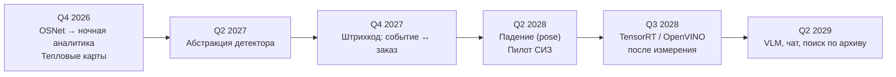
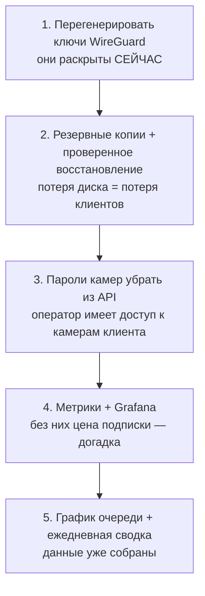
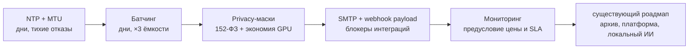

# 18. Дорожная карта

**Статус документа:** актуален на 2026-07-16
**Аудитория:** технические руководители, продуктовые менеджеры, архитекторы
**Связанные документы:** [00_VISION.md](00_VISION.md), все реестры долга в документах 01–16
**Источник приоритетов в репозитории:** `PLAN.md` (приоритетный план, обновляется чаще этого документа)

---

## 1. Назначение и статус

Документ задаёт трёхлетнюю дорожную карту: приоритеты по кварталам, технический долг, коммерческие и корпоративные вехи, направление ИИ.

**Соотношение с `PLAN.md`.** `PLAN.md` — оперативный план, отражающий текущее состояние и ближайшие задачи. Настоящий документ — стратегический горизонт и обоснование порядка. При расхождении по ближайшему кварталу приоритет у `PLAN.md`; при расхождении по обоснованию приоритета — у этого документа.

**Ограничение достоверности.** Даты кварталов условны: они выражают **порядок и относительную длительность**, а не обязательства. Ресурсы команды в репозитории не зафиксированы **[Данные отсутствуют]**, поэтому абсолютные сроки вывести невозможно. Пользоваться следует порядком, а не датами.

---

## 2. Принципы приоритизации

Порядок работ выведен из четырёх правил, а не из привлекательности задач.

| № | Правило | Следствие |
|---|---|---|
| 1 | **Защита от безвозвратной потери — раньше всего** | Резервные копии выше HA, выше функций, выше всего |
| 2 | **Измерение — раньше оптимизации и раньше обещаний** | Мониторинг блокирует юнит-экономику и SLA, а не «удобен» |
| 3 | **Использовать собранное — раньше, чем собирать новое** | График очереди из `dwell_sec` ценнее нового детектора |
| 4 | **Организационные барьеры — раньше функций рынка** | LDAP и офлайн-установка закрывают производство надёжнее, чем отсутствие моделей СИЗ |

Правило 3 заслуживает пояснения: платформа **собирает больше данных, чем показывает**. Время ожидания каждого посетителя за всю историю лежит в БД и не выведено ни на один график. Такие задачи имеют лучшее отношение «ценность / стоимость» из всех возможных.

---

## 3. Текущее состояние

### 3.1. Стадия

По шкале из [00_VISION.md](00_VISION.md), 10: **между стадией 1 (рабочий продукт) и стадией 2 (тиражируемый продукт)**.

Достигнуто: одна боевая точка ПВЗ, полный конвейер от RTSP до Telegram, зоны, алерты, клипы, аналитика, Re-ID, живое видео, лендинг с формой заявки.

Критерий перехода к стадии 2 ([00_VISION.md](00_VISION.md), 10): *точка подключается без участия разработчика; владелец ежедневно получает пользу без запроса*.

Оценка по критерию:

| Часть критерия | Состояние |
|---|---|
| Точка подключается без разработчика | **Частично**: кит `pvz-onboarding/` есть, ONVIF нет, RTSP вводится вручную |
| Владелец получает пользу ежедневно | **Нет**: ежедневной сводки нет; чтобы увидеть пользу, нужно зайти в интерфейс |

### 3.2. Что блокирует масштабирование

Сводка реестров долга. Полные списки — в конце каждого документа.

| Блокер | Документ | Что именно блокирует |
|---|---|---|
| **Нет резервных копий** | [02](02_INFRASTRUCTURE.md), I-01 | Любое масштабирование: отказ диска = потеря клиентов |
| **Нет контура тестирования** | [02](02_INFRASTRUCTURE.md), I-02 | Каждая функция проверяется на живом клиенте |
| **Нет мониторинга** | [12](12_MONITORING.md), M-D-01 | Юнит-экономику, SLA, планирование ёмкости |
| **Ключи WireGuard в репозитории** | [13](13_SECURITY.md), S-01 | Безопасность всех клиентов |
| **Пароли камер в API** | [13](13_SECURITY.md), S-02 | То же |
| Нет условий правил по камерам | [08](08_RULE_ENGINE.md), R-D-01 | Продажу сети точек |
| Нет офлайн-установки, LDAP, email | [03](03_DEPLOYMENT.md), [13](13_SECURITY.md) | Производство и госсектор |
| VPS — узкое место по трафику | [04](04_NETWORK.md), N-D-10 | Рост числа точек |

---

## 4. Год 1: тиражируемый продукт

Цель года: **платформа, которую можно продавать сети ПВЗ, не боясь потерять данные и не зная, сколько она стоит в обслуживании.**

### 4.1. Q3 2026 — гигиена

Квартал не содержит ни одной новой функции. Это осознанно: продолжать функциональную разработку поверх системы без резервных копий и с раскрытыми ключами — накапливать риск быстрее, чем ценность.

| Приоритет | Работа | Документ | Критерий готовности |
|---|---|---|---|
| 1 | Перегенерировать ключи WireGuard, убрать из репозитория, gitleaks | [13](13_SECURITY.md), S-01 | В истории Git нет ключей; проверка блокирует коммит |
| 2 | Резервное копирование + **проверенное восстановление** | [03](03_DEPLOYMENT.md), 10 | Дамп развёрнут на dev-ПК, событие дошло до Telegram |
| 3 | Пароли камер убрать из API | [13](13_SECURITY.md), S-02 | `operator` не видит URL |
| 4 | JWT `expiresIn` + `token_version` | [13](13_SECURITY.md), S-03 | Удаление пользователя отзывает доступ |
| 5 | Rate-limit на `/login` | [13](13_SECURITY.md), S-04 | 11-я попытка → 429 |
| 6 | Регрессионный набор на `file`-камерах | [02](02_INFRASTRUCTURE.md), 2.3 | Ночная запись прогоняется перед правкой Re-ID |
| 7 | Метрики + Prometheus + Grafana + dcgm-exporter | [12](12_MONITORING.md), 11 | **Известно, сколько камер тянет GPU** |
| 8 | blackbox-exporter | [12](12_MONITORING.md), 5.6 | Доступность измеряется |
| 9 | Зафиксировать теги образов, `maxmemory` Redis, ufw кодом | [02](02_INFRASTRUCTURE.md) | — |
| 10 | Один механизм миграций; `init.sql` = минимум + `0000` | [10](10_DATABASE.md), 12 | Новая и обновлённая установки идентичны |

**Веха квартала:** известна себестоимость одной точки в долях GPU и гигабайтах. Это разблокирует ценообразование.

### 4.2. Q4 2026 — ценность для владельца

Квартал использует уже собираемые данные (правило 3).

| Приоритет | Работа | Документ | Почему сейчас |
|---|---|---|---|
| 1 | **График очереди из `dwell_sec`** | [15](15_PVZ_MODULES.md), 5.3 | Данные в БД по всей истории; «язык денег» |
| 2 | **Ежедневная сводка в Telegram** | [15](15_PVZ_MODULES.md), 13 | Единственный механизм ежедневной пользы без действий владельца |
| 3 | Исход разбора (`confirmed` / `false_positive`) | [09](09_WORKFLOW_ENGINE.md), 3.3 | Первый источник данных о точности |
| 4 | Тепловые карты как потребитель `track_events` | [15](15_PVZ_MODULES.md), 10 | Без новых моделей; даёт стриму назначение |
| 5 | `staff` в `shelf_violation` | [15](15_PVZ_MODULES.md), P-D-02 | Убирает основной шум модуля |
| 6 | OSNet ONNX + пороги от эмбеддера | [06](06_AI_ENGINE.md), 5.6 | **Ночная аналитика, которой нет** |
| 7 | Дефекты счётчика: часовой пояс, `visitors_seen` в Redis | [15](15_PVZ_MODULES.md), P-D-04/05 | Проявятся на первом клиенте восточнее Урала |
| 8 | Условия правил по камерам и зонам | [08](08_RULE_ENGINE.md), R-D-01 | Блокер продажи сети |
| 9 | OpenAPI | [16](16_API_GUIDE.md), 11.1 | Часы работы, полноценная документация |
| 10 | CI (typecheck, mypy, gitleaks, audit) | [19](19_BEST_PRACTICES.md) | Проверки перестают зависеть от памяти человека |

**Веха квартала:** переход к стадии 2 по второй части критерия — владелец получает пользу ежедневно без своих действий.

### 4.3. Q1 2027 — надёжность конвейера

| Приоритет | Работа | Документ |
|---|---|---|
| 1 | Различение ошибок в `EventConsumer` (БД ≠ dead-letter) | [11](11_HIGH_AVAILABILITY.md), HA-D-02 |
| 2 | Буфер событий при недоступности Redis | [11](11_HIGH_AVAILABILITY.md), HA-D-03 |
| 3 | Идемпотентность вставки + `XAUTOCLAIM` (одной задачей) | [11](11_HIGH_AVAILABILITY.md), HA-D-04 |
| 4 | Healthcheck анализатора | [11](11_HIGH_AVAILABILITY.md), HA-D-05 |
| 5 | Зависшая камера: контроль темпа кадров | [05](05_CAMERA_CONNECTION.md), C-D-02 |
| 6 | RTSP только TCP в анализаторе | [05](05_CAMERA_CONNECTION.md), C-D-04 |
| 7 | Эталоны сотрудников в PostgreSQL | [10](10_DATABASE.md), раздел 7 |
| 8 | Проверить `UPDATE` сжатых чанков; при подтверждении — `event_state` | [10](10_DATABASE.md), 4.3 |
| 9 | Реестр образов + откат по тегу | [02](02_INFRASTRUCTURE.md), 4.4 |
| 10 | Loki + сбор логов; JSON-логи в анализаторе | [12](12_MONITORING.md), 6 |

**Веха квартала:** сбой инфраструктуры перестаёт означать тихую потерю событий.

### 4.4. Q2 2027 — платформа и архив

| Приоритет | Работа | Документ |
|---|---|---|
| 1 | **UI видеоархива** | Самая ожидаемая функция; данные пишутся, интерфейса нет |
| 2 | Фаза 2 платформы: инвайты, платформенный админ, профили организаций | [00](00_VISION.md), 7.3 |
| 3 | Применить `allowed_camera_ids` | [13](13_SECURITY.md), S-06 |
| 4 | Зоны и модули под роль `admin` | [13](13_SECURITY.md), S-09 |
| 5 | Автоматическая нарезка клипа по правилу | [08](08_RULE_ENGINE.md), R-D-03 |
| 6 | Отчёты PDF/Excel | Работают и на ПВЗ, и на производство |
| 7 | Абстракция детектора | [06](06_AI_ENGINE.md), 10.3 — предусловие edge и TensorRT |
| 8 | Демо-режим и сценарий показа | `PLAN.md`, блок B, пункт 7 |

**Веха года 1:** стадия 2 достигнута. Продукт тиражируем: подключение точки не требует разработчика, владелец получает ежедневную пользу, данные защищены, характеристики измеримы.

---

## 5. Год 2: корпоративная зрелость

Цель года: **платформа, которую можно продать предприятию и сети точек с договорным SLA.**

### 5.1. Q3 2027 — гибридный режим

Триггер: **VPS становится узким местом по трафику раньше GPU** ([04](04_NETWORK.md), 10.2). При 10 точках с архивом требуется 400 Мбит/с через VPS.

| Работа | Документ |
|---|---|
| Forwarder событий с площадки в центр | [03](03_DEPLOYMENT.md), 8.1 |
| Локальный архив на площадке; клипы режутся там же | [03](03_DEPLOYMENT.md), 8.2 |
| Обновление ПО на площадках без ручного доступа | — |
| Регистрация площадки в центре (сертификат либо токен) | — |
| Микросегментация подсети | [04](04_NETWORK.md), 9.2 |
| `Endpoint` точек по имени, не по IP | [11](11_HIGH_AVAILABILITY.md), HA-D-08 |

Порядок внутри квартала определён зависимостью: forwarder — предусловие edge, а не параллельная задача.

### 5.2. Q4 2027 — корпоративные требования

Этап 0 из [14_FACTORY_MODULES.md](14_FACTORY_MODULES.md), 11. Ни одной строчки компьютерного зрения — и при этом обязателен.

| Работа | Документ |
|---|---|
| **Офлайн-установка** (веса YOLO в образ, `docker save`) | [03](03_DEPLOYMENT.md), 7.2 |
| **LDAP / Active Directory** | [13](13_SECURITY.md), 6 |
| **Email-канал (SMTP)** | [08](08_RULE_ENGINE.md), R-D-02 |
| Аудит входа и неудачного входа | [13](13_SECURITY.md), 7.3 |
| RLS вторым рубежом | [10](10_DATABASE.md), 6.2 |
| Шифрование паролей камер | [13](13_SECURITY.md), 8.3 |
| Проверить Astra Linux | [03](03_DEPLOYMENT.md), 7.4 |
| Экспорт метрик и логов в системы заказчика | [12](12_MONITORING.md), 10 |

**Веха квартала:** первый пилот на производстве возможен технически.

### 5.3. Q1 2028 — отказоустойчивость

Триггер: **первый клиент с договорным SLA.** До этого HA — преждевременные затраты.

| Работа | Документ |
|---|---|
| Разделение ролей: узел GPU + узел данных | [02](02_INFRASTRUCTURE.md), 9.4 |
| Patroni (PostgreSQL) | [11](11_HIGH_AVAILABILITY.md), 5.3 |
| Redis Sentinel | [11](11_HIGH_AVAILABILITY.md), 5.3 |
| MinIO с erasure coding | То же |
| Analyzer: active-passive с лидерством через Redis | [11](11_HIGH_AVAILABILITY.md), 5.4 |
| Реплики api (`CONSUMER_NAME` из hostname) | [02](02_INFRASTRUCTURE.md), 9.3 |
| Второй VPS | [11](11_HIGH_AVAILABILITY.md), 5.5 |
| Readiness-проверки | [11](11_HIGH_AVAILABILITY.md), 7.3 |
| Дежурство и учения по восстановлению | [11](11_HIGH_AVAILABILITY.md), 9.3 |

**Существенно:** последняя строка — организационная, и без неё остальные бессмысленны. SLA 99.9% означает 43 минуты простоя в месяц; отказ в 3 часа ночи должен быть замечен и устранён за это время. Никакая архитектура этого не обеспечит без дежурного ([11](11_HIGH_AVAILABILITY.md), 8.4).

**Веха квартала:** SLA 99.9% может быть декларирован честно.

### 5.4. Q2 2028 — производственные модули

Только после этапа 0 (5.2).

| Работа | Документ |
|---|---|
| `detections` в `FrameContext`; заявка классов в манифесте плагина | [14](14_FACTORY_MODULES.md), 5.3 |
| Фазы `setup`/`teardown` у плагинов | [07](07_PLUGIN_SYSTEM.md), 7.1 |
| Работа в одиночку (расширение `CrowdPlugin`) | [14](14_FACTORY_MODULES.md), 10 |
| Детекция падения (YOLOv8-pose) | [06](06_AI_ENGINE.md), 7.2 |
| Интеграция со СКУД | [09](09_WORKFLOW_ENGINE.md), 8 |
| Отчёты для ОТ | [14](14_FACTORY_MODULES.md), 9 |
| **Пилот СИЗ с данными заказчика** (каска, жилет) | [14](14_FACTORY_MODULES.md), 5 |

Последняя строка — не разработка, а цикл «пилот → сбор данных → разметка → обучение → внедрение», занимающий месяцы. Его следует закладывать в договор, а не открывать после подписания.

**Веха года 2:** платформа продаётся предприятию.

---

## 6. Год 3: платформа

Цель года: **ядро, на котором сторонние команды пишут отраслевые модули.**

### 6.1. Q3 2028 — edge

| Работа | Документ |
|---|---|
| Сборка под ARM64 (Jetson, база L4T) | [03](03_DEPLOYMENT.md), 9 |
| Модель под устройство: TensorRT для Jetson, OpenVINO для iGPU | [06](06_AI_ENGINE.md), 10.3 |
| USB-камеры | [05](05_CAMERA_CONNECTION.md), 8.5 |
| Автообновление устройств | — |

Edge требует forwarder (5.1) и абстракции детектора (4.4) — обе к этому моменту готовы. Это и есть причина их раннего размещения в плане.

### 6.2. Q4 2028 — масштабирование вычислений

Триггер: 5–6 тенантов на узел ([02](02_INFRASTRUCTURE.md), 9.2) — каждый процесс analyzer держит свою копию модели в VRAM.

| Работа | Документ |
|---|---|
| Разделяемый сервис инференса либо мультитенантный analyzer | [02](02_INFRASTRUCTURE.md), 9.2 |
| gRPC + разделяемая память для кадров | [16](16_API_GUIDE.md), 14 |
| TensorRT (**только после измерения узкого места**) | [06](06_AI_ENGINE.md), 3.5 |
| NVDEC (аппаратное декодирование) | [02](02_INFRASTRUCTURE.md), 5.2 |
| Kubernetes | [02](02_INFRASTRUCTURE.md), 11 |

Порядок внутри квартала значим: мультитенантный analyzer — **предусловие** Kubernetes, а не следствие. «Процесс на тенанта» плохо ложится на модель Deployment ([02](02_INFRASTRUCTURE.md), 11.4).

### 6.3. Q1 2029 — SDK и партнёрские плагины

| Работа | Документ |
|---|---|
| Изоляция плагинов: отдельный процесс + разделяемая память | [07](07_PLUGIN_SYSTEM.md), 9.3 |
| Манифест плагина | [07](07_PLUGIN_SYSTEM.md), 9.4 |
| Версионирование контракта плагина | — |
| SDK (генерация из OpenAPI) | [16](16_API_GUIDE.md), 13 |
| **Партнёрская модель**: 2–3 партнёра, качество на нас | [07](07_PLUGIN_SYSTEM.md), 9.5 |

Партнёрская модель, а не маркетплейс. Обоснование: маркетплейс требует ответов на вопросы, которые не заданы («кто отвечает за ложный алерт стороннего плагина»), и открывать каталог имеет смысл, когда контракт выдержал 5–10 внешних плагинов.

### 6.4. Q2 2029 — локальный ИИ

Отложен до года 3 сознательно: он не решает ни одной из блокирующих проблем.

| Работа | Документ |
|---|---|
| Контейнер Ollama + очередь `ai` | [06](06_AI_ENGINE.md), 8.1 |
| VLM-описания событий (фоново, необязательно) | [06](06_AI_ENGINE.md), 8.2 |
| Текстовая сводка дня | То же |
| Чат по аналитике (**tool-функции, не свободный SQL**) | [06](06_AI_ENGINE.md), 8.3 |
| Поиск по архиву (CLIP + pgvector) | [06](06_AI_ENGINE.md), 8.2 |

**Веха года 3:** внешняя команда пишет плагин, не имея доступа к нашему коду.

---

## 7. Что не будет сделано

Раздел не менее важен, чем план. Каждая строка — решение, зафиксированное в соответствующем документе.

| Не делаем | Почему | Документ |
|---|---|---|
| **Распознавание лиц посетителей** | 152-ФЗ; критерий допуска в тендерах; разрушает позиционирование | [00](00_VISION.md), 7.1 |
| **Остановка оборудования** | Требует SIL, недостижимого для нейросети | [14](14_FACTORY_MODULES.md), 3.3 |
| **OEE** | Платформа даёт 1 составляющую из 3 | [14](14_FACTORY_MODULES.md), 8.2 |
| Цифровой двойник, предиктивное обслуживание | Требуют вибрации, температуры, тока | [14](14_FACTORY_MODULES.md), 8.3–8.4 |
| Машинное зрение (GigE, контроль качества) | Другие модели, камеры, покупатели — другой продукт | [05](05_CAMERA_CONNECTION.md), 9.3 |
| **GB28181** | Нет оборудования на целевом рынке; месяцы работы, ноль клиентов | [05](05_CAMERA_CONNECTION.md), 8.4 |
| RTMP, WebRTC как источник | Устаревшее либо не та ниша | [05](05_CAMERA_CONNECTION.md), 8.1–8.3 |
| **BPM-движок (Camunda)** | Нужны 2 возможности из 8; цена — третий язык, второй источник истины | [09](09_WORKFLOW_ENGINE.md), 4 |
| ABAC | RBAC + область по камерам достаточно | [13](13_SECURITY.md), 5.6 |
| gRPC во внешний API | Браузер требует прокси; REST работает везде | [16](16_API_GUIDE.md), 14.1 |
| Blue/Green | Две среды тянули бы камеры одновременно | [11](11_HIGH_AVAILABILITY.md), 6.3 |
| Elasticsearch для логов | Ресурсы уровня самой платформы; Loki достаточно | [12](12_MONITORING.md), 4.2 |
| Открытый маркетплейс плагинов | Правовые и репутационные риски до созревания контракта | [07](07_PLUGIN_SYSTEM.md), 9.5 |
| **VLM, отменяющая алерт** | Пропуск в системе безопасности недопустим | [06](06_AI_ENGINE.md), 8.3 |

---

## 8. Технический долг

### 8.1. Сводка по документам

| Документ | Критический | Высокий | Средний | Низкий |
|---|---|---|---|---|
| [02](02_INFRASTRUCTURE.md) Инфраструктура | 2 | 3 | 4 | 3 |
| [03](03_DEPLOYMENT.md) Развёртывание | 1 | 4 | 3 | 1 |
| [04](04_NETWORK.md) Сеть | 1 | 3 | 4 | 2 |
| [05](05_CAMERA_CONNECTION.md) Камеры | 1 | 3 | 5 | 2 |
| [06](06_AI_ENGINE.md) ИИ | — | 5 | 4 | 1 |
| [07](07_PLUGIN_SYSTEM.md) Плагины | — | 2 | 4 | 4 |
| [08](08_RULE_ENGINE.md) Правила | — | 3 | 7 | 3 |
| [09](09_WORKFLOW_ENGINE.md) Процессы | — | 3 | 5 | 2 |
| [10](10_DATABASE.md) БД | 1 | 4 | 7 | 3 |
| [11](11_HIGH_AVAILABILITY.md) HA | 2 | 5 | 4 | 3 |
| [12](12_MONITORING.md) Мониторинг | 1 | 5 | 3 | 1 |
| [13](13_SECURITY.md) Безопасность | 4 | 7 | 8 | 1 |
| [14](14_FACTORY_MODULES.md) Производство | — | 3 | 7 | 2 |
| [15](15_PVZ_MODULES.md) ПВЗ | — | 4 | 6 | 2 |
| [16](16_API_GUIDE.md) API | 3 | 4 | 5 | 3 |

### 8.2. Критический долг: полный список

Тринадцать пунктов. Все закрываются в Q3–Q4 2026.

| № | Проблема | Документ |
|---|---|---|
| 1 | Нет резервных копий | [02](02_INFRASTRUCTURE.md), I-01 |
| 2 | Нет контура тестирования | [02](02_INFRASTRUCTURE.md), I-02 |
| 3 | Приватные ключи WireGuard в репозитории | [13](13_SECURITY.md), S-01 |
| 4 | Пароли камер отдаются любому пользователю | [13](13_SECURITY.md), S-02 |
| 5 | JWT без срока; удаление не отзывает доступ | [13](13_SECURITY.md), S-03 |
| 6 | Нет rate-limit на `/login` | [13](13_SECURITY.md), S-04 |
| 7 | Отказ PostgreSQL → события в dead-letter | [11](11_HIGH_AVAILABILITY.md), HA-D-02 |
| 8 | Нет метрик | [12](12_MONITORING.md), M-D-01 |
| 9 | Нет резервных копий БД | [10](10_DATABASE.md), DB-D-01 |
| 10 | Два механизма миграций; Drizzle тихо не работает | [03](03_DEPLOYMENT.md), DP-02 |
| 11 | Зависшая камера не обнаруживается | [05](05_CAMERA_CONNECTION.md), C-D-02 |
| 12 | Нет `XAUTOCLAIM` | [11](11_HIGH_AVAILABILITY.md), HA-D-04 |
| 13 | Нет буфера событий при сбое Redis | [11](11_HIGH_AVAILABILITY.md), HA-D-03 |

### 8.3. Правило работы с долгом

*Рекомендация:* **не менее 30% ёмкости каждого квартала — на долг.** Обоснование: долг в этом реестре не косметический. Пункты 1, 3, 4 означают риск потери данных клиента или доступа к его камерам. Такой долг не «выплачивается когда-нибудь» — он реализуется как инцидент.

Правило релиза: **новая функция не выпускается, если она увеличивает критический долг.**

---

## 9. Коммерческие вехи

**[Данные отсутствуют]:** цены, план продаж, юнит-экономика в репозитории отсутствуют и не могут быть выведены ([00](00_VISION.md), 9.2).

Ниже — только технические предусловия коммерческих событий.

| Веха | Техническое предусловие | Квартал |
|---|---|---|
| Вторая точка ПВЗ | Резервные копии; онбординг без разработчика | Q3 2026 |
| **Ценообразование** | **Мониторинг**: себестоимость точки | Q3 2026 |
| Первая сеть (10+ точек) | Условия правил по камерам; `allowed_camera_ids`; платформенный админ | Q4 2026 – Q2 2027 |
| Сеть 50+ точек | Гибридный режим (VPS — узкое место по трафику) | Q3 2027 |
| Первый пилот на производстве | Офлайн-установка, LDAP, email, отчёты | Q4 2027 |
| **Договорный SLA** | HA + дежурство + измерение доступности | Q1 2028 |
| Госсектор | Astra Linux, ФСТЭК **[Требует решения]** | — |
| Партнёрские плагины | Изоляция, манифест, SDK | Q1 2029 |

Вторая строка — центральная: **до появления мониторинга цену подписки назначить нельзя иначе как угадав.** Это делает Q3 2026 предусловием всей коммерческой части.

---

## 10. Направление ИИ

Порядок из [06_AI_ENGINE.md](06_AI_ENGINE.md), 11, размещённый по кварталам.

Принцип порядка: сначала то, что использует уже собираемые данные (тепловые карты), затем то, что снимает известное ограничение (OSNet — ночная слепота), затем новое (падение, СИЗ), и только в конце — привлекательное, но не блокирующее (VLM).

Локальный ИИ отложен на год 3 не из-за сложности, а потому что он не закрывает ни одного блокера. Соблазн начать с него велик — он демонстрируем и интересен, — но VLM-описание алерта не поможет продать платформу, у которой нет резервных копий.

---

## 11. Риски дорожной карты

| Риск | Вероятность | Влияние | Смягчение |
|---|---|---|---|
| **Инцидент до Q3 2026** (потеря диска, компрометация ключей) | Средняя | **Критическое**: потеря клиента и репутации | Q3 2026 целиком посвящён этому |
| Ресурсы команды неизвестны | — | Сроки условны | План выражает **порядок**, не даты |
| Пилот на производстве потребует СИЗ раньше этапа 0 | Высокая | Пилот провалится на LDAP | Проговаривать порядок до договора |
| VPS упрётся в трафик раньше Q3 2027 | Средняя | Рост числа точек остановится | Мониторинг покажет заранее |
| Точность СИЗ окажется неприемлемой | **Высокая** | Направление закроется | Пилот с данными заказчика, не обещание |
| OSNet не решит ночную задачу | Средняя | Ночной аналитики не будет | Проверять на эталонной записи до внедрения |
| Долг превысит ёмкость | Средняя | Разработка встанет | Правило 30% |
| Требование ФСТЭК | Низкая | Госсектор закрыт | Не входить в госсектор без оценки |

Первая строка — главный риск документа. Он реализуется не в будущем, а прямо сейчас: ключи уже раскрыты, копий уже нет. План Q3 2026 — это не улучшение, а устранение существующего.

---

## 12. Критерии перехода между стадиями

| Переход | Критерий | Ожидаемый квартал |
|---|---|---|
| 1 → 2 (тиражируемый) | Точка подключается без разработчика; владелец получает пользу ежедневно | Q2 2027 |
| 2 → 3 (enterprise) | Отказ узла не приводит к потере событий; аудит и права проходят проверку СБ заказчика | Q2 2028 |
| 3 → 4 (платформа) | Внешняя команда пишет плагин без доступа к нашему коду | Q2 2029 |

Критерии — из [00_VISION.md](00_VISION.md), 10. Они сформулированы как проверяемые факты, а не как ощущения, и это следует сохранить: «продукт стал зрелым» непроверяемо, «событие не теряется при отказе узла» — проверяемо учением.

---

## 13. Что делать в первую очередь

Если из документа нужно взять одно:

Первые три — устранение реализующегося риска. Четвёртый — разблокировка бизнес-решений. Пятый — первая за долгое время новая ценность для владельца, построенная на уже собранных данных.

Всё остальное в документе может подождать.

---

## Расширение по [REVIEW_BOARD.md](REVIEW_BOARD.md): год 4 и пересмотр приоритетов

**Статус: [План].** Ревью совета вводит блокеры планки 1000+, меняющие приоритеты роадмапа.

### Пересмотр: что стало блокером

Ревью переклассифицировало часть «улучшений» в **блокеры планки** ([REVIEW_BOARD.md](REVIEW_BOARD.md), 11):

| Было в роадмапе как | Стало | Причина |
|---|---|---|
| Оптимизация ИИ (потом) | **Батчинг — первым** | Кратный рычаг ёмкости, дёшев ([06](06_AI_ENGINE.md), 14.1) |
| — | **Метеринг, квоты** | Без них нет счёта при планке ([21](21_TENANT_LIFECYCLE.md)) |
| Мониторинг (Блок C-D) | **Предусловие цены и SLA** | Себестоимость и SLI ([22](22_SRE_OPERATIONS.md)) |
| — | **Privacy-маски** | 152-ФЗ при обзоре улицы ([13](13_SECURITY.md), 12.1) |
| — | **NTP, MTU** | Тихо ломают Re-ID/клипы/RTSP ([04](04_NETWORK.md), 16) |

### Год 4: масштаб (при достижении ~20 клиентов)

Не по календарю, а по триггерам ([20](20_SCALE_ARCHITECTURE.md), 10):

| Квартал (условно) | Тема | Триггер |
|---|---|---|
| Y4Q1 | Ячейки, control plane | 20+ клиентов или первый SLA |
| Y4Q2 | Метеринг, квоты, биллинг | Переход на платную модель |
| Y4Q3 | SRE: SLI/SLO, дежурство, ранбуки | Договорной SLA |
| Y4Q4 | Мультирегион, резидентность | Клиент с требованием региона |

### Уточнение порядка ближайших работ

Ревью не отменяет существующий роадмап, а добавляет предшествующий слой «дешёвых блокеров»:

Обоснование порядка: сначала то, что дёшево и тихо ломает продукт (NTP, MTU), затем то, что кратно увеличивает ёмкость (батчинг), затем правовой блокер (маски), затем блокеры продаж (SMTP), затем измерение (мониторинг), затем крупные фичи. Крупные фичи на непроверенной ёмкости и без мониторинга — строительство вслепую.

### Триггеры вместо дат

Главный принцип, внесённый ревью ([20](20_SCALE_ARCHITECTURE.md), 10; [00](00_VISION.md), V-11): элементы масштаба внедряются **по триггеру, не по графику**. Роадмап года 4 — это условия, а не сроки. Построить ячейки, имея 3 клиентов, — потратить ресурс на несуществующую нагрузку.

### Дополнение к вехам

| Веха | Критерий готовности |
|---|---|
| Готовность к платной модели | Метеринг + квоты + себестоимость посчитана |
| Готовность к SLA | SLI измеряются + дежурство + ранбуки |
| Готовность к корпоративной продаже | SMTP + LDAP/OIDC + SBOM + privacy-маски |
| Готовность к производству | OPC UA + LTS + модель Б (VMS) + 62443-матрица |
| Готовность к планке 1000 | Ячейки + control plane + мониторинг с корректной кардинальностью |
