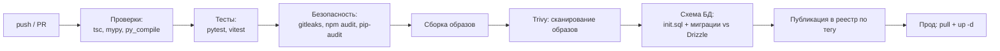

# 19. Инженерные стандарты

**Статус документа:** актуален на 2026-07-16
**Аудитория:** все инженеры
**Связанные документы:** [00_VISION.md](00_VISION.md), [17_CLAUDE_PROMPTS.md](17_CLAUDE_PROMPTS.md), [16_API_GUIDE.md](16_API_GUIDE.md), [10_DATABASE.md](10_DATABASE.md)

---

## 1. Назначение документа

Документ фиксирует стандарты разработки: код, архитектуру, именование, тестирование, Git, CI/CD, документацию, производительность, безопасность.

Разграничение с [00_VISION.md](00_VISION.md): там — **принципы** (почему), здесь — **практики** (как). Практика, противоречащая принципу, отменяется.

Раздел 2 фиксирует состояние процессов — оно определяет, какие практики являются требованиями, а какие пожеланиями.

---

## 2. Состояние процессов

Честная констатация, определяющая всё дальнейшее.

| Практика | Состояние |
|---|---|
| Проверка типов | **Есть**, вручную перед коммитом |
| Форматирование | **Нет** (нет prettier, black, ruff format) |
| Линтер | **Частично**: `eslint-disable` в коде есть, конфигурации в репозитории нет |
| Тесты | **Нет ни одного** |
| CI | **Нет** |
| Обзор кода | **[Требует проверки]** |
| Проверка секретов | **Нет** — прямое следствие: ключи WireGuard в репозитории |
| Проверка зависимостей | **Нет** |
| Сканирование образов | **Нет** |
| Контур тестирования | **Нет** |

Вывод: **процесс держится на дисциплине одного человека.** Это работает при одном разработчике и перестаёт работать при втором.

Прямое доказательство отказа дисциплины без автоматики — находка S-01 ([13](13_SECURITY.md), 8.2): настоящие приватные ключи попали в репозиторий и остались в истории. Ни один человек не собирался их коммитить.

Отсюда правило документа: **практика, не подкреплённая автоматической проверкой, не является практикой — она является пожеланием.**

---

## 3. Общие правила кода

### 3.1. Языки и их границы

| Язык | Где | Почему именно там |
|---|---|---|
| Python 3.12 | `analyzer/` | GPU, PyTorch, OpenCV — экосистема CV существует только здесь |
| TypeScript | `api/`, `web/`, `shared/` | Всё остальное |

**Третий язык не вводится.** Это решение, а не привычка: третий язык означает третий набор образов, третий стиль отладки, третьего специалиста. Именно оно закрывает вопрос BPM-движка на JVM ([09](09_WORKFLOW_ENGINE.md), 4.3).

Граница: Python не выходит за пределы обработки кадров. Всё, что не требует GPU или OpenCV, пишется на TypeScript.

### 3.2. Строгая типизация

| Язык | Требование |
|---|---|
| TypeScript | `strict`, включая `noImplicitAny`, `strictNullChecks`, `exactOptionalPropertyTypes` |
| Python | `mypy strict`, `pydantic v2` с `ConfigDict(strict=True)` |

Обоснование не общее, а конкретное: платформа обрабатывает поток машинно-сгенерированных сообщений от процесса, которому **нельзя доверять по построению** — видеоаналитика ошибается. Типы — первая линия обороны.

### 3.3. Валидация на границах

Любые данные извне процесса валидируются:

| Граница | Инструмент |
|---|---|
| HTTP-запрос | Zod (`fastify-type-provider-zod`) |
| Сообщение Redis Stream | Zod (`EventMessageSchema`) |
| Конфигурация из env | Zod (`EnvSchema.parse`), pydantic-settings |
| Данные из Redis (проекции) | pydantic (`CameraConfig.model_validate`) |
| Ответ внешнего API | Zod |

Правило: **процесс, стартовавший с невалидной конфигурацией, обязан упасть немедленно**, а не через час в проде.

### 3.4. Конфигурация только из окружения

Ни одного IP, порта, токена или домена в коде.

Исключение, реализованное осознанно: часть параметров переопределяется из БД (`system_setting`) — БД имеет приоритет над `.env` ([01](01_SYSTEM_ARCHITECTURE.md), 6.7). Это нужно, чтобы владелец менял пороги без доступа к серверу.

### 3.5. Комментарии

**Правило:** комментарий пишется только там, где код не может объяснить сам себя — неочевидное ограничение, причина обходного решения, ссылка на внешнее поведение.

Язык — английский. Документация — в `docs/`, не в коде.

Образцы правильных комментариев из репозитория:

```typescript
// event_id has no FK: `event` is a hypertable, its `id` alone is not unique
// (PK is composite (id, ts_start)), so it cannot be referenced.
```

```typescript
// string enum, not coerce.boolean: `?resolved=false` must mean false
```

```nginx
# proxy_pass targets use variables (not the bare hostname) so nginx re-resolves
# them via the `resolver` directive instead of caching the IP forever
```

Общее у всех трёх: они объясняют **почему сделано неочевидно**, и без них следующий разработчик «исправит» код обратно в ошибку.

Плохой комментарий — пересказ кода:
```typescript
// increment the counter
counter++
```

### 3.6. Обработка ошибок

Принцип — [00_VISION.md](00_VISION.md), 6.2: любой внешний вход враждебен, любая внешняя зависимость временно недоступна.

| Ситуация | Правило |
|---|---|
| Ошибка одной камеры | Логировать, откат, остальные работают |
| Ошибка плагина | Перехватить, вернуть `[]`, остальные плагины отрабатывают |
| Невалидное сообщение | Dead-letter + XACK — не блокировать группу |
| **Недоступность хранилища** | **Повторить, не dead-letter** ([11](11_HIGH_AVAILABILITY.md), 4.1) |
| Ошибка аудита | Проглотить — аудит не ломает запрос |
| Ошибка внешнего сервиса | Зафиксировать статус, повторить |

Голое `except Exception` допустимо **только** там, где оно является границей изоляции, и обязано сопровождаться пометкой:

```python
except Exception:  # noqa: BLE001 — one plugin must not kill the frame
    logger.exception("plugin %s failed", plugin.feature_id)
```

Пометка `noqa` с объяснением — это заявление «я знаю, что делаю, и вот зачем». Голый `except` без неё — дефект.

### 3.7. Деградация

Каждый модуль обязан иметь определённое поведение при отсутствии зависимости. Реализованные образцы:

```python
def make_embedder() -> HistogramEmbedder | OnnxEmbedder:
    path = os.environ.get("REID_ONNX", "")
    if path and os.path.isfile(path):
        try:
            return OnnxEmbedder(path)
        except Exception:  # noqa: BLE001 — fall back rather than kill the worker
            pass
    return HistogramEmbedder()
```

Это эталон: отсутствие модели не роняет воркер, а переключает режим.

### 3.8. Ограниченные очереди и буферы

**Правило:** любая очередь, буфер или кеш в памяти обязаны иметь верхнюю границу.

Образцы:

```python
self._pending_crops = (crops + self._pending_crops)[-20:]   # последние 20
for _ in range(5):   # ограниченный батч зачисления лиц за тик
```

```typescript
removeOnComplete: 200, removeOnFail: 500
maxlen=self.settings.stream_maxlen, approximate=True
```

Обоснование: неограниченный буфер в долгоживущем процессе — это отложенный OOM. Потеря кропа личности приемлема; исчерпание памяти анализатора — нет.

---

## 4. Правила TypeScript

### 4.1. Fastify

| Правило | Обоснование |
|---|---|
| Каждый маршрут типизирован через Zod | Схема = валидация + сериализация + типы |
| `preHandler` для аутентификации и ролей | Единая точка |
| Ошибки — `reply.code(n).send({...})` с `return` | Отсутствие `return` — ловушка ([13](13_SECURITY.md), 5.2) |
| Тяжёлая работа — в BullMQ, не в обработчике | Обработчик не блокирует событийный цикл |

### 4.2. Drizzle

| Правило | Обоснование |
|---|---|
| Только типобезопасные запросы | Сырой SQL — источник ошибок |
| Сырой SQL допустим для TimescaleDB | `drop_chunks`, `time_bucket`, `hypertable_size` — Drizzle их не покрывает |
| **`tenant_id` в каждой выборке** | Граница мультитенантности |
| Выборка полей явно, не `select()` | Иначе пароли камер попадут в ответ ([13](13_SECURITY.md), 5.4) |
| Keyset-пагинация, не `OFFSET` | `OFFSET` деградирует и даёт дубли при вставках |

Четвёртая строка выведена из реальной находки: `select().from(camera)` возвращает `urlMain` с паролем.

### 4.3. Next.js

| Правило | Обоснование |
|---|---|
| SSR только для страниц аутентификации | Остальное — Client Components |
| JWT — httpOnly-cookie через route-handler | Неизвлекаем при XSS |
| TanStack Query для серверных данных | Кеш и инвалидация |
| Zustand для живых событий | Поток WebSocket |
| **Перечисления через `web/lib/labels.ts`** | Единственное место перевода |
| Без эмодзи; иконки `@tabler`, не `lucide` | Решение V-07 |

### 4.4. Асинхронность

| Правило |
|---|
| `await` всегда, кроме сознательного «выстрелил и забыл» с `void` |
| `Promise.allSettled` там, где отказ одного не должен ронять остальные |
| Таймауты на внешние вызовы: `AbortSignal.timeout(10_000)` |
| Не блокировать событийный цикл: CPU-задачи — в воркер |

---

## 5. Правила Python

### 5.1. Обязательное

| Правило | Обоснование |
|---|---|
| `from __future__ import annotations` первой строкой | Отложенные аннотации |
| `@dataclass(slots=True)` для структур данных | Память: структуры создаются на каждом кадре |
| `Protocol` вместо ABC для интерфейсов | Структурная типизация: стороннему плагину не нужен наш базовый класс |
| pydantic — для внешних данных, dataclass — для внутренних | pydantic валидирует, dataclass дёшев |
| Аннотации везде | mypy strict |

`slots=True` — не микрооптимизация: `TrackInfo` создаётся для каждого трека на каждом кадре каждой камеры.

### 5.2. Асинхронность

| Правило | Обоснование |
|---|---|
| Задача на камеру | Изоляция отказов |
| Инференс — в `run_in_executor` с пулом из одного потока | GPU — разделяемый ресурс; параллельные вызовы дают OOM без выигрыша ([01](01_SYSTEM_ARCHITECTURE.md), 4.1) |
| Фоновый цикл не завершается при пустом состоянии | Иначе цикл перезапуска Docker |
| `asyncio.CancelledError` пробрасывается | Иначе задача не отменяется |

```python
except asyncio.CancelledError:
    raise
except Exception:  # noqa: BLE001 — keep other cameras alive
    logger.exception("camera %s: consumer crashed", source.camera_id)
```

Порядок обработчиков значим: `CancelledError` наследуется от `BaseException` в 3.8+, но перехват до общего `Exception` документирует намерение.

### 5.3. Работа с кадрами

| Правило | Обоснование |
|---|---|
| BGR — порядок каналов OpenCV | Смена порядка ломает всё молча |
| Нормализованные координаты 0..1 на границах | Смена разрешения не ломает зоны |
| Не копировать кадр без нужды | Кадр 640×360 BGR ≈ 690 КБ |
| Не буферизовать | `CAP_PROP_BUFFERSIZE = 1` |

---

## 6. Именование

### 6.1. Язык

| Что | Язык |
|---|---|
| Идентификаторы, поля БД, ключи Redis | **Английский** |
| Комментарии, docstrings | **Английский** |
| Логи | **Английский** |
| Сообщения ошибок API | **Английский** (идентификаторы для разработчика) |
| **Пользовательский интерфейс** | **Русский, без исключений** |
| Telegram-уведомления | **Русский** |
| Метки настроек (`SETTING_DEFS.label`) | **Русский** |
| Документация в `docs/` | **Русский** |

Граница проходит по слою представления. Решение V-06.

### 6.2. Соглашения

| Контекст | Стиль | Пример |
|---|---|---|
| TypeScript | camelCase | `tenantId`, `writeAudit` |
| Python | snake_case | `tenant_id`, `write_audit` |
| БД | snake_case | `ts_start`, `app_user` |
| Ключи Redis | `namespace:{id}` | `camera_alive:{camera_id}` |
| Redis Streams / WebSocket | snake_case | `ts_start` |
| REST | camelCase | `tsStart` |
| Env | UPPER_SNAKE | `REID_ONNX` |

Расхождение camelCase и snake_case в REST против WebSocket объяснено в [16_API_GUIDE.md](16_API_GUIDE.md), 2.3.

### 6.3. Ключи Redis

Формат: `namespace:{id}` либо `namespace:{id1}:{id2}`.

Правило: **префикс определяет владельца и время жизни.**

| Префикс | Владелец | TTL |
|---|---|---|
| `cameras:`, `zones:`, `features:` | api (проекция) | — |
| `camera_alive:` | analyzer | 15с |
| `reid:gallery:` | analyzer | 12ч |
| `reid:staff:`, `face:staff:` | api | **бессрочно** |
| `ws_ticket:` | api | короткий |
| `cooldown:`, `digest:` | worker-alerts | по правилу |

Новый ключ обязан быть добавлен в эту таблицу и в [01_SYSTEM_ARCHITECTURE.md](01_SYSTEM_ARCHITECTURE.md), 9.5. Ключ без описанного времени жизни — потенциальная утечка.

---

## 7. Архитектурные стандарты

### 7.1. Границы

| Граница | Правило |
|---|---|
| Analyzer ↔ мир | Только Redis Streams; никакого PostgreSQL |
| Плагин ↔ ядро | `FeaturePlugin`; плагин не знает про Redis |
| api ↔ analyzer | Только Redis (стримы + проекции) |
| Сервис ↔ сервис | Redis Streams, не HTTP; исключение — `/internal/*` |
| Модель ↔ конвейер | Тип модели не протекает наружу |

### 7.2. Точка расширения выбирается до кода

| Задача | Точка |
|---|---|
| Отраслевая логика | `FeaturePlugin` |
| Новый источник видео | `VideoSource` |
| Новые данные события | `meta jsonb` — **без миграции** |
| Новая настройка | `SETTING_DEFS` |
| Новый канал | `alert_rule.channels` |

`meta` — недооценённая точка: `dwell_sec`, `global_id`, `staff`, `count`, `change` добавлены без единой миграции.

### 7.3. Согласованность перечислений

Добавление `event_type` требует правок в **шести местах** ([16](16_API_GUIDE.md), 9.2). Пропуск даёт либо dead-letter, либо английское слово в русском интерфейсе.

*Рекомендация:* свести перечисления и метки в `shared/` — это сократит шесть мест до трёх.

### 7.4. Решения фиксируются

**Правило:** архитектурное решение записывается в реестр решений соответствующего документа: решение, обоснование, **отвергнутая альтернатива**.

Третий пункт важнее первых двух. Без него через год решение будет «улучшено» обратно в ошибку. Пример: `frame_skip = 2` выглядит как параметр производительности, который можно поднять; на деле выше 3 разваливается трекинг ([06](06_AI_ENGINE.md), 4.2).

---

## 8. Тестирование

### 8.1. Состояние

**Ни одного теста.** `CLAUDE.md` содержит указание «НЕ генерировать: README, тесты, примеры — пока не попрошу» — то есть отсутствие тестов было осознанным решением стадии прототипа.

Это решение исчерпало себя: платформа обслуживает боевого клиента, а защиты Re-ID выведены из инцидента и без тестов будут сняты при первой «оптимизации».

### 8.2. С чего начинать

Порядок определяется тестируемостью и ценой ошибки.

| Приоритет | Что | Почему |
|---|---|---|
| 1 | `ZoneEngine.process()` | Синхронный и чистый **специально для тестируемости**; вся логика зон |
| 2 | Окна времени (`_in_window`, `inQuietHours`) | Продублированы в двух языках; расхождение необъяснимо |
| 3 | Защиты Re-ID | Выведены из инцидента; будут сняты без тестов |
| 4 | `EventConsumer` | Ветка dead-letter против повтора |
| 5 | Схемы Zod | Граница с внешним миром |

Строка 1 — не случайность. Автор специально разделил `ZoneEngine`:

> `process()` is pure/sync (testable); `emit()` and the 30s refresh loop are the only async parts.

Код спроектирован под тесты, которых нет.

### 8.3. Регрессия на инциденты

**Правило:** каждый инцидент, стоивший расследования, обязан получить тест.

| Инцидент | Тест |
|---|---|
| «2 курьера ночью = 44 посетителя» | Пробация; гейт по насыщенности только для `color_based`; `pending` не считается |
| Пять тысяч уведомлений в сутки | `zone_entry`/`zone_exit` не порождают заданий алертов; кулдаун по `global_id` |
| Мерцание трекинга рвало dwell | Состояние зоны по `global_id` переживает смену `track_id` |
| `Connection: upgrade` на двух прыжках | Проверка конфигурации nginx |

Без этих тестов защиты выглядят как усложнения, которые «можно упростить».

### 8.4. Инструменты

| Слой | Инструмент |
|---|---|
| Python | pytest, pytest-asyncio |
| TypeScript | vitest |
| БД | testcontainers либо отдельная схема |
| E2E | `file`-камеры на dev-ПК |

### 8.5. Уровни

| Уровень | Что | Ценность |
|---|---|---|
| Модульные | Чистая логика: зоны, окна, Re-ID | **Высшая** |
| Интеграционные | `EventConsumer` + БД, воркеры | Высокая |
| **Регрессия на записях** | Прогон эталонного видео | **Высшая** |
| E2E | Полный конвейер | Средняя |

Третий уровень специфичен и недооценён: **эталонный набор записей** (день, ночь ИК, час пик, двое в похожей одежде) — единственный способ проверить точность CV. Механизм `file`-камер существует и бесплатен ([05](05_CAMERA_CONNECTION.md), 7.3).

### 8.6. Что не тестировать

| Не тестировать | Почему |
|---|---|
| Точность YOLO | Это модель Ultralytics, не наш код |
| Redis, PostgreSQL, ffmpeg | Чужой код |
| Тривиальные геттеры | Шум |
| Сама разметка | Проверяется набором записей, а не unit-тестами |

---

## 9. Git

### 9.1. Ветки

Основная — `main`. Разработка — на dev-ПК, `git push`, на сервере `git pull` + пересборка.

**[Требует решения]:** модель ветвления не зафиксирована. При одном разработчике `main` достаточно; при втором потребуется хотя бы feature-ветки и обзор.

### 9.2. Коммиты

Фактический стиль в репозитории соответствует Conventional Commits:

```
feat: add cross-camera re-identification feature with staff exclusion
feat: add camera offline/online events and update related schemas
feat: update manifest.json with new file metadata
```

*Рекомендация:* закрепить формально — `feat`, `fix`, `docs`, `refactor`, `perf`, `chore`. Обоснование: даёт автоматическую генерацию списка изменений и версионирование по semver, что понадобится при появлении реестра образов ([02](02_INFRASTRUCTURE.md), 4.4).

### 9.3. Что не коммитить

| Никогда | Почему |
|---|---|
| **Приватные ключи** | S-01: уже произошло |
| `.env` с настоящими значениями | То же |
| Секреты в `.example` | `wg0-vps.conf.example` содержал настоящий ключ |
| Большие бинарные файлы | В корне лежит `onehourpvz.mp4` на 392 МБ |
| Веса моделей | Скачиваются при сборке |

Третья строка — суть находки S-01: файл с суффиксом `.example` подразумевает плейсхолдеры, но контроль отсутствовал.

Четвёртая строка — фактическое нарушение: `onehourpvz.mp4` (392 МБ) и `ViziAI_Investor_Deck.pptx` находятся в репозитории. Git хранит их вечно; клонирование тянет всю историю.

*Рекомендация:* вынести в внешнее хранилище либо Git LFS; добавить в `.gitignore` шаблоны `*.mp4`, `*.pptx`.

### 9.4. Обязательная проверка перед коммитом

```bash
cd api && npx tsc --noEmit
cd web && npx tsc --noEmit
python -m py_compile analyzer/**/*.py
# .ps1 — парсер PowerShell
```

*Рекомендация:* pre-commit hook с этими проверками **плюс gitleaks**. Последнее предотвращает повторение S-01 и стоит минуты настройки.

---

## 10. CI/CD

### 10.1. Целевой конвейер



### 10.2. Порядок внедрения

| Шаг | Содержание | Стоимость | Эффект |
|---|---|---|---|
| 1 | **gitleaks** | Минуты | Предотвращает S-01 |
| 2 | tsc, mypy, py_compile в CI | Часы | Проверки перестают зависеть от памяти |
| 3 | `npm audit`, `pip-audit` | Минуты | Известные уязвимости |
| 4 | Первые тесты (`ZoneEngine`) | Дни | Регрессия |
| 5 | Сборка образов | Часы | Воспроизводимость |
| 6 | Trivy | Часы | Уязвимости базовых образов |
| 7 | **Проверка схемы БД** | Дни | Соответствие Drizzle и SQL ([10](10_DATABASE.md), 12.4) |
| 8 | Реестр + публикация по тегу | Дни | **Откат за секунды** |

Шаг 1 — первый по отношению «эффект / стоимость» во всём документе.

Шаг 7 специфичен: `api/db/schema.ts` и SQL синхронизируются вручную; расхождение даёт ошибки времени выполнения. Проверка — поднять пустую БД, применить `init.sql` + миграции, сравнить с интроспекцией.

### 10.3. Развёртывание

Текущее — `scripts/update.sh` ([03](03_DEPLOYMENT.md), 5). Целевое — `pull` образа из реестра вместо сборки на проде.

**Автоматическое развёртывание из CI не рекомендуется** на текущей стадии: нет контура тестирования, нет мониторинга, нет отката за секунды. Автоматический выкат в этих условиях означает автоматическое распространение ошибки на боевого клиента.

Порядок: реестр → откат по тегу → мониторинг → **затем** автоматизация выката.

---

## 11. Документация

### 11.1. Что где

| Что | Где |
|---|---|
| Архитектура | `docs/architecture/` |
| Оперативный план | `PLAN.md` |
| Стек и правила | `CLAUDE.md` |
| Установка | `docs/operations/INSTALL_UBUNTU_SERVER.md`, `docs/operations/DEPLOY.md` |
| Онбординг точки | `pvz-onboarding/README.md` |
| Специфика | `docs/product/AI-IMPROVEMENTS.md`, `docs/operations/REID-OSNET.md`, `docs/operations/ARCHIVE-DISK.md` |

### 11.2. Правила

| Правило | Обоснование |
|---|---|
| Документация — источник истины, а не пересказ кода | Иначе устареет и станет вредна |
| **Ничего не выдумывать** | Нет факта → `[Данные отсутствуют]` с объяснением, что нужно и почему |
| Отличать реализованное от плана | Пометка `[План]` |
| Каждое решение — с отвергнутой альтернативой | Иначе будет «улучшено» обратно |
| Перекрёстные ссылки | Единая система, а не набор файлов |
| Обновлять вместе с кодом | Отстающая документация хуже отсутствующей: ей верят |
| Mermaid для диаграмм | Версионируется как текст |
| Без эмодзи и маркетинга | Инженерный документ |

Второе правило — ключевое. Документ, содержащий выдуманную цифру производительности, опаснее документа, честно говорящего «не измерено»: по первому будут планировать.

### 11.3. Когда обновлять

| Изменение | Документ |
|---|---|
| Новый сервис или поток | [01](01_SYSTEM_ARCHITECTURE.md) |
| Схема БД | [10](10_DATABASE.md) |
| Эндпоинт | [16](16_API_GUIDE.md) |
| Плагин | [07](07_PLUGIN_SYSTEM.md), [14](14_FACTORY_MODULES.md) либо [15](15_PVZ_MODULES.md) |
| Модель или пороги | [06](06_AI_ENGINE.md) |
| Сеть | [04](04_NETWORK.md) |
| Решение по безопасности | [13](13_SECURITY.md) |
| Закрыт долг | **Убрать строку из реестра** |

Последняя строка: реестр долга с закрытыми пунктами теряет доверие целиком.

---

## 12. Производительность

### 12.1. Правило

**Не оптимизировать без измерения.**

Это не общее место, а конкретное следствие ситуации: неизвестно, что ограничивает число камер — инференс на GPU или декодирование RTSP на CPU ([02](02_INFRASTRUCTURE.md), 5.2). Внедрение TensorRT при узком месте в CPU не даст ничего, но сломает переносимость образа ([06](06_AI_ENGINE.md), 3.5).

Порядок: мониторинг → поиск узкого места → оптимизация → **повторное измерение**.

### 12.2. Известные ловушки

| Ловушка | Последствие |
|---|---|
| Поднять `frame_skip` выше 3 | Развалится трекинг: IoU между кадрами обнулится |
| Параллельный инференс | OOM на 8 ГБ VRAM без выигрыша |
| Убрать `CAP_PROP_BUFFERSIZE = 1` | События «из прошлого» |
| Убрать ограничение частоты метрик | Запись в Redis на каждом кадре |
| Выборка события по `id` без `ts_start` | Сканирование всех чанков |
| `select()` вместо явных полей | Пароли камер в ответе |
| `track_id` в метке Prometheus | Миллионы рядов, отказ Prometheus |

Каждая строка выглядит как безобидное упрощение. Все они должны быть известны до того, как кто-то решит «немного оптимизировать».

### 12.3. Реализованные приёмы

| Приём | Где |
|---|---|
| Субпоток для ИИ | `ai_url()` |
| `frame_skip` | `VideoSource._keep` |
| Один поток инференса | `ThreadPoolExecutor(max_workers=1)` |
| Ограничение частоты метрик | `CounterPlugin`, `ShelfPlugin` |
| Отложенная запись галереи | `IdentityManager.sync` (10с) |
| `ffmpeg -c copy` | `worker-clips`, `recorder` |
| Keyset-пагинация | `/events` |
| Один запрос для страницы | `/analytics/overview` |
| Кеш настроек 30с | `settings.ts` |
| Кеш ZoneInfo | `_TZ_CACHE` |
| `drop_chunks` вместо `DELETE` | `retention.ts` |
| Сжатие TimescaleDB | `init.sql` |

---

## 13. Безопасность в разработке

| Правило | Обоснование |
|---|---|
| **`tenant_id` только из JWT** | Граница мультитенантности |
| 404 вместо 403 для чужого тенанта | 403 подтвердил бы существование ресурса |
| Явная выборка полей | `select()` вернёт пароли камер |
| Не логировать секреты | Ответ `GET /cameras` содержит пароли |
| Экранировать вывод | `escapeHtml` для Telegram, `ffmpegEscape` для drawtext |
| Ограничивать размер входа | `max(2_000_000)` для base64 |
| Таймауты на внешние вызовы | `AbortSignal.timeout` |
| Атомарные операции Redis | `SET NX EX` вместо GET+SET |
| Секреты — из окружения, права 600 | — |
| Проверка секретов перед коммитом | S-01 — следствие её отсутствия |

Пятая строка — не теория: имя камеры с двоеточием ломает фильтр ffmpeg, имя с `<` ломает разбор HTML в Telegram. Оба случая уже учтены в коде.

---

## 14. Специфика среды

Правила, вытекающие из целевой среды ([00_VISION.md](00_VISION.md), 11.5).

| Правило | Причина |
|---|---|
| **`.ps1` с кириллицей — только UTF-8 с BOM** | PS 5.1 иначе ломает разбор файла |
| PowerShell 2.0-совместимо | На Windows 7 нет ничего новее |
| `.cmd`-обёртки для владельца | Политика выполнения PowerShell |
| Скрипты диагностики — самодостаточный вывод | Разработчик не имеет доступа к проду; уточняющий вопрос стоит цикл переписки |
| Скрипт для VPS проверяет роль узла | `fix-vps-nginx-ws.sh` запускали не там |
| Не полагаться на непрерывность питания точки | ПК выключают на ночь |
| Не полагаться на стабильность канала | Откат обязателен |

Четвёртая строка определяет стиль всех `diag-*.sh`: вывод должен отвечать «что проверялось, что получилось, что это значит».

---

## 15. Обзор кода

**[Требует решения]:** практика не зафиксирована.

*Рекомендация:* при одном разработчике формальный обзор избыточен; при появлении второго — обязателен.

Чек-лист обзора, специфичный для платформы:

| Проверка |
|---|
| `tenant_id` фильтруется во всех выборках? |
| Поля выбраны явно (нет `select()`)? |
| Внешние данные валидируются? |
| Отказ зависимости обработан (деградация, не падение)? |
| Буферы и очереди ограничены? |
| Новое значение перечисления добавлено во все места? |
| Метка UI по-русски? |
| Секретов и хардкода нет? |
| Решение записано в реестр с отвергнутой альтернативой? |
| Не нарушен ли реестр решений соответствующего документа? |
| Комментарий объясняет «почему», а не «что»? |

Предпоследняя строка — главная: большинство «улучшений» нарушают решение, принятое после инцидента.

---

## 16. Реестр решений

| № | Решение | Обоснование | Альтернатива и почему отвергнута |
|---|---|---|---|
| B-01 | Два языка, третий не вводится | Третий = третий набор образов, отладки, специалист | JVM для BPM: см. [09](09_WORKFLOW_ENGINE.md), 4 |
| B-02 | Строгая типизация везде | Поток машинных сообщений от процесса, которому нельзя доверять | Постепенная типизация: типы врут |
| B-03 | Валидация на каждой границе | Внешний вход враждебен | Доверять: dead-letter вместо ошибки |
| B-04 | Падать при невалидной конфигурации | Лучше при старте, чем через час в проде | Умолчания: тихая неверная работа |
| B-05 | Комментарий только про «почему» | Комментарий-пересказ устаревает и врёт | Комментировать всё: шум |
| B-06 | `except Exception` только как граница изоляции, с `noqa` и объяснением | Заявление «я знаю, зачем» | Голый except: скрытие дефектов |
| B-07 | Любой буфер ограничен | Неограниченный = отложенный OOM | Без границы: исчерпание памяти |
| B-08 | Не оптимизировать без измерения | Узкое место неизвестно; TensorRT может не дать ничего | Оптимизировать по наитию: ломает переносимость |
| B-09 | Тесты начинать с `ZoneEngine` | Спроектирован под тесты (чистый, синхронный) | С E2E: медленно, хрупко |
| B-10 | Каждый инцидент → тест | Иначе защиту снимут как «усложнение» | Без тестов: повтор инцидента |
| B-11 | Решение фиксируется с отвергнутой альтернативой | Без неё «улучшат» обратно в ошибку | Только решение: контекст утрачен |
| B-12 | Практика без автопроверки — не практика | S-01: дисциплина отказала | Полагаться на людей: ключи в репозитории |
| B-13 | Автовыкат из CI не вводить сейчас | Нет контура тестирования, мониторинга, отката | Автовыкат: автораспространение ошибки |
| B-14 | Документация не выдумывает | Выдуманная цифра опаснее честного «не измерено» | Заполнить пробелы: по ним будут планировать |

---

## 17. Долг процессов

| № | Проблема | Влияние | Приоритет |
|---|---|---|---|
| BP-01 | Нет проверки на секреты | **S-01 — прямое следствие** | **Критический** |
| BP-02 | Нет тестов | Защиты, выведенные из инцидентов, будут сняты | **Высокий** |
| BP-03 | Нет CI | Проверки зависят от памяти человека | **Высокий** |
| BP-04 | Нет контура тестирования | Каждая функция проверяется на клиенте | **Высокий** |
| BP-05 | Нет проверки зависимостей и образов | Известные уязвимости в проде | Высокий |
| BP-06 | Нет линтера и форматирования | Стиль зависит от автора | Средний |
| BP-07 | Соответствие Drizzle и SQL не проверяется | Ошибки времени выполнения | Средний |
| BP-08 | Модель ветвления не зафиксирована | Проявится со вторым разработчиком | Средний |
| BP-09 | Большие бинарные файлы в Git | 392 МБ в истории навсегда | Средний |
| BP-10 | Практика обзора кода не зафиксирована | То же | Низкий |

---

## Расширение по [REVIEW_BOARD.md](REVIEW_BOARD.md): стандарты для планки

**Статус: [План].** Дополнения по итогам ревью (B-23, B-65..B-69).

### SBOM и цепочка поставки (B-23)

Раздел про CI/CD дополняется обязательными шагами ([13](13_SECURITY.md), 12.5):

| Шаг | Инструмент | Блокирует сборку |
|---|---|---|
| Генерация SBOM | Syft / CycloneDX | Нет (артефакт) |
| Сканирование CVE | Trivy / Grype | **Да, при критических** |
| Подпись образа | cosign (Sigstore) | — |
| Провенанс (SLSA) | GitHub attestation | — |
| Проверка подписи на проде | cosign verify | **Да** |
| gitleaks (секреты) | gitleaks | **Да** ([04](04_NETWORK.md), 4.3) |

Без этого закрыт госсектор и корпоративный сегмент — не техдолг, а рынок.

### ADR: реестры решений становятся записями (B-65)

Реестры решений в каждом документе — это фактически ADR без формализации. Дополнить статусом:

```markdown
# ADR-NNN: <решение>
Статус: действует | заменено ADR-MMM | отменено
Дата: YYYY-MM-DD
Контекст: почему возник вопрос
Решение: что решили
Последствия: чем платим
Альтернативы: что отвергли и почему
```

Пример необходимости: A-02 заменено на A-02-R ([20](20_SCALE_ARCHITECTURE.md), 6) — реестр обязан показать замену со статусом, а не переписать историю ([REVIEW_BOARD.md](REVIEW_BOARD.md), 8.1). Без статуса читатель не знает, действует решение или заменено.

### Владельцы документов (B-66)

Каждый документ получает владельца (роль, не человека) и дату последнего пересмотра. Документ без владельца устаревает за квартал при планке. Проверка актуальности — в CI (дата пересмотра старше N месяцев → предупреждение).

### Политика устаревания (B-67)

Для публичного API, функций, версий:

| Что | Срок предупреждения | Механизм |
|---|---|---|
| Эндпоинт API | 6 месяцев | `Deprecation` header, `Sunset` |
| Версия схемы события | Через миграцию enum | Не удалять значения |
| Версия ПО (on-prem) | LTS 3 года ([14](14_FACTORY_MODULES.md), 12.7) | Матрица обновления |
| Feature-флаг | По завершении раскатки | Удаление мёртвого кода |

### Проверки в CI (B-68)

Раздел про CI дополняется:

| Проверка | Что ловит |
|---|---|
| Битые ссылки в docs | Ссылка на несуществующий раздел |
| `tsc --noEmit` (api, web) | Типы |
| `py_compile`, mypy | Python |
| Парсер PowerShell | `.ps1` с кириллицей (UTF-8 BOM) |
| gitleaks | Секреты |
| Trivy | CVE |
| Согласованность enum | `event_type` в SQL/Drizzle/Zod/labels совпадает |

Последняя — специфична для платформы: добавление типа события в трёх местах ([01](01_SYSTEM_ARCHITECTURE.md), 9.2) забывается; проверка ловит рассинхрон до прода.

### Журнал изменений (B-69)

Продукт и документация ведут CHANGELOG. При планке и LTS клиент обязан знать, что изменилось между версиями — особенно для on-prem, где он валидирует каждое обновление.

### Дополнение к реестру решений и долгу

| № | Решение | Обоснование |
|---|---|---|
| BP-05 | SBOM + подпись + сканирование в CI, блокировка при CVE | Предусловие госсектора; цепочка поставки |
| BP-06 | Реестры решений → ADR со статусом | Замена решения видна, история не переписывается |
| BP-07 | Владелец и дата пересмотра у каждого документа | Документ без владельца устаревает за квартал |
| BP-08 | Проверка согласованности enum событий в CI | Рассинхрон в 3 местах ловится до прода |

| № | Долг | Приоритет |
|---|---|---|
| BP-D-05 | Нет SBOM/подписи/сканирования | **Критично** (рынок) |
| BP-D-06 | Реестры решений без статуса (не ADR) | Средний |
| BP-D-07 | Нет владельцев документов | Средний |
| BP-D-08 | Нет CI-проверок (ссылки, enum, секреты) | Средний |
