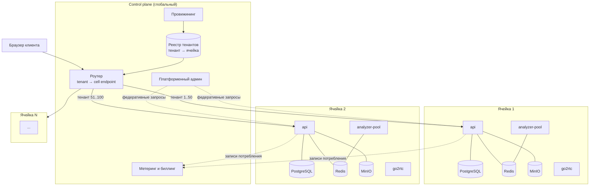
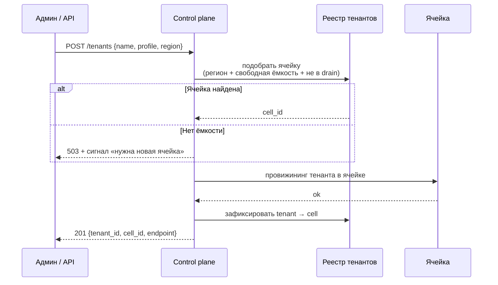
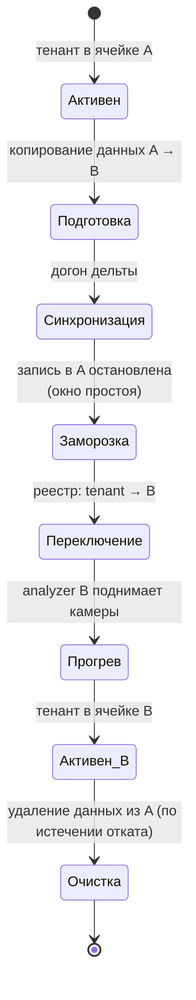
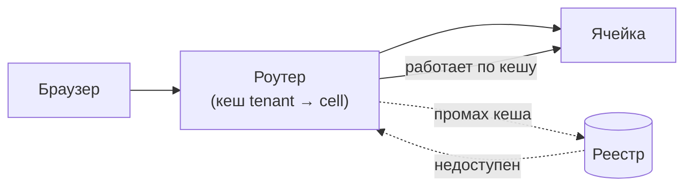
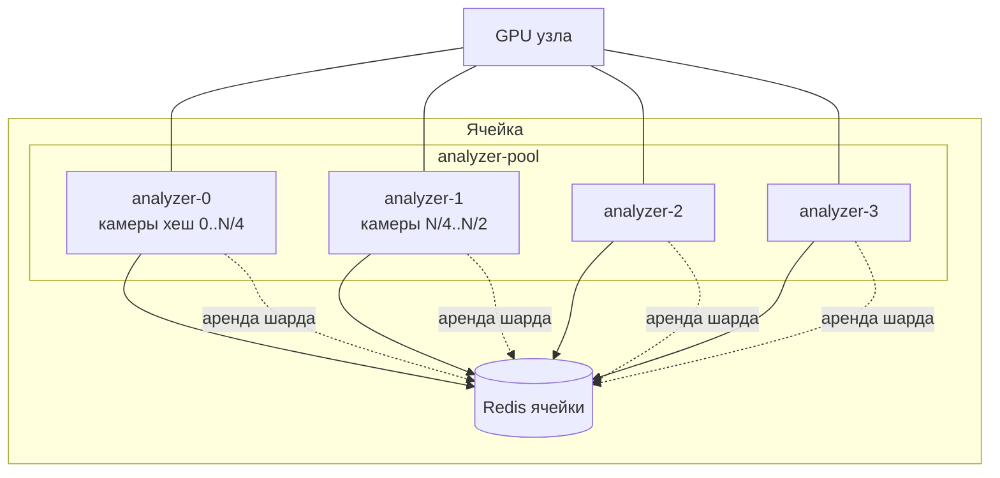
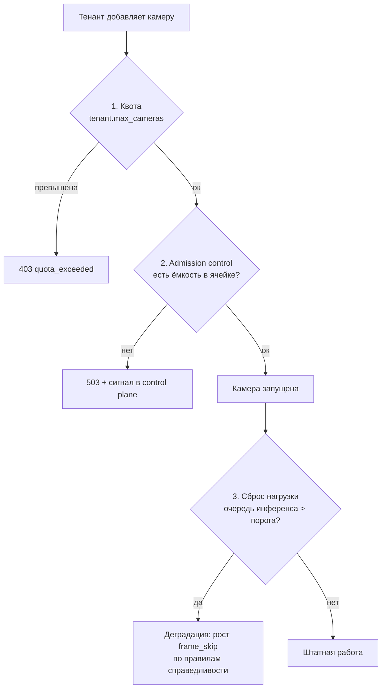

# 20. Архитектура масштаба

**Статус документа:** проект, создан 2026-07-16 по итогам [REVIEW_BOARD.md](REVIEW_BOARD.md)
**Статус реализации: [План] целиком.** Ни один элемент этого документа не существует в коде.
**Аудитория:** архитекторы, технические руководители
**Закрывает находки:** B-01, B-02, B-03, B-06, B-12, B-14, B-15, B-17, B-19, B-75
**Связанные документы:** [02_INFRASTRUCTURE.md](02_INFRASTRUCTURE.md), [11_HIGH_AVAILABILITY.md](11_HIGH_AVAILABILITY.md), [21_TENANT_LIFECYCLE.md](21_TENANT_LIFECYCLE.md), [06_AI_ENGINE.md](06_AI_ENGINE.md)

---

## 1. Назначение и границы

Документ проектирует архитектуру платформы для **1000+ клиентов**. Он отвечает на вопросы, которые при одном клиенте не возникают:

- что откажет вместе, если что-то откажет;
- как клиент попадает на конкретный сервер;
- что мешает одному клиенту съесть ресурсы остальных;
- сколько узлов нужно для N клиентов.

**Предупреждение о применимости.** Всё описанное — целевое состояние. Внедрение любого элемента раньше своего триггера (раздел 10) — это строительство инфраструктуры для клиентов, которых нет. Это убивает компанию быстрее, чем отсутствие ячеек. Совет зафиксировал это как условие принятия документа ([REVIEW_BOARD.md](REVIEW_BOARD.md), 9).

---

## 2. Почему текущая архитектура не масштабируется

### 2.1. Три физических предела

| Предел | Расчёт | Следствие |
|---|---|---|
| **VRAM** | 1000 тенантов × 1 процесс × ~1.5 ГБ (копия YOLO) = **1.5 ТБ VRAM** | Решение A-02 неисполнимо |
| **Трафик архива** | 1000 точек × 4 камеры × 4 Мбит/с = **16 Гбит/с** постоянного входящего | Облачный архив невозможен |
| **Радиус поражения** | Один PostgreSQL, один Redis, один MinIO | Любой инцидент = инцидент 1000 клиентов |

Первые два — арифметика, а не мнение. Третий — проектное решение, которое при одном клиенте не имело цены, а при тысяче имеет.

### 2.2. Что придётся заменить

| Решение | Статус при планке |
|---|---|
| **A-02** (процесс на тенанта) | **Заменяется** на A-02-R (раздел 6) |
| A-01 (кадры не через Redis) | Сохраняется, усиливается |
| A-03 (analyzer не ходит в БД) | Сохраняется, усиливается ячейками |
| A-04 (Redis — проекция) | Сохраняется, область = ячейка |
| DB-01 (одна СУБД, не ClickHouse) | **Получает триггер пересмотра** (раздел 9.3) |

Замена A-02 — единственное отменяемое решение. Остальная архитектура выдерживает планку. Это существенный результат ревью: основание пригодно.

---

## 3. Ячеистая архитектура

### 3.1. Принцип

**Ячейка (cell)** — полный, самодостаточный экземпляр платформы, обслуживающий фиксированное подмножество тенантов.



### 3.2. Свойства ячейки

| Свойство | Значение |
|---|---|
| Самодостаточность | Ячейка работает при отказе control plane (деградация: нет провижининга, обслуживание идёт) |
| Отсутствие связей между ячейками | Ячейка 1 не знает о ячейке 2. Никаких запросов, никакой репликации |
| Одна версия ПО на ячейку | Ячейки могут работать на разных версиях — основа поэтапного выката |
| Фиксированная ёмкость | Ячейка не растёт бесконечно; при заполнении создаётся новая |
| Полный стек | PostgreSQL, Redis, MinIO, api, воркеры, analyzer-pool, go2rtc, nginx |

### 3.3. Что это даёт

| Проблема | Ответ ячеек |
|---|---|
| **B-01** Радиус поражения | Отказ ячейки = отказ её тенантов, не всех |
| **B-12** Изоляция отказов на уровне инфраструктуры | Ячейка — граница |
| **B-15** Шумный сосед | Ограничен ячейкой; плюс квоты внутри ([21](21_TENANT_LIFECYCLE.md)) |
| **B-17** Blue/Green | **Работает по ячейкам**, хотя глобально отвергнут ([11](11_HIGH_AVAILABILITY.md), 6.3) |
| Тестирование | Канареечная ячейка с внутренними тенантами |
| Развёртывание | Ячейка за ячейкой; ошибка не уходит дальше первой |
| Масштабирование | Добавить ячейку — операция, а не проект |
| Резидентность данных | Ячейка в требуемом регионе ([21](21_TENANT_LIFECYCLE.md), 8) |

### 3.4. Цена ячеек

Честно, потому что решение не бесплатно:

| Цена | Оценка |
|---|---|
| Накладные расходы | Каждая ячейка несёт свой PostgreSQL, Redis, MinIO. При 50 тенантах на ячейку это заметная доля |
| Кросс-тенантные запросы | Платформенный админ обязан опрашивать N ячеек и агрегировать. `JOIN` между ячейками невозможен |
| Сложность эксплуатации | 20 ячеек = 20 наборов дашбордов, алертов, бэкапов. Требует автоматизации, иначе toil растёт линейно |
| Перемещение тенанта | Между ячейками — операция с простоем; см. 3.7 |
| Минимальный размер | Ячейка на 3 тенанта экономически бессмысленна |

**Вывод:** ячейки оправданы, когда стоимость радиуса поражения превышает накладные расходы. Это происходит между 20 и 50 клиентами, а не при первом.

### 3.5. Размер ячейки

Определяется **самым дефицитным ресурсом**, а не пожеланием.

| Ограничитель | Оценка |
|---|---|
| **GPU** | Главный. Число камер на узел (раздел 8) |
| PostgreSQL | Не ограничивает: 1000 клиентов дают ~90 ГБ за 90 дней ([10](10_DATABASE.md), 8.1) |
| Redis | Не ограничивает при `maxmemory` |
| Радиус поражения | **Продуктовое ограничение**: сколько клиентов допустимо уронить одновременно |

Последняя строка важнее первых. Даже если GPU тянет 200 камер, ячейка на 200 камер означает, что один инцидент затрагивает 50 клиентов. Это может быть неприемлемо по договору.

*Рекомендация:* размер ячейки = **min(ёмкость GPU, допустимый радиус поражения)**. Целевой ориентир до появления измерений: **50 площадок (около 200 камер) на ячейку**. Значение подлежит пересмотру после реализации [12_MONITORING.md](12_MONITORING.md) — до этого оно является гипотезой.

### 3.6. Назначение тенанта ячейке



Критерии подбора:

| Критерий | Правило |
|---|---|
| Регион | Жёсткое требование (резидентность) |
| Свободная ёмкость | По камерам, не по числу тенантов |
| Статус ячейки | `active`; не `draining`, не `canary` (если тенант не внутренний) |
| Версия | Крупный клиент — на стабильную, не на канареечную |
| Изоляция | Клиент с требованием выделенной ячейки — отдельная ячейка (тариф) |

Последняя строка — продуктовая возможность: **выделенная ячейка** как премиальный тариф. Это стандартная модель (AWS: dedicated tenancy) и она уже поддержана архитектурой.

### 3.7. Перемещение тенанта между ячейками

Требуется при: перебалансировке, росте клиента, миграции региона, выводе ячейки из эксплуатации.



Честная оценка: **простой неизбежен**. Данные тенанта — PostgreSQL (события, настройки), Redis (галерея Re-ID, эталоны сотрудников), MinIO (клипы, снапшоты), архив. Перенос без простоя потребовал бы двухфазной записи, что не оправдано частотой операции.

*Рекомендация:* окно простоя в непиковые часы, порядка 15–30 минут; клиент уведомляется. Архив **не переносится** — он остаётся в старой ячейке до истечения ретеншена либо теряется по согласованию. Это следствие решения D-08 ([03](03_DEPLOYMENT.md)).

---

## 4. Control plane

### 4.1. Назначение и состав

Control plane — **не «главная ячейка»**. Это отдельный, маленький, критичный по доступности сервис.

| Компонент | Функция |
|---|---|
| Реестр тенантов | `tenant_id → cell_id`, регион, тариф, статус |
| Роутер | Маршрутизация запроса в ячейку |
| Провижининг | Создание, приостановка, удаление тенанта ([21](21_TENANT_LIFECYCLE.md)) |
| Реестр ячеек | Ячейки, версии, ёмкость, статус |
| Метеринг | Сбор записей потребления из ячеек ([21](21_TENANT_LIFECYCLE.md), 5) |
| Платформенный админ | Кросс-тенантные операции (федеративно) |
| Каталог инвайтов | Онбординг ([00](00_VISION.md), 7.3) |

### 4.2. Ключевое требование: control plane не в горячем пути

**Правило:** отказ control plane **не должен** останавливать обслуживание.



Реализация: роутер кеширует соответствие `tenant → cell` (оно меняется редко — только при перемещении). При недоступности реестра роутер работает по кешу. Деградирует только провижининг: нового клиента завести нельзя, существующие обслуживаются.

Обоснование: control plane — единая точка отказа по построению. Единственный способ не сделать его SPOF всей платформы — вынести из горячего пути.

Это прямое применение принципа 6.7 из [00_VISION.md](00_VISION.md) (деградация вместо отказа) к новому слою.

### 4.3. Роутинг

Варианты и оценка:

| Вариант | Как | Плюсы | Минусы |
|---|---|---|---|
| **Поддомен на тенанта** | `t-731.viziai.ru` → ячейка | Прозрачно, кешируется DNS, простой откат | Wildcard-сертификат; поддомен виден клиенту |
| Путь | `/t/731/...` | Один домен | Ломает cookie-скоуп и текущие маршруты |
| Заголовок / JWT | Роутер читает `tenant_id` из токена | Прозрачно для клиента | Роутер обязан разбирать JWT — узкое место и связность |
| Отдельный домен клиента | CNAME | Премиально | Сертификаты на клиента |

*Рекомендация:* **поддомен на тенанта.** Обоснование: работает на уровне DNS и nginx без разбора тела запроса; тенант виден в логах; перемещение = смена записи. Wildcard-сертификат решает вопрос TLS одной записью.

Оговорка: JWT-подход выглядит элегантнее, но заставляет роутер разбирать и проверять токен на каждом запросе — то есть роутер становится вторым слоем аутентификации и точкой отказа. Отвергнут.

### 4.4. Кросс-тенантные операции

Платформенный админ обязан видеть все ячейки. `JOIN` невозможен — данные в разных БД.

| Операция | Реализация |
|---|---|
| Список всех тенантов | Реестр control plane (данные там) |
| Состояние всех ячеек | Опрос ячеек, агрегация |
| Поиск события у любого клиента | Веерный запрос в ячейки, объединение, ограничение |
| Глобальная аналитика | **Не в реальном времени**: выгрузка из ячеек в аналитическое хранилище (9.3) |
| Биллинг | Записи потребления стекаются в control plane |

Правило: **кросс-ячеистая операция — всегда веерный запрос с частичным отказом.** Недоступность одной ячейки означает неполный ответ, а не ошибку. Ответ обязан помечать, какие ячейки не ответили.

---

## 5. Радиус поражения

### 5.1. Таблица радиусов

Главный артефакт документа: что именно откажет вместе.

| Отказ | Радиус сейчас | Радиус с ячейками | Радиус целевой |
|---|---|---|---|
| Контейнер `api` | **Все клиенты** | Ячейка | Реплика (0) |
| PostgreSQL | **Все** | Ячейка | Ячейка (секунды, Patroni) |
| Redis | **Все** | Ячейка | Ячейка (Sentinel) |
| MinIO | **Все** | Ячейка | Ячейка |
| Узел GPU | **Все** | Часть ячейки | Часть ячейки |
| go2rtc | **Все (живое видео)** | Ячейка (живое видео) | Ячейка |
| Control plane | — | **Только провижининг** | Только провижининг |
| Роутер | — | **Все** | Реплики + DNS |
| VPS / хаб | **Все** | Регион | Мультихаб ([04](04_NETWORK.md)) |
| Ошибка миграции | **Все** | **Первая ячейка** | Первая ячейка |
| Ошибка кода | **Все** | **Канареечная ячейка** | Канареечная ячейка |

Две последние строки — главный выигрыш. Сегодня ошибочная миграция ломает всех одновременно ([03](03_DEPLOYMENT.md), 4.3: миграции применяются ко всем при каждом обновлении). С ячейками она ломает одну ячейку, и выкат останавливается.

### 5.2. Роутер как новый SPOF

Ячейки устраняют один SPOF и создают другой: роутер видят все.

Смягчение:
- Роутер — stateless (кеш восстановим), значит реплицируется тривиально;
- Несколько экземпляров за DNS с низким TTL;
- Роутер не разбирает JWT и не ходит в БД в горячем пути (4.3) — он остаётся простым, а простое отказывает реже.

Правило: **роутер обязан оставаться самым простым сервисом платформы.** Любая функция, добавляемая в роутер, увеличивает радиус до максимального. Это правило следует защищать: соблазн «раз уж все запросы проходят через роутер, добавим туда rate-limit / аудит / метрики тенанта» будет возникать постоянно.

---

## 6. Ответ на B-03: пул анализаторов

### 6.1. Замена решения A-02

| | A-02 (действует) | **A-02-R (целевое)** |
|---|---|---|
| Модель | Процесс на тенанта | **Пул процессов на ячейку** |
| Копий модели в VRAM | По числу тенантов | По числу процессов пула |
| Назначение камер | `TENANT_ID` в `.env` | Шардирование по консистентному хешу |
| VRAM при 50 тенантах | ~75 ГБ | **~6 ГБ** (4 процесса) |
| Радиус отказа процесса | Один тенант | Часть камер ячейки |
| Мультитенантность в процессе | Нет | **Да** |

Историю решения A-02 сохранить: оно было верным для стадии 1, и причина замены — не ошибка, а смена планки. Реестр решений обязан отражать замену, а не переписывание ([REVIEW_BOARD.md](REVIEW_BOARD.md), 8.1).

### 6.2. Устройство пула



| Механизм | Реализация |
|---|---|
| Распределение камер | Консистентное хеширование `camera_id` → шард |
| Владение шардом | Аренда в Redis (`SET shard:{n} {worker} NX EX 30` с продлением) |
| Отказ процесса | Аренда истекает; другой процесс подхватывает шард |
| Добавление процесса | Перебалансировка: часть камер мигрирует |
| Мультитенантность | Процесс обслуживает камеры **разных тенантов**; `tenant_id` — атрибут камеры, не процесса |

Ключевое изменение в коде: `Settings.tenant_id` перестаёт быть свойством процесса. `AnalyzerWorker` уже держит словари по камерам (`_site_by_camera`, `_tz_by_camera`) — добавление `_tenant_by_camera` является локальным изменением. Проекция становится `cameras:{cell_id}` вместо `cameras:{tenant_id}`.

Это существенно: **архитектура анализатора выдерживает замену A-02 без переписывания.** Изменение затрагивает загрузку конфигурации и супервизор, а не конвейер.

### 6.3. Почему не «процесс на камеру»

Отвергнутая альтернатива: отдельный процесс на камеру, как в ряде VMS.

| Аспект | Оценка |
|---|---|
| Изоляция | Лучше |
| VRAM | **Катастрофа**: копия модели на камеру |
| Батчинг | **Невозможен**: батч собирается из кадров разных камер |
| Переключение контекста | 200 процессов на узел |

Батчинг — решающий аргумент. Он требует, чтобы кадры **нескольких камер** сходились в одном процессе. Процесс на камеру закрывает главный рычаг ёмкости ([06](06_AI_ENGINE.md), раздел 3-бис).

### 6.4. Соотношение с решением A-02 (один поток инференса)

Сохраняется: внутри процесса пула инференс по-прежнему в одном потоке. Меняется то, что этот поток обрабатывает **батч кадров**, а не один кадр.

Противоречия нет: один поток, один батч, предсказуемая загрузка GPU.

---

## 7. Шумный сосед и сброс нагрузки

### 7.1. Проблема

Ячейка на 50 тенантов. Один заводит 200 камер вместо четырёх. Последствия:

| Ресурс | Эффект |
|---|---|
| GPU | Очередь инференса растёт; **все тенанты ячейки** получают задержку |
| CPU | Декодирование насыщает узел |
| Redis | Поток событий вытесняет чужие |
| PostgreSQL | Вставки конкурируют |
| Диск архива | Съедается ретеншеном соседей |

Сегодня **ничто этого не предотвращает** (B-15, B-72).

### 7.2. Три рубежа



**Рубеж 1 — квота.** Статический предел на тенанта ([21](21_TENANT_LIFECYCLE.md), 4). Дёшево, предотвращает большинство.

**Рубеж 2 — admission control.** Ячейка знает свою ёмкость и не принимает камеру, которая её превысит. Требует модели ёмкости (раздел 8).

**Рубеж 3 — сброс нагрузки.** Последняя линия: если очередь инференса растёт, платформа **сознательно снижает качество** вместо того, чтобы отставать от реального времени.

### 7.3. Сброс нагрузки: правила справедливости

Критично: **кто именно деградирует.**

| Стратегия | Оценка |
|---|---|
| Равномерно всем | Несправедливо: нарушитель наказал соседей |
| **Пропорционально превышению квоты** | **Верно**: деградирует тот, кто вызвал |
| По приоритету тарифа | Возможно, но требует продуктового решения |
| Отключить лишние камеры | Слишком грубо |

*Рекомендация:* деградация через **рост `frame_skip`** у камер тенанта, потребляющего сверх доли, до восстановления очереди. `frame_skip` уже настраивается per-camera ([01](01_SYSTEM_ARCHITECTURE.md), 4.6) — механизм существует, требуется управляющий контур.

**Жёсткое ограничение:** `frame_skip` выше 3 разваливает трекинг ([06](06_AI_ENGINE.md), 4.2). Следовательно, сброс нагрузки **не имеет права** поднимать его выше 3 — при исчерпании этого диапазона следует останавливать приём новых камер и подавать сигнал в control plane, а не ломать аналитику молча.

Это важный пример: механизм деградации ограничен инженерным фактом из другого документа. Без этой связи «оптимизация под нагрузкой» тихо сломала бы качество.

### 7.4. Режимы brownout (B-19)

Деградация как **явные режимы**, а не таблица частных случаев.

| Режим | Триггер | Что отключается | Что сохраняется |
|---|---|---|---|
| **Норма** | — | — | Всё |
| **Жёлтый** | Очередь инференса > 2× нормы | Рост `frame_skip` нарушителям; сводки алертов реже | Детекция, critical-алерты, события |
| **Оранжевый** | Очередь > 5× | Плагины `shelf`, `repack` (дорогие, некритичные); тепловые карты; `track_events` | Детекция, зоны, critical-алерты |
| **Красный** | Очередь > 10× либо VRAM на исходе | Всё, кроме зон `forbidden` и `camera_offline` | Только критические события |
| **Чёрный** | Отказ GPU | Аналитика; **архив продолжает писаться** | Запись, живое видео |

Принцип очерёдности: **сначала отключается то, что можно восстановить постфактум** (тепловые карты — агрегат, его можно пересчитать; `shelf` — статистика), в последнюю очередь — то, что необратимо (critical-событие о человеке в запретной зоне ночью).

Строка «Чёрный» существенна: отказ GPU не должен останавливать запись архива. Recorder не зависит от GPU ([01](01_SYSTEM_ARCHITECTURE.md), 5) — это свойство следует сохранить осознанно, а не случайно.

---

## 8. Модель ёмкости (B-75)

### 8.1. Почему параметрическая

Измерений нет ([12](12_MONITORING.md), M-D-01). Совет требует модель **с явными неизвестными**, а не отсутствие модели: без неё нельзя ни планировать закупку, ни назначить цену.

Модель ниже параметризована. Коэффициенты помечены как неизвестные и подлежат замене измерением.

### 8.2. Модель

```
Обозначения:
  C     — камер на площадке (ПВЗ: 4)
  F     — кадров в секунду источника (типично 12–15)
  S     — frame_skip (прод: 2)
  R     — частота анализа = F / (S + 1)                    [кадров/с на камеру]
  B     — размер батча инференса
  T_inf — время инференса батча B                          [НЕИЗВЕСТНО]
  T_dec — время декодирования кадра на ядре CPU            [НЕИЗВЕСТНО]
  N_cpu — ядер CPU
  U     — целевая утилизация (0.7 — запас на всплески)

Пропускная способность GPU:
  Кадров/с_GPU = B / T_inf(B)

Пропускная способность CPU (декодирование):
  Кадров/с_CPU = N_cpu / T_dec × U
  (декодируются ВСЕ кадры, включая пропущенные по frame_skip)

Камер на узел:
  Камер_GPU = Кадров/с_GPU / R
  Камер_CPU = Кадров/с_CPU / F        ← знаменатель F, не R!
  Камер_узел = min(Камер_GPU, Камер_CPU)

Площадок на ячейку:
  Площадок = Камер_узел / C × Узлов_GPU_в_ячейке
```

### 8.3. Критическая асимметрия

Обратите внимание на знаменатели:

| Ресурс | Знаменатель | Почему |
|---|---|---|
| GPU | `R` = `F / (S+1)` | Инференс только на оставленных кадрах |
| **CPU** | **`F`** | **Декодируются ВСЕ кадры**; `frame_skip` отбрасывает кадр **после** декодирования |

Отсюда следствие, не отражённое ни в одном документе до ревью: **`frame_skip` снижает нагрузку на GPU и не снижает нагрузку на CPU.** При `S = 2` GPU разгружается втрое, CPU — нисколько.

Значит, при росте числа камер **CPU упирается раньше GPU почти неизбежно**, и увеличение `frame_skip` — распространённая реакция — не помогает вовсе.

Это подтверждает приоритет B-05 (NVDEC/DeepStream) над TensorRT: перенос декодирования на GPU снимает настоящее ограничение, ускорение инференса — мнимое.

*Проверка гипотезы:* закрывается метриками `viziai_inference_duration_seconds` и утилизацией CPU по ядрам ([12](12_MONITORING.md), 5.2). До измерения — гипотеза с высокой уверенностью.

### 8.4. Пример расчёта

**Иллюстрация метода, не результат.** Коэффициенты вымышлены и подлежат замене.

```
Дано (ГИПОТЕЗА, требует измерения):
  C = 4, F = 12, S = 2 → R = 4 кадра/с на камеру
  T_inf(16) = 40 мс   → 16/0.040 = 400 кадров/с GPU
  T_dec = 8 мс/кадр, N_cpu = 16, U = 0.7
                       → 16/0.008 × 0.7 = 1400 кадров/с CPU

  Камер_GPU = 400 / 4  = 100
  Камер_CPU = 1400 / 12 = 116
  Камер_узел = min(100, 116) = 100
  Площадок = 100 / 4 = 25 на узел GPU

Ячейка из 2 узлов GPU = 50 площадок
1000 площадок = 20 ячеек = 40 узлов GPU
```

Без батчинга (`B = 1`, `T_inf(1) = 8 мс` → 125 кадров/с):

```
  Камер_GPU = 125 / 4 = 31
  Камер_узел = min(31, 116) = 31 → втрое меньше
```

**Вывод модели:** батчинг меняет требуемое число узлов при планке с ~130 до ~40. Это единственный параметр такого масштаба влияния. Он же — самый дешёвый в реализации.

### 8.5. Что модель не учитывает

| Фактор | Влияние |
|---|---|
| Re-ID (эмбеддинг на CPU) | Добавляет к `T_dec`; при OSNet ONNX — заметно |
| Плагины | `shelf` работает с пикселями |
| Recorder | ffmpeg на камеру, `-c copy` — низкая нагрузка |
| Неравномерность | Час пик даёт больше треков → больше работы Re-ID |
| Ночь | Меньше людей → меньше нагрузки |

Последние две строки означают: ёмкость следует считать **по пику, а не по среднему**, а `U = 0.7` — попытка это учесть грубо.

---

## 9. Данные при планке

### 9.1. Шардирование по ячейкам

PostgreSQL не является ограничителем по объёму ([10](10_DATABASE.md), 8.1: 1000 клиентов ≈ 90 ГБ за 90 дней). Ячейки дают шардирование **как побочный эффект** — специальное решение не требуется.

Это удачное следствие: данных мало, а изоляция нужна. Ячейки дают изоляцию бесплатно.

### 9.2. Миграции при 20 ячейках

Текущая схема ([03](03_DEPLOYMENT.md), 4.3: все миграции применяются при каждом обновлении) на 20 ячейках означает 20 применений. Требования:

| Требование | Почему |
|---|---|
| Идемпотентность | Сохраняется |
| **Совместимость вперёд/назад** | Ячейки на разных версиях одновременно |
| Применение per-cell | Часть ячеек уже обновлена |
| Остановка выката при отказе | Ошибка на ячейке 1 не должна дойти до ячейки 2 |

Это делает правило «расширить — переключить — сузить» ([03](03_DEPLOYMENT.md), 4.4) **обязательным**, а не рекомендуемым: при поэтапном выкате версии сосуществуют неделями.

### 9.3. Кросс-тенантная аналитика: триггер пересмотра DB-01

Решение DB-01 («одна СУБД, не ClickHouse») верно при текущем масштабе и **остаётся верным внутри ячейки**.

Но появляется новая задача: аналитика **по всем клиентам** (продуктовая, не клиентская). При ячейках она невозможна — данные в 20 БД.

*Рекомендация:* выгрузка событий из ячеек в аналитическое хранилище control plane.

| Вариант | Оценка |
|---|---|
| Опрос ячеек | Не масштабируется |
| **CDC → колоночное хранилище** | Верно. ClickHouse оправдан **здесь**, а не внутри ячейки |
| Federated query | Хрупко |

**Триггер пересмотра DB-01:** появление второй ячейки. До этого — не трогать.

Формулировка решения уточняется: *«внутри ячейки — TimescaleDB; для кросс-ячеистой продуктовой аналитики — отдельное колоночное хранилище»*. Это не отмена DB-01, а определение его области.

### 9.4. Redis и события при планке

Находка HA-14 ([11](11_HIGH_AVAILABILITY.md)): Redis не гарантирует сохранность событий даже в HA (асинхронная репликация).

При одном клиенте потеря секунды событий при переключении — приемлемо. При 1000 клиентов и договорном SLA на приём событий — материально.

**Триггер перехода на durable-брокер:** договорное обязательство «ни одно событие не потеряно».

| Вариант | Оценка |
|---|---|
| Redis Streams + AOF `everysec` | Теряет ≤1с при аварии |
| Redis Streams + AOF `always` | Не теряет; **резко дороже по IOPS** |
| **NATS JetStream** | Durable, лёгкий, подходит по масштабу |
| Kafka | Гарантии, но операционно тяжёл для ячейки |

*Рекомендация:* при появлении обязательства — **NATS JetStream** на ячейку. Kafka избыточен: поток событий ячейки — сотни в секунду, а не сотни тысяч. Семантика (consumer group, ack, dead-letter) переносится, менять код потребителя минимально.

До появления обязательства — Redis + AOF `everysec` и **честная формулировка в договоре**, что при аварийном отказе узла возможна потеря событий за ≤1 секунду.

---

## 10. Триггеры внедрения

Раздел, определяющий, когда документ применять. Внедрение раньше триггера вредно.

| Элемент | Триггер | Почему не раньше |
|---|---|---|
| **Батчинг инференса** | **Немедленно** | Не зависит от масштаба; кратный выигрыш; дёшев |
| Модель ёмкости (заполнить измерениями) | Появление мониторинга | Без данных — гипотеза |
| Мультитенантный analyzer (A-02-R) | 5–6 тенантов на узел | VRAM ещё хватает |
| NVDEC / DeepStream | Утилизация CPU > 70% | До этого CPU не узкое место |
| **Ячейки** | **20+ клиентов либо первый договорный SLA** | Накладные расходы превышают выигрыш |
| Control plane | Вторая ячейка | Одна ячейка — маршрутизация не нужна |
| Квоты | Первый клиент не по типовому профилю | До этого все одинаковы |
| Admission control | Первая ячейка близка к заполнению | — |
| Сброс нагрузки | Первый инцидент перегрузки | Преждевременная сложность |
| Колоночное хранилище | Вторая ячейка | Кросс-ячеистых запросов ещё нет |
| NATS JetStream | Обязательство «ни одного события» | Redis достаточен |
| Выделенные ячейки | Клиент, готовый платить | — |

**Правило:** элемент внедряется **после** срабатывания триггера, а не в ожидании. Исключение — первая строка: батчинг полезен при одном клиенте.

---

## 11. Реестр решений

| № | Решение | Обоснование | Альтернатива и почему отвергнута |
|---|---|---|---|
| **A-02-R** | **Пул мультитенантных анализаторов заменяет «процесс на тенанта»** | 1000 копий модели = 1.5 ТБ VRAM — физически невозможно | A-02: неисполнимо при планке. Процесс на камеру: убивает батчинг |
| SC-01 | Ячеистая архитектура | Ограничение радиуса поражения; выкат, тестирование, резидентность — следствия | Один большой кластер: инцидент = 1000 клиентов |
| SC-02 | Размер ячейки = min(ёмкость GPU, допустимый радиус) | Радиус — продуктовое ограничение, часто жёстче технического | Только по GPU: один инцидент на 50 клиентов |
| SC-03 | Control plane вне горячего пути; роутер работает по кешу | Иначе control plane — SPOF всей платформы | В горячем пути: отказ реестра = отказ всех |
| SC-04 | Роутер обязан оставаться простейшим сервисом | Его радиус максимален; сложность = отказы у всех | Логика в роутере: SPOF с богатой поверхностью |
| SC-05 | Маршрутизация поддоменом | Работает на DNS/nginx без разбора запроса | JWT в роутере: второй слой аутентификации, узкое место |
| SC-06 | Кросс-ячеистые запросы — веерные, с частичным отказом | Ячейки не связаны by design | Federated JOIN: воссоздаёт связность, которую ячейки устраняли |
| SC-07 | Ячейки не связаны между собой | Связь между ячейками уничтожает изоляцию | Общий кеш/БД: ячейки перестают быть ячейками |
| SC-08 | Перенос тенанта — с простоем | Частота операции не оправдывает двухфазную запись | Без простоя: сложность, не окупаемая |
| SC-09 | Сброс нагрузки не поднимает `frame_skip` выше 3 | Выше 3 разваливается трекинг ([06](06_AI_ENGINE.md), 4.2) | Без границы: тихая поломка аналитики под нагрузкой |
| SC-10 | Деградация — явные режимы; сначала восстановимое | Тепловую карту можно пересчитать, пропущенное вторжение — нет | Ad hoc: под нагрузкой отключится случайное |
| SC-11 | Отказ GPU не останавливает запись архива | Recorder не зависит от GPU — свойство защищается осознанно | Общая остановка: теряем и аналитику, и доказательства |
| SC-12 | Область DB-01 уточнена: Timescale в ячейке, колоночное — в control plane | Кросс-ячеистая аналитика — другая задача | ClickHouse в ячейке: две СУБД на ячейку |
| SC-13 | Элемент внедряется после триггера | Инфраструктура для несуществующих клиентов убивает компанию | По плану-графику: затраты без клиентов |

---

## 12. Долг

| № | Проблема | Влияние | Приоритет |
|---|---|---|---|
| SC-D-01 | Модель ёмкости параметрическая; `T_inf`, `T_dec` неизвестны | Планирование и цена — гипотезы | **Высокий** (закрывается [12](12_MONITORING.md)) |
| SC-D-02 | Гипотеза «CPU упирается раньше GPU» не проверена | Приоритет NVDEC против TensorRT не подтверждён | **Высокий** |
| SC-D-03 | Размер ячейки (50 площадок) — догадка | Ошибка удваивает или ополовинивает парк | Высокий |
| SC-D-04 | Перенос тенанта не спроектирован детально | Первая перебалансировка будет ручной | Средний |
| SC-D-05 | Нет автоматизации создания ячейки (IaC) | 20 ячеек вручную = toil | Средний |
| SC-D-06 | Веерные запросы платформенного админа не спроектированы | Кросс-тенантные операции | Средний |
| SC-D-07 | Ячейки не проверены на практике | Первая ячейка выявит ошибки модели | Средний |
