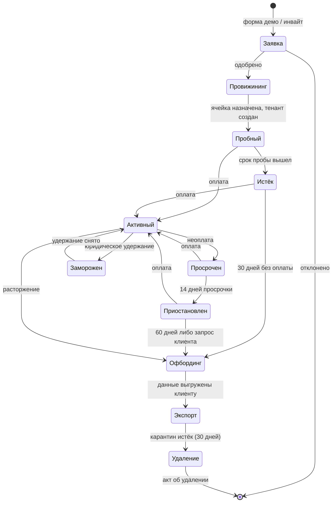
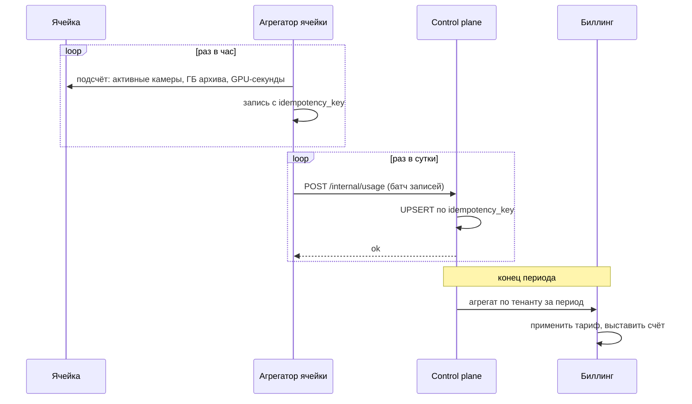
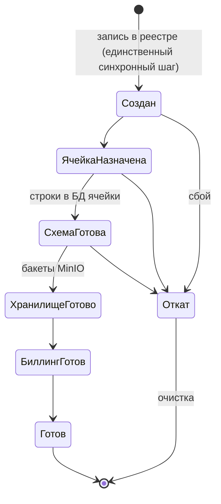
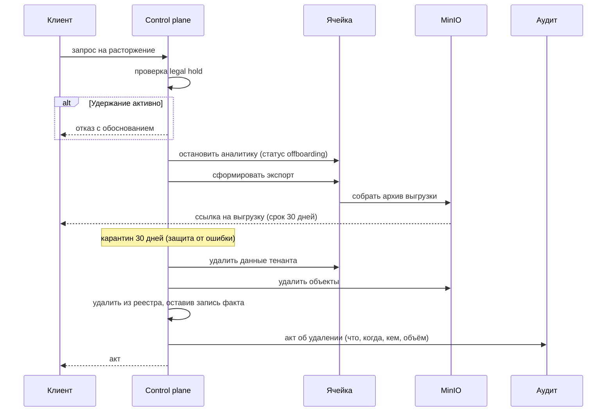

# 21. Жизненный цикл тенанта

**Статус документа:** проект, создан 2026-07-16 по итогам [REVIEW_BOARD.md](REVIEW_BOARD.md)
**Статус реализации: [План] целиком**, кроме отмеченного как существующее в разделе 3
**Аудитория:** архитекторы, backend-инженеры, продуктовые менеджеры, финансы
**Закрывает находки:** B-71, B-72, B-73, B-53, B-77, B-28
**Связанные документы:** [20_SCALE_ARCHITECTURE.md](20_SCALE_ARCHITECTURE.md), [13_SECURITY.md](13_SECURITY.md), [10_DATABASE.md](10_DATABASE.md), [00_VISION.md](00_VISION.md)

---

## 1. Назначение

Документ проектирует полный жизненный цикл клиента: от заявки до удаления данных, включая квоты, учёт потребления, тарификацию, приостановку и офбординг.

**Почему это отдельный документ.** При одном клиенте жизненного цикла нет: тенант заводится SQL-вставкой, удаляется каскадом, потребление не считается. При 1000 клиентах каждая из этих операций — процесс с юридическими и финансовыми последствиями.

Совет квалифицировал отсутствие метеринга (B-71) и квот (B-72) как **блокеры**: без них компания с тысячей клиентов не может ни выставить счёт, ни защититься от злоупотребления.

---

## 2. Состояния тенанта



| Состояние | Аналитика | Живое видео | API | Данные | Счёт |
|---|---|---|---|---|---|
| Пробный | Да (лимит) | Да | Да | Хранятся | Нет |
| **Активный** | Да | Да | Да | Хранятся | Да |
| Просрочен | Да | Да | Да | Хранятся | Да + напоминание |
| **Приостановлен** | **Нет** | **Нет** | **Только чтение** | **Хранятся** | Заморожен |
| Заморожен (legal hold) | Да | Да | Да | **Не удаляются** | Да |
| Офбординг | Нет | Нет | Только экспорт | Карантин | Финальный |
| Удалён | — | — | — | **Уничтожены** | — |

### 2.1. Решение: приостановка сохраняет данные

Ключевое: при неоплате **аналитика останавливается, данные сохраняются**.

Обоснование: клиент, вернувшийся через неделю, не должен обнаружить потерю архива и настроек. Удаление данных за неоплату — способ гарантированно потерять клиента и получить репутационный ущерб.

Цена: приостановленный тенант продолжает потреблять хранилище. Отсюда лимит 60 дней.

*Рекомендация:* приостановка **освобождает GPU** (главный дефицитный ресурс) и **не освобождает диск** (дешёвый). Это верный баланс: ёмкость ячейки высвобождается сразу, данные ждут.

---

## 3. Что существует сегодня

| Элемент | Состояние |
|---|---|
| Таблица `tenant(id, name, mode, settings)` | **Есть** |
| `tenant_feature` — включение модулей | **Есть**; основа тарификации ([00](00_VISION.md), 9.1) |
| Создание тенанта | **Нет API**; вставка SQL |
| Удаление | **Есть**: каскад `ON DELETE CASCADE` — **необратимо и опасно** ([10](10_DATABASE.md), DB-D-15) |
| Инвайты | Модель принята ([00](00_VISION.md), 7.3), **не реализована** |
| Квоты | **Нет** |
| Метеринг | **Нет** |
| Приостановка | **Нет** |
| Экспорт данных | **Нет** |
| Резидентность | **Нет** |

Единственный существующий элемент жизненного цикла — каскадное удаление, и оно является дефектом: одна ошибка администратора необратимо уничтожает клиента при отсутствии резервных копий ([02](02_INFRASTRUCTURE.md), I-01).

---

## 4. Квоты (B-72)

### 4.1. Модель

```sql
-- [План]
CREATE TABLE tenant_quota (
  tenant_id       uuid PRIMARY KEY REFERENCES tenant(id) ON DELETE CASCADE,
  max_sites       integer NOT NULL DEFAULT 1,
  max_cameras     integer NOT NULL DEFAULT 8,
  max_users       integer NOT NULL DEFAULT 5,
  max_zones_per_camera integer NOT NULL DEFAULT 10,
  max_alert_rules integer NOT NULL DEFAULT 20,
  archive_days    integer NOT NULL DEFAULT 7,
  archive_gb      integer NOT NULL DEFAULT 200,
  event_days      integer NOT NULL DEFAULT 90,
  api_rps         integer NOT NULL DEFAULT 10,
  api_burst       integer NOT NULL DEFAULT 50,
  clips_per_day   integer NOT NULL DEFAULT 100,
  notifications_per_day integer NOT NULL DEFAULT 500,
  gpu_share       real    NOT NULL DEFAULT 1.0,  -- доля от честной доли ячейки
  updated_at      timestamptz NOT NULL DEFAULT now()
);
```

### 4.2. Классы квот

| Класс | Примеры | Проверка | При превышении |
|---|---|---|---|
| **Структурные** | `max_cameras`, `max_sites`, `max_users` | При создании | `403 quota_exceeded` |
| **Скоростные** | `api_rps`, `clips_per_day` | На запросе | `429` + `Retry-After` |
| **Ресурсные** | `archive_gb`, `gpu_share` | Постоянно | Деградация, не отказ |
| **Временные** | `archive_days`, `event_days` | Ретеншеном | Автоудаление |

Различие принципиально. Структурная квота **запрещает** действие — это честно и понятно. Ресурсная квота **не может** запретить (нельзя «отказать» уже идущему видеопотоку) — она приводит к деградации ([20](20_SCALE_ARCHITECTURE.md), 7.3).

### 4.3. `gpu_share`: честная доля

Самая нетривиальная квота. GPU нельзя нарезать как диск.

Модель: тенант имеет право на **честную долю** ячейки, пропорциональную тарифу:

```
Честная доля тенанта = gpu_share_i / Σ(gpu_share всех активных тенантов ячейки)
Фактическое потребление = Σ(кадров/с всех камер тенанта)
Превышение = Фактическое / (Ёмкость ячейки × Честная доля)
```

При `Превышение > 1` **и** признаках перегрузки ячейки тенант деградирует первым (рост `frame_skip`, но не выше 3 — SC-09).

Важно: при **отсутствии** перегрузки превышение допускается. Тенант, использующий свободный GPU ночью, никому не мешает. Ограничивать его — значит жечь ресурс впустую.

Это модель **работы с избыточным потреблением** (burst), стандартная для облаков: гарантирована доля, разрешено больше при наличии свободного.

### 4.4. Квоты как продукт

Квота — техническое выражение тарифа. Соответствие ([00](00_VISION.md), 9.2):

| Тариф | `max_cameras` | `archive_days` | Модули | `gpu_share` |
|---|---|---|---|---|
| Базовый | 4 | 3 | `counter` | 0.5 |
| Стандартный | 8 | 7 | + `queue`, `crowd`, зоны, алерты, клипы | 1.0 |
| Расширенный | 16 | 30 | + `reid`, `shelf`, `repack`, тепловые карты, отчёты | 2.0 |
| Корпоративный | По договору | По договору | Все | Выделенная ячейка |

**[Данные отсутствуют]:** цены. Числа выше — структура упаковки, не прайс. Назначение цены требует себестоимости, а она требует мониторинга ([12](12_MONITORING.md), раздел 2).

### 4.5. Обязательное свойство: квота не ломает существующее

При понижении тарифа тенант может оказаться сверх квоты (было 16 камер, стало 8).

*Правило:* **квота ограничивает добавление, а не работу.** Существующие 16 камер продолжают работать; 17-ю добавить нельзя. Отключать камеры автоматически — недопустимо: клиент потеряет наблюдение молча.

Разрешение конфликта — явное действие клиента либо администратора, с уведомлением.

---

## 5. Метеринг (B-71)

### 5.1. Что тарифицировать

Выбор единицы — продуктовое решение с техническими последствиями.

| Единица | За | Против | Оценка |
|---|---|---|---|
| **Площадка (site)** | Понятно клиенту; совпадает с его экономикой | Не отражает наши затраты (4 или 16 камер — разница втрое) | **Основная для ПВЗ** |
| **Камера** | Ближе к затратам | Клиент экономит, отключая камеры | **Основная для производства** |
| Событие | Точно | Непредсказуемо для клиента; наказывает за активность | **Отвергнуто** |
| ГБ-часы архива | Справедливо | Сложно | **Дополнительная** |
| GPU-секунды | Точнее всего | Непонятно клиенту | Внутренняя, не для счёта |

*Рекомендация:* **гибрид** — фиксированная плата за площадку (ПВЗ) или камеру (производство) плюс отдельно архив сверх включённого объёма.

Обоснование отказа от тарификации по событиям: она наказывает клиента за то, что система работает. Владелец, увидев рост счёта из-за роста числа посетителей, начнёт отключать модули. Это разрушает продукт.

### 5.2. Записи потребления

```sql
-- [План]. Пишется в ячейке, стекается в control plane.
CREATE TABLE usage_record (
  id          uuid NOT NULL DEFAULT uuid_generate_v4(),
  tenant_id   uuid NOT NULL,
  cell_id     text NOT NULL,
  metric      text NOT NULL,   -- sites_active | cameras_active | archive_gb | gpu_seconds | events | clips
  value       double precision NOT NULL,
  period_start timestamptz NOT NULL,
  period_end   timestamptz NOT NULL,
  idempotency_key text NOT NULL,   -- {tenant}:{metric}:{period_start}
  created_at  timestamptz NOT NULL DEFAULT now(),
  PRIMARY KEY (id, period_start),
  UNIQUE (idempotency_key)
);
SELECT create_hypertable('usage_record', 'period_start', chunk_time_interval => INTERVAL '7 days');
```

### 5.3. Три обязательных свойства

Метеринг — финансовые данные. Требования жёстче, чем к событиям.

**Идемпотентность.** `idempotency_key = {tenant}:{metric}:{period_start}`. Повторная отправка (сбой сети, ретрай) не удваивает счёт. Без этого клиент получит двойной счёт, и это дороже любого технического инцидента.

**Опоздавшие записи.** Ячейка была недоступна сутки — записи придут задним числом. Биллинг обязан принимать записи за закрытый период и выставлять корректировку, а не отбрасывать.

**Неудаляемость.** `usage_record` не подпадает под ретеншен. Финансовые записи хранятся по сроку, определяемому законодательством (**[Требует решения]**: срок хранения первичных документов).

### 5.4. Сбор



Ячейка **не знает тарифов**. Она измеряет и отправляет факты. Тарификация — в control plane.

Обоснование: тариф меняется, ячейка — нет. Смешение привело бы к тому, что смена цены требует выката во все ячейки.

### 5.5. Что считать «активной камерой»

Неочевидно и имеет финансовые последствия.

| Определение | Проблема |
|---|---|
| Строка в БД | Клиент платит за камеру, которая месяц офлайн |
| Была онлайн хотя бы раз за период | Клиент платит за случайно подключённую |
| **Была онлайн ≥ N% периода** | **Требует определения N** |
| Средняя за период | Справедливо; сложнее объяснить |

*Рекомендация:* **камера тарифицируется за сутки, если была онлайн хотя бы час.** Обоснование: защищает клиента от оплаты сломанной камеры (частый случай — камера отвалилась, клиент не заметил) и защищает нас от бесплатного использования. Порог в час отсекает тестовые подключения.

Данные для этого **уже собираются**: heartbeat `camera_alive:{id}` и события `camera_offline`/`camera_online` ([01](01_SYSTEM_ARCHITECTURE.md), 11.4). Метеринг доступности камеры не требует нового механизма — требует агрегации существующего.

### 5.6. Спорные ситуации

| Ситуация | Правило |
|---|---|
| Камера офлайн по вине клиента (выключили ПК) | Тарифицируется (мы держали ёмкость) |
| Камера офлайн по нашей вине (отказ ячейки) | **Не тарифицируется**; автоматическая корректировка |
| Тенант приостановлен | Хранение тарифицируется, аналитика — нет |
| Ячейка недоступна | Компенсация по SLA ([22](22_SRE_OPERATIONS.md), 4) |

Вторая строка требует, чтобы биллинг **знал о наших инцидентах**. Связь: `viziai_cell_availability` → автоматическая корректировка. Без этого клиент будет требовать перерасчёт вручную по каждому инциденту — и будет прав.

---

## 6. FinOps: себестоимость тенанта (B-77)

### 6.1. Разложение затрат

```
Себестоимость площадки в месяц =
    Доля GPU-узла        = Стоимость_узла / Площадок_на_узел
  + Доля узла данных     = Стоимость_узла / Площадок_на_ячейку
  + Трафик               = ГБ_в_месяц × Цена_за_ГБ (VPS!)
  + Хранение архива      = ГБ × Цена_за_ГБ-месяц
  + Хранение MinIO       = ГБ × Цена
  + Доля control plane   = Стоимость / Всего_площадок
  + Доля поддержки       = ФОТ / Всего_площадок
```

**[Данные отсутствуют]:** все коэффициенты. Модель показывает структуру, не результат.

### 6.2. Что доминирует

| Статья | Оценка |
|---|---|
| **Трафик через VPS** | **Вероятно доминирует.** 4 камеры × (1 Мбит/с ИИ + 4 Мбит/с архив) = 20 Мбит/с непрерывно ≈ 6.5 ТБ/месяц на точку. При тарификации трафика это может превышать долю GPU |
| Доля GPU | Зависит от батчинга (см. [20](20_SCALE_ARCHITECTURE.md), 8.4: втрое) |
| Хранение архива | 4 камеры × 4 Мбит/с × 7 дней ≈ 1.2 ТБ |
| Поддержка | При 1000 клиентах — существенно |

Первая строка — вероятно, главный вывод раздела: **облачный архив экономически несостоятелен**, и это подтверждает приоритет гибридного режима ([03](03_DEPLOYMENT.md), 8) не только технически, но и финансово.

*Рекомендация:* до подключения пятой точки посчитать фактический трафик через VPS и его стоимость. Вероятный вывод — архив остаётся на площадке, в облако уходят события и клипы по запросу. Это меняет и продукт, и цену.

### 6.3. Единица экономики

| Показатель | Формула | Состояние |
|---|---|---|
| Себестоимость площадки | 6.1 | **[Данные отсутствуют]** |
| Валовая маржа | (Цена − Себестоимость) / Цена | Неизвестна |
| Точка безубыточности ячейки | Постоянные / Маржа на площадку | Неизвестна |
| Порог выделенной ячейки | Когда клиент окупает ячейку целиком | Неизвестен |

Все четыре закрываются мониторингом. Это делает [12_MONITORING.md](12_MONITORING.md) предусловием не только SLA, но и ценообразования — что зафиксировано в [18_ROADMAP.md](18_ROADMAP.md), 9.

---

## 7. Провижининг

### 7.1. API

```
POST   /api/v1/platform/tenants          создать (super платформы)
GET    /api/v1/platform/tenants/{id}
PATCH  /api/v1/platform/tenants/{id}     тариф, квоты, статус
POST   /api/v1/platform/tenants/{id}/suspend
POST   /api/v1/platform/tenants/{id}/resume
POST   /api/v1/platform/tenants/{id}/offboard
GET    /api/v1/platform/tenants/{id}/usage?from=&to=
POST   /api/v1/platform/invites          инвайт-ссылка
```

Пространство `/api/v1/platform/*` отделено от `/api/v1/admin/*`: первое — операции **над** тенантами (control plane), второе — операции **внутри** тенанта (ячейка). Смешение привело бы к тому, что администратор клиента оказался бы в одном пространстве имён с платформенным.

### 7.2. Идемпотентность провижининга

Создание тенанта затрагивает: реестр, ячейку (схема, проекции), MinIO (бакеты), биллинг. Частичный отказ оставит «полутенанта».

*Рекомендация:* провижининг — **машина состояний с продолжением**, а не транзакция.



Каждый шаг идемпотентен и возобновляем. Фоновый процесс дотягивает застрявшие. Это стандартная модель (saga), и она обязательна: распределённая транзакция между реестром, ячейкой, MinIO и биллингом недостижима.

### 7.3. Инвайты

Модель принята ([00](00_VISION.md), 7.3): свободной регистрации нет.

```sql
-- [План]
CREATE TABLE invite (
  token       text PRIMARY KEY,         -- случайный, ≥32 байт
  tenant_id   uuid REFERENCES tenant(id) ON DELETE CASCADE,  -- NULL = создать новый
  email       text,
  role        user_role NOT NULL DEFAULT 'admin',
  created_by  uuid,
  expires_at  timestamptz NOT NULL,
  used_at     timestamptz,
  used_by     uuid
);
```

Свойства: одноразовость (`used_at`), срок (`expires_at`), привязка к email (опционально). Тот же принцип, что у WS-тикета ([13](13_SECURITY.md), SEC-05): одноразовый токен вместо долгоживущего секрета.

---

## 8. Резидентность данных (B-53)

### 8.1. Требование

Клиент требует, чтобы его данные находились в конкретном ЦОД, регионе или юрисдикции. Источники требования: 152-ФЗ, отраслевые нормы, внутренняя политика.

### 8.2. Реализация через ячейки

Ячейка привязана к региону. Тенант с требованием резидентности назначается ячейке нужного региона ([20](20_SCALE_ARCHITECTURE.md), 3.6).

```
tenant.region = 'ru-msk' → ячейки с region = 'ru-msk'
```

Это **бесплатное следствие** ячеистой архитектуры — специальный механизм не требуется. Ещё один аргумент в пользу SC-01.

### 8.3. Что нарушает резидентность

Неочевидные утечки, каждую нужно закрыть явно:

| Канал | Риск | Смягчение |
|---|---|---|
| Резервные копии | Копия в другом регионе нарушает требование | Копии в регионе ячейки |
| Метрики и логи | Централизованный Prometheus видит все регионы | Метрики — не ПДн; **проверить, что метки не содержат ПДн** |
| Метеринг | Записи потребления стекаются в control plane | Не ПДн: агрегаты |
| **Telegram** | **Серверы вне РФ** | Для клиентов с требованием — только email/webhook |
| Снапшоты в уведомлениях | **Кадр с людьми уходит в Telegram** | То же |
| Поддержка | Инженер смотрит данные клиента | Журнал доступа, согласие |

Строка про Telegram существенна и ранее не отмечалась: **уведомление со снапшотом отправляет изображение людей на серверы Telegram**, то есть за пределы РФ. Для клиента с требованием резидентности или для обработки ПДн это прямое нарушение.

*Рекомендация:* для тенантов с флагом резидентности **запретить канал Telegram на уровне валидации правила**, а не полагаться на дисциплину. Это делает email ([08](08_RULE_ENGINE.md), R-D-02) блокером не только on-premise, но и облачного корпоративного сегмента.

Находка повышает приоритет email-канала.

---

## 9. Офбординг и удаление (B-73)

### 9.1. Почему это обязательно

152-ФЗ даёт субъекту право на удаление данных; договор с клиентом — право забрать свои данные. Сегодня существует только каскадное удаление, которое:
- необратимо;
- не даёт клиенту экспорта;
- не оставляет доказательства удаления;
- не учитывает юридическое удержание.

### 9.2. Процедура



### 9.3. Карантин

**Правило:** между офбордингом и удалением — 30 дней.

Обоснование: ошибочное расторжение случается (не тот тенант, недоразумение с оплатой). Немедленное удаление делает ошибку неисправимой. 30 дней — окно на исправление; данные не обслуживаются, но существуют.

Цена: хранение оплачивается нами. Приемлемо.

### 9.4. Состав экспорта

| Данные | Формат |
|---|---|
| События | CSV/Parquet, включая `meta` |
| Настройки (камеры, зоны, правила) | JSON |
| Пользователи | JSON без хешей паролей |
| Клипы и снапшоты | Файлы |
| Архив | **[Требует решения]**: терабайты; см. ниже |
| Аудит | CSV |
| Отметки сотрудников | JSON + фото |

**[Требует решения] по архиву:** выгрузка терабайтов через интернет нереалистична.
*Рекомендация:* архив выгружается **только за согласованный период** либо передаётся физическим носителем за отдельную плату. Это должно быть зафиксировано в договоре заранее — иначе при расторжении возникнет спор.

### 9.5. Удаление: что именно уничтожается

Полнота удаления — юридическое требование. Неочевидные места:

| Место | Удаляется? |
|---|---|
| PostgreSQL ячейки | Да, каскадом |
| Redis: проекции | Да |
| **Redis: `reid:staff`, `face:staff`** | **Да — биометрия сотрудников!** |
| Redis: галерея посетителей | Истечёт сама (TTL 12ч) |
| MinIO: клипы, снапшоты, кропы | Да |
| Файловый архив | Да |
| **Резервные копии** | **Проблема, см. ниже** |
| Аудит | **Нет** — остаётся факт существования тенанта |
| Записи потребления | **Нет** — финансовые документы |
| Логи | Истекут по ретеншену |
| Метрики | Истекут |

**Резервные копии — главная сложность удаления.** Копия от прошлой недели содержит данные удалённого тенанта. Удалить строку из дампа невозможно.

*Рекомендация:* принять и зафиксировать в договоре: **данные удаляются из рабочих систем немедленно, из резервных копий — по мере истечения срока хранения копий (30 дней)**. Это стандартная формулировка; попытка обещать немедленное удаление из копий приведёт к невыполнимому обязательству.

Строки «Аудит» и «Записи потребления» также требуют договорной фиксации: мы обязаны хранить факт, что клиент существовал и сколько потреблял, — это требование бухгалтерского учёта, а не наше желание.

### 9.6. Юридическое удержание (B-28)

```sql
-- [План]
CREATE TABLE legal_hold (
  id          uuid PRIMARY KEY DEFAULT uuid_generate_v4(),
  tenant_id   uuid NOT NULL REFERENCES tenant(id),
  scope       jsonb NOT NULL,        -- {camera_ids, from, to} либо {all: true}
  reason      text NOT NULL,
  created_by  uuid NOT NULL,
  created_at  timestamptz NOT NULL DEFAULT now(),
  released_at timestamptz
);
```

Действие: при активном удержании **ретеншен пропускает** попавшие в область данные, офбординг блокируется.

Сценарий: судебный спор о происшествии на точке. Ретеншен архива — 7 дней; разбирательство — месяцы. Без удержания доказательство исчезнет **автоматически, по нашему коду** — что при недобросовестной интерпретации выглядит как уничтожение доказательств.

*Рекомендация:* реализовать вместе с ретеншеном, не после. `api/src/retention.ts` — единственное место, где данные удаляются автоматически; проверка удержания добавляется туда одним условием.

Приоритет выше, чем кажется: цена ошибки — юридическая, а не техническая.

---

## 10. Реестр решений

| № | Решение | Обоснование | Альтернатива и почему отвергнута |
|---|---|---|---|
| TL-01 | Приостановка сохраняет данные, освобождает GPU | Клиент, вернувшийся через неделю, не должен потерять архив; GPU — дефицит, диск — нет | Удаление за неоплату: гарантированная потеря клиента |
| TL-02 | Тарификация по площадке (ПВЗ) / камере (производство), не по событиям | Тарификация по событиям наказывает за работу системы: клиент отключит модули | По событиям: разрушает продукт |
| TL-03 | Ячейка измеряет, control plane тарифицирует | Тариф меняется, ячейка — нет | Тариф в ячейке: смена цены = выкат во все ячейки |
| TL-04 | Метеринг идемпотентен по ключу | Двойной счёт дороже технического инцидента | Без ключа: ретрай удваивает счёт |
| TL-05 | Опоздавшие записи принимаются с корректировкой | Ячейка была недоступна — не вина клиента | Отбрасывать: недосчёт выручки и споры |
| TL-06 | Камера тарифицируется за сутки при онлайне ≥ 1 часа | Защищает клиента от оплаты сломанной камеры и нас от бесплатного использования | По строке в БД: платит за месяц офлайна |
| TL-07 | Простой по нашей вине не тарифицируется автоматически | Иначе клиент требует перерасчёт вручную по каждому инциденту | Вручную: спор при каждом отказе |
| TL-08 | Квота ограничивает добавление, не работу | Автоотключение камер = потеря наблюдения молча | Отключать: клиент теряет наблюдение без предупреждения |
| TL-09 | Превышение `gpu_share` допустимо при отсутствии перегрузки | Ограничивать при свободном GPU = жечь ресурс | Жёсткая доля: недоутилизация |
| TL-10 | Провижининг — сага, не транзакция | Распределённая транзакция между реестром, ячейкой, MinIO, биллингом недостижима | Транзакция: «полутенанты» при сбое |
| TL-11 | Карантин 30 дней перед удалением | Ошибочное расторжение случается и должно быть исправимо | Немедленно: ошибка неисправима |
| TL-12 | Удаление из копий — по истечении срока копий | Удалить строку из дампа невозможно | Обещать немедленно: невыполнимо |
| TL-13 | **Telegram запрещён для тенантов с резидентностью** | Снапшот с людьми уходит на серверы вне РФ | Полагаться на дисциплину: нарушение произойдёт |
| TL-14 | `/api/v1/platform/*` отделён от `/api/v1/admin/*` | Операции над тенантом ≠ операции внутри тенанта | Смешение: админ клиента рядом с платформенным |
| TL-15 | Legal hold проверяется в ретеншене | Единственное место автоудаления | Отдельный механизм: ретеншен всё равно удалит |

---

## 11. Долг

| № | Проблема | Влияние | Приоритет |
|---|---|---|---|
| TL-D-01 | Метеринга нет | **Счёт выставить нельзя** | **Блокер при планке** |
| TL-D-02 | Квот нет | Клиент может завести 500 камер на тарифе для 4 | **Блокер при планке** |
| TL-D-03 | Офбординга и экспорта нет | Право на удаление неисполнимо | **Критично** |
| TL-D-04 | Legal hold отсутствует; ретеншен удалит доказательство | Юридический риск | **Критично** |
| TL-D-05 | Telegram нарушает резидентность (снапшоты вне РФ) | Блокер корпоративного облачного сегмента | **Критично** |
| TL-D-06 | Себестоимость неизвестна | Цена — догадка | **Критично** |
| TL-D-07 | Каскадное удаление тенанта необратимо | Ошибка администратора уничтожает клиента | **Критично** |
| TL-D-08 | Инвайты не реализованы | Онбординг ручной | Средний |
| TL-D-09 | Провижининг ручной (SQL) | Не масштабируется | Средний |
| TL-D-10 | Срок хранения финансовых записей не определён | **[Требует решения]** юриста | Средний |
| TL-D-11 | Выгрузка архива при офбординге не решена | Спор при расторжении | Средний |
