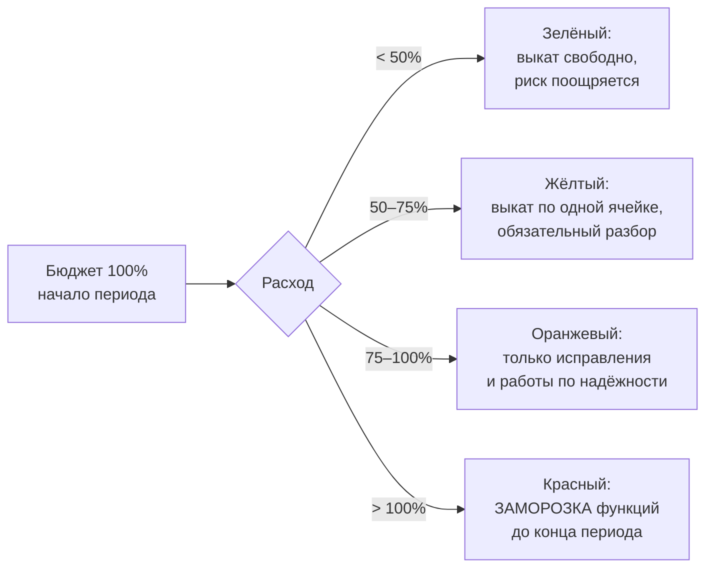
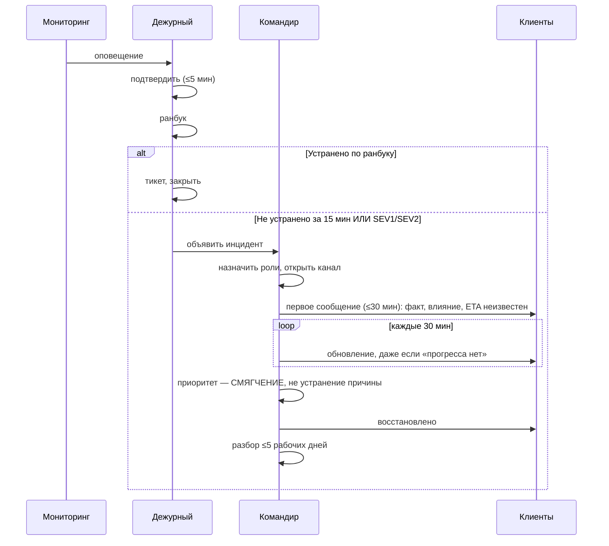

# 22. SRE и эксплуатация

**Статус документа:** проект, создан 2026-07-16 по итогам [REVIEW_BOARD.md](REVIEW_BOARD.md)
**Статус реализации: [План] целиком**
**Аудитория:** SRE, DevOps, дежурные, технические руководители
**Закрывает находки:** B-76, B-74, B-18, B-24, B-16
**Связанные документы:** [12_MONITORING.md](12_MONITORING.md), [11_HIGH_AVAILABILITY.md](11_HIGH_AVAILABILITY.md), [20_SCALE_ARCHITECTURE.md](20_SCALE_ARCHITECTURE.md), [21_TENANT_LIFECYCLE.md](21_TENANT_LIFECYCLE.md)

---

## 1. Назначение

Документ проектирует эксплуатацию платформы при 1000+ клиентах: измеримые обязательства (SLI/SLO), бюджет ошибок, дежурство, реагирование на инциденты, разборы, учения.

**Почему отдельный документ.** [11_HIGH_AVAILABILITY.md](11_HIGH_AVAILABILITY.md) отвечает на вопрос «как система переживает отказ». Этот документ отвечает на вопрос «как компания переживает отказ». Это разные предметы: первый — про архитектуру, второй — про людей, обязательства и процессы.

Совет квалифицировал отсутствие SLI/SLO (B-76) и модели поддержки (B-74) как **критичные**: SLA без SLI — это обещание без измерения, то есть обещание, о нарушении которого мы узнаём от клиента.

---

## 2. Ключевое различие: SLA, SLO, SLI

Термины используются как синонимы повсеместно, и это приводит к неисполнимым договорам.

| Термин | Что | Кому | Пример |
|---|---|---|---|
| **SLI** (индикатор) | Измерение | Инженерам | Доля событий, попавших в БД, за 5 минут |
| **SLO** (цель) | Внутренняя цель по SLI | Инженерам | 99.9% событий за 30 дней |
| **SLA** (соглашение) | Договорное обязательство + компенсация | Клиенту | 99.5%, иначе скидка 10% |

**Правило:** `SLA < SLO`. Всегда.

Обоснование: SLO — точка, в которой мы начинаем беспокоиться. SLA — точка, в которой мы платим. Между ними должен быть зазор, иначе первое же превышение SLO означает нарушение договора. Типовой зазор — порядок величины: SLO 99.9% → SLA 99.5%.

Текущее состояние: [11_HIGH_AVAILABILITY.md](11_HIGH_AVAILABILITY.md), 8 описывает SLA и не описывает SLI. То есть обязательство есть, измерения нет.

---

## 3. SLI: что измеряем

### 3.1. Принцип выбора

SLI обязан отражать **то, что чувствует клиент**, а не то, что удобно измерять.

| Плохой SLI | Почему плохой | Хороший SLI |
|---|---|---|
| Загрузка CPU | Клиенту всё равно | — |
| Аптайм контейнера `api` | Контейнер жив, события теряются | Доля событий, дошедших до БД |
| Камера онлайн | **Зависит от клиента**, не от нас | Доля времени, когда мы готовы принять поток |
| Число ошибок 5xx | Не говорит о доле | Доля успешных запросов |

Вторая строка — главная ловушка платформы: контейнер `api` может быть `healthy`, а события уходить в dead-letter из-за недоступности PostgreSQL ([11](11_HIGH_AVAILABILITY.md), 4.1). Аптайм процесса — ложный SLI.

Третья строка — вопрос ответственности: камера офлайн, потому что клиент выключил кассовый ПК ([04](04_NETWORK.md), 5.3). Включать это в SLI означает отвечать за чужое железо.

### 3.2. Реестр SLI

| № | SLI | Формула | Источник |
|---|---|---|---|
| **SLI-1** | **Приём событий** | `events_persisted / events_emitted` | `viziai_events_consumed_total` / `viziai_events_emitted_total` |
| **SLI-2** | **Своевременность событий** | Доля событий с `e2e_latency < 10с` | `viziai_event_e2e_latency_seconds` |
| **SLI-3** | **Доставка критических уведомлений** | `alerts_delivered / alerts_due` (severity=critical) | `viziai_alert_dispatched_total{status}` |
| **SLI-4** | **Доступность API** | `1 − (5xx / всего)`, исключая 4xx | `viziai_http_requests_total{status}` |
| **SLI-5** | **Доступность извне** | Доля успешных проб blackbox | blackbox-exporter |
| **SLI-6** | **Готовность к приёму потока** | Доля времени, когда analyzer готов принять камеру | `viziai_camera_ready` |
| **SLI-7** | **Целостность архива** | `segments_written / segments_expected` | `viziai_archive_segments_total` |
| **SLI-8** | **Успешность нарезки клипа** | `clips_ok / clips_requested` | `viziai_job_total{queue="clips"}` |
| **SLI-9** | **Точность метеринга** | Доля периодов без корректировки | Биллинг |

### 3.3. SLI-1 требует пояснения

`events_persisted / events_emitted` — самый важный SLI платформы и самый сложный в измерении.

Проблема: числитель считает `api`, знаменатель — `analyzer`. Это **разные процессы**, и их счётчики могут разойтись по причинам, не связанным с отказом (перезапуск обнуляет счётчик).

*Рекомендация:* сравнивать не абсолютные значения, а **скорости за окно**:

```promql
sum(rate(viziai_events_consumed_total[5m])) / sum(rate(viziai_events_emitted_total[5m]))
```

Плюс независимая проверка: `viziai_events_failed_total` (dead-letter) и `viziai_stream_pending` (отставание). Расхождение между этими тремя сигналами указывает на природу проблемы:

| Признак | Диагноз |
|---|---|
| SLI-1 < 1, `events_failed` растёт | Рассогласование схем либо недоступность БД |
| SLI-1 < 1, `stream_pending` растёт | Потребитель отстаёт |
| SLI-1 < 1, оба в норме | **Потеря без следа** — самый тяжёлый случай (XAUTOCLAIM, HA-D-04) |

Третья строка — то, ради чего SLI-1 существует: он ловит класс отказов, невидимый ни одним другим сигналом.

### 3.4. Чего мы не обещаем

Фиксируется явно, иначе спор неизбежен ([11](11_HIGH_AVAILABILITY.md), 8.3).

| Не входит в SLI | Почему |
|---|---|
| Камера онлайн | Канал, питание и ПК — клиента |
| Точность детекции | Вероятностная модель; отдельная метрика качества, не доступности |
| Доставка Telegram | Внешний сервис |
| Скорость канала клиента | — |
| Живое видео | Зависит от канала клиента и go2rtc; **осознанно вне SLA** |

Последняя строка — продуктовое решение: живое видео важно для демонстрации, но его доступность зависит от факторов вне нашего контроля. Обещать его — значит отвечать за провайдера клиента.

---

## 4. SLO и бюджет ошибок

### 4.1. Целевые значения

Значения ниже — **целевые для планки**, недостижимые сегодня ([11](11_HIGH_AVAILABILITY.md), 8.1: текущая конфигурация даёт не выше 99.0%).

| SLI | SLO (30 дней) | Бюджет ошибок | SLA клиенту |
|---|---|---|---|
| SLI-1 Приём событий | **99.95%** | 0.05% ≈ 1 из 2000 | 99.9% |
| SLI-2 Своевременность | 99.0% < 10с | 1% | Не в SLA |
| SLI-3 Критические уведомления | **99.9%** | 0.1% | 99.5% |
| SLI-4 API | 99.9% | 43 мин/мес | 99.5% |
| SLI-5 Доступность извне | 99.9% | 43 мин/мес | 99.5% |
| SLI-6 Готовность к потоку | 99.9% | 43 мин/мес | 99.5% |
| SLI-7 Целостность архива | 99.5% | 0.5% | 99.0% |
| SLI-8 Клипы | 99.0% | 1% | Не в SLA |
| SLI-9 Метеринг | **99.99%** | 0.01% | — |

Обоснование асимметрии:

- **SLI-1 и SLI-3 — самые жёсткие.** Потерянное событие невосстановимо; недоставленное критическое уведомление — то, за что платят.
- **SLI-9 жёстче всех.** Ошибка метеринга — деньги. Клиент простит минуту простоя и не простит двойной счёт.
- **SLI-8 мягкий.** Клип можно перезапросить.
- **SLI-2 не в SLA.** Задержка в 30 секунд вместо 10 не наносит ущерба владельцу ПВЗ ([04](04_NETWORK.md), 10.3).

### 4.2. Политика бюджета ошибок

Бюджет — это **разрешённое количество отказов**. Не «плохо», а «допустимо».



| Уровень | Что разрешено | Что обязательно |
|---|---|---|
| Зелёный | Любой выкат | — |
| Жёлтый | Выкат по одной ячейке с паузой | Разбор каждого расхода |
| Оранжевый | Только исправления и надёжность | Приоритет долга из [11](11_HIGH_AVAILABILITY.md) |
| **Красный** | **Заморозка новых функций** | Разбор с руководством; план восстановления |

Смысл политики: она делает надёжность **обязанностью продуктовой команды**, а не только инженеров. При исчерпании бюджета новые функции не выпускаются — это единственный механизм, заставляющий инвестировать в надёжность до инцидента, а не после.

**Обратное правило, столь же важное:** при неизрасходованном бюджете (зелёный, < 50%) команда обязана **брать больше риска** — выкатывать чаще, экспериментировать. Неизрасходованный бюджет означает, что мы перевложились в надёжность и недовложились в продукт.

### 4.3. Бюджет на ячейку или глобально

**[Требует решения]:** при ячеистой архитектуре бюджет считается по ячейке или по платформе?

| Вариант | Оценка |
|---|---|
| Глобально | Одна упавшая ячейка размывается 19 здоровыми; клиент упавшей ячейки пострадал на 100% |
| **По ячейке, худшая определяет** | **Верно**: SLA даётся клиенту, а не среднему |
| По тенанту | Точнее всего; 1000 бюджетов — не поддаётся управлению |

*Рекомендация:* **SLO считается по ячейке; статус платформы = худшая ячейка.** Обоснование: клиент не утешится тем, что «в среднем по платформе 99.9%», когда его ячейка лежала два часа. Усреднение по клиентам — способ не заметить систематическую проблему у меньшинства.

---

## 5. Оповещения по бюджету

### 5.1. Проблема простых порогов

[12_MONITORING.md](12_MONITORING.md), 9.2 предлагает пороги вида «события не поступают 10 минут». Это работает при одном клиенте и плохо работает при планке:

| Дефект порога | Проявление |
|---|---|
| Медленное выгорание не ловится | 99.5% вместо 99.95% месяц — бюджет исчерпан, порог молчал |
| Короткий всплеск будит зря | 30 секунд отказа ночью — бюджет позволяет |
| Порог не связан с обязательством | «10 минут» — откуда число? |

### 5.2. Многооконные оповещения по скорости выгорания

Стандартный подход SRE: оповещение срабатывает, когда **скорость расхода бюджета** такова, что он кончится раньше периода.

| Окно | Скорость выгорания | Бюджет кончится через | Действие |
|---|---|---|---|
| 5 мин **и** 1 час | **14.4×** | ~2 дня | **Разбудить дежурного** |
| 30 мин **и** 6 часов | **6×** | ~5 дней | **Разбудить дежурного** |
| 2 часа **и** 1 день | 3× | 10 дней | Тикет в рабочее время |
| 6 часов **и** 3 дня | 1× | 30 дней | Тикет |

Два окна одновременно — защита от ложных срабатываний: короткое окно даёт скорость реакции, длинное подтверждает, что это не всплеск.

```promql
# Пример для SLI-1, скорость 14.4×
(
  1 - (sum(rate(viziai_events_consumed_total[5m])) / sum(rate(viziai_events_emitted_total[5m])))
) > (14.4 * 0.0005)
and
(
  1 - (sum(rate(viziai_events_consumed_total[1h])) / sum(rate(viziai_events_emitted_total[1h])))
) > (14.4 * 0.0005)
```

Где `0.0005` = `1 − SLO` = бюджет SLI-1.

**Свойство подхода:** число в оповещении выведено из обязательства, а не придумано. Это отвечает на третий дефект из 5.1.

*Рекомендация:* заменить пороговые оповещения из [12](12_MONITORING.md), 9.2 на многооконные для SLI-1, SLI-3, SLI-4, SLI-5. Пороговые сохранить для бинарных состояний (БД недоступна, диск заполнен) — там бюджет неприменим.

---

## 6. Дежурство

### 6.1. Почему без него SLA невозможен

Зафиксировано в [11](11_HIGH_AVAILABILITY.md), 8.4 и повторяется: SLO 99.9% = 43 минуты в месяц. Отказ в 3 часа ночи должен быть замечен и устранён за это время. **Никакая архитектура этого не обеспечит без человека.**

Автоматика восстанавливает известное. Инцидент — по определению неизвестное.

### 6.2. Минимальная модель

| Параметр | Значение |
|---|---|
| Смена | Неделя |
| Минимум людей в ротации | **4** |
| Время реакции (подтверждение) | 5 минут для critical |
| Время до начала работ | 15 минут |
| Эскалация | Нет подтверждения 10 минут → второй дежурный → руководитель |
| Компенсация | **[Требует решения]**: доплата за дежурство |

Строка «минимум 4» — не пожелание. При двух людях ротация «неделя через неделю» приводит к выгоранию за квартал. Это единственная причина, по которой дежурство разваливается, и она предсказуема.

**Следствие для планирования:** дежурство требует **штата**, а не решения. При команде меньше четырёх инженеров SLA 99.9% недостижим независимо от архитектуры. Это должно быть сказано до подписания договора, а не после.

### 6.3. Правила гигиены

| Правило | Обоснование |
|---|---|
| Дежурный **не ведёт проектных задач** | Прерывание убивает и то, и другое |
| **Максимум 2 пробуждения за смену** | Больше — систематическая проблема, не невезение |
| Каждое пробуждение → тикет | Иначе причина не устраняется |
| Оповещение без действия → удаляется | Игнорируемое оповещение обучает игнорировать все ([00](00_VISION.md), 11.2) |
| Дежурный имеет право заморозить выкат | Без права — ответственность без полномочий |

Второе правило — измеримый критерий здоровья эксплуатации. Три пробуждения за смену два раза подряд означают, что следует остановить функциональную разработку.

### 6.4. Что дежурный обязан иметь

| Инструмент | Состояние |
|---|---|
| Дашборд «Обзор платформы» | **[План]** ([12](12_MONITORING.md), 8) |
| Ранбуки на каждое critical-оповещение | **[План]**, раздел 7 |
| Доступ к продуктиву | **Есть у владельца; у разработчика нет** ([02](02_INFRASTRUCTURE.md), 13) |
| Право на откат | **[План]** — требует реестра образов |
| Скрипты диагностики | **Есть** (`scripts/diag-*.sh`) |
| Канал связи с клиентом | **[Требует решения]** |

Третья строка — **структурная проблема**: рабочий процесс ([02](02_INFRASTRUCTURE.md), 13) построен на том, что разработчик не имеет доступа к продуктиву и диагностирует скриптами через пользователя. Это работает при одном клиенте и **несовместимо с дежурством**: дежурный, который не может подключиться к серверу в 3 часа ночи, не дежурный.

*Рекомендация:* при введении дежурства модель доступа обязана измениться — доступ по заявке с записью сессии, а не отсутствие доступа. Иначе SLA недостижим.

---

## 7. Ранбуки

### 7.1. Правило

**Каждое critical-оповещение обязано иметь ранбук.** Оповещение без ранбука — это «разбудить человека и предложить ему подумать».

### 7.2. Шаблон

```markdown
# РАНБУК: <имя оповещения>

## Что означает
Одна фраза: что именно сломано с точки зрения клиента.

## Влияние на клиента
Что клиент видит. Сколько клиентов затронуто (одна ячейка? все?).

## Диагностика
Конкретные команды. Не «проверьте состояние БД», а `docker compose exec postgres pg_isready`.

## Устранение
Пронумерованные шаги. Если известно несколько причин — дерево решений.

## Если не помогло
Кого эскалировать, что собрать перед эскалацией.

## Что НЕ делать
Действия, которые кажутся разумными и делают хуже.

## После устранения
Что записать, какие тикеты завести.
```

Раздел «Что НЕ делать» обязателен и специфичен для платформы. Примеры:

| Оповещение | Что кажется разумным | Почему делает хуже |
|---|---|---|
| Очередь инференса растёт | Поднять `frame_skip` до 6 | **Развалит трекинг** ([06](06_AI_ENGINE.md), 4.2) |
| Redis переполнен | `FLUSHALL` | **Уничтожит эталоны сотрудников** — единственные данные без источника истины ([10](10_DATABASE.md), 7) |
| Событий нет | Перезапустить analyzer | Потеряет аналитику; сначала проверить `cameras:{tenant}` |
| `events:failed` растёт | Очистить dead-letter | **Уничтожит события**, которые можно переиграть |
| Диск архива полон | Удалить старые сегменты вручную | Рассинхронизация с `archive_segment`; ретеншен сделает это сам |
| Камеры офлайн массово | Будить дежурного | **Вероятно, отказ провайдера клиента** — не наша зона |

Эта таблица — концентрат знания, которое иначе живёт только в голове автора кода. Совет считает её самым ценным элементом раздела.

### 7.3. Обязательные ранбуки

| Ранбук | Оповещение |
|---|---|
| RB-01 | Платформа недоступна извне |
| RB-02 | События не поступают |
| RB-03 | `events:failed` растёт (рассогласование схем) |
| RB-04 | PostgreSQL недоступен |
| RB-05 | Redis недоступен |
| RB-06 | Диск архива заполнен |
| RB-07 | Диск данных заполнен |
| RB-08 | Analyzer не обрабатывает кадры |
| RB-09 | Быстрое выгорание бюджета SLI-1 |
| RB-10 | Критические уведомления не доставляются |
| RB-11 | Ячейка недоступна |
| RB-12 | Ошибка выката, требуется откат |

---

## 8. Реагирование на инциденты

### 8.1. Классификация

| Уровень | Критерий | Реакция | Уведомление клиента |
|---|---|---|---|
| **SEV1** | Потеря данных либо отказ > 1 ячейки | Немедленно, все руки | **Да, немедленно** |
| **SEV2** | Отказ одной ячейки либо потеря функции у многих | Немедленно, дежурный | Да, в течение часа |
| **SEV3** | Деградация, обходной путь есть | Рабочее время | По запросу |
| **SEV4** | Единичный клиент, обходной путь есть | Плановая очередь | Нет |

**Отдельно: SEV1-БЕЗ** (безопасность). Компрометация, утечка, раскрытие данных. Реакция немедленная, но процесс иной — см. 8.4.

### 8.2. Роли

При планке требуется разделение ролей, потому что один человек не может одновременно чинить и объяснять.

| Роль | Обязанность |
|---|---|
| **Командир инцидента** | Координирует. **Не чинит сам.** Принимает решения |
| Технический ответственный | Чинит |
| Коммуникатор | Говорит с клиентами и внутрь |
| Летописец | Ведёт хронологию для разбора |

При SEV3–SEV4 все роли — на дежурном. При SEV1–SEV2 разделение обязательно.

Правило «командир не чинит» контринтуитивно и критично: человек, погрузившийся в отладку, перестаёт видеть картину и не отвечает на вопрос «а не откатить ли». Это самая частая причина, по которой инцидент длится часы вместо минут.

### 8.3. Ход инцидента



**Смягчение важнее устранения причины.** Откат, переключение на ячейку, отключение функции — приоритетнее понимания. Причину ищут после восстановления. Это правило нарушается чаще всех: инженеру интереснее понять, чем откатить.

**Сообщение «прогресса нет» обязательно.** Молчание клиент интерпретирует хуже любой правды.

### 8.4. Инцидент безопасности (B-24)

Отличается от технического: приоритет — **сохранить доказательства**, а не восстановить.

| Шаг | Отличие |
|---|---|
| 1. Не перезапускать | Перезапуск уничтожит следы в памяти |
| 2. Снять образ | До вмешательства |
| 3. Изолировать | Отключить от сети, не выключать |
| 4. Оценить объём | Чьи данные затронуты |
| 5. **Уведомить** | Клиентов, **[Требует решения]**: РКН при утечке ПДн — сроки и форма |
| 6. Восстановить из известного состояния | Не «починить взломанное» |
| 7. Разбор | Отдельная процедура |

**[Требует решения]:** уведомление РКН при утечке ПДн. Сроки, форма и порог установлены законом; требуется юрист. Инженерное решение здесь недостаточно, но **план обязан существовать заранее** — узнавать порядок уведомления во время инцидента поздно.

*Рекомендация:* назначить ответственного за ИБ-инциденты (роль, не должность) и составить план до первого корпоративного клиента.

### 8.5. Публичный статус

**[Требует решения]:** страница статуса.

При 1000 клиентах во время SEV1 поддержка получит сотни обращений об одном и том же. Страница статуса снимает большую их часть.

*Рекомендация:* страница на **независимой инфраструктуре** (не в нашей ячейке, не за нашим VPS). Иначе при полном отказе она ляжет вместе с платформой — то есть окажется бесполезной ровно тогда, когда нужна.

---

## 9. Разборы

### 9.1. Безобвинительность

**Правило: разбор не ищет виновного.**

Обоснование не этическое, а практическое: разбор, ищущий виновного, получает неполную хронологию. Люди скрывают действия, если за них наказывают. Неполная хронология означает неустранённую причину и повторный инцидент.

Формулировка: не «Иванов уронил прод», а «выкат без канареечной ячейки позволил ошибке дойти до всех клиентов».

### 9.2. Обязательные разборы

| Событие | Разбор |
|---|---|
| SEV1, SEV2 | **Всегда** |
| Расход > 10% бюджета за раз | Всегда |
| Потеря данных **любого объёма** | **Всегда** |
| Пробуждение без ранбука | Всегда |
| Повтор известной причины | Всегда, с эскалацией |
| SEV3 | По решению |

Третья строка — жёсткая. Потеря одного события кажется мелочью, но платформа продаёт именно события. Потеря без объяснения означает неизвестный дефект, а он повторится.

### 9.3. Структура

```markdown
# Разбор: <краткое имя> (SEV<N>, <дата>)

## Влияние
Клиентов затронуто, длительность, что именно потеряно/деградировало.

## Хронология
Время (UTC) — событие. Включая ложные гипотезы: они объясняют длительность.

## Причина
Не «отказал Redis», а почему отказ Redis привёл к потере событий.
Метод «пять почему» до организационной причины.

## Что сработало
Обязательный раздел. Механизмы, сдержавшие ущерб, — их нельзя потерять при рефакторинге.

## Что не сработало
Механизмы, которые должны были сдержать и не сдержали.

## Действия
| Действие | Тип (устранить/обнаружить/смягчить) | Владелец | Срок |
Каждое — с тикетом. Без владельца — не действие.

## Уроки
Что мы узнали об архитектуре.
```

Раздел «Что сработало» существен: разбор, перечисляющий только провалы, приводит к удалению механизмов, которые на самом деле спасли. Пример: dead-letter не даёт потерять сообщение, но при отказе БД маскирует проблему ([11](11_HIGH_AVAILABILITY.md), 4.1). Разбор обязан отметить и то, и другое.

### 9.4. Пример разбора существующего инцидента

Инцидент «2 курьера ночью = 44 посетителя» ([06](06_AI_ENGINE.md), 5.4) произошёл до введения этого процесса. Ретроспективно он выглядел бы так — и это иллюстрирует ценность формата:

| Раздел | Содержание |
|---|---|
| Влияние | 1 клиент, метрика посетителей завышена в 22 раза; доверие к аналитике подорвано |
| Причина (5 почему) | Личность создавалась с одного кадра → нет пробации → **не было тестов на Re-ID** → **не было контура тестирования** → **не было эталонных записей** |
| Что сработало | Ничего: дефект обнаружил клиент |
| Что не сработало | Отсутствие метрик (`reid_rejected_total{reason}` показал бы всплеск `low_saturation` за минуту) |
| Действия | Пробация, гейты качества, гейт насыщенности, `pending` не считается |
| Урок | **Новая сущность создаётся после накопления доказательств, а не по первому наблюдению** |

Существенно: организационная причина (нет контура тестирования) **не была устранена** — устранены только технические симптомы. Это ровно то, что метод «пять почему» выявляет, а точечное исправление — нет. Дефект того же класса повторится.

---

## 10. Учения (B-18)

### 10.1. Принцип

**Непроверенная процедура не существует.** Резервная копия, из которой не восстанавливались, — гипотеза ([11](11_HIGH_AVAILABILITY.md), 9.3).

### 10.2. График

| Учение | Частота | Проверяет |
|---|---|---|
| Восстановление из копии | **Ежеквартально** | Копии, процедуру, время |
| Отказ ячейки | Раз в полгода | Радиус поражения, оповещения |
| Отказ VPS | Раз в полгода | Резервный вход |
| Потеря узла GPU | Раз в полгода | Деградацию |
| Инцидент ИБ (настольные) | Раз в год | План, роли, уведомления |
| Перемещение тенанта | При появлении | Процедуру |

### 10.3. Автоматизация проверки копий

Ежеквартальное учение вручную — минимум. Целевое: **автоматическое восстановление копии в изолированную среду после каждого создания** с проверкой:

| Проверка | Критерий |
|---|---|
| Дамп восстанавливается | Без ошибок |
| Гипертаблицы целы | `SELECT count(*) FROM event` > 0 |
| Схема соответствует коду | Миграции применяются без ошибок |
| Данные консистентны | Контрольные суммы по тенантам |

Это единственный способ узнать о неработающей копии **до** того, как она понадобится. Учитывая, что копий сегодня нет вовсе ([02](02_INFRASTRUCTURE.md), I-01), автоматическая проверка вводится **вместе** с копиями, а не после.

### 10.4. Хаос-инжиниринг

**[Требует решения]:** не раньше ячеистой архитектуры.

Обоснование: хаос-эксперимент на одноузловой платформе с одним клиентом — это просто поломка продуктива. Он имеет смысл, когда есть радиус поражения, который можно проверить.

При ячейках: эксперименты в канареечной ячейке с внутренними тенантами.

| Эксперимент | Гипотеза |
|---|---|
| Убить процесс analyzer | Аренда шарда перехватывается ≤30с |
| Задержка Redis +500 мс | Конвейер деградирует, не падает |
| Заполнить диск архива | Ретеншен освобождает; recorder не падает |
| Отключить go2rtc | Живое видео пропало, аналитика цела |
| Разорвать сеть до камеры | Откат; `camera_offline` через 300с |

Каждый эксперимент проверяет **заявленное в документации свойство**. Расхождение — дефект документации либо кода.

---

## 11. Поддержка (B-74)

### 11.1. Уровни

| Уровень | Кто | Решает | Эскалация |
|---|---|---|---|
| **L1** | Поддержка | Инструкции, известные проблемы, «камера офлайн» | L2 через 30 мин |
| **L2** | Инженер сопровождения | Диагностика по скриптам, ранбуки | L3 через 2 часа |
| **L3** | Разработка | Дефекты кода | — |

**Наблюдение:** большая часть обращений при планке будет «камера офлайн» — то есть **проблема на стороне клиента** (выключили ПК, отвалился провайдер, сменился IP камеры). L1 обязан уметь это диагностировать без инженера.

Отсюда требование к продукту: интерфейс должен **сам** отвечать на вопрос «почему камера офлайн» ([05](05_CAMERA_CONNECTION.md), C-D-05: сегодня отсутствие питания неотличимо от неверного пароля). Каждый такой пробел продукта = обращение в поддержку × 1000 клиентов.

Это связь, не очевидная из инженерных документов: **качество диагностики в UI напрямую определяет стоимость поддержки.**

### 11.2. Каналы и время реакции

| Тариф | Канал | Реакция | Часы |
|---|---|---|---|
| Базовый | Email | 1 рабочий день | 5×8 |
| Стандартный | Email, чат | 4 часа | 5×8 |
| Расширенный | + телефон | 1 час | 5×8, critical 24×7 |
| Корпоративный | + выделенный инженер | 30 мин | 24×7 |

**[Требует решения]:** штат. Модель требует людей; при их отсутствии обещать нельзя.

### 11.3. База знаний

Обращение, повторившееся трижды, обязано стать статьёй базы знаний либо **исправлением продукта**.

*Правило:* если статья базы знаний объясняет, как обойти дефект интерфейса, — это тикет на продукт, а не статья. База знаний, растущая быстрее продукта, — признак того, что мы перекладываем сложность на клиента.

---

## 12. Toil

### 12.1. Определение

Toil — ручная, повторяющаяся, автоматизируемая работа, растущая линейно с числом клиентов.

**Правило:** доля toil у инженера > 50% — сигнал остановки функциональной разработки.

### 12.2. Известный toil

| Работа | Растёт с | Автоматизация |
|---|---|---|
| Провижининг тенанта (SQL) | Клиентами | [21](21_TENANT_LIFECYCLE.md), 7 |
| «Ресинхр Redis» после рестарта | Инцидентами | Автоматически при старте analyzer |
| Создание правила «камера не в сети» | Клиентами | Шаблон правил при провижининге |
| Диагностика через пользователя | Обращениями | Доступ дежурного (6.4) |
| Создание ячейки | Ячейками | IaC ([20](20_SCALE_ARCHITECTURE.md), SC-D-05) |
| Ручные шаги после обновления | Выкатами | Пост-проверки ([03](03_DEPLOYMENT.md), 5.4) |
| Настройка порогов Re-ID на точке | Точками | **[Требует решения]**: автокалибровка |

Последняя строка — скрытый и опасный toil: если каждая точка требует ручной подстройки порогов ([06](06_AI_ENGINE.md), 5.5), то 1000 точек = 1000 подстроек. Это делает продукт **нетиражируемым**, то есть прямо противоречит [00_VISION.md](00_VISION.md), 4.1 (однородность ПВЗ как основание вертикали).

*Рекомендация:* признать автокалибровку порогов Re-ID **требованием тиражируемости**, а не улучшением качества. Если пороги нельзя вывести автоматически (например, из статистики распределения близостей на точке за первые сутки), продукт не масштабируется до планки независимо от архитектуры.

Это, возможно, самая важная находка документа: она обнаружена не в инфраструктуре, а в стыке между алгоритмом и экономикой поддержки.

---

## 13. Реестр решений

| № | Решение | Обоснование | Альтернатива и почему отвергнута |
|---|---|---|---|
| SRE-01 | `SLA < SLO` всегда, с зазором в порядок величины | Иначе первое превышение SLO = нарушение договора | `SLA = SLO`: нарушение при любом отклонении |
| SRE-02 | SLI отражают опыт клиента, не состояние процессов | Аптайм `api` ложен: контейнер жив, события в dead-letter | Аптайм: измеряем не то |
| SRE-03 | «Камера онлайн» не входит в SLI | Зависит от питания, ПК и провайдера клиента | Включить: отвечаем за чужое железо |
| SRE-04 | Живое видео вне SLA | Зависит от канала клиента | Включить: то же |
| SRE-05 | SLI метеринга жёстче всех (99.99%) | Клиент простит минуту простоя и не простит двойной счёт | Наравне: финансовые ошибки |
| SRE-06 | SLO по ячейке; статус = худшая ячейка | Клиент упавшей ячейки не утешится средним по платформе | Глобально: систематическая проблема меньшинства не видна |
| SRE-07 | Многооконные оповещения по скорости выгорания | Число выведено из обязательства, а не придумано; ловит медленное выгорание | Пороги: не связаны с SLO, не ловят деградацию |
| SRE-08 | Заморозка функций при исчерпании бюджета | Единственный механизм инвестировать в надёжность до инцидента | Без политики: надёжность всегда проигрывает функциям |
| SRE-09 | **Неизрасходованный бюджет = брать больше риска** | Перевложение в надёжность = недовложение в продукт | Только ограничение: теряем скорость зря |
| SRE-10 | Минимум 4 человека в ротации | При двух — выгорание за квартал, предсказуемо | 2 человека: ротация развалится |
| SRE-11 | Командир инцидента не чинит | Погрузившийся в отладку не видит картины и не решит «откатить ли» | Совмещение: инцидент длится часами |
| SRE-12 | Смягчение приоритетнее устранения причины | Откат восстанавливает клиента; понимание — потом | Искать причину: клиент лежит |
| SRE-13 | Сообщение «прогресса нет» обязательно | Молчание клиент интерпретирует хуже правды | Молчать до решения: репутация |
| SRE-14 | Разбор безобвинительный | Обвинение даёт неполную хронологию → причина не устранена → повтор | Искать виновного: скрытие фактов |
| SRE-15 | Раздел «что сработало» обязателен | Иначе при рефакторинге удалят механизм, который спас | Только провалы: теряем защиты |
| SRE-16 | Разбор при потере данных любого объёма | Потеря без объяснения = неизвестный дефект = повтор | По объёму: пропускаем класс дефектов |
| SRE-17 | Страница статуса на независимой инфраструктуре | Иначе ляжет вместе с платформой ровно тогда, когда нужна | В нашей ячейке: бесполезна при SEV1 |
| SRE-18 | Хаос — не раньше ячеек | На одном узле с одним клиентом это просто поломка продуктива | Сейчас: вредит |
| SRE-19 | Статья базы знаний, обходящая дефект UI, = тикет на продукт | База, растущая быстрее продукта, = перекладывание сложности на клиента | Писать статьи: маскируем дефекты |
| SRE-20 | **Автокалибровка порогов Re-ID — требование тиражируемости** | 1000 точек × ручная подстройка = продукт не масштабируется | Ручная настройка: противоречит основанию вертикали ПВЗ |

---

## 14. Долг

| № | Проблема | Влияние | Приоритет |
|---|---|---|---|
| SRE-D-01 | SLI не определены и не измеряются | SLA — обещание без измерения | **Критично** |
| SRE-D-02 | Нет дежурства и штата под него | SLA недостижим при любой архитектуре | **Критично** |
| SRE-D-03 | **Дежурный не имеет доступа к продуктиву** (по текущей модели) | Дежурство невозможно организационно | **Критично** |
| SRE-D-04 | Нет ранбуков | Оповещение = «разбудить и предложить подумать» | **Критично** |
| SRE-D-05 | Нет плана реагирования на ИБ-инцидент | Порядок уточняется во время инцидента | **Критично** |
| SRE-D-06 | Копии не проверяются автоматически | Копия — гипотеза | **Критично** |
| SRE-D-07 | **Автокалибровка порогов Re-ID отсутствует** | Продукт нетиражируем при планке | **Критично** |
| SRE-D-08 | Нет политики бюджета ошибок | Надёжность всегда проигрывает функциям | Высокий |
| SRE-D-09 | Нет модели поддержки и штата | Обращения некому обрабатывать | Высокий |
| SRE-D-10 | Нет страницы статуса | Сотни обращений об одном инциденте | Средний |
| SRE-D-11 | Организационная причина инцидента Re-ID не устранена | Дефект того же класса повторится | Средний |
| SRE-D-12 | Уведомление РКН при утечке — процедура не определена | Юридический риск | Средний |
