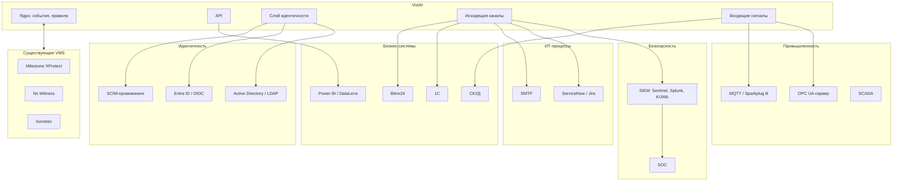
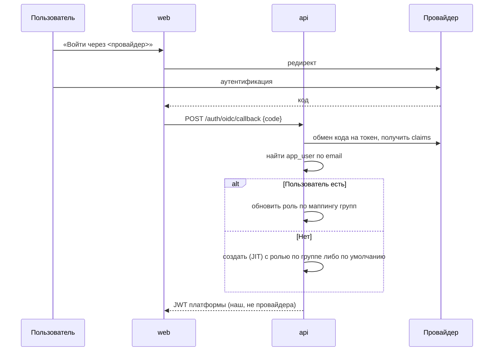
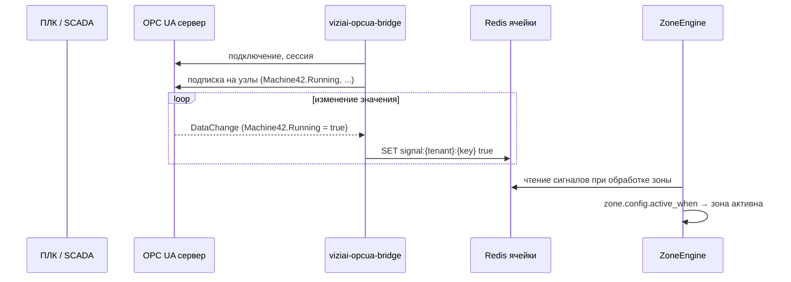
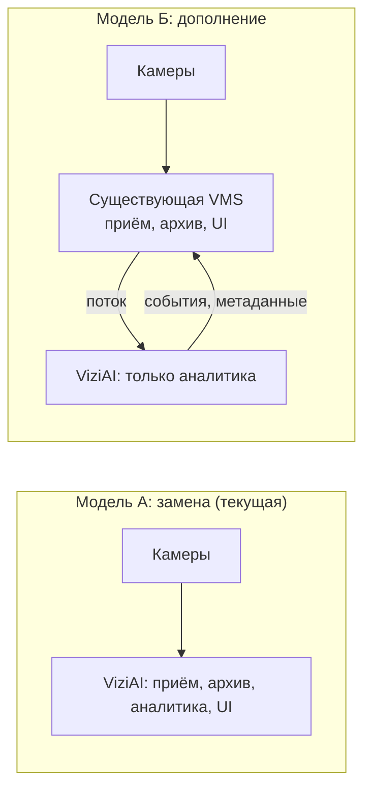
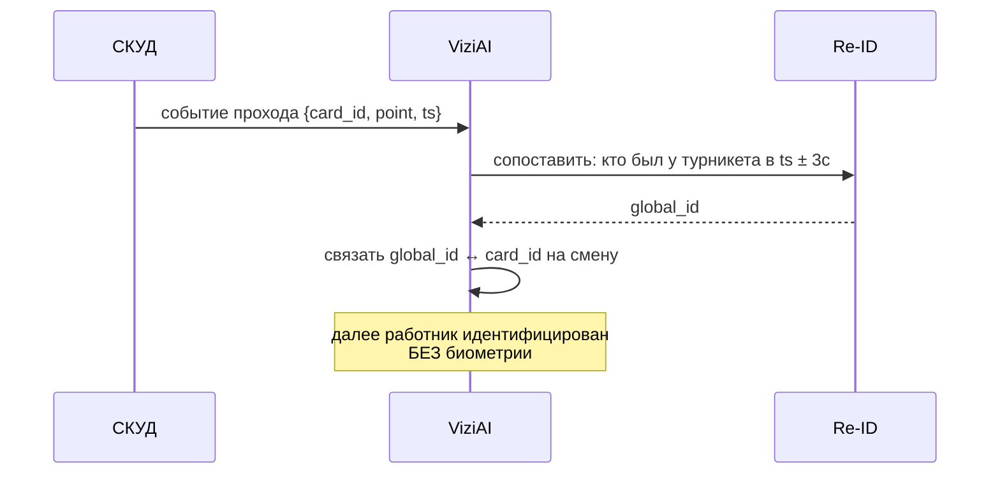

# 23. Корпоративные интеграции

**Статус документа:** проект, создан 2026-07-16 по итогам [REVIEW_BOARD.md](REVIEW_BOARD.md)
**Статус реализации: [План] целиком**, кроме webhook и Telegram
**Аудитория:** архитекторы, backend-инженеры, продуктовые менеджеры, продажи
**Закрывает находки:** B-45, B-46, B-47, B-58, B-59, B-60, B-61, B-62, B-63
**Связанные документы:** [13_SECURITY.md](13_SECURITY.md), [14_FACTORY_MODULES.md](14_FACTORY_MODULES.md), [16_API_GUIDE.md](16_API_GUIDE.md), [09_WORKFLOW_ENGINE.md](09_WORKFLOW_ENGINE.md)

---

## 1. Назначение

Документ проектирует интеграции с корпоративным ландшафтом: идентичность, безопасность, ИТ-процессы, промышленные системы, учётные системы, аналитика.

**Тезис документа.** При планке 1000+ клиентов интеграции перестают быть функциями и становятся **условием допуска**. Корпоративный заказчик не покупает систему, которая не подключается к его AD, не пишет в его SIEM и не читает его АСУ ТП. Отсутствие интеграции закрывает рынок надёжнее, чем отсутствие детекции ([14](14_FACTORY_MODULES.md), 3.4).

---

## 2. Карта интеграций



---

## 3. Идентичность (B-58)

### 3.1. Уточнение приоритета

[13_SECURITY.md](13_SECURITY.md), 6.3 ставит LDAP первым, потому что on-premise-заказчик изолирован и OIDC-провайдер во внешнем интернете ему недоступен. Это **остаётся верным** для изолированной сети.

Совет уточняет: для **облачного** корпоративного клиента верно обратное — у него Entra ID, а не доступный извне контроллер домена. Приоритет зависит от сегмента, а не абсолютен.

| Сегмент | Механизм | Почему |
|---|---|---|
| ПВЗ, малый бизнес | Email + пароль | AD нет |
| **Облачный корпоративный** | **OIDC (Entra ID, Яндекс ID, Keycloak)** | Контроллер домена недоступен извне |
| **On-premise, изолированная сеть** | **LDAP / AD** | OIDC-провайдер недоступен |
| Госсектор | LDAP + **[Требует решения]**: ЕСИА | — |

*Рекомендация:* реализовывать **оба**, начиная с абстракции. Порядок: сначала слой провайдеров аутентификации, затем LDAP (первый реальный корпоративный запрос вероятнее из on-premise), затем OIDC.

### 3.2. Абстракция

```python
# [План] Концепция; фактическая реализация — TypeScript
class AuthProvider(Protocol):
    id: str                    # local | ldap | oidc
    def authenticate(credentials) -> Identity | None: ...
    def supports_provisioning() -> bool: ...
```

Ключевое требование: **`app_user` остаётся источником ролей и `tenant_id`**. Внешний провайдер отвечает **только за аутентификацию** («это точно Иванов»), не за авторизацию («что Иванову можно»).

Обоснование: роли платформы (`super`, `admin`, `manager`, `operator`) специфичны; попытка вывести их из групп AD приведёт к тому, что клиент обязан создать группы под нашу модель. Правильнее: маппинг групп → роли настраивается, но роль хранится у нас.

### 3.3. Провижининг при первом входе (JIT)



**Существенно:** мы выдаём **свой** JWT, а не пробрасываем токен провайдера. Обоснование: токен провайдера не содержит `tenant_id`, имеет свой срок жизни и свою модель отзыва. Наш JWT сохраняет единую модель ([13](13_SECURITY.md), 4.2).

### 3.4. SCIM

JIT решает создание, но не решает **отключение**: уволенный сотрудник, удалённый из AD, больше не войдёт, но его существующий JWT продолжит работать (S-03, S-07).

SCIM даёт синхронизацию в обратную сторону: AD сообщает нам об увольнении → мы инкрементируем `token_version` → доступ отзывается немедленно.

*Рекомендация:* SCIM внедрять **вместе** с `token_version` ([13](13_SECURITY.md), 4.3), не раньше. Без механизма отзыва SCIM бесполезен: мы узнаем об увольнении и ничего не сможем сделать.

Требование СБ заказчика «единая точка отключения» ([13](13_SECURITY.md), 6.2) закрывается только связкой SCIM + `token_version`. Ни один из компонентов по отдельности его не закрывает.

### 3.5. Ограничение: `super` не отдаётся во внешний провайдер

Роль `super` (платформенный администратор) обязана оставаться локальной с обязательной двухфакторной аутентификацией.

Обоснование: компрометация AD клиента не должна давать доступ к платформенной администрации. Роль `super` в облачном режиме — **наша**, а не клиента.

---

## 4. SIEM (B-59)

### 4.1. Требование

СБ корпоративного заказчика требует, чтобы события безопасности стекались в её SIEM. Система, ведущая свой журнал «где-то у себя», получает замечание при первом аудите.

### 4.2. Что отправлять

Разграничение принципиально: **события безопасности ≠ события видеоаналитики**.

| В SIEM | Не в SIEM |
|---|---|
| Вход, неудачный вход | `zone_entry` посетителя |
| Изменение прав, ролей | Метрики занятости |
| Создание, удаление пользователя | Тепловые карты |
| Изменение конфигурации (камеры, зоны, правила) | Аналитика |
| Просмотр и выгрузка видео | — |
| Удаление данных, офбординг | — |
| Ошибки аутентификации служебных вызовов | — |
| **`zone_violation` (critical)** | **[Требует решения]**: пограничный случай |

Последняя строка требует решения: нарушение запретной зоны — это событие безопасности? Для завода — да (физическая безопасность). Для ПВЗ — нет.

*Рекомендация:* настраиваемый фильтр: тенант выбирает, какие типы событий уходят в SIEM. По умолчанию — только аудит.

Обоснование: отправка всех `zone_entry` в SIEM при 1000 клиентах утопит SOC заказчика в шуме и приведёт к отключению интеграции — тот же принцип анти-флуда ([00](00_VISION.md), 11.2), применённый к другому потребителю.

### 4.3. Формат

| Формат | Оценка |
|---|---|
| **Syslog RFC 5424 + CEF** | **Рекомендуется**: читают все SIEM, включая KUMA, Splunk, Sentinel |
| LEEF | Только QRadar |
| JSON по HTTP | Требует парсера на стороне SIEM |
| Родные коннекторы | Работа на каждый SIEM |

*Рекомендация:* **CEF поверх syslog** как единственный формат. Обоснование то же, что для `/metrics` ([12](12_MONITORING.md), M-10): отдавать стандарт, а не поддерживать каждую систему заказчика.

```
CEF:0|ViziAI|Platform|1.2.3|login_failed|Authentication failure|5|
  src=10.9.0.11 suser=ivanov@example.ru cs1Label=tenant cs1=<uuid> rt=<ms>
```

### 4.4. Гарантии доставки

**[Требует решения]:** syslog по UDP теряет сообщения; аудит терять нельзя.

*Рекомендация:* syslog **по TCP с TLS** (RFC 5425) плюс локальная буферизация. Потеря записи аудита из-за недоступности SIEM недопустима: аудит — доказательная база ([13](13_SECURITY.md), 7).

Связь с существующим дефектом: `writeAudit` проглатывает ошибки ([13](13_SECURITY.md), 7.2). При интеграции с SIEM это становится опаснее — мы можем не записать ни к себе, ни в SIEM, и не заметить. Метрика `viziai_audit_write_errors_total` из рекомендации [13](13_SECURITY.md), 7.2 становится обязательной.

---

## 5. Промышленные протоколы (B-45, B-46)

### 5.1. OPC UA: почему это критично

[14_FACTORY_MODULES.md](14_FACTORY_MODULES.md), 6.2 верно определяет потребность: зона у станка опасна **только когда станок работает**; постоянно активная зона даёт поток ложных нарушений (наладчик у остановленного станка).

Документ предлагает абстрактный «внешний сигнал через webhook». Совет (оптика Siemens) отмечает: **отрасль решает это через OPC UA**, и предложение webhook означает, что интегратор обязан написать мост OPC UA → HTTP. Он это сделает, но это плюс месяц к проекту и минус к оценке нашей зрелости.

OPC UA (IEC 62541) — стандарт де-факто промышленной интероперабельности. Поддерживается Siemens, Rockwell, Schneider, Beckhoff.

### 5.2. Модель интеграции

**Мы — клиент OPC UA, не сервер.** Читаем, не пишем.



Конфигурация зоны:

```json
{
  "active_when": {
    "source": "opcua",
    "key": "machine_42_running",
    "equals": true
  }
}
```

Это расширяет модель расписаний зон ([08](08_RULE_ENGINE.md), 3.4) с временного окна на произвольное условие — как и предлагал [14](14_FACTORY_MODULES.md), 6.2, но с конкретным протоколом.

### 5.3. Жёсткое ограничение: только чтение

**Мост OPC UA не пишет в промышленную сеть. Никогда.**

Обоснование — прямое следствие решения F-01 ([14](14_FACTORY_MODULES.md)): платформа не останавливает оборудование, потому что это требует SIL, недостижимого для вероятностной модели.

Техническое следствие: клиент OPC UA конфигурируется **без права записи**, а учётная запись на стороне заказчика создаётся с правами только на чтение. Это должно быть требованием к настройке, а не нашей дисциплиной: возможность записи, существующая «на всякий случай», однажды будет использована.

Оптика Siemens: заказчик спросит об этом первым. Ответ «мы технически не можем писать» сильнее ответа «мы не пишем».

### 5.4. MQTT / Sparkplug B (B-46)

Альтернатива OPC UA для IIoT-ландшафтов. Легче, распространён в новых установках.

| Аспект | OPC UA | MQTT/Sparkplug |
|---|---|---|
| Модель | Клиент-сервер, адресное пространство | Публикация-подписка, брокер |
| Типизация | Богатая | Sparkplug B добавляет схему |
| Распространённость | Старые и новые АСУ ТП | Новые IIoT |
| Сложность клиента | Средняя | Низкая |

*Рекомендация:* один мост с двумя источниками (`opcua`, `mqtt`), общая абстракция сигнала. Оба заполняют один и тот же `signal:{tenant}:{key}` в Redis — ядро не знает, откуда пришёл сигнал.

Это тот же приём, что `VideoSource` ([05](05_CAMERA_CONNECTION.md), 2.2): абстракция источника, конвейер не меняется.

### 5.5. Публикация наших событий в MQTT

Обратное направление: заказчик хочет получать наши события в свою шину.

*Рекомендация:* новый канал `alert_rule.channels` типа `mqtt` — вписывается в существующую модель ([08](08_RULE_ENGINE.md), 5.4) без изменения ядра. Топик `viziai/{tenant}/{site}/{camera}/{type}`.

Это дешёвая интеграция с высокой воспринимаемой ценностью на промышленном рынке.

---

## 6. Интеграция в существующую VMS (B-47)

### 6.1. Стратегическая находка

Совет квалифицирует это как **разворот стратегии выхода на рынок**, а не как функцию.

**Проблема.** [00_VISION.md](00_VISION.md) позиционирует ViziAI как VMS+VCA, конкурирующую с Milestone, Nx Witness, Genetec. Для ПВЗ это верно: у владельца нет VMS.

Для **производства это ложно**. У завода уже есть Milestone на 200 камер, купленный три года назад, с обученным персоналом и амортизацией на пять лет. Предложение «замените его на нас» будет отклонено на первой встрече — не по качеству, а по стоимости замены.

**Но тот же завод купит аналитику как дополнение к существующей VMS.**

### 6.2. Две модели



| Аспект | Модель А (замена) | Модель Б (дополнение) |
|---|---|---|
| Рынок | ПВЗ, малый бизнес, новые установки | **Предприятия с существующей VMS** |
| Что продаём | Платформу | **Аналитику** |
| Конкурент | Milestone | Аналитические плагины для Milestone |
| Цикл продажи | Месяцы | **Короче**: не требует замены |
| Наша ответственность | Всё | Только аналитика |
| Архив, живое видео, UI | Наши | **Их** — половина нашей работы не нужна |
| Цена | Выше | Ниже |

### 6.3. Что требуется для модели Б

Существенно: **архитектура к этому готова больше, чем кажется**.

| Требование | Состояние |
|---|---|
| Принять поток от VMS | **Готово**: VMS отдаёт RTSP; это `rtsp_pull` |
| Аналитика без нашего архива | **Готово**: recorder — отдельный профиль ([02](02_INFRASTRUCTURE.md), 3.3) |
| Аналитика без нашего UI | Готово: события уходят по webhook/MQTT |
| **Отдать события в VMS** | **Требует работы**: MIP SDK (Milestone), плагины Nx |
| Отдать метаданные (bbox) для наложения | Требует ONVIF Profile M либо родного SDK |
| Не требовать наш go2rtc | Готово |

Вывод: **модель Б реализуема преимущественно существующим кодом плюс адаптер на конкретную VMS.** Разделение на профили (`recorder` отдельно) и отсутствие связности между аналитикой и архивом — решения, принятые по другим причинам, — делают эту модель доступной почти бесплатно.

Это удачное свойство архитектуры, которое стоит осознать: **ядро уже является аналитическим движком, а не VMS.** VMS-функции (архив, живое видео) — надстройка, отделимая конфигурацией.

### 6.4. Требуемое продуктовое решение

**[Требует решения на уровне [00_VISION.md](00_VISION.md)]:** мы конкурент VMS или её дополнение?

Совет считает: **оба**, но это обязано быть решением, а не умолчанием.

| Сегмент | Модель |
|---|---|
| ПВЗ | А (замена) — у клиента нет VMS |
| Малый ритейл, офис | А |
| **Производство** | **Б (дополнение)** |
| Крупный ритейл | Б |
| Новая установка любого размера | А |

Риск, который следует признать: модель Б делает нас **зависимыми от чужой платформы** и ограничивает то, что мы можем показать (UI — их). Взамен она открывает рынок, закрытый для модели А стоимостью замены.

*Рекомендация:* начать с ONVIF Profile M (стандарт метаданных) как универсального пути, затем MIP SDK для Milestone как крупнейшего игрока. Не начинать с проприетарных SDK всех VMS сразу — это бесконечная работа ([05](05_CAMERA_CONNECTION.md), 8.4, тот же аргумент против GB28181).

---

## 7. ИТ-процессы

### 7.1. ITSM (B-60)

Инцидент платформы → заявка в ServiceNow/Jira заказчика.

*Рекомендация:* **не реализовывать родные коннекторы.** Webhook с качественной полезной нагрузкой ([08](08_RULE_ENGINE.md), 5.6) покрывает: ServiceNow, Jira, Bitrix24 и всё остальное принимают webhook.

Это возвращает приоритет **проектированию полезной нагрузки webhook** ([16](16_API_GUIDE.md), API-D-09): она является интерфейсом ко всем ITSM сразу. Сегодня она бедна (нет `event_id`, идентификаторов, `meta`, подписи), и это делает интеграцию с ITSM неполноценной не из-за отсутствия коннектора, а из-за качества данных.

### 7.2. SMTP

Приоритет повышен относительно [08](08_RULE_ENGINE.md), R-D-02.

Причины, по которым email — не «ещё один канал», а блокер:

| Причина | Ссылка |
|---|---|
| On-premise: Telegram недоступен | [03](03_DEPLOYMENT.md), 7.1 |
| **Резидентность: Telegram отправляет снапшоты вне РФ** | [21](21_TENANT_LIFECYCLE.md), 8.3 |
| Корпоративный клиент не использует Telegram для рабочих уведомлений | — |
| Инциденты требуют адресации человеку | [09](09_WORKFLOW_ENGINE.md), 7 |

Вторая строка — новая находка ревью и самая весомая: она делает email блокером **облачного корпоративного сегмента**, а не только on-premise.

---

## 8. Бизнес-системы

### 8.1. 1С

Крупнейший запрос российского рынка.

**[Требует решения]:** что именно интегрировать.

| Сценарий | Оценка |
|---|---|
| Нарушения ОТ → 1С:Зарплата (взыскания) | Требует идентификации работника; см. ниже |
| Выдачи → 1С:Торговля (сверка) | Требует штрихкода ([06](06_AI_ENGINE.md), 7.3) |
| Табель по видео | **Опасно**: см. ниже |
| Сотрудники из 1С → отметки в «Людях» | **Полезно и дёшево** |

Последняя строка — недооценённый сценарий: справочник сотрудников уже есть у клиента в 1С. Импорт избавляет владельца от ручной отметки каждого сотрудника — то есть снимает toil ([22](22_SRE_OPERATIONS.md), 12.2) и ускоряет внедрение.

**Про табель.** Учёт рабочего времени по видео технически возможен (Re-ID сотрудника + присутствие в кадре), но:
- юридически табель — документ, а вероятностная модель не может быть его основанием;
- ошибка = недоплата человеку;
- профсоюз и трудовая инспекция.

*Рекомендация:* **не позиционировать как табель.** Позиционировать как «данные для сверки», где источником истины остаётся СКУД или ручной табель. Та же граница, что F-01 и SEC-13: вероятностная модель не является основанием для решений о людях и деньгах.

### 8.2. СКУД

Приоритетнее 1С ([09](09_WORKFLOW_ENGINE.md), 8; [14](14_FACTORY_MODULES.md), 9.2).

Ценность: СКУД даёт **достоверную идентификацию** работника по пропуску, что снимает главное ограничение Re-ID на производстве — работники в одинаковой спецодежде неразличимы ([14](14_FACTORY_MODULES.md), 4).



Это существенно: связка даёт идентификацию личности, **сохраняя решение V-02** (без биометрии). Мы не распознаём лицо — мы знаем, что человек, вошедший по пропуску Иванова в 08:31, — это трек, появившийся у турникета в 08:31.

Оговорка честности: связка `global_id ↔ card_id` **является персональными данными** (позволяет идентифицировать субъекта), в отличие от анонимного `global_id`. Следовательно:
- связка живёт не дольше смены;
- она подпадает под 152-ФЗ как обычные (не биометрические) ПДн;
- требует правового основания — трудовые отношения его дают.

Это важное уточнение к [13](13_SECURITY.md), 10.2: `global_id` не является ПДн **сам по себе**, но становится ПДн при связывании с личностью. Интеграция со СКУД меняет правовой режим данных, и это должно быть проговорено при внедрении.

### 8.3. BI (B-61)

Клиент хочет строить свои витрины.

*Рекомендация:* **не строить коннекторы к Power BI/DataLens.** Дать:
1. REST с фильтрами и пагинацией (есть);
2. **Выгрузку в S3 в Parquet** по расписанию — читается всеми BI;
3. **[Требует решения]:** доступ к БД только на чтение — для on-premise возможно, для облака нет (радиус, нагрузка, изоляция).

Третий пункт — частый запрос корпоративного клиента и частая ошибка поставщика. Прямой доступ к БД облачной мультитенантной платформы недопустим: он ломает изоляцию и делает схему БД публичным контрактом, который нельзя менять.

Формулировка отказа для продаж: «в облаке — выгрузка в ваше хранилище; прямой доступ к БД — только в on-premise, где БД ваша».

### 8.4. Terraform-провайдер (B-62)

При 1000 клиентах управление тенантами кликами нежизнеспособно.

*Рекомендация:* провайдер поверх `/api/v1/platform/*` ([21](21_TENANT_LIFECYCLE.md), 7.1). Ресурсы: `viziai_tenant`, `viziai_site`, `viziai_camera`, `viziai_zone`, `viziai_alert_rule`, `viziai_user`.

Ценность двойная:
1. **Нам**: провижининг 1000 тенантов как код.
2. **Клиенту с сетью точек**: 200 ПВЗ с одинаковой конфигурацией зон описываются модулем и разворачиваются за минуты вместо недель.

Второй пункт — сильный аргумент для сети ПВЗ и прямое усиление главного преимущества ([00](00_VISION.md), 5.2: скорость внедрения без интегратора).

Предусловие: OpenAPI ([16](16_API_GUIDE.md), 11.1) — провайдер генерируется из спецификации.

---

## 9. Публичный API как продукт (B-63)

### 9.1. Разница

| Аспект | Внутренний API (сейчас) | Публичный API |
|---|---|---|
| Потребитель | Наш web | Клиент, партнёр |
| Совместимость | Меняем свободно | **Контракт** |
| Аутентификация | JWT пользователя | **Ключ API / сервисный аккаунт** |
| Квоты | Нет | **Обязательны** |
| Документация | Нет | **Обязательна** |
| Версионирование | `/v1` формально | Политика |

### 9.2. Ключи API

Пользовательский JWT не годится для интеграции: он привязан к человеку (увольнение ломает интеграцию), имеет короткий срок, не имеет квот.

```sql
-- [План]
CREATE TABLE api_key (
  id          uuid PRIMARY KEY DEFAULT uuid_generate_v4(),
  tenant_id   uuid NOT NULL REFERENCES tenant(id) ON DELETE CASCADE,
  name        text NOT NULL,
  key_hash    text NOT NULL,          -- храним хеш, не ключ
  scopes      text[] NOT NULL,        -- events:read, cameras:read, ...
  rate_limit  integer,                -- переопределение квоты тенанта
  created_by  uuid,
  expires_at  timestamptz,
  last_used_at timestamptz,
  revoked_at  timestamptz
);
```

Свойства: хеш вместо ключа (утечка дампа не даёт ключей), области видимости, срок, отзыв, `last_used_at` для поиска неиспользуемых.

`scopes` существенны: интеграция, читающая события, не должна иметь права удалять камеры. Модель ролей ([13](13_SECURITY.md), 5) для этого не годится — она про людей.

### 9.3. Квоты API

Реализуют `tenant_quota.api_rps` ([21](21_TENANT_LIFECYCLE.md), 4.1).

```
HTTP/1.1 429 Too Many Requests
Retry-After: 12
X-RateLimit-Limit: 10
X-RateLimit-Remaining: 0
X-RateLimit-Reset: 1721106862
```

Заголовки обязательны: клиент, получивший 429 без `Retry-After`, начнёт повторять немедленно и усугубит перегрузку.

---

## 10. Принцип интеграций

Сквозное правило, выведенное из разделов выше.

> **Отдавать стандарт, а не поддерживать систему заказчика.**

| Задача | Стандарт | Не делаем |
|---|---|---|
| Метрики | `/metrics` Prometheus | Коннекторы к Zabbix, Datadog |
| Логи, аудит | Syslog + CEF | Коннекторы к каждому SIEM |
| События наружу | Webhook, MQTT | Коннекторы к каждой ITSM |
| Данные для BI | Parquet в S3 | Коннекторы к Power BI |
| Метаданные в VMS | ONVIF Profile M | SDK каждой VMS |
| Управление | REST + OpenAPI → Terraform | Плагины к каждой IaC |
| Идентичность | OIDC, LDAP, SCIM | Интеграция с каждым IdP |

Исключение допускается для **одного** игрока, если он доминирует настолько, что стандарт не покрывает потребность: MIP SDK для Milestone (6.4), 1С для российского рынка (8.1).

Обоснование: поддержка систем заказчиков — работа, растущая линейно с числом клиентов и не имеющая конца. При 1000 клиентах это гарантированный источник неограниченного toil ([22](22_SRE_OPERATIONS.md), 12).

---

## 11. Приоритеты

| № | Интеграция | Ценность | Блокирует | Стоимость |
|---|---|---|---|---|
| 1 | **SMTP** | Блокер on-premise **и** резидентности | Оба корпоративных сегмента | Дни |
| 2 | **Полезная нагрузка webhook** (`event_id`, `meta`, подпись) | Интерфейс ко всем ITSM сразу | ITSM, интеграции | Дни |
| 3 | **LDAP / AD** | Блокер on-premise | Производство, госсектор | Недели |
| 4 | OpenAPI | Предусловие SDK и Terraform | — | Часы |
| 5 | СКУД | Идентификация без биометрии | Отчёты ОТ | Недели |
| 6 | OIDC + SCIM (+ `token_version`) | Блокер облачного корпоративного | Корпоративное облако | Недели |
| 7 | SIEM (CEF/syslog) | Требование СБ | Корпоративные | Недели |
| 8 | Terraform | Провижининг 1000 тенантов; сети ПВЗ | Планка | Недели |
| 9 | OPC UA | Зоны по состоянию станка | Производство | Недели |
| 10 | MQTT (вход и выход) | IIoT | Производство | Дни |
| 11 | ONVIF Profile M → VMS | **Разворот выхода на рынок производства** | Производство | Месяцы |
| 12 | Ключи API | Публичный API | Партнёры | Недели |
| 13 | Parquet для BI | Витрины клиента | Крупные | Недели |
| 14 | 1С (импорт сотрудников) | Снимает toil внедрения | — | Недели |

Первые две строки — дни работы, закрывающие блокеры двух сегментов. Это лучшее соотношение в документе.

---

## 12. Реестр решений

| № | Решение | Обоснование | Альтернатива и почему отвергнута |
|---|---|---|---|
| EI-01 | **Отдавать стандарт, а не поддерживать систему заказчика** | Поддержка систем клиентов = неограниченный toil при планке | Коннекторы: бесконечная работа |
| EI-02 | Приоритет LDAP или OIDC зависит от сегмента, не абсолютен | On-premise изолирован (нет OIDC); облачный корпоративный не даст доступ к AD | Один механизм: закрывает один сегмент |
| EI-03 | Внешний провайдер — только аутентификация; роли и `tenant_id` у нас | Иначе клиент обязан создать группы AD под нашу модель | Роли из AD: навязываем клиенту нашу модель |
| EI-04 | Выдаём свой JWT, не пробрасываем токен провайдера | Токен провайдера не содержит `tenant_id`, имеет свой отзыв | Проброс: две модели сессий |
| EI-05 | SCIM внедряется только вместе с `token_version` | Без отзыва мы узнаем об увольнении и ничего не сделаем | SCIM отдельно: бесполезен |
| EI-06 | `super` не отдаётся во внешний провайдер; 2FA обязательна | Компрометация AD клиента не должна давать платформенную администрацию | Через AD: чужой периметр контролирует наш |
| EI-07 | **Мост OPC UA не пишет в промышленную сеть. Никогда** | Следствие F-01: не останавливаем оборудование. «Технически не можем» сильнее «не делаем» | Запись «на всякий случай»: однажды будет использована |
| EI-08 | В SIEM — аудит; события аналитики по фильтру | Все `zone_entry` утопят SOC заказчика и приведут к отключению интеграции | Всё: тот же флуд, другой потребитель |
| EI-09 | Syslog по TCP+TLS с буфером | UDP теряет; аудит — доказательная база | UDP: тихая потеря аудита |
| EI-10 | Прямой доступ к БД — только on-premise | В облаке ломает изоляцию и делает схему публичным контрактом | Дать в облаке: схему нельзя менять; радиус |
| EI-11 | **Не позиционировать как табель** | Вероятностная модель не может быть основанием документа о деньгах человека | Табель: недоплата, профсоюз, инспекция |
| EI-12 | Связка `global_id ↔ card_id` — ПДн, живёт смену | `global_id` анонимен; связывание с личностью меняет правовой режим | Хранить долго: биометрия по сути |
| EI-13 | Ключи API отдельно от JWT пользователя | Увольнение ломает интеграцию; нет квот и областей | JWT для интеграций: хрупко |
| EI-14 | Модель Б (дополнение к VMS) для производства | Завод не заменит Milestone; но купит аналитику к нему | Только замена: рынок закрыт стоимостью замены |
| EI-15 | ONVIF Profile M прежде проприетарных SDK | Универсально; SDK каждой VMS — бесконечная работа | Все SDK сразу: то же, что GB28181 |

---

## 13. Долг

| № | Проблема | Влияние | Приоритет |
|---|---|---|---|
| EI-D-01 | Нет SMTP | Блокер on-premise **и** резидентности | **Критично** |
| EI-D-02 | Полезная нагрузка webhook бедна и без подписи | Интерфейс ко всем ITSM неполноценен | **Критично** |
| EI-D-03 | Нет LDAP / AD | Блокер on-premise и госсектора | **Критично** |
| EI-D-04 | Нет OIDC / SCIM | Блокер облачного корпоративного | Высокий |
| EI-D-05 | Нет SIEM-экспорта | Требование СБ | Высокий |
| EI-D-06 | Нет OPC UA | Зоны алармят на наладчика; отрасль ждёт этот протокол | Высокий |
| EI-D-07 | **Продуктовое решение «конкурент или дополнение VMS» не принято** | Стратегия выхода на производство неопределена | **Критично** |
| EI-D-08 | Нет ключей API и квот | Публичный API невозможен | Средний |
| EI-D-09 | Нет Terraform | Провижининг 1000 тенантов вручную | Средний |
| EI-D-10 | Нет интеграции со СКУД | Нет идентификации работника без биометрии | Средний |
| EI-D-11 | Нет выгрузки для BI | Клиент не строит свои витрины | Низкий |
| EI-D-12 | Сценарий 1С не определён | **[Требует решения]** | Низкий |
