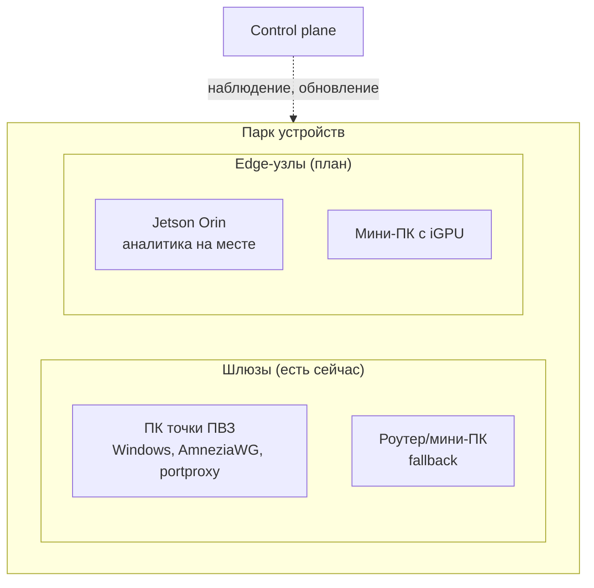
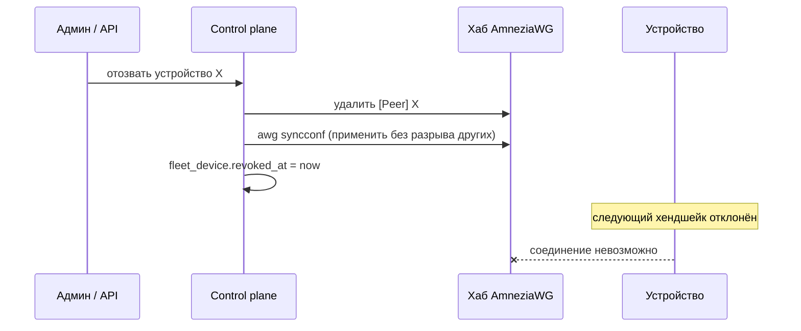
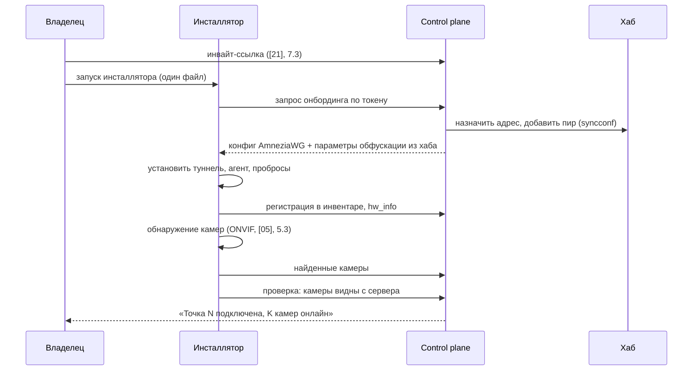

# 24. Управление парком устройств

**Статус документа:** проект, создан 2026-07-16 по итогам [REVIEW_BOARD.md](REVIEW_BOARD.md)
**Статус реализации: [План] целиком**, кроме отмеченного в разделе 3
**Аудитория:** DevOps, инженеры сопровождения, инженеры edge
**Закрывает находки:** управление 1000 шлюзов, B-56 (в части edge), B-52 (air-gap edge)
**Связанные документы:** [04_NETWORK.md](04_NETWORK.md), [03_DEPLOYMENT.md](03_DEPLOYMENT.md), [22_SRE_OPERATIONS.md](22_SRE_OPERATIONS.md), [00_VISION.md](00_VISION.md)

---

## 1. Назначение

Документ проектирует управление физическими устройствами на площадках клиентов: шлюзами точек ПВЗ и (в перспективе) edge-узлами аналитики.

**Почему отдельный документ.** При одном клиенте шлюз настраивается вручную китом `pvz-onboarding/`, обновляется приездом или удалённым сеансом, наблюдается глазами. При 1000 клиентах это 1000+ устройств на чужих площадках, на неподдерживаемых ОС, за NAT, которые нельзя обойти ногами. Управление парком становится отдельной инженерной дисциплиной.

Совет отметил: разрыв между «настроить один шлюз» ([04](04_NETWORK.md), 5) и «управлять тысячей» не покрыт ни одним документом.

---

## 2. Что такое устройство в парке



| Класс | Роль | Состояние | ОС |
|---|---|---|---|
| **Шлюз** | Проброс RTSP в туннель; аналитика в облаке | **В проде** | Windows 7/10/11 |
| **Шлюз (fallback)** | То же | Принято ([00](00_VISION.md), 7.4) | OpenWrt, Linux |
| **Edge-узел** | Аналитика на площадке | **[План]** | Linux (Jetson, x86) |

Различие принципиально: шлюз **тупой** (проброс TCP), edge-узел **умный** (несёт analyzer). Управление ими различается радикально.

---

## 3. Что существует сегодня

| Элемент | Состояние |
|---|---|
| Кит онбординга `pvz-onboarding/` | **Есть**: 5 шагов, `.cmd` двойным кликом |
| `add-site.sh` на VPS | **Есть**: назначение адреса, параметры обфускации из хаба |
| Проверка здоровья точки | **Есть**: `5-healthcheck.ps1` |
| Watchdog туннеля | **Есть**: `wg-watchdog.sh` (на сервере) |
| Удаление проброса | **Есть**: `remove-camera.ps1`, `УДАЛИТЬ-проброс.cmd` |
| **Инвентарь устройств** | **Нет** |
| **Наблюдение за парком** | **Нет** (только per-camera heartbeat) |
| **Удалённое обновление** | **Нет** |
| **Отзыв устройства** | **Нет** ([04](04_NETWORK.md), N-D-06) |
| **Ротация ключей** | **Нет** ([04](04_NETWORK.md), 9.2) |

Итог: онбординг решён хорошо, **эксплуатация парка не решена вовсе**. Устройство, однажды настроенное, живёт вне поля зрения до отказа.

---

## 4. Инвентарь

### 4.1. Модель

```sql
-- [План], control plane
CREATE TABLE fleet_device (
  id            uuid PRIMARY KEY DEFAULT uuid_generate_v4(),
  tenant_id     uuid NOT NULL,
  site_id       uuid,
  kind          text NOT NULL,          -- gateway | edge
  wg_address    inet,                   -- 10.9.0.x
  wg_pubkey     text,
  os            text,                    -- windows7 | windows10 | openwrt | jetson
  agent_version text,
  last_seen     timestamptz,
  status        text NOT NULL DEFAULT 'unknown', -- online | offline | degraded
  hw_info       jsonb,                  -- cpu, ram, disk
  enrolled_at   timestamptz NOT NULL DEFAULT now(),
  revoked_at    timestamptz
);
```

### 4.2. Зачем инвентарь

Вопросы, на которые сегодня нет ответа и которые при планке задаются ежедневно:

| Вопрос | Сейчас |
|---|---|
| Сколько всего шлюзов? | Неизвестно (считать пиры в конфиге хаба вручную) |
| Сколько на Windows 7? | Неизвестно |
| Какие офлайн дольше суток? | Неизвестно |
| У скольких устарел агент? | Понятия агента нет |
| Какие давно не обновлялись? | Неизвестно |
| Что стоит на площадке клиента X? | Неизвестно |

Каждый вопрос при 1000 устройств — это либо инвентарь, либо ручной обход. Второе невозможно.

### 4.3. Наблюдение уровня устройства против уровня камеры

Сейчас наблюдается **камера** (heartbeat `camera_alive`), но не **шлюз**.

Разница существенна: если шлюз завис, все его камеры офлайн одновременно. Сегодня это выглядит как N независимых отказов камер, порождает N событий `camera_offline` и не указывает на настоящую причину — отказ одного устройства.

*Рекомендация:* агрегировать: массовый одновременный `camera_offline` одной площадки → одно событие `gateway_offline` вместо N. Тот же принцип, что предложен для PoE-коммутатора ([04](04_NETWORK.md), 11.4) и анти-флуда ([08](08_RULE_ENGINE.md), 4).

Это требует знания «какая камера за каким шлюзом» — то есть инвентаря. Без него агрегация невозможна.

---

## 5. Агент устройства

### 5.1. Дилемма

Управление парком требует чего-то на устройстве, что отвечает control plane. Но:

| За агента | Против агента |
|---|---|
| Наблюдение, обновление, диагностика | Ещё один компонент на хрупком Windows 7 |
| Отзыв, ротация ключей | Поверхность атаки на устройстве в чужой сети |
| Автоматизация | Сам требует обновления (проблема курицы и яйца) |

Windows 7 ([00](00_VISION.md), 7.4) обостряет дилемму: агент на неподдерживаемой ОС сам становится риском.

### 5.2. Минимальный агент

*Рекомендация:* агент делает **минимум**, а не максимум.

| Делает | Не делает |
|---|---|
| Периодический сигнал в control plane (я жив, версия, ОС, диск) | Не выполняет произвольные команды |
| Сообщает статус туннеля и пробросов | Не имеет удалённой оболочки |
| Принимает **подписанное** задание на обновление | Не открывает входящих портов |
| Проверяет целостность своей конфигурации | Не хранит секретов сверх ключа WG |

Обоснование ограничений: агент с удалённым выполнением команд на 1000 устройств в чужих сетях — это ботнет по построению. Его компрометация даёт доступ к 1000 площадкам. Поэтому агент **инициирует** связь (исходящую, как и туннель) и **тянет** задания, а не принимает команды.

Это тот же принцип, что вся сетевая модель ([04](04_NETWORK.md), 2.2): соединения инициируются изнутри наружу.

### 5.3. Реализация

**[Требует решения]:** язык и форма агента.

| Вариант | Оценка |
|---|---|
| PowerShell-скрипт в планировщике | Продолжает текущий подход; хрупок; PS 2.0 ограничен |
| **Служба на Go (статическая сборка)** | **Рекомендуется**: один бинарник, без зависимостей, кроссплатформенно (Windows + Linux edge) |
| Python-агент | Требует рантайма на устройстве |

Go выбран по той же причине, что и для ONVIF-обнаружения ([05](05_CAMERA_CONNECTION.md), 5.3): статический бинарник на Windows 7 надёжнее скрипта, и тот же код работает на edge-узле Linux.

### 5.4. Самообновление агента

Проблема курицы и яйца: агент обновляет систему, но кто обновит агента?

*Рекомендация:* агент — **две части**: крошечный неизменный загрузчик (обновляется только вручную/при онбординге) и обновляемое тело. Загрузчик проверяет подпись тела и запускает. Это стандартная модель (как watchdog + firmware); она позволяет обновлять тело удалённо, оставляя загрузчик неизменным и потому надёжным.

---

## 6. Удалённое обновление (B-56 для edge)

### 6.1. Что обновляется

| Компонент | Частота | Риск обновления |
|---|---|---|
| Конфигурация проброса | Редко | Низкий |
| Клиент AmneziaWG | Редко | **Высокий**: ошибка отрезает устройство |
| Агент (тело) | Средне | Средний |
| Параметры обфускации | Почти никогда | **Критический**: рассинхрон с хабом = потеря связи ([04](04_NETWORK.md), 3.2) |
| ОС устройства | — | Не управляется нами |

### 6.2. Золотое правило удалённого обновления

**Устройство за NAT, которое нельзя обойти ногами, нельзя обновлять способом, который может отрезать его от сети.**

Это правило определяет всё остальное. Ошибочное обновление туннеля на шлюзе за NAT означает **потерю устройства навсегда** — до физического визита.

### 6.3. Защитные механизмы

| Механизм | Назначение |
|---|---|
| **Откат по таймеру** | Устройство применяет обновление; если не подтвердило связь за N минут — само откатывается |
| **Канареечные устройства** | Обновление сначала на 1% парка (внутренние точки), затем волнами |
| **Поэтапный выкат** | 1% → 10% → 50% → 100% с паузами и проверкой |
| **Заморозка по метрике** | Рост доли офлайн после волны → автостоп выката |
| **Подпись задания** | Устройство применяет только подписанное нами обновление |
| **Окно обслуживания** | Обновление туннеля — в непиковые часы точки |

Откат по таймеру — важнейший. Механика: новая конфигурация применяется во временный профиль; устройство обязано «дозвониться» до control plane и подтвердить; нет подтверждения за 5 минут — автоматический возврат к прежней конфигурации. Ошибочное обновление откатывается само.

Это единственный способ безопасно менять туннель на недостижимом устройстве.

### 6.4. Ротация ключей WireGuard как частный случай

[04](04_NETWORK.md), N-D-01 требует ротации ключей (компрометация — приватные ключи в репозитории). При 4000 камер на 1000 шлюзов ротация вручную невозможна.

Ротация ключа WG — самый опасный вид обновления: неверный ключ отрезает устройство немедленно. Поэтому она обязана использовать все механизмы 6.3, особенно откат по таймеру.

*Рекомендация:* ротация ключей — первый сценарий, реализуемый на механизме удалённого обновления, потому что она обязательна ([04](04_NETWORK.md), N-D-01) и потому что она — худший случай, проверяющий механизм на прочность.

---

## 7. Отзыв устройства

### 7.1. Сценарии

| Сценарий | Действие |
|---|---|
| Клиент ушёл | Отозвать все устройства тенанта |
| Устройство скомпрометировано | Немедленный отзыв |
| Замена ПК на точке | Отзыв старого, онбординг нового |
| Кража ПК | Немедленный отзыв |

### 7.2. Механизм

Отзыв = удаление пира из конфига хаба AmneziaWG + пометка `revoked_at` в инвентаре + инвалидация ключа.



Существенно: `awg syncconf` применяет изменение конфига **без разрыва остальных пиров** — отзыв одной точки не роняет туннели соседей. Полный перезапуск интерфейса (`awg-quick down/up`) разорвал бы всех, что при планке недопустимо.

*Рекомендация:* отзыв обязан использовать `syncconf`, не рестарт. Это должно быть зафиксировано, потому что рестарт — «очевидный» способ применить изменение конфига, и он тихо роняет весь парк.

### 7.3. Отсутствие отзыва сегодня — активная уязвимость

Сегодня отозвать точку нельзя ([04](04_NETWORK.md), N-D-06). Украденный кассовый ПК сохраняет ключ и доступ в подсеть `10.9.0.0/24`. В плоской сети без микросегментации ([04](04_NETWORK.md), 9.1) это доступ к камерам других клиентов.

Это связывает три находки: отсутствие отзыва (N-D-06) × плоская сеть (N-D-02) × ключи в открытом виде на Windows = путь компрометации, разобранный в [13](13_SECURITY.md). Микросегментация ([04](04_NETWORK.md), 9.2) снижает ущерб; отзыв устраняет причину.

---

## 8. Edge-узлы

### 8.1. Отличие от шлюза

Edge-узел несёт **аналитику**, не только проброс. Это меняет всё управление.

| Аспект | Шлюз | Edge-узел |
|---|---|---|
| На борту | portproxy | Полный analyzer + модели |
| Обновление | Конфиг | **Код + модели (гигабайты)** |
| Отказ | Камеры офлайн | **Аналитика площадки офлайн** |
| Данные | Транзит | **Обрабатываются на месте** |
| ОС | Windows | Linux (Jetson, x86) |
| Что уходит в облако | Видео | **Только события** |

### 8.2. Зачем edge

Из [00](00_VISION.md), 8.4 и [03](03_DEPLOYMENT.md), 8:

| Причина | Пояснение |
|---|---|
| **Трафик** | Облачный архив = 16 Гбит/с при планке ([20](20_SCALE_ARCHITECTURE.md), 2.1); edge оставляет видео на месте |
| Канал | Точки без стабильного интернета |
| Резидентность | Заказчик запрещает вынос видео с площадки |
| Задержка | Аналитика без раунд-трипа до облака |
| Промышленные камеры | GigE Vision нельзя вынести ([05](05_CAMERA_CONNECTION.md), 9.2) |

### 8.3. Готовность архитектуры

Существенно: **ядро уже готово к edge больше, чем кажется**.

| Требование edge | Состояние |
|---|---|
| Analyzer общается только через Redis Stream | **Готово** (A-01, A-03) |
| Analyzer не ходит в PostgreSQL | **Готово** (A-03) |
| Абстракция источника видео | **Готово** (`VideoSource`) |
| Абстракция детектора (для Jetson TensorRT/OpenVINO) | **Нет** ([06](06_AI_ENGINE.md), 10.3) — блокер |
| Передача событий edge → облако | **Нет** — механизм не спроектирован |
| Локальный Redis на edge | Тривиально |

Два пробела: абстракция детектора (иначе edge потребует ветвления `if device` в конвейере) и forwarder событий (edge → облако).

### 8.4. Forwarder событий

Тот же вопрос, что гибридный режим ([03](03_DEPLOYMENT.md), 8; [01](01_SYSTEM_ARCHITECTURE.md), 12.3).

*Рекомендация:* forwarder — потребитель локального `events`, отправляющий их в облачную ячейку durable-транспортом с подтверждением и буферизацией при обрыве канала.

Ключевое требование: **события не теряются при обрыве канала** — edge буферизует и досылает. Это ровно то, чего не делает текущий облачный режим ([04](04_NETWORK.md), 10.4: аналитика за время обрыва теряется). Edge не только экономит трафик, но и **устойчивее к обрыву** — событие переживёт разрыв, потому что родилось на площадке.

Первый потребитель `track_events` (тепловые карты, [06](06_AI_ENGINE.md), 9) послужит образцом для forwarder'а — оба являются сервисами-потребителями стрима.

### 8.5. Аппаратные варианты

| Устройство | GPU | Камер (оценка) | Применение |
|---|---|---|---|
| Jetson Orin Nano | Встроенный, TensorRT | 4–8 | Малая точка, промышленный узел |
| Jetson Orin NX | Встроенный | 8–16 | Средняя площадка |
| Мини-ПК + iGPU (OpenVINO) | Intel iGPU | 2–4 | Дёшево, x86 |
| Мини-ПК + внешний GPU | Дискретный | По GPU | Как облачный узел, но на месте |

**[Данные отсутствуют]:** оценки камер не измерены. Все требуют абстракции детектора под свой ускоритель (TensorRT для Jetson, OpenVINO для Intel).

### 8.6. Air-gap edge (B-52)

Крайний случай: edge-узел без исходящего интернета вообще.

Тогда forwarder невозможен. Варианты:
- события накапливаются локально, синхронизируются при периодическом подключении;
- полностью автономная работа с локальным UI (по сути on-premise на одном узле).

**[Требует решения]:** это отдельный продукт (автономная коробка) или режим. Решать при появлении конкретного заказчика.

---

## 9. Онбординг при планке

### 9.1. Текущий онбординг не масштабируется линейно

Кит `pvz-onboarding/` рассчитан на то, что владелец запускает `.cmd` двойным кликом. Это работает и является преимуществом ([00](00_VISION.md), 5.2). Но при планке добавляется то, чего в ките нет:

| Пробел | Влияние при планке |
|---|---|
| Регистрация в инвентаре | Устройство вне поля зрения |
| Установка агента | Нет наблюдения и обновления |
| Автоматическое назначение адреса | `add-site.sh` требует запуска на VPS вручную |
| Проверка версии обфускации | Ошибка = тихий отказ ([04](04_NETWORK.md), 3.2) |
| Валидация «камеры действительно видны» | Онбординг «успешен», аналитики нет |

### 9.2. Целевой онбординг



Отличие от текущего: **один инсталлятор** вместо пяти `.cmd`, автоматическая регистрация, установка агента, валидация результата. Владелец по-прежнему запускает один файл — но за файлом стоит парк-менеджмент.

Ключевое: онбординг **завершается проверкой**, а не установкой. «Точка подключена» означает «камеры видны с сервера», а не «скрипт отработал».

---

## 10. Наблюдение за парком

### 10.1. Дашборд парка

**[План]** — для дежурного ([22](22_SRE_OPERATIONS.md), 6.4).

| Панель | Данные |
|---|---|
| Всего устройств / онлайн / офлайн | Инвентарь + `last_seen` |
| Офлайн дольше суток | Требуют внимания |
| По версиям агента | Кого обновлять |
| По ОС | Сколько на Windows 7 (риск) |
| По регионам/ячейкам | Распределение |
| Волна обновления | Прогресс поэтапного выката |
| Хендшейк туннеля устарел | Признак DPI-разрыва ([04](04_NETWORK.md), 13.3) |

### 10.2. Метрики парка

Расширение [12_MONITORING.md](12_MONITORING.md):

```
viziai_fleet_devices_total{kind, os, status}
viziai_fleet_device_last_seen_seconds{device_id}
viziai_fleet_agent_version{device_id, version}
viziai_fleet_tunnel_handshake_age_seconds{device_id}
viziai_fleet_update_wave_progress{wave, phase}
```

Осторожно с кардинальностью ([12](12_MONITORING.md), 5.1): `device_id` как метка при 1000 устройств — граница допустимого. Метрики с `device_id` держать отдельно и с коротким ретеншеном либо агрегировать по ОС/версии/статусу.

---

## 11. Реестр решений

| № | Решение | Обоснование | Альтернатива и почему отвергнута |
|---|---|---|---|
| FL-01 | Агент делает минимум, инициирует связь исходящую, тянет задания | Агент с удалённым выполнением на 1000 устройств = ботнет | Богатый агент: компрометация даёт доступ к 1000 площадкам |
| FL-02 | Агент — загрузчик (неизменный) + тело (обновляемое) | Решает «кто обновит агента» | Монолит: нельзя обновить удалённо безопасно |
| FL-03 | Агент на Go (статический бинарник) | Надёжнее скрипта на Windows 7; один код для edge Linux | PowerShell: хрупок, PS 2.0 ограничен |
| FL-04 | **Обновление с откатом по таймеру** | Устройство за NAT, отрезавшее себя, потеряно до визита | Без отката: ошибка = потеря устройства |
| FL-05 | Поэтапный выкат с канареечными устройствами | Ошибка не уходит дальше 1% парка | Всем сразу: ошибка роняет весь парк |
| FL-06 | Ротация ключей — первый сценарий удалённого обновления | Обязательна (N-D-01) и худший случай — проверяет механизм | Отложить: ключи в репозитории остаются |
| FL-07 | Отзыв через `awg syncconf`, не рестарт | Рестарт роняет туннели всех пиров | Рестарт: тихо роняет весь парк |
| FL-08 | Массовый `camera_offline` площадки → одно `gateway_offline` | Отказ одного устройства выглядит как N отказов камер | N событий: шум, скрытая причина |
| FL-09 | Онбординг завершается проверкой «камеры видны», не установкой | «Скрипт отработал» ≠ «аналитика идёт» | По завершению скрипта: молчаливый отказ |
| FL-10 | Edge буферизует события при обрыве, досылает | Edge устойчивее облака к обрыву канала | Терять: та же потеря, что в облаке |
| FL-11 | Один инсталлятор вместо пяти `.cmd` при планке | Регистрация, агент, валидация не помещаются в кит | Пять шагов: нет инвентаря и наблюдения |

---

## 12. Долг

| № | Проблема | Влияние | Приоритет |
|---|---|---|---|
| FL-D-01 | Нет инвентаря устройств | Парк вне поля зрения | **Высокий** |
| FL-D-02 | Нет отзыва устройства | Украденный ПК сохраняет доступ в подсеть | **Высокий** (связан с [13](13_SECURITY.md)) |
| FL-D-03 | Нет ротации ключей; ключи в репозитории | Компрометация VPN ([04](04_NETWORK.md), N-D-01) | **Критично** |
| FL-D-04 | Нет удалённого обновления | 1000 устройств обновлять ногами | **Высокий** |
| FL-D-05 | Нет агента | Нет наблюдения и управления | Высокий |
| FL-D-06 | Нет наблюдения уровня устройства | Отказ шлюза = N ложных отказов камер | Средний |
| FL-D-07 | Абстракция детектора отсутствует | Блокер edge ([06](06_AI_ENGINE.md), AI-D-01) | Высокий |
| FL-D-08 | Forwarder событий edge→облако не спроектирован | Блокер edge и гибрида | Средний |
| FL-D-09 | Онбординг при планке не автоматизирован | toil, растущий с числом точек | Средний |
